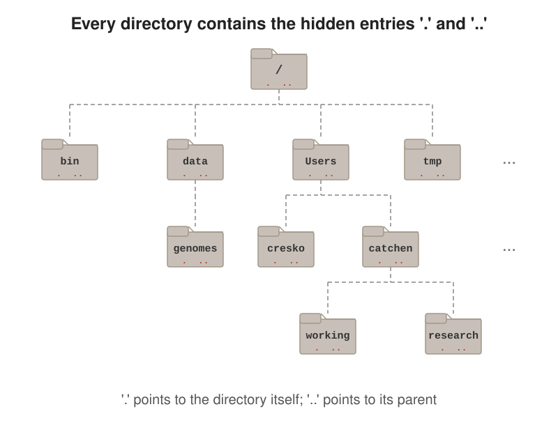

# Foundational Computational Tools for Bioengineers

> This book now lives **inside the course-website repository** (`BioE_Comp_Tools_Fa2026/Book/`) as a nested Quarto book project. It renders to `../docs/book/` and is published alongside the website at <https://wcresko.github.io/BioE_Comp_Tools_Fa2026/book/>.

A comprehensive Quarto book for graduate students in bioengineering and life sciences, covering essential computational skills including Unix/Linux, R and Python programming, version control with Git/GitHub, and high-performance computing.

## About

This book accompanies a graduate-level course taught at the University of Oregon's Phil and Penny Knight Campus for Accelerating Scientific Impact. It provides practical, hands-on instruction in foundational computational tools that are essential for modern research.

## Contents

1. Introduction to Computational Tools
2. Your Computational Toolkit: Installing and Using Editors and IDEs
3. Computing Resources at the University of Oregon
4. Unix Fundamentals
5. Reproducible Documents with Quarto
6. Computer Systems Architecture
7. Files, Pipes, and Redirection
8. Tidy Data Principles
9. GREP and Regular Expressions
10. Shell Scripting
11. R Programming Fundamentals
12. Python Programming Fundamentals
13. Data Wrangling with the Tidyverse
14. Data Visualization with ggplot2
15. Writing Functions in R
16. High-Performance Computing with Talapas
17. Parallel Computing in R
18. LaTeX for Scientific Documents
19. Coding with AI Assistants
20. Version Control with Git and GitHub
21. Working with Databases

Appendices:

- A. Keyboard Shortcuts Reference
- B. Unix Command Reference
- C. Common Data Formats & Public Repositories
- D. Regular Expression Reference
- E. R Command Reference
- F. Python Quick Reference
- G. SLURM Command Reference
- H. LaTeX Command Reference
- I. Git Command Reference
- J. Glossary

Chapter files in `chapters/` are numbered to match this order (`04-unix-fundamentals.qmd` is Chapter 4; `appendix-A-shortcuts.qmd` is Appendix A), and their figures are named `images/Chap04_img001.svg`, `images/AppA_img001.png`, etc. (see `images/README.md`).

## Building the Book

### Prerequisites

- [Quarto](https://quarto.org/) (version 1.4 or later)
- [R](https://www.r-project.org/) (version 4.0 or later)
- R packages: `tidyverse`, `gt`, `knitr`
- Python chunks in the book are shown with `eval: false`, so Python is not required to render it

### Build Commands

```bash
# From the repository root:
quarto render                 # renders the website AND (via a post-render hook) the book
quarto render Book --to html  # render just the book -> docs/book/
quarto preview Book           # live preview of the book with reload

# Or from inside Book/:
cd Book && quarto render
```

### Output

- HTML output is written to `../docs/book/` (the website's `docs/` folder) for GitHub Pages deployment
- PDF output is currently switched off; to re-enable it, uncomment the `pdf:` block in `_quarto.yml` and install librsvg (`brew install librsvg`)

## Deploying to GitHub Pages

The course website repository already publishes `docs/` via GitHub Pages, so after `./render_all.sh`, commit and push `docs/` and the book appears at `https://wcresko.github.io/BioE_Comp_Tools_Fa2026/book/`.

## Directory Structure

```
BioE_Comp_Tools_Fa2026/Book/
├── _quarto.yml          # Book configuration
├── index.qmd            # Preface
├── references.qmd       # Bibliography page
├── references.bib       # BibTeX references
├── custom.scss          # Custom styling
├── apa.csl              # Citation style
├── chapters/            # Chapter content
│   ├── 01-introduction.qmd
│   ├── 02-your-toolkit.qmd
│   ├── ...              # numbered 01-21, in book order
│   ├── 21-databases.qmd
│   └── appendix-[A-J]-*.qmd  # shortcuts, unix, data-formats, regex, r, python, slurm, latex, git, glossary
├── images/              # Image assets
└── (renders to ../docs/book/)
```

## Customization

### Styling

Edit `custom.scss` to modify colors, fonts, and other visual elements. The book uses University of Oregon colors by default.

### Adding Chapters

1. Create a new `.qmd` file in the `chapters/` directory
2. Add the chapter to the `chapters:` list in `_quarto.yml`
3. Render the book

### Images

Place images in the `images/` directory and reference them in chapters:

```markdown
{#fig-example}
```

## Author

**William A. Cresko**  
Professor of Biology  
Phil and Penny Knight Campus for Accelerating Scientific Impact  
University of Oregon

## License

This work is licensed under a Creative Commons Attribution-NonCommercial-ShareAlike 4.0 International License (CC BY-NC-SA 4.0).

## Acknowledgments

- Research Advanced Computing Services (RACS) at the University of Oregon
- Software Carpentry for foundational teaching materials
- The R and Quarto communities
