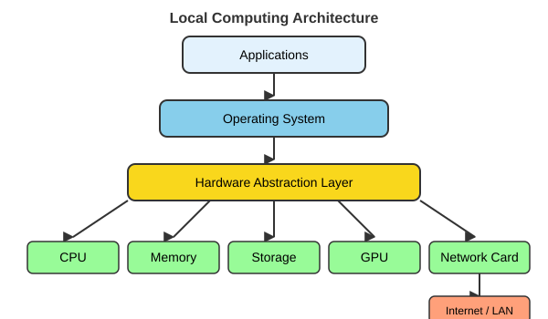

# Computing Resources at the University of Oregon {#sec-computing-at-uo}

::: {.callout-note title="Learning Objectives"}
After completing this chapter, you will be able to:

- Use your UO digital identity (Duck ID, Duo, UO email, VPN) to reach university services, and know when the VPN is and is not needed
- Find the right place to ask for help at UO, and ask in a way that gets a fast answer
- Describe the Microsoft 365 stack, OneDrive, and UO Dropbox, and know which you are eligible for
- Locate synced cloud folders from the command line and handle the spaces in their paths
- Classify data as green, amber, or red and choose storage and tools accordingly
- Protect research data and back up your work following the 3-2-1 rule
- Install site-licensed software and manage references with Zotero
- Explain what RACS and Talapas offer, how accounts work, and how to reach the cluster through Open OnDemand
:::

The previous chapters equipped your laptop. This chapter is about everything the University of Oregon provides beyond your laptop: the accounts that unlock its services, the places where you can store and share files, the rules that govern what may go where, the software the University licenses on your behalf, and the research computing cluster, Talapas, that you will use later in the course. Much of this is mundane, but it is the kind of mundane that, ignored, costs people a thesis chapter, a data-security incident, or a week of waiting for a cluster account. An hour spent understanding it now is well invested.

## Your UO Digital Identity {#sec-uo-identity}

Almost everything in this chapter begins with your **Duck ID**, the UO username and password that you manage at <https://duckid.uoregon.edu>. It is the key to email, Canvas, Microsoft 365, the software download site, and Talapas. Most UO services also require **two-step login through Duo**: after entering your password, you approve the login on a second device, usually the Duo Mobile app on your phone. Set Duo up before you need it; being unable to log in to a service you need in a hurry is a frustrating way to discover that your phone is not enrolled.

Your **UO email address** (`you@uoregon.edu`) doubles as your sign-in name for Microsoft 365 and for UO's Dropbox contract. When a service asks you to "sign in with your work or school account," this is the account it means.

The **UO VPN**, delivered through the Cisco Secure Client and downloadable from <https://uovpn.uoregon.edu>, makes your off-campus computer appear to be on the campus network. You only need it for campus-restricted resources such as some library databases, departmental file shares, and some licensed software that must be activated from the campus network. Most UO services, including email, Canvas, Microsoft 365, Teams, and Zoom, work from anywhere without it.

::: {.callout-note title="Talapas and the VPN"}
For Talapas, the VPN is *recommended but not required*. Without it, connect over SSH to `login.talapas.uoregon.edu`, which is a load balancer that distributes users across the login nodes; expect Duo prompts. With the VPN active, you may also connect directly to an individual login node, `login1` through `login4`. The mechanics of SSH and job submission are in @sec-hpc-talapas.
:::

## Where to Get Help at UO {#sec-uo-help}

There is a lot of help available at UO, and a large part of getting unstuck quickly is knowing which door to knock on. The **UO Service Portal** at <https://service.uoregon.edu> is the front door for all campus technology: it has a searchable knowledge base and a ticketing system, and most questions about accounts, software, Wi-Fi, and cloud storage already have an article there, so search it first. Behind the portal sits the **Technology Service Desk**, reachable by phone at 541-346-4357 or through live chat.

For data analysis rather than technology, **UO Libraries Data Services** (<https://library.uoregon.edu/data-services>) is an underused treasure. They run free workshops on R, Python, data analysis, and related topics; offer one-on-one consultations, in person or on Zoom, on statistics, R, Python, version control, and data-management plans; and staff a drop-in help desk in Knight Library on weekdays from 11am to 4pm.

For research computing, **RACS** (Research Advanced Computing Services), which runs Talapas, can be reached at racs@uoregon.edu or through their service desk at <https://hpcrcf.atlassian.net/servicedesk/customer/portal/1>; @sec-racs describes what they do. Closer to home, the **Center for Biomedical Data Science (CBDS)** at the Knight Campus, directed by the author of this book, supports the computational and data-science side of biomedical research at the Knight Campus, including training such as this course; ask the instructor about CBDS resources and events. Your home department and the Knight Campus also have IT staff who can help with lab computers and shared storage.

### How to ask for help well {#sec-how-to-ask-for-help-well}

Whoever you ask, the quality of the answer depends on the quality of the question. Start by saying what you were trying to do ("I'm trying to install R on my M2 Mac"), then include the **exact error message** as copied text, not a blurry photograph of your screen (a screenshot is acceptable only if the text cannot be copied). Show the command or code you ran and what you expected to happen, say what you have already tried (restarted? searched the error? checked your location with `pwd`?), and state your system: macOS, Windows, or Ubuntu, and the chip type. For code problems, reduce the problem to a **minimal example**, the smallest piece of code that still shows the failure. Half the time, the discipline of writing a good question leads you to the answer yourself; the other half, it lets someone else answer in a single reply.

## The Microsoft 365 Stack {#sec-microsoft-365}

Every UO student and employee has a Microsoft 365 license, which you access by signing in at <https://office.uoregon.edu> with your UO email address. @tbl-m365 lists what it includes.

| Tool | What it is for |
|:-----|:---------------|
| **Outlook** | UO email and calendar |
| **Word, Excel, PowerPoint, OneNote** | Desktop, web, and mobile apps; install them on your own devices from office.uoregon.edu |
| **Teams** | Chat, meetings, and shared files for groups and labs |
| **OneDrive** | Your personal cloud storage (1 TB) |
| **SharePoint / Teams files** | Shared storage owned by a group rather than a person |
| **Copilot Chat** | UO-protected generative AI assistant, when signed in with your UO account |

: The Microsoft 365 tools available to UO students and employees {#tbl-m365}

### OneDrive {#sec-onedrive}

**OneDrive** is your personal cloud storage, available at no cost with **1 TB** of space. The OneDrive sync app for Mac and Windows creates a `OneDrive` folder on your computer, and files you save there are copied to the cloud automatically, so they survive a lost or dead laptop. You can share files and folders with UO colleagues and with outside collaborators. OneDrive is approved for **FERPA** and **HIPAA** data (see @sec-data-classification), and individual files may be as large as 250 GB.

::: {.callout-warning title="OneDrive is yours; lab data belongs in shared storage"}
OneDrive belongs to *you*, and when you leave UO it goes away. Data that belongs to a lab, such as raw experimental data, shared analysis code, and protocols, should live in storage the lab controls: a Teams/SharePoint site, a lab Dropbox team folder, or the lab's project space on Talapas. Otherwise, it leaves when you do.
:::

### UO Dropbox {#sec-uo-dropbox}

UO also holds an institutional **Dropbox** contract, but eligibility changed in 2026. Since March 2026, Dropbox accounts under the UO contract are available to faculty, staff, officers of administration, and **graduate employees (GEs)**; students who are not UO employees no longer have access and should use OneDrive instead. If you are eligible, sign in with your UO email address and install the desktop app so that your files sync to a local folder; individual accounts have 2 TB of storage, and labs and departments can purchase team storage. Your lab may also share a Dropbox **team folder** with you regardless of whether you have your own account. Dropbox is approved for **green** and **amber** data, including FERPA records, but **not** for HIPAA or other red data.

### Synced folders have real paths {#sec-synced-folders-have-real-paths}

Both OneDrive and Dropbox create an ordinary folder on your computer, which means it has a path you can use from the command line and from your scripts. Typical locations look like these (yours may differ slightly):

```bash
# macOS
~/Library/CloudStorage/OneDrive-UniversityofOregon
~/University\ of\ Oregon\ Dropbox/Your\ Name

# Windows, as seen from Ubuntu/WSL
/mnt/c/Users/you/OneDrive\ -\ University\ of\ Oregon
```

Notice the backslashes: names such as `University of Oregon Dropbox` contain **spaces**, and the shell uses spaces to separate arguments, so a path with spaces must be quoted (`cd "University of Oregon Dropbox"`) or escaped with backslashes. Tab completion adds the escapes for you, and @sec-unix-fundamentals has more on paths and quoting. Find your own synced folder with `cd`, `ls`, and Tab completion. Synced folders are excellent for documents and drafts, but large or rapidly changing analysis files are better kept on local disk or on Talapas, where the sync client cannot interfere with them.

## Data Classification: What Can Go Where? {#sec-data-classification}

UO classifies data by the harm that would result if it were exposed, and the classification determines where it may be stored and which tools may touch it [@uo2019infoasset]. **Know the class of your data before you choose where to put it.** @tbl-data-classification summarizes the three classes; the Information Security Office maintains the authoritative, and much longer, table of which services are approved for which class [@uo2024dataclass].

| Class | Examples | May be stored in |
|:------|:---------|:-----------------|
| **Green** (low risk) | Published data, your code, most de-identified research data | Almost anywhere, including AI tools |
| **Amber** (medium risk) | FERPA student records, unpublished research data | OneDrive, Dropbox, Teams/SharePoint |
| **Red** (high risk) | HIPAA / protected health information, Social Security numbers, credit-card numbers | Only approved systems (for example OneDrive for HIPAA); ask first |

: UO's data classification and where each class may live {#tbl-data-classification}

::: {.callout-important}
Only **green** data may be entered into AI tools that UO does not officially support. Microsoft Copilot Chat, signed in with your UO account, is approved for more; see @sec-uo-ai.
:::

### Protecting research data {#sec-protecting-research-data}

Two categories deserve special attention. **Human-subjects data**, meaning anything covered by an Institutional Review Board (**IRB**) protocol, and **protected health information** covered by **HIPAA** are red, high-risk data. Store them only where your IRB protocol and UO approve: UO OneDrive and Teams are approved for HIPAA data, Dropbox is not, and personal cloud accounts (a personal Google Drive or iCloud), email attachments, and unsupported AI tools are never acceptable. **De-identify** data as early in the workflow as you can, and keep the key that links identifiers to participants separately and securely. **Encrypt your laptop** (FileVault on macOS, BitLocker or Device Encryption on Windows) and use a screen lock, so that a stolen backpack is an inconvenience rather than a breach. Finally, remember that unpublished data and code are valuable; do not post them publicly until your PI agrees. When in doubt, **ask before you store or share**, whether your PI, the IRB, or the Service Portal. It is far easier than cleaning up afterwards.

## Backups and the 3-2-1 Rule {#sec-backups}

Every year, someone loses a thesis chapter to a dead laptop or a stolen bag. The standard defense is the **3-2-1 rule**: keep **three** copies of anything important, on **two** different kinds of storage, with **one** copy off-site. In practice that might mean the working copy on your laptop, a versioned backup on an external drive using Time Machine (macOS) or File History (Windows), and an off-site copy in OneDrive or your lab's Dropbox or server. For code, GitHub adds a fourth layer: every commit you push is a backup with full history (@sec-git-github).

::: {.callout-warning title="A synced folder is not a backup"}
OneDrive and Dropbox protect you against a dead laptop, but not against yourself. If you delete or overwrite a file, the deletion syncs everywhere within seconds. Keep *versioned* backups (Time Machine, File History, Git) in addition to sync, and **test that you can restore a file** before the day you need to.
:::

## Choosing Where to Store Your Work {#sec-where-to-store}

With several storage options available, it helps to have a rule of thumb. @tbl-storage-choices summarizes what each is good for.

| Storage | Best for | Covered in |
|:--------|:---------|:-----------|
| Your laptop's disk | Active work: fast, but **not backed up** by itself | @sec-computer-systems |
| OneDrive | Personal documents, drafts, backups | This chapter |
| Dropbox (if eligible) | Lab-shared folders, collaboration | This chapter |
| Teams / SharePoint | Group-owned documents | This chapter |
| **GitHub** | **Code** and small text files, with full version history | @sec-git-github |
| **Talapas** | Large datasets and heavy computation | @sec-hpc-talapas |

: Where to keep different kinds of work {#tbl-storage-choices}

The short version: **code goes to GitHub (@sec-git-github), documents go to OneDrive or Dropbox, and big data goes to Talapas (@sec-talapas-storage).** Whatever else you do, keep your raw data somewhere backed up and untouched.

## Site-Licensed Software {#sec-site-licensed-software}

The University pays for a number of software licenses that you can use for free. The **UO Software Downloads** site at <https://software.uoregon.edu> (sign in with your Duck ID) offers MATLAB, Mathematica, LabVIEW, SPSS and SPSS Amos, ESRI ArcGIS, and more; some titles need a license code or a connection to the UO network or VPN to activate, and availability can differ between students and employees, so check the site for the current list. The Microsoft 365 desktop apps are installed from <https://office.uoregon.edu>. For Adobe products, students get **Adobe Express** on personal devices, while the full **Creative Cloud** suite is available in campus computer labs. UO-managed computers (as opposed to your personal laptop) install approved software through the **Software Center** app.

It is worth noticing that none of the tools at the center of this course, the shell, R, Python, Quarto, LaTeX, Git, VS Code, and Positron, require a license at all. They are free and open source, they will follow you to any future institution or employer, and nothing you build with them will stop working when a contract lapses.

## Managing References with Zotero {#sec-zotero}

You will read hundreds of papers before your qualifying exam, and a reference manager is the only sane way to keep track of them. **Zotero** (<https://www.zotero.org>) is free and open source. Its browser connector saves a paper's citation, and usually the PDF, from a journal page or PubMed with one click; group libraries let you share a reading list with your lab or rotation group; and it inserts citations and bibliographies into Word and into Quarto documents (Insert → Citation in the visual editor). Citing from Quarto is covered in @sec-quarto-documents, and a well-kept Zotero library makes it painless. Start now, while the library is small.

## Generative AI at UO {#sec-uo-ai}

UO provides **Microsoft Copilot Chat** (<https://copilot.microsoft.com>) as a UO-protected generative AI assistant; sign in with your UO account. UO-supported AI tools are approved for specific data classifications, while unsupported tools are approved for **green** data only; the current list of tools and what each may be used with is on UO's [AI Service Offerings](https://service.uoregon.edu/TDClient/2030/Portal/KB/Article/140911/AI-Service-Offerings) page. The course policy follows UO's guidance for instructors [@uo2026genai] and is simple: you *may* use AI to help you learn, debug, and get suggestions, but the work you submit must be your own, and you say when and how you used an assistant. These tools are excellent at explaining error messages and suggesting code, and confidently wrong surprisingly often, so always read, run, and understand what they produce. We look at AI-assisted coding in depth in @sec-ai-assisted-coding.

## Research Computing: RACS and Talapas {#sec-racs}

**Research Advanced Computing Services (RACS)**, at <https://racs.uoregon.edu>, runs the University's research computing and supports UO researchers with computing of every kind. Their best-known service is the **Talapas** HPC cluster, with CPU, GPU, and large-memory nodes and more than 225 scientific software packages installed. Beyond the cluster, RACS provides large-scale **research data storage** (roughly \$35 per terabyte per year) for data that does not fit in what Talapas includes; **Globus** for fast, reliable transfer of very large datasets, for example from a sequencing core or a collaborator; **consulting** on software installation, code optimization, data security, and hardware purchases; **grant support** for the computing and data-management sections of proposals; and help reaching resources beyond UO, including national supercomputers through NSF ACCESS and cloud consulting for AWS and Azure. Contact them at racs@uoregon.edu or through the [RACS service desk](https://hpcrcf.atlassian.net/servicedesk/customer/portal/1). They are there to help; ask early.

### Your laptop vs. Talapas {#sec-your-laptop-vs-talapas}

Computation can happen in three kinds of places (@fig-where-computation). Your **laptop or lab workstation** is fast to start and entirely under your control, but limited in memory, storage, and uptime. A **cluster** such as Talapas is many computers, called nodes, working together and shared among many users through a scheduler that decides whose job runs where. **Cloud** computing rents machines by the hour from a provider such as Amazon Web Services, Microsoft Azure, or Google Cloud, scaling up on demand and billing for what you use. @sec-computer-systems compares the three in more depth; for most work in this course the choice is between your laptop and Talapas, and the deciding factor is almost always memory.

::: {#fig-where-computation layout-ncol=3}
{#fig-where-local}

{#fig-where-cluster}

{#fig-where-cloud}

Where computation can happen.
:::

To understand why a cluster matters, compare it with the laptop you are reading this on. @tbl-laptop-vs-talapas puts the numbers side by side.[^talapas-specs]

[^talapas-specs]: Cluster hardware changes as nodes are added and retired. The figures here are from the RACS documentation in September 2026; the current numbers are always at <https://racs.uoregon.edu>.

| | Typical laptop | One standard Talapas node | Talapas large-memory node | All of Talapas |
|:--|:---------------|:--------------------------|:--------------------------|:---------------|
| **CPU cores** | 8-12 | **128** | varies | **14,500+** |
| **RAM** | 8-16 GB | **512 GB** | **up to 4 TB** | **~129 TB** |
| **GPUs** | integrated | -- | -- | **89** (NVIDIA A100, H100, V100) |
| **Storage** | 0.5-1 TB SSD | shared | shared | **~3 PB** (3,000 TB) |

: A typical laptop compared with the Talapas cluster {#tbl-laptop-vs-talapas}

A single standard node has roughly ten times the cores and thirty times the memory of a laptop, and Talapas has hundreds of nodes. Your storage there consists of a **250 GB home directory** plus your lab's **project space**, 2 TB by default (@sec-talapas-storage). When an analysis reports "out of memory," or would take days on your laptop, it is a job for Talapas. As @sec-computer-systems explains, memory is usually the binding constraint in data analysis, and the large-memory nodes exist precisely for the assemblies, image stacks, and single-cell matrices that will not fit anywhere else.

### Getting an account {#sec-getting-an-account}

Every Talapas user is sponsored by a UO principal investigator and belongs to at least one **PIRG** (Principal Investigator Research Group), which the PI is responsible for. Ask your PI, or your rotation PI, to add you, and request the account through RACS's request page at <https://racs.uoregon.edu/request-access> (which leads to the Talapas customer portal, <https://hpcrcf.atlassian.net/servicedesk/customer/portal/1/group/1/create/9>). A PI who does not yet have a PIRG can request one from racs@uoregon.edu. Setup can take a few days, so ask early; for this course, class access will be arranged before the Talapas material in @sec-hpc-talapas. The [Talapas Knowledge Base](https://uoracs.github.io/talapas2-knowledge-base/) is the authoritative documentation.

### Open OnDemand: Talapas in your browser {#sec-uo-open-ondemand}

You do not need to master SSH (@sec-talapas-ssh) to start using Talapas. **Open OnDemand** at <https://ondemand.talapas.uoregon.edu> gives you the cluster through a web browser; log in with your Duck ID using Chrome or Firefox (a private window avoids login glitches). From there you can launch **Jupyter Lab** notebooks running on Talapas; a full **remote desktop** with RStudio Server, **MATLAB**, and Stata; a **shell** in the browser; a **file explorer** for drag-and-drop transfer between your laptop and the cluster; and a **job composer** for submitting batch jobs. Because OnDemand apps run as jobs on compute nodes, they **keep running even after you close your browser**, so remember to end sessions you no longer need. Command-line access over SSH and job scheduling with SLURM are covered in @sec-hpc-talapas.

## Summary {#sec-uo-summary}

This chapter mapped the University's computing landscape so that you can find your way around it. Key takeaways:

- Your Duck ID with Duo unlocks nearly everything; your UO email is your Microsoft 365 and Dropbox sign-in; the VPN is needed only for campus-restricted resources and is recommended but not required for Talapas
- Help is available from the Service Portal and Technology Service Desk, UO Libraries Data Services (workshops, consultations, drop-in desk), RACS, and CBDS; a good question includes the exact error, the command, your system, and what you tried
- Everyone has Microsoft 365 with 1 TB of OneDrive; UO Dropbox is limited to faculty, staff, and GEs; synced folders have real paths, usually with spaces that must be quoted
- Data is green, amber, or red; IRB and HIPAA data are red; only green data may go into unsupported AI tools; encrypt your laptop and de-identify early
- Follow the 3-2-1 backup rule and remember that a synced folder is not a backup
- Code goes to GitHub, documents to OneDrive/Dropbox, big data to Talapas
- UO licenses MATLAB, Mathematica, and more at software.uoregon.edu, but the core tools of this course are free and open source
- Zotero manages references; Copilot Chat is UO's protected AI assistant
- RACS runs Talapas (14,500+ cores, ~129 TB RAM, 89 GPUs, ~3 PB storage), provides storage, Globus, consulting, and grant support; every user belongs to a PIRG; Open OnDemand offers Jupyter, RStudio, a shell, and file transfer from a browser

Next, @sec-unix-fundamentals opens the terminal and begins the command-line skills that run through the rest of the book.

## Exercises {#sec-uo-exercises .unnumbered}

::: {.callout-tip title="Practice Exercises"}
1. **Find your synced folder**: Sign in to OneDrive (and Dropbox, if you are a GE) with your UO account and install the sync app. From a terminal, `cd` into the synced folder, run `pwd`, and write down the absolute path. How did you handle the spaces in the name?

2. **Classify three datasets**: For each of the following, state whether it is green, amber, or red data and where you could store it: (a) a table of Young's modulus measurements from a hydrogel you made; (b) survey responses from human participants under an IRB protocol, including names; (c) the R scripts that made the figures for your last paper.

3. **Set up a backup**: Configure Time Machine or File History with an external drive, or verify that your OneDrive folder is syncing. Then delete a test file from a synced folder and try to recover it. Did the recovery work? Would it have worked for a file you overwrote three weeks ago?

4. **Make the 3-2-1 plan**: For the most important document you own (a thesis draft, a manuscript, a dataset), list where the three copies are or will be, which two kinds of storage they use, and which copy is off-site.

5. **Start your Talapas account**: Ask your PI whether their lab has a PIRG and, if so, to add you. Then log in to Open OnDemand and open the file explorer to look at your home directory. What is the path?
:::
