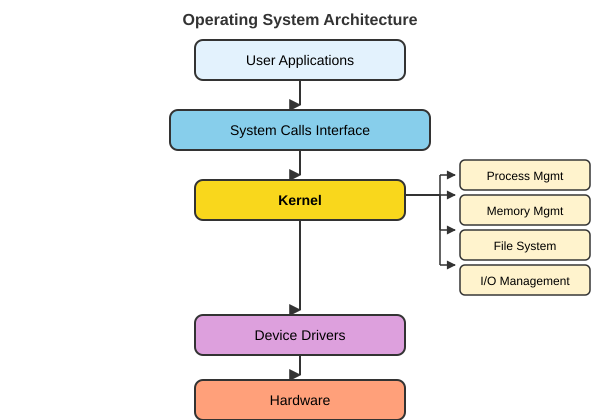

# Computer Systems Architecture {#sec-computer-systems}

```{r}
#| label: ch02-setup
#| include: false
library(tidyverse)
library(gt)
theme_set(theme_minimal())
```

::: {.callout-note title="Learning Objectives"}
After completing this chapter, you will be able to:

- Describe the major components of a computer system
- Explain the fetch-decode-execute cycle
- Compare CPU and GPU architectures and their appropriate use cases
- Distinguish between different types of memory and storage
- Understand the role of operating systems
- Compare local, cluster, and cloud computing approaches
:::

Understanding how computers work at a fundamental level will help you make better decisions about computational resources, write more efficient code, and troubleshoot problems effectively. This chapter provides the conceptual foundation for everything that follows.

## What Is a Computer System? {#sec-what-is-computer}

A computer system consists of four major components working together:

**Hardware.** The physical components you can touch—processors, memory chips, storage devices, and input/output peripherals.

**Software.** Programs and instructions that tell the hardware what to do. This includes operating systems, applications, and your own scripts.

**Firmware.** Low-level software embedded directly in hardware components, providing basic control functions.

**Data.** The information being processed, stored, and transmitted by the system.

@fig-computer-components shows how data flows between these components.

{#fig-computer-components fig-align="center" width="60%"}

The hardware on the edges of that diagram is the **input/output (I/O) system**: keyboards, mice, touchscreens, cameras, microphones, and laboratory sensors bring data in; displays, printers, speakers, and actuators send results out. A network interface is both, which is why a cluster or cloud machine you never touch physically can still be a full computer system.

At the heart of every computation is the **fetch-decode-execute cycle**, which the CPU performs billions of times per second.

## The Fetch-Decode-Execute Cycle {#sec-fetch-decode-execute}

Every instruction your programs execute follows the same fundamental pattern (@fig-fetch-decode-execute):

{#fig-fetch-decode-execute fig-align="center" width="85%"}

1. **Fetch**: The CPU retrieves the next instruction from memory
2. **Decode**: The CPU interprets what the instruction means
3. **Execute**: The CPU performs the specified operation
4. **Store**: Results are saved to memory or a register

This cycle repeats continuously, with modern processors executing billions of cycles per second. Understanding this cycle helps explain why some operations are fast (data already in registers) while others are slow (waiting for data from disk).

## The Central Processing Unit (CPU) {#sec-cpu}

The CPU is often called the "brain" of the computer, though this metaphor oversimplifies its function. The CPU is really a very fast calculator that follows instructions precisely.

### CPU Components {#sec-cpu-components}

The CPU contains several critical components:

**Control Unit (CU).** Directs the operation of the processor, managing the fetch-decode-execute cycle.

**Arithmetic Logic Unit (ALU).** Performs mathematical calculations and logical comparisons.

**Registers.** Ultra-fast temporary storage locations (typically 64 bits each) for data being actively processed.

**Cache.** High-speed memory buffer that stores frequently accessed data to reduce trips to main memory.

### Key CPU Concepts {#sec-key-cpu-concepts}

Several metrics describe CPU performance:

**Clock Speed.** Measured in gigahertz (GHz), this indicates how many cycles the CPU can perform per second. A 3.5 GHz processor performs 3.5 billion cycles per second.

**Cores.** Modern CPUs contain multiple independent processing units (cores). An 8-core processor can theoretically perform 8 operations simultaneously.

**Threads.** Virtual cores that allow better utilization of physical cores through simultaneous multithreading (SMT) or hyper-threading.

**Instruction Set.** The low-level language the CPU understands. Common architectures include x86-64 (Intel/AMD) and ARM (Apple Silicon, most phones).

::: {.callout-note}
More cores and higher clock speeds don't always mean faster performance for your specific task. Many analyses are limited by memory access speed or storage I/O rather than raw CPU power.
:::

## Graphics Processing Units (GPUs) {#sec-gpus}

While CPUs are designed for complex sequential tasks, **GPUs** excel at simple parallel operations. Originally designed for rendering graphics (where millions of pixels need similar calculations), GPUs have become essential for:

- Machine learning and deep neural networks
- Scientific simulations
- Cryptocurrency mining
- Image and video processing

### GPU Architecture {#sec-gpu-architecture}

GPUs differ fundamentally from CPUs:

**Streaming Multiprocessors (SMs).** Processing clusters containing many smaller cores.

**CUDA Cores / Stream Processors.** Thousands of simple processing units optimized for parallel computation.

**Video Memory (VRAM).** Dedicated high-bandwidth memory separate from system RAM.

### CPU vs. GPU: When to Use Each {#sec-cpu-vs-gpu-when-to-use-each}

@tbl-cpu-gpu contrasts the two processor types.

| Characteristic | CPU | GPU |
|:---------------|:----|:----|
| Design Focus | Sequential, complex tasks | Parallel, simple tasks |
| Core Count | 4-64 powerful cores | Thousands of smaller cores |
| Memory | Large cache, lower bandwidth | Smaller cache, higher bandwidth |
| Best For | Operating systems, complex logic, serial tasks | Graphics, ML/AI, simulations |

: Comparison of CPU and GPU characteristics {#tbl-cpu-gpu}

::: {.callout-tip}
If your computation involves applying the same operation to millions of data points (like image processing or matrix multiplication), GPUs can provide dramatic speedups. If your computation requires complex branching logic and sequential dependencies, CPUs are more appropriate.
:::

## Types of Computer Memory {#sec-memory-types}

Understanding the memory hierarchy helps explain performance characteristics of different operations.

### Random Access Memory (RAM) {#sec-random-access-memory}

RAM provides temporary working space for programs and data currently in use. Key characteristics:

**Volatile.** Contents are lost when power is removed.

**Random Access.** Any memory location can be accessed with equal speed (unlike sequential access).

**Bandwidth and Latency.** Two different numbers describe how fast memory is: *bandwidth* is how much data can move per second (tens of gigabytes per second for modern DDR4/DDR5 memory), and *latency* is the delay before the first byte arrives (on the order of 100 nanoseconds). Running two memory modules in *dual channel* doubles the available bandwidth, which is why laptops are usually sold with matched pairs.

**Types.** There are two main kinds of RAM:

- **DRAM (Dynamic RAM)**: Main system memory (the DDR4 and DDR5 modules in a laptop or server); cheap and dense, but must be refreshed constantly
- **SRAM (Static RAM)**: Used in CPU caches; needs no refresh and is much faster, but far more expensive per byte

Modern systems typically have 8-64 GB of RAM, though scientific workstations and servers may have much more. For a concrete sense of scale, @tbl-laptop-vs-talapas in @sec-computing-at-uo compares a typical laptop (8-16 GB) with a single Talapas node (512 GB) and the cluster's large-memory nodes (up to 4 TB).

::: {.callout-tip title="The usual bottleneck is RAM"}
For data analysis, the most common limit is not processor speed but memory: your data must fit in RAM while you work on it. When a program dies with "out of memory," or your laptop grinds to a halt swapping to disk, the remedy is more RAM or a move to the cluster (@sec-hpc-talapas), not a faster CPU.
:::

### Persistent Storage {#sec-persistent-storage}

Unlike RAM, storage devices retain data without power:

**Hard Disk Drives (HDDs)**

- Mechanical spinning platters with magnetic storage
- Large capacities at low cost (many terabytes)
- Slower access (~10ms latency, 100-200 MB/s throughput)
- Susceptible to physical damage

**Solid State Drives (SSDs)**

- No moving parts (NAND flash memory)
- Much faster access (~0.1ms latency, 500-7000 MB/s throughput)
- More expensive per gigabyte than HDDs
- More durable and energy-efficient

::: {.callout-important}
The memory hierarchy creates significant performance differences. Data in CPU registers can be accessed in nanoseconds, data in RAM in tens of nanoseconds, but data on disk takes milliseconds—a difference of six orders of magnitude!
:::

### The Memory Hierarchy {#sec-the-memory-hierarchy}

@fig-memory-hierarchy illustrates the tradeoffs between speed, capacity, and cost:

```{r}
#| label: fig-memory-hierarchy
#| fig-cap: "The memory hierarchy: faster storage is smaller and more expensive"
#| echo: false

memory_data <- tibble(
  Level = factor(c("Registers", "L1 Cache", "L2 Cache", "L3 Cache", "RAM", "SSD", "HDD"),
                 levels = c("Registers", "L1 Cache", "L2 Cache", "L3 Cache", "RAM", "SSD", "HDD")),
  Capacity = c(1, 64, 256, 8192, 32768, 1e6, 4e6),  # KB
  Access_ns = c(0.5, 1, 4, 20, 100, 25000, 5e6)
)

ggplot(memory_data, aes(x = Level, y = Access_ns)) +
  geom_col(fill = "#154733", alpha = 0.8) +
  scale_y_log10(labels = scales::comma) +
  labs(
    title = "Memory Access Times",
    x = "Memory Type",
    y = "Access Time (nanoseconds, log scale)"
  ) +
  theme(axis.text.x = element_text(angle = 45, hjust = 1))
```

## Operating Systems {#sec-operating-systems}

An **operating system (OS)** is the software layer that manages hardware resources and provides services to applications. Think of it as a translator between your programs and the physical computer.

### How an Operating System Is Organized {#sec-os-architecture}

@fig-os-architecture shows the layers. Your applications (R, a web browser, a shell) never touch the hardware directly. They make **system calls**—requests such as "open this file" or "give me more memory"—to the **kernel**, the core of the OS that runs with full privileges. The kernel's subsystems handle process management, memory management, the file system, and I/O, and talk to the physical hardware through **device drivers**, small pieces of code that know the details of one particular disk, network card, or GPU. This layering is what lets the same R script run on a laptop and a cluster node with completely different hardware.

{#fig-os-architecture fig-align="center" width="70%"}

### Core Functions {#sec-core-functions}

Operating systems handle:

**Process Management.** Creating, scheduling, and terminating programs. Managing how CPU time is shared among competing processes.

**Memory Management.** Allocating RAM to programs, implementing virtual memory, protecting programs from interfering with each other's memory.

**File System Management.** Organizing data on storage devices, managing directories and permissions, handling read/write operations.

**Device Management.** Providing standardized interfaces to diverse hardware through device drivers.

**Security.** User authentication, access control, protection against malicious software.

### CPU Scheduling {#sec-cpu-scheduling}

A computer runs far more processes than it has cores, so the OS must decide which process gets a core next. This is **CPU scheduling**, and the same ideas reappear at cluster scale when SLURM decides which *job* runs next (@sec-scheduler-fairshare). The classic strategies are:

- **First-come, first-served (FCFS)**: simple, but one long process can make everything behind it wait
- **Shortest job first (SJF)**: gives the best average waiting time, if job lengths are known in advance
- **Round robin (RR)**: every runnable process gets a short time slice in turn, which keeps interactive programs responsive
- **Priority scheduling**: important processes go first, usually with some aging so low-priority work eventually runs

Schedulers are judged by *CPU utilization* (keep the cores busy), *throughput* (jobs finished per unit time), *turnaround time* (submission to completion), *waiting time* (time spent in the ready queue), and *response time* (delay before the first visible output). Desktop operating systems weight responsiveness heavily; a cluster scheduler weights throughput and fairness instead.

### Security and Protection {#sec-os-security}

The OS also keeps programs and users from interfering with one another. The CPU itself runs in two modes: ordinary programs execute in **user mode**, and only the kernel executes in **kernel mode**, where it can touch hardware directly; a user-mode program that tries to access memory that is not its own is stopped by **memory protection**. On top of that, file **permissions** and access control lists decide who may read or write what (@sec-file-permissions), user authentication verifies who you are, and **sandboxing** isolates untrusted processes (containers, discussed in @sec-software-layers, are a modern form of this).

### Common Operating Systems {#sec-common-operating-systems}

For scientific computing, you'll encounter:

**Linux.** Open-source Unix-like OS dominant in servers and clusters, and heir to the design philosophy of the original Unix [@kernighan1984unix]. Most bioinformatics tools assume Linux.

**macOS.** Apple's Unix-based desktop OS. Provides native access to Unix tools.

**Windows.** Microsoft's desktop OS. Now supports Linux tools through WSL (see @sec-windows-setup).

::: {.callout-note title="The Principle of Least Privilege"}
A fundamental security concept: every program and user should operate using the minimum permissions necessary to accomplish their task. This limits the damage that can occur from mistakes or malicious actions.
:::

## Computing Environments {#sec-computing-environments}

Research computing happens across a spectrum of environments, from your laptop to massive cloud data centers.

### Local Computing {#sec-local-computing}

**Local computing** refers to resources physically present and directly controlled by you—your laptop, desktop, or lab workstation. @fig-local-architecture shows the software stack on such a machine: applications sit on the operating system, which reaches the CPU, memory, storage, GPU, and network card through a hardware abstraction layer.

{#fig-local-architecture fig-align="center" width="70%"}

The appeal of local computing is control. The machine is yours, the software on it is whatever you choose to install, the data never leaves your desk, nothing depends on a network connection, and performance is predictable because no one else is using it. The costs are the mirror image of those strengths: the scale is fixed by the hardware you bought, you are responsible for maintenance and backups, a powerful workstation is a large one-time expense, and for most of every day and all of every night the machine sits idle.

### Cluster Computing {#sec-cluster-computing}

A **computing cluster** is a collection of interconnected computers (nodes) working together as a single system. The University of Oregon's Talapas is an example; @fig-cluster-architecture shows the basic layout, and @sec-hpc-talapas covers using it.

{#fig-cluster-architecture fig-align="center" width="70%"}

Key components include:

**Head/Login Node.** Where users log in and submit jobs. Not for running computations!

**Compute Nodes.** Worker machines that actually run your analyses.

**Interconnect.** A high-speed network (InfiniBand or 10+ gigabit Ethernet) linking the nodes to each other and to storage. It is much faster than an ordinary office network, and it is what makes a cluster behave like one machine rather than many.

**Shared Storage.** Parallel file systems such as Lustre or IBM's GPFS (the one Talapas uses; @sec-talapas-storage) that every node sees identically, so a file written on the login node is immediately available to a job on any compute node.

**Resource Manager.** Software that schedules jobs and allocates resources fairly. Several exist (@tbl-resource-managers); Talapas uses SLURM [@yoo2003slurm], for which @sec-appendix-slurm is a command reference.

| System | Typical use | Key features |
|:-------|:------------|:-------------|
| SLURM | Academic and national-lab HPC (Talapas) | Fair-share scheduling, backfill, job arrays, power management |
| PBS / Torque | Traditional HPC | Mature, stable, widely supported |
| SGE / UGE (Grid Engine) | Mixed workloads | Flexible queue policies |
| Kubernetes | Containerized services and cloud | Microservices, auto-scaling |

: Resource managers used to schedule jobs on clusters {#tbl-resource-managers}

A cluster trades that control for scale. Because nodes can be added, a cluster grows to a size no single machine can reach, and because it is shared among many users and projects, it can justify specialized hardware such as GPUs and very-large-memory nodes that no individual lab would buy. It is professionally managed and maintained, and it tolerates failure: if one node dies, the others keep working. In return you must learn the job-scheduling system, accept that jobs may wait in a queue, compete with other users for resources, and live with less control over the software environment than on your own machine. Somebody also has to fund the space, power, and cooling, which is why access is organized through PIRGs and allocations (@sec-computing-at-uo).

### Cloud Computing {#sec-cloud-computing}

**Cloud computing** provides on-demand computing resources over the internet, with pay-as-you-go pricing. Major providers include Amazon Web Services (AWS, the market leader with hundreds of services), Microsoft Azure (strong enterprise integration), and Google Cloud Platform (GCP, with an AI/ML focus). @fig-cloud-architecture sketches how a provider organizes its resources: each geographic **region** contains several independent **availability zones**, each with its own compute, storage, and networking, so that a failure in one zone does not take down the others.

{#fig-cloud-architecture fig-align="center" width="75%"}

The cloud's distinctive strength is elasticity: resources can be added or removed in minutes, there is no hardware to buy up front, the same services are available worldwide, and managed offerings such as hosted databases and notebooks remove much of the operational burden, with redundancy and disaster recovery built in. Its weaknesses are financial and contractual as much as technical. Pay-as-you-go costs can exceed those of an on-premises system for steady workloads; proprietary services create vendor lock-in; everything depends on a reliable internet connection; moving data out is billed as egress and can be surprisingly expensive; you have less control than on a local system and must answer compliance questions about where data may reside; and performance can vary with "noisy neighbors" sharing the same physical hardware.

### Choosing the Right Environment {#sec-choosing-the-right-environment}

@tbl-computing-environments summarizes the tradeoffs between the three environments.

| Factor | Local | Cluster | Cloud |
|:-------|:------|:--------|:------|
| Scale | Small | Large | Unlimited |
| Control | Complete | Moderate | Limited |
| Cost Model | Capital expense | Shared allocation | Pay-per-use |
| Learning Curve | Low | Moderate | Moderate-High |
| Best For | Development, small analyses | Large batch jobs | Burst computing, web services |

: Comparison of computing environments {#tbl-computing-environments}

::: {.callout-tip}
A common workflow: develop and test locally, run production analyses on a cluster, use cloud resources for specialized needs or when cluster queues are full.
:::

## The Evolution of Scientific Computing {#sec-computing-evolution}

Computing infrastructure has evolved dramatically over the past several decades (@fig-computing-evolution): from centralized mainframes in the 1960s and 70s, through personal computers in the 1980s and 90s and client-server systems in the 1990s and 2000s, to clusters and grids in the 2000s, cloud computing from about 2006 on, and today's edge and hybrid arrangements.

{#fig-computing-evolution fig-align="center" width="100%"}

Key drivers of this evolution include:

- **Performance Needs**: Ever-increasing computational demands from research
- **Economics**: Pursuit of cost optimization and economies of scale
- **Connectivity**: Internet bandwidth improvements enabling remote computing
- **Virtualization**: Technologies that abstract hardware from software

Modern research computing increasingly uses **hybrid approaches**, combining local development with cluster and cloud resources based on the specific needs of each project.

## Summary {#sec-cs-summary}

This chapter provided foundational knowledge about computer systems:

- Computers consist of hardware, software, firmware, and data working together
- The CPU executes instructions through the fetch-decode-execute cycle
- GPUs excel at parallel tasks; CPUs excel at sequential, complex operations
- Memory hierarchy creates significant performance differences
- Operating systems manage resources and provide services to applications
- Computing environments range from local to cluster to cloud, each with tradeoffs

Understanding these concepts will help you choose appropriate resources for your analyses, interpret performance characteristics, and communicate effectively with system administrators.

## Additional Reading {#sec-cs-additional-reading .unnumbered}

To deepen your understanding of computer systems architecture:

- **"Code: The Hidden Language of Computer Hardware and Software"** by Charles Petzold — An accessible introduction to how computers work from first principles
- **"Computer Organization and Design"** by Patterson and Hennessy — The classic textbook on computer architecture
- **[Putting the "You" in CPU](https://cpu.land/)** — A free, interactive online guide to how processors work
- **[How Computers Really Work](https://nostarch.com/how-computers-really-work)** by Matthew Justice — A practical guide covering hardware, software, and everything in between
- **AWS, GCP, and Azure Documentation** — Each cloud provider offers extensive free training on cloud computing concepts

For GPU computing and parallel processing:

- **NVIDIA CUDA Documentation** — Comprehensive guides for GPU programming
- **[An Even Easier Introduction to CUDA](https://developer.nvidia.com/blog/even-easier-introduction-cuda/)** — NVIDIA's beginner-friendly CUDA tutorial

## Exercises {#sec-cs-exercises .unnumbered}

::: {.callout-tip title="Practice Exercises"}
1. **System Exploration**: On your computer, find out:
   - How many CPU cores does your system have?
   - How much RAM is installed?
   - What type of storage (SSD or HDD) do you have?
   - What operating system and version are you running?

2. **Memory Hierarchy**: Explain why reading data from disk is so much slower than reading from RAM. What implications does this have for analyzing large datasets?

3. **Computing Environment Selection**: For each scenario, which computing environment (local, cluster, or cloud) would you recommend and why?
   - Testing a new analysis script on a small dataset
   - Running a genome assembly requiring 256 GB of RAM
   - Hosting a web application for your lab's research tools
   - Training a deep learning model requiring multiple GPUs for two weeks
:::
