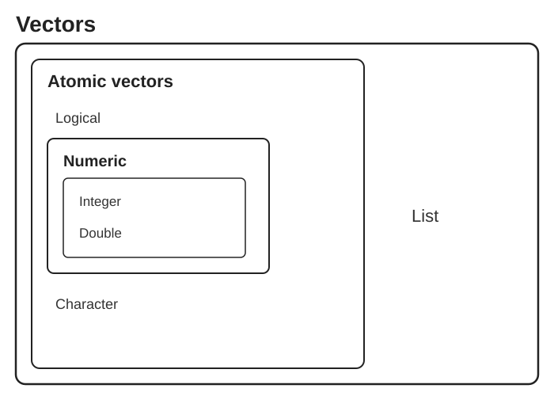

# Tidy Data Principles {#sec-tidy-data}

```{r}
#| label: ch08-setup
#| include: false
library(tidyverse)
library(gt)
theme_set(theme_minimal())
```

::: {.callout-note title="Learning Objectives"}
After completing this chapter, you will be able to:

- Define tidy data and explain its three principles
- Identify common problems in messy datasets
- Apply tidy data principles to your own data
- Distinguish between different data types
- Implement best practices for data organization
- Use appropriate file formats for data storage
:::

This chapter is about how to *think* about and *organize* data, whether it lives in a spreadsheet, a text file, or a data frame. The small R examples are illustrations you can read without knowing R yet; the tools for actually wrangling data in R (the tidyverse) come in @sec-data-wrangling, after R itself is introduced in @sec-r-programming.

## Why Data Organization Matters {#sec-why-data-organization}

Before you can analyze data, you must organize it. The structure of your data profoundly affects how easily you can work with it. A well-organized dataset can be analyzed in minutes; a poorly organized one might require hours of preprocessing.

Consider this scenario: you've completed an experiment measuring gene expression levels in fish embryos exposed to different environmental stressors. You carefully collected samples at multiple developmental stages, ran your assays, and now have a spreadsheet full of numbers. The analysis should be straightforward—just load the data and run some statistical tests.

But then reality sets in. Your spreadsheet has multiple header rows. Some columns contain merged cells indicating experimental blocks. Treatment conditions are color-coded rather than labeled. Missing values appear as empty cells, question marks, or the word "missing" depending on who entered the data. Suddenly, what should have been an afternoon of analysis becomes a week of data cleaning.

This scenario plays out in laboratories around the world, every day. The solution isn't just better software—it's better data organization from the start.

**Tidy data** provides a standard way to organize data that makes analysis easier. It's not the only valid way to structure data, but it's particularly well-suited for analysis in R and Python (pandas follows the same ideas; see @sec-py-pandas). When your data is tidy, you spend less time wrestling with data formats and more time answering scientific questions.

::: {.callout-note title="Data Wrangling in the Wild"}
It's often said that 80% of data analysis is spent on data cleaning and preparation. While this statistic varies by field and project, the underlying truth remains: thoughtful data organization at the start of a project saves enormous time and frustration later.
:::

## The Three Principles of Tidy Data {#sec-tidy-principles}

Hadley Wickham formalized the concept of tidy data in an influential paper [@wickham2014tidy]. Tidy data follows three rules:

::: {.callout-important title="The Three Rules of Tidy Data"}
1. Each **variable** forms a column
2. Each **observation** forms a row
3. Each **value** has its own cell
:::

{#fig-tidy-structure width="80%"}

Wickham's original paper states the third rule slightly differently: each **type of observational unit** forms its own table (we return to this in @sec-messy-multiple-units). The rules are interrelated—it is impossible to satisfy only two of the three—which leads to an even simpler pair of practical instructions:

1. Put each dataset in a tibble (or data frame)
2. Put each variable in a column

Real-world data rarely arrives in this form. Spreadsheets often encode information in column names, spread a single variable across several columns, or combine several variables in one column. **Data wrangling** is the process of transforming such messy data into tidy data, and the rest of this chapter is about the tools for doing so.

Let's unpack what the three rules mean.

### Variables as Columns {#sec-variables-as-columns}

A **variable** is a characteristic that you measure, observe, or categorize. Examples:

- Gene expression level
- Treatment group
- Patient age
- Sample ID
- Measurement date

Each variable should have its own column with a descriptive header.

### Observations as Rows {#sec-observations-as-rows}

An **observation** is a single unit of data collection—typically one measurement from one subject at one time point. Each observation gets its own row.

### Values in Cells {#sec-values-in-cells}

Each cell contains exactly one value. No merged cells, no multiple values crammed together, no implicit values indicated by color or formatting.

## Tidy vs. Messy Data: Examples {#sec-tidy-examples}

### A Tidy Dataset {#sec-tidy-example}

```{r}
#| label: tbl-tidy-example
#| tbl-cap: "Example of tidy data organization"

tidy_data <- tibble(
  sample_id = c("S001", "S002", "S003", "S001", "S002", "S003"),
  timepoint = c("0h", "0h", "0h", "24h", "24h", "24h"),
  gene = rep("BRCA1", 6),
  expression = c(4.2, 3.8, 4.5, 8.1, 7.9, 9.2)
)

tidy_data |>
  gt() |>
  tab_header(title = "Gene Expression Data (Tidy Format)")
```

This is tidy because:

- Each column is a variable (sample_id, timepoint, gene, expression)
- Each row is an observation (one expression measurement)
- Each cell has one value

### A Messy Dataset (Same Data) {#sec-messy-example}

A common messy format spreads measurements across columns:

```{r}
#| label: tbl-messy-example
#| tbl-cap: "The same data in messy (wide) format"

messy_data <- tibble(
  sample_id = c("S001", "S002", "S003"),
  `BRCA1_0h` = c(4.2, 3.8, 4.5),
  `BRCA1_24h` = c(8.1, 7.9, 9.2)
)

messy_data |>
  gt() |>
  tab_header(title = "Gene Expression Data (Messy Format)")
```

This is messy because:

- Time point and gene are embedded in column names
- Each row represents multiple observations
- Adding genes or timepoints requires adding columns

### Why It Matters {#sec-why-it-matters}

With tidy data, operations are straightforward:

```{r}
#| label: tidy-operations

# Calculate mean expression by timepoint
tidy_data |>
  group_by(timepoint) |>
  summarize(mean_expression = mean(expression))

# Easy to filter and plot
tidy_data |>
  filter(timepoint == "24h")
```

With messy data, you must first reshape it—or write complex code to work around the structure.

## Common Data Problems {#sec-data-problems}

### Problem 1: Column Headers Are Values {#sec-messy-headers-are-values}

Often, column names contain data values rather than variable names:

```{r}
#| label: headers-are-values

# Messy: years in column headers
population_messy <- tibble(
  country = c("USA", "Canada", "Mexico"),
  `2020` = c(331, 38, 129),
  `2021` = c(332, 38, 130),
  `2022` = c(333, 39, 131)
)

population_messy |> gt()
```

Solution: "Pivot" the data to create a `year` column:

```{r}
#| label: pivot-longer

population_tidy <- population_messy |>
  pivot_longer(
    cols = `2020`:`2022`,
    names_to = "year",
    values_to = "population"
  )

population_tidy |> gt()
```

### Problem 2: Multiple Variables in One Column {#sec-messy-multiple-variables}

Sometimes multiple pieces of information are crammed into one cell:

```{r}
#| label: multiple-vars

# Messy: rate contains both values
messy_rates <- tibble(
  country = c("USA", "Canada", "Mexico"),
  rate = c("1000/50000", "200/10000", "500/25000")
)

messy_rates |> gt()
```

Solution: Separate into distinct columns:

```{r}
#| label: separate-cols

tidy_rates <- messy_rates |>
  separate(rate, into = c("cases", "population"), sep = "/", convert = TRUE)

tidy_rates |> gt()
```

### Problem 3: Variables in Both Rows and Columns {#sec-messy-rows-and-columns}

Complex tables sometimes mix variables across dimensions:

```{r}
#| label: both-dimensions

# Messy: measurement type in rows, conditions in columns
messy_experiment <- tibble(
  measurement = c("weight", "height", "weight", "height"),
  subject = c("A", "A", "B", "B"),
  control = c(70, 170, 65, 165),
  treatment = c(68, 170, 64, 166)
)

messy_experiment |> gt()
```

This requires multiple steps to tidy: pivot longer, then pivot wider.

### Problem 4: Multiple Observational Units {#sec-messy-multiple-units}

When a single table contains data about different types of things:

```{r}
#| label: multiple-units

# Messy: patient and hospital info in same table
combined_data <- tibble(
  patient_id = c("P001", "P002"),
  patient_name = c("Alice", "Bob"),
  hospital_id = c("H1", "H1"),
  hospital_name = c("General", "General"),
  hospital_beds = c(500, 500),  # Repeated!
  diagnosis = c("Flu", "Cold")
)

combined_data |> gt()
```

Solution: Normalize into separate tables linked by keys.

## Best Practices for Data Organization {#sec-data-best-practices}

### Naming Conventions {#sec-tidy-naming-conventions}

::: {.callout-tip title="Data File Naming Rules"}
**File names:**

- Use descriptive names: `patient_outcomes_2024.csv`
- Include dates in ISO format: `YYYY-MM-DD`
- Avoid spaces (use underscores or hyphens)
- Keep names concise but informative

**Column names:**

- Use lowercase with underscores: `sample_id`, `gene_expression`
- Make names meaningful: `treatment_group` not `tg`
- Avoid special characters and spaces
- Start with a letter, not a number
:::

### File Formats {#sec-file-formats}

@tbl-file-formats lists the formats you will meet most often; @sec-appendix-data-formats describes them in more detail.

| Format | Extension | Best For |
|:-------|:----------|:---------|
| Comma-separated | `.csv` | General tabular data |
| Tab-separated | `.tsv` | Data containing commas |
| Plain text | `.txt` | Simple data, scripts |
| Excel | `.xlsx` | Sharing with non-programmers |
| RDS | `.rds` | R-specific data with types preserved |
| Parquet | `.parquet` | Large datasets, fast reading |

: Common data file formats {#tbl-file-formats}

For long-term storage and sharing, prefer plain text formats (CSV, TSV) over proprietary formats. They're human-readable and don't require specific software.

### Documentation {#sec-documentation}

Always create a **data dictionary** (also called a codebook) documenting:

- Variable names and descriptions
- Units of measurement
- Allowable values or categories
- Coding of missing values
- Source of the data
- Date created/modified

### Preserving Raw Data {#sec-preserving-raw-data}

::: {.callout-warning title="Never Modify Raw Data"}
Always keep an unchanged copy of your original data. Create a separate processed version for analysis. This allows you to:

- Retrace your steps if something goes wrong
- Rerun analysis with different preprocessing
- Share the original data with collaborators

Keep raw files in their own directory, with write permission removed if possible (`chmod a-w`, @sec-chmod). All cleaning and transformation should be done programmatically, in scripts that can be re-run, with the outputs saved to new files.
:::

### Data File Do's and Don'ts {#sec-data-file-dos-donts}

The naming rules above cover file and column names; these guidelines cover the *contents* of a data file, whether you edit it with Unix tools, R, or a spreadsheet program.

::: {.callout-tip title="Do"}
- **Add new observations as rows** and new variables as columns, so the file stays rectangular
- **Include exactly one header row** with concise but descriptive variable names
- **Use ISO 8601 dates** (`YYYY-MM-DD`): they sort correctly as text and contain no delimiter characters
- **Represent missing values consistently**, as empty cells or `NA`
- **Maintain metadata** (a data dictionary, @sec-documentation) alongside the file
:::

::: {.callout-warning title="Don't"}
- **Don't mix data types within a column.** If a column holds numbers, every entry should be a number or an explicit `NA`, never a note like `"below detection"`
- **Don't use delimiter characters inside values.** In a comma-delimited file, a value such as `March 8, 2024` will be split into two fields
- **Don't paste data from formatted documents** such as Word; hidden formatting characters can corrupt a file
- **Don't open data files in Excel to edit them** unless you know what it will silently convert: gene names such as `SEPT1` and `MARCH1` become dates, and long identifiers become scientific notation
- **Don't encode information in colour or formatting.** Everything must live in the cell values, because formatting is lost on export
- **Don't leave empty rows or columns as visual separators.** They break the rectangular structure that import functions expect
:::

## Data Types {#sec-tidy-data-types}

Understanding data types helps you organize and analyze correctly.

### Categorical vs. Quantitative {#sec-categorical-vs-quantitative}

```{r}
#| label: tbl-data-types-table
#| tbl-cap: "Classification of data types"

data_types <- tibble(
  Category = c("Categorical", "Categorical", "Quantitative", "Quantitative"),
  Type = c("Ordinal", "Nominal", "Ratio", "Interval"),
  Description = c(
    "Ordered categories",
    "Unordered categories",
    "True zero, ratios meaningful",
    "No true zero"
  ),
  Examples = c(
    "small, medium, large",
    "red, blue, green",
    "height, weight, concentration",
    "temperature (°C), calendar year"
  )
)

data_types |>
  gt() |>
  tab_header(title = "Data Type Classification")
```

Quantitative data can be further split into **discrete** values (counts, integers, scores on a fixed scale) and **continuous** values that can in principle take any value in a range (mass, concentration, expression level). The interval/ratio distinction matters because ratio data support statements like "twice as much" while interval data do not: 20 g is twice as heavy as 10 g, but water at 20 °C is not "twice as hot" as water at 10 °C.

### R Data Types {#sec-r-data-types}

Each of these kinds of data maps onto a specific R type (@tbl-r-data-types and @fig-r-vector-types); the vector types themselves are covered in @sec-vectors.

| Data Type | Description | Examples | R Type |
|:----------|:------------|:---------|:-------|
| **Character** | Text strings | "control", gene names | `character` |
| **Factor** | Categorical with levels, unordered | Species, treatment groups | `factor` |
| **Ordered factor** | Categorical with a meaningful order | "low" < "medium" < "high" | `ordered` |
| **Integer** | Whole numbers | Counts, discrete measurements | `integer` |
| **Numeric** | Real numbers | Measurements, ratios, continuous data | `numeric` (`double`) |
| **Logical** | True/false values | QC pass/fail, conditions | `logical` |
| **Date** | Calendar dates | "2024-01-15", collection dates | `Date` |
| **Date-time** | Timestamps with time | "2024-01-15 14:30:00" | `POSIXct` |

: How kinds of data map to R types {#tbl-r-data-types}

{#fig-r-vector-types width="80%"}

```{r}
#| label: r-types

# Numeric (continuous)
temperature <- c(37.2, 36.8, 38.1)
class(temperature)
typeof(temperature)   # stored as "double"

# Integer (the L suffix)
counts <- c(1L, 2L, 3L)
class(counts)

# Character
sample_names <- c("control", "treatment", "treatment")
class(sample_names)

# Factor (categorical)
treatment <- factor(c("low", "medium", "high"),
                   levels = c("low", "medium", "high"),
                   ordered = TRUE)
class(treatment)
treatment

# Logical
passed_qc <- c(TRUE, TRUE, FALSE)
class(passed_qc)

# Date
collected <- as.Date("2024-01-15")
class(collected)
```

`class()` reports the type R uses when choosing how to print, plot, or model an object; `typeof()` reports how the values are stored underneath (a `numeric` vector is stored as `double`, a factor as `integer`). Getting types right matters because statistical and plotting functions treat factors differently from character strings, and arithmetic only works on numeric types.

### When to Use Factors {#sec-when-to-use-factors}

Factors are R's way of handling categorical variables. Use them when:

- You have a limited set of possible values
- The order matters (ordinal data)
- You want specific grouping in analyses and plots

```{r}
#| label: factor-example

# Character vector sorts alphabetically
treatments <- c("High", "Low", "Medium", "Low", "High")
sort(treatments)

# Factor maintains meaningful order
treatments_factor <- factor(treatments, 
                           levels = c("Low", "Medium", "High"))
sort(treatments_factor)
```

## Structuring Spreadsheets for Analysis {#sec-spreadsheets}

If you must use spreadsheets for data entry, follow these guidelines:

::: {.callout-important title="Spreadsheet Best Practices"}
1. **One header row only** — Put variable names in row 1
2. **No merged cells** — They break data structure
3. **No color-coding as data** — Use a column instead
4. **Consistent missing values** — Use `NA`, not blank, `-`, or `N/A`
5. **One sheet per dataset** — Don't spread data across tabs
6. **Export as CSV** — Preserve as plain text
7. **No calculations in raw data** — Keep raw and calculated data separate
:::

### Before and After {#sec-before-and-after}

**Bad spreadsheet practices:**

- Merged cells for visual grouping
- Color-coded cells indicating categories
- Multiple header rows
- Notes in random cells
- Mixed data types in columns
- Embedded calculations

**Good spreadsheet practices:**

- Clean rectangular data
- Single header row
- Consistent formatting throughout
- Separate documentation sheet
- Explicit coding of all information

## Summary {#sec-tidy-summary}

Tidy data provides a consistent structure that simplifies analysis:

- Each variable is a column
- Each observation is a row
- Each value occupies one cell

Key principles for data organization:

- Use descriptive, consistent naming conventions
- Document your data with a data dictionary
- Preserve raw data separately from processed data
- Choose appropriate file formats for your needs
- Understand the difference between data types

The tools for putting these principles into practice in R - the tidyverse, dplyr, and tidyr - are the subject of @sec-data-wrangling.

## Additional Reading {#sec-tidy-additional-reading .unnumbered}

To deepen your understanding of tidy data:

- **[Tidy Data (Original Paper)](https://vita.had.co.nz/papers/tidy-data.pdf)** by Hadley Wickham — The foundational paper on tidy data principles
- **[Data Organization in Spreadsheets](https://doi.org/10.1080/00031305.2017.1375989)** by Karl Broman and Kara Woo — Practical rules for spreadsheets that will be analyzed by code
- **[R for Data Science](https://r4ds.hadley.nz/)** by Hadley Wickham, Mine Çetinkaya-Rundel, and Garrett Grolemund [@wickham2023r] — Chapter 5 covers tidy data

## Exercises {#sec-tidy-exercises .unnumbered}

::: {.callout-tip title="Practice Exercises"}
**Exercise 1: Identify Tidy Data**

For each dataset description, determine if it's tidy. If not, explain what violates tidy principles:

1. Patient data with columns: patient_id, age, blood_pressure_systolic, blood_pressure_diastolic
2. Gene expression with columns: gene_name, sample_1, sample_2, sample_3
3. Survey data with columns: respondent_id, question, response
4. Weather data with columns: city, 2023_temp, 2024_temp, 2023_precip, 2024_precip

**Exercise 2: Data Dictionary**

Create a data dictionary for an experiment tracking:
- Gene expression levels measured at 0, 12, and 24 hours
- Three treatment groups (control, low dose, high dose)
- Twenty biological replicates per group
- Quality control pass/fail flags

**Exercise 3: Spot the Problems**

Review a dataset you've worked with (or your lab's data). Identify any violations of tidy data principles and propose solutions.

:::
