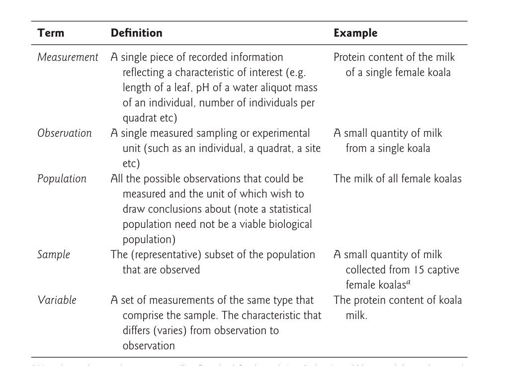
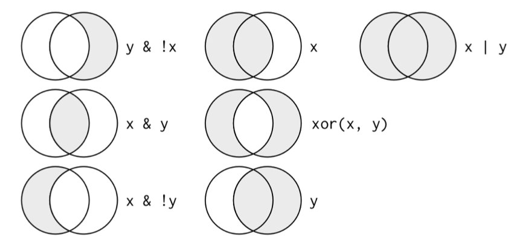
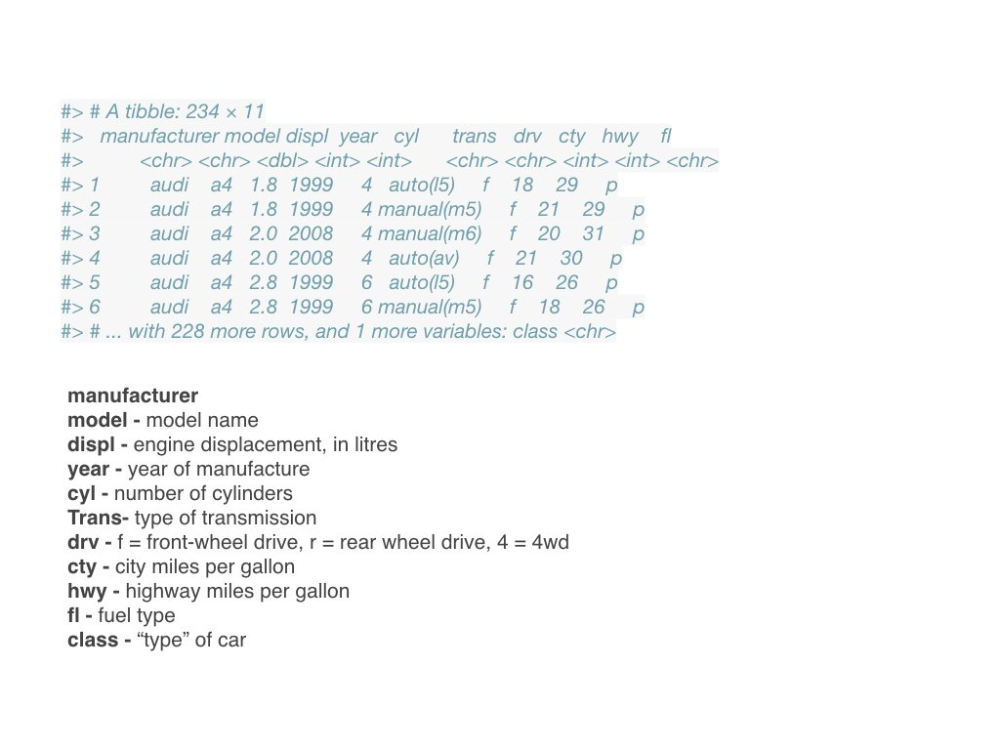

# Tidy Data Principles {#sec-tidy-data}

```{r}
#| label: ch08-setup
#| include: false
library(tidyverse)
library(gt)
theme_set(theme_minimal())
```

::: {.callout-note title="Learning Objectives"}
After completing this chapter, you will be able to:

- Define tidy data and explain its three principles
- Identify common problems in messy datasets
- Apply tidy data principles to your own data
- Distinguish between different data types
- Implement best practices for data organization
- Use appropriate file formats for data storage
- Use the tidyverse packages for data manipulation
- Apply dplyr verbs: filter, select, mutate, arrange, summarize
- Join multiple data frames using various join types
- Reshape data between wide and long formats with pivot functions
- Chain operations using the pipe operator
- Work with tibbles as modern data frames and inspect them with `glimpse()`
- Detect, drop, and replace missing values
- Understand when to use data.table for high-performance data wrangling
:::

## Why Data Organization Matters {#sec-why-data-organization}

Before you can analyze data, you must organize it. The structure of your data profoundly affects how easily you can work with it. A well-organized dataset can be analyzed in minutes; a poorly organized one might require hours of preprocessing.

Consider this scenario: you've completed an experiment measuring gene expression levels in fish embryos exposed to different environmental stressors. You carefully collected samples at multiple developmental stages, ran your assays, and now have a spreadsheet full of numbers. The analysis should be straightforward—just load the data and run some statistical tests.

But then reality sets in. Your spreadsheet has multiple header rows. Some columns contain merged cells indicating experimental blocks. Treatment conditions are color-coded rather than labeled. Missing values appear as empty cells, question marks, or the word "missing" depending on who entered the data. Suddenly, what should have been an afternoon of analysis becomes a week of data cleaning.

This scenario plays out in laboratories around the world, every day. The solution isn't just better software—it's better data organization from the start.

**Tidy data** provides a standard way to organize data that makes analysis easier. It's not the only valid way to structure data, but it's particularly well-suited for analysis in R and Python (pandas follows the same ideas; see @sec-py-pandas). When your data is tidy, you spend less time wrestling with data formats and more time answering scientific questions.

::: {.callout-note title="Data Wrangling in the Wild"}
It's often said that 80% of data analysis is spent on data cleaning and preparation. While this statistic varies by field and project, the underlying truth remains: thoughtful data organization at the start of a project saves enormous time and frustration later.
:::

## The Three Principles of Tidy Data {#sec-tidy-principles}

Hadley Wickham formalized the concept of tidy data in an influential paper [@wickham2014tidy]. Tidy data follows three rules:

::: {.callout-important title="The Three Rules of Tidy Data"}
1. Each **variable** forms a column
2. Each **observation** forms a row
3. Each **value** has its own cell
:::

{#fig-tidy-structure width="80%"}

Wickham's original paper states the third rule slightly differently: each **type of observational unit** forms its own table (we return to this in @sec-messy-multiple-units). The rules are interrelated—it is impossible to satisfy only two of the three—which leads to an even simpler pair of practical instructions:

1. Put each dataset in a tibble (or data frame)
2. Put each variable in a column

Real-world data rarely arrives in this form. Spreadsheets often encode information in column names, spread a single variable across several columns, or combine several variables in one column. **Data wrangling** is the process of transforming such messy data into tidy data, and the rest of this chapter is about the tools for doing so.

Let's unpack what the three rules mean.

### Variables as Columns {#sec-variables-as-columns}

A **variable** is a characteristic that you measure, observe, or categorize. Examples:

- Gene expression level
- Treatment group
- Patient age
- Sample ID
- Measurement date

Each variable should have its own column with a descriptive header.

### Observations as Rows {#sec-observations-as-rows}

An **observation** is a single unit of data collection—typically one measurement from one subject at one time point. Each observation gets its own row.

### Values in Cells {#sec-values-in-cells}

Each cell contains exactly one value. No merged cells, no multiple values crammed together, no implicit values indicated by color or formatting.

## Tidy vs. Messy Data: Examples {#sec-tidy-examples}

### A Tidy Dataset {#sec-tidy-example}

```{r}
#| label: tbl-tidy-example
#| tbl-cap: "Example of tidy data organization"

tidy_data <- tibble(
  sample_id = c("S001", "S002", "S003", "S001", "S002", "S003"),
  timepoint = c("0h", "0h", "0h", "24h", "24h", "24h"),
  gene = rep("BRCA1", 6),
  expression = c(4.2, 3.8, 4.5, 8.1, 7.9, 9.2)
)

tidy_data |>
  gt() |>
  tab_header(title = "Gene Expression Data (Tidy Format)")
```

This is tidy because:

- Each column is a variable (sample_id, timepoint, gene, expression)
- Each row is an observation (one expression measurement)
- Each cell has one value

### A Messy Dataset (Same Data) {#sec-messy-example}

A common messy format spreads measurements across columns:

```{r}
#| label: tbl-messy-example
#| tbl-cap: "The same data in messy (wide) format"

messy_data <- tibble(
  sample_id = c("S001", "S002", "S003"),
  `BRCA1_0h` = c(4.2, 3.8, 4.5),
  `BRCA1_24h` = c(8.1, 7.9, 9.2)
)

messy_data |>
  gt() |>
  tab_header(title = "Gene Expression Data (Messy Format)")
```

This is messy because:

- Time point and gene are embedded in column names
- Each row represents multiple observations
- Adding genes or timepoints requires adding columns

### Why It Matters {#sec-why-it-matters}

With tidy data, operations are straightforward:

```{r}
#| label: tidy-operations

# Calculate mean expression by timepoint
tidy_data |>
  group_by(timepoint) |>
  summarize(mean_expression = mean(expression))

# Easy to filter and plot
tidy_data |>
  filter(timepoint == "24h")
```

With messy data, you must first reshape it—or write complex code to work around the structure.

## Common Data Problems {#sec-data-problems}

### Problem 1: Column Headers Are Values {#sec-messy-headers-are-values}

Often, column names contain data values rather than variable names:

```{r}
#| label: headers-are-values

# Messy: years in column headers
population_messy <- tibble(
  country = c("USA", "Canada", "Mexico"),
  `2020` = c(331, 38, 129),
  `2021` = c(332, 38, 130),
  `2022` = c(333, 39, 131)
)

population_messy |> gt()
```

Solution: "Pivot" the data to create a `year` column:

```{r}
#| label: pivot-longer

population_tidy <- population_messy |>
  pivot_longer(
    cols = `2020`:`2022`,
    names_to = "year",
    values_to = "population"
  )

population_tidy |> gt()
```

### Problem 2: Multiple Variables in One Column {#sec-messy-multiple-variables}

Sometimes multiple pieces of information are crammed into one cell:

```{r}
#| label: multiple-vars

# Messy: rate contains both values
messy_rates <- tibble(
  country = c("USA", "Canada", "Mexico"),
  rate = c("1000/50000", "200/10000", "500/25000")
)

messy_rates |> gt()
```

Solution: Separate into distinct columns:

```{r}
#| label: separate-cols

tidy_rates <- messy_rates |>
  separate(rate, into = c("cases", "population"), sep = "/", convert = TRUE)

tidy_rates |> gt()
```

### Problem 3: Variables in Both Rows and Columns {#sec-messy-rows-and-columns}

Complex tables sometimes mix variables across dimensions:

```{r}
#| label: both-dimensions

# Messy: measurement type in rows, conditions in columns
messy_experiment <- tibble(
  measurement = c("weight", "height", "weight", "height"),
  subject = c("A", "A", "B", "B"),
  control = c(70, 170, 65, 165),
  treatment = c(68, 170, 64, 166)
)

messy_experiment |> gt()
```

This requires multiple steps to tidy: pivot longer, then pivot wider.

### Problem 4: Multiple Observational Units {#sec-messy-multiple-units}

When a single table contains data about different types of things:

```{r}
#| label: multiple-units

# Messy: patient and hospital info in same table
combined_data <- tibble(
  patient_id = c("P001", "P002"),
  patient_name = c("Alice", "Bob"),
  hospital_id = c("H1", "H1"),
  hospital_name = c("General", "General"),
  hospital_beds = c(500, 500),  # Repeated!
  diagnosis = c("Flu", "Cold")
)

combined_data |> gt()
```

Solution: Normalize into separate tables linked by keys.

## Best Practices for Data Organization {#sec-data-best-practices}

### Naming Conventions {#sec-tidy-naming-conventions}

::: {.callout-tip title="Data File Naming Rules"}
**File names:**

- Use descriptive names: `patient_outcomes_2024.csv`
- Include dates in ISO format: `YYYY-MM-DD`
- Avoid spaces (use underscores or hyphens)
- Keep names concise but informative

**Column names:**

- Use lowercase with underscores: `sample_id`, `gene_expression`
- Make names meaningful: `treatment_group` not `tg`
- Avoid special characters and spaces
- Start with a letter, not a number
:::

### File Formats {#sec-file-formats}

@tbl-file-formats lists the formats you will meet most often; @sec-appendix-data-formats describes them in more detail.

| Format | Extension | Best For |
|:-------|:----------|:---------|
| Comma-separated | `.csv` | General tabular data |
| Tab-separated | `.tsv` | Data containing commas |
| Plain text | `.txt` | Simple data, scripts |
| Excel | `.xlsx` | Sharing with non-programmers |
| RDS | `.rds` | R-specific data with types preserved |
| Parquet | `.parquet` | Large datasets, fast reading |

: Common data file formats {#tbl-file-formats}

For long-term storage and sharing, prefer plain text formats (CSV, TSV) over proprietary formats. They're human-readable and don't require specific software.

### Documentation {#sec-documentation}

Always create a **data dictionary** (also called a codebook) documenting:

- Variable names and descriptions
- Units of measurement
- Allowable values or categories
- Coding of missing values
- Source of the data
- Date created/modified

### Preserving Raw Data {#sec-preserving-raw-data}

::: {.callout-warning title="Never Modify Raw Data"}
Always keep an unchanged copy of your original data. Create a separate processed version for analysis. This allows you to:

- Retrace your steps if something goes wrong
- Rerun analysis with different preprocessing
- Share the original data with collaborators

Keep raw files in their own directory, with write permission removed if possible (`chmod a-w`, @sec-chmod). All cleaning and transformation should be done programmatically, in scripts that can be re-run, with the outputs saved to new files.
:::

### Data File Do's and Don'ts {#sec-data-file-dos-donts}

The naming rules above cover file and column names; these guidelines cover the *contents* of a data file, whether you edit it with Unix tools, R, or a spreadsheet program.

::: {.callout-tip title="Do"}
- **Add new observations as rows** and new variables as columns, so the file stays rectangular
- **Include exactly one header row** with concise but descriptive variable names
- **Use ISO 8601 dates** (`YYYY-MM-DD`): they sort correctly as text and contain no delimiter characters
- **Represent missing values consistently**, as empty cells or `NA`
- **Maintain metadata** (a data dictionary, @sec-documentation) alongside the file
:::

::: {.callout-warning title="Don't"}
- **Don't mix data types within a column.** If a column holds numbers, every entry should be a number or an explicit `NA`, never a note like `"below detection"`
- **Don't use delimiter characters inside values.** In a comma-delimited file, a value such as `March 8, 2024` will be split into two fields
- **Don't paste data from formatted documents** such as Word; hidden formatting characters can corrupt a file
- **Don't open data files in Excel to edit them** unless you know what it will silently convert: gene names such as `SEPT1` and `MARCH1` become dates, and long identifiers become scientific notation
- **Don't encode information in colour or formatting.** Everything must live in the cell values, because formatting is lost on export
- **Don't leave empty rows or columns as visual separators.** They break the rectangular structure that import functions expect
:::

## Data Types {#sec-tidy-data-types}

Understanding data types helps you organize and analyze correctly.

### Categorical vs. Quantitative {#sec-categorical-vs-quantitative}

```{r}
#| label: tbl-data-types-table
#| tbl-cap: "Classification of data types"

data_types <- tibble(
  Category = c("Categorical", "Categorical", "Quantitative", "Quantitative"),
  Type = c("Ordinal", "Nominal", "Ratio", "Interval"),
  Description = c(
    "Ordered categories",
    "Unordered categories",
    "True zero, ratios meaningful",
    "No true zero"
  ),
  Examples = c(
    "small, medium, large",
    "red, blue, green",
    "height, weight, concentration",
    "temperature (°C), calendar year"
  )
)

data_types |>
  gt() |>
  tab_header(title = "Data Type Classification")
```

Quantitative data can be further split into **discrete** values (counts, integers, scores on a fixed scale) and **continuous** values that can in principle take any value in a range (mass, concentration, expression level). The interval/ratio distinction matters because ratio data support statements like "twice as much" while interval data do not: 20 g is twice as heavy as 10 g, but water at 20 °C is not "twice as hot" as water at 10 °C.

### R Data Types {#sec-r-data-types}

Each of these kinds of data maps onto a specific R type (@tbl-r-data-types and @fig-r-vector-types); the vector types themselves are introduced in @sec-vectors.

| Data Type | Description | Examples | R Type |
|:----------|:------------|:---------|:-------|
| **Character** | Text strings | "control", gene names | `character` |
| **Factor** | Categorical with levels, unordered | Species, treatment groups | `factor` |
| **Ordered factor** | Categorical with a meaningful order | "low" < "medium" < "high" | `ordered` |
| **Integer** | Whole numbers | Counts, discrete measurements | `integer` |
| **Numeric** | Real numbers | Measurements, ratios, continuous data | `numeric` (`double`) |
| **Logical** | True/false values | QC pass/fail, conditions | `logical` |
| **Date** | Calendar dates | "2024-01-15", collection dates | `Date` |
| **Date-time** | Timestamps with time | "2024-01-15 14:30:00" | `POSIXct` |

: How kinds of data map to R types {#tbl-r-data-types}

{#fig-r-vector-types width="80%"}

```{r}
#| label: r-types

# Numeric (continuous)
temperature <- c(37.2, 36.8, 38.1)
class(temperature)
typeof(temperature)   # stored as "double"

# Integer (the L suffix)
counts <- c(1L, 2L, 3L)
class(counts)

# Character
sample_names <- c("control", "treatment", "treatment")
class(sample_names)

# Factor (categorical)
treatment <- factor(c("low", "medium", "high"),
                   levels = c("low", "medium", "high"),
                   ordered = TRUE)
class(treatment)
treatment

# Logical
passed_qc <- c(TRUE, TRUE, FALSE)
class(passed_qc)

# Date
collected <- as.Date("2024-01-15")
class(collected)
```

`class()` reports the type R uses when choosing how to print, plot, or model an object; `typeof()` reports how the values are stored underneath (a `numeric` vector is stored as `double`, a factor as `integer`). Getting types right matters because statistical and plotting functions treat factors differently from character strings, and arithmetic only works on numeric types.

### When to Use Factors {#sec-when-to-use-factors}

Factors are R's way of handling categorical variables. Use them when:

- You have a limited set of possible values
- The order matters (ordinal data)
- You want specific grouping in analyses and plots

```{r}
#| label: factor-example

# Character vector sorts alphabetically
treatments <- c("High", "Low", "Medium", "Low", "High")
sort(treatments)

# Factor maintains meaningful order
treatments_factor <- factor(treatments, 
                           levels = c("Low", "Medium", "High"))
sort(treatments_factor)
```

## Structuring Spreadsheets for Analysis {#sec-spreadsheets}

If you must use spreadsheets for data entry, follow these guidelines:

::: {.callout-important title="Spreadsheet Best Practices"}
1. **One header row only** — Put variable names in row 1
2. **No merged cells** — They break data structure
3. **No color-coding as data** — Use a column instead
4. **Consistent missing values** — Use `NA`, not blank, `-`, or `N/A`
5. **One sheet per dataset** — Don't spread data across tabs
6. **Export as CSV** — Preserve as plain text
7. **No calculations in raw data** — Keep raw and calculated data separate
:::

### Before and After {#sec-before-and-after}

**Bad spreadsheet practices:**

- Merged cells for visual grouping
- Color-coded cells indicating categories
- Multiple header rows
- Notes in random cells
- Mixed data types in columns
- Embedded calculations

**Good spreadsheet practices:**

- Clean rectangular data
- Single header row
- Consistent formatting throughout
- Separate documentation sheet
- Explicit coding of all information

## The Tidyverse: A Collection of Data Science Packages {#sec-tidyverse}

The **tidyverse** is a collection of R packages designed for data science that share a common philosophy and work seamlessly together [@wickham2019tidyverse]. These packages make data manipulation, visualization, and analysis more intuitive and readable (@fig-tidyverse-packages).

{#fig-tidyverse-packages width="80%"}

### Core Tidyverse Packages {#sec-core-tidyverse-packages}

The core packages are listed in @tbl-tidyverse; ggplot2 has its own chapter (@sec-data-viz) and purrr is used in @sec-writing-functions.

| Package | Purpose |
|:--------|:--------|
| **dplyr** | Data manipulation (filter, select, mutate, etc.) |
| **ggplot2** | Data visualization |
| **tidyr** | Data tidying (pivot, separate, etc.) |
| **readr** | Fast data import |
| **purrr** | Functional programming |
| **stringr** | String manipulation |
| **forcats** | Working with factors |
| **tibble** | Modern data frames |

: Core tidyverse packages {#tbl-tidyverse}

Load all core packages at once with a single `library()` call:

```{r}
#| label: load-tidyverse
#| eval: false

library(tidyverse)
```

This loads the eight core tidyverse packages and displays helpful information about function conflicts [@wickham2019tidyverse]. For example, the message notes that `dplyr::filter()` masks `stats::filter()`: once the tidyverse is loaded, typing `filter()` gives you the dplyr version, and you must write `stats::filter()` to reach the base R one (@sec-namespace-conflicts).

### Data Import with readr {#sec-data-import-with-readr}

The **readr** package provides fast, friendly functions for reading rectangular data. It's more consistent and feature-rich than base R's `read.csv()`.

```{r}
#| label: readr-basics
#| eval: false

# Basic CSV import (tidyverse alternative to read.csv)
data <- read_csv("experiment_results.csv")

# Tab-separated files
data <- read_tsv("data.tsv")

# Semicolon-separated (common in European locales)
data <- read_csv2("data.csv")

# Fixed-width files
data <- read_fwf("data.txt", fwf_widths(c(10, 5, 8)))
```

#### Controlling Column Types

By default, `read_csv()` guesses column types from the first 1000 rows. You can override this with `col_types`:

```{r}
#| label: col-types
#| eval: false

# Specify column types explicitly
data <- read_csv(
  "samples.csv",
  col_types = cols(
    sample_id = col_character(),    # Force as character
    count = col_integer(),          # Integer values
    concentration = col_double(),   # Decimal numbers
    date = col_date(),              # Parse as date
    treatment = col_factor(levels = c("control", "drug_A", "drug_B"))
  )
)

# Shorthand specification (c = character, i = integer, d = double, D = date)
data <- read_csv("samples.csv", col_types = "ciidD")

# Only override specific columns, guess the rest
data <- read_csv(
  "samples.csv",
  col_types = cols(
    sample_id = col_character(),
    .default = col_guess()
  )
)
```

::: {.callout-tip}
Always check `problems(data)` after reading to see if any values couldn't be parsed as expected. This catches data quality issues early!
:::

#### Handling Messy Column Names

Real-world data often has problematic column names (spaces, special characters, inconsistent capitalization). The **janitor** package provides `clean_names()` to standardize them:

```{r}
#| label: clean-names
#| eval: false

library(janitor)

# Before: "Sample ID", "Gene Expression (log2)", "P-Value"
# After:  "sample_id", "gene_expression_log2",  "p_value"
data <- read_csv("messy_data.csv") |>
  clean_names()
```

This converts all names to lowercase snake_case, making them valid R identifiers and consistent to work with.

## The Pipe Operator {#sec-pipe}

One of the most powerful features of the tidyverse is the **pipe operator**, which allows you to chain operations together in a readable way. The pipe passes the result of one operation as the first argument of the next (@fig-pipe-operator). Read it as "then": take the data, *then* filter, *then* group, *then* summarize. This left-to-right, top-to-bottom flow mirrors how we think about data transformations, and it is the same idea as the Unix pipe `|` from @sec-pipes, applied to R objects instead of text streams.

{#fig-pipe-operator width="80%"}

### The Native Pipe: `|>` {#sec-native-pipe}

R 4.1+ includes a native pipe operator `|>`:

```{r}
#| label: native-pipe

# Without pipe: nested, hard to read
sqrt(sum(abs(c(-4, 9, -16))))

# With pipe: reads left to right
c(-4, 9, -16) |>
  abs() |>
  sum() |>
  sqrt()
```

### The magrittr Pipe: `%>%` {#sec-magrittr-pipe}

The tidyverse also provides `%>%` from the magrittr package, which predates the native pipe and is what you will see in older code and tutorials:

```{r}
#| label: magrittr-pipe

library(dplyr)

# Both work similarly for most cases
c(1, 2, 3, 4, 5) |> mean()
c(1, 2, 3, 4, 5) %>% mean()
```

The two differ in small ways: `%>%` uses `.` as a placeholder for the piped value and lets you call a function without parentheses (`x %>% mean`), while `|>` uses `_` as a placeholder (only for a named argument) and always requires parentheses. `|>` needs no package, so this book uses it throughout; either is fine as long as you are consistent within a project.

::: {.callout-tip}
The pipe transforms `x |> f(y)` into `f(x, y)`. Think of it as "take this, then do that." This makes code read like a recipe: take data, then filter, then select, then summarize. In RStudio and Positron, `Ctrl/Cmd + Shift + M` inserts a pipe (@sec-appendix-shortcuts).
:::

## Data Manipulation with dplyr {#sec-dplyr}

The **dplyr** package provides a consistent set of "verbs" for data manipulation. These functions are designed to be intuitive and compose well together.

### The Five Core dplyr Verbs {#sec-the-five-core-dplyr-verbs}

@tbl-dplyr-verbs summarizes the five verbs; the same verbs work on database tables through dbplyr (@sec-databases).

| Verb | Action |
|:-----|:-------|
| `filter()` | Pick rows based on conditions |
| `select()` | Pick columns by name |
| `arrange()` | Reorder rows |
| `mutate()` | Create or modify columns |
| `summarize()` | Reduce to summary statistics |

: The five core dplyr verbs {#tbl-dplyr-verbs}

Let's create sample data to demonstrate these:

```{r}
#| label: sample-data

# Sample experimental data
experiments <- tibble(
  sample_id = paste0("S", 1:12),
  treatment = rep(c("control", "drug_A", "drug_B"), each = 4),
  replicate = rep(1:4, 3),
  expression = c(10.2, 11.1, 9.8, 10.5,   # control
                 15.3, 14.8, 16.2, 15.0,   # drug_A
                 18.1, 19.2, 17.5, 18.8),  # drug_B
  cell_count = c(1000, 1050, 980, 1020,
                 1100, 1080, 1150, 1090,
                 1200, 1250, 1180, 1220)
)

experiments
```

### Filtering Rows with `filter()` {#sec-dplyr-filter}

Select rows that meet specific conditions:

```{r}
#| label: filter-examples

# Single condition
experiments |>
  filter(treatment == "drug_A")

# Multiple conditions (AND)
experiments |>
  filter(treatment == "drug_A", expression > 15)

# OR conditions
experiments |>
  filter(treatment == "drug_A" | treatment == "drug_B")

# Using %in% for multiple values
experiments |>
  filter(treatment %in% c("drug_A", "drug_B"))
```

Conditions are built from the comparison and logical operators in @tbl-filter-operators (introduced in @sec-logical-operators-and-comparisons). Separate conditions with commas for AND; `&` and `|` combine conditions the way set intersection and union do (@fig-boolean-venn).

| Operator | Meaning |
|:---------|:--------|
| `==`, `!=` | Equal to, not equal to |
| `<`, `<=`, `>`, `>=` | Less/greater than (or equal) |
| `&` | AND (both conditions true) |
| `\|` | OR (either condition true) |
| `!` | NOT |
| `%in%` | Value belongs to a set |
| `is.na()` | Value is missing |

: Operators used in `filter()` conditions {#tbl-filter-operators}

{#fig-boolean-venn width="60%"}

::: {.callout-warning}
`filter()` keeps only rows where the condition is `TRUE`. Rows where the condition evaluates to `NA` are silently dropped, so `filter(expression > 15)` also removes rows with a missing `expression`. Use `is.na()` explicitly if you want to keep or inspect them (@sec-missing-values).
:::

### Selecting Columns with `select()` {#sec-dplyr-select}

Choose which columns to keep:

```{r}
#| label: select-examples

# Select specific columns
experiments |>
  select(sample_id, treatment, expression)

# Select range of columns
experiments |>
  select(sample_id:replicate)

# Exclude columns with minus
experiments |>
  select(-cell_count)

# Select using helper functions
experiments |>
  select(starts_with("exp"))

experiments |>
  select(where(is.numeric))

# Move columns to the front, keeping everything else
experiments |>
  select(expression, cell_count, everything())
```

The **selection helpers** are useful with wide datasets: `starts_with()`, `ends_with()`, and `contains()` match literal text, `matches()` takes a regular expression (@sec-grep-regex), `num_range("x", 1:3)` picks `x1`, `x2`, `x3`, `where()` selects by a predicate on the column, and `everything()` stands for all remaining columns (handy for reordering). The same helpers work inside `pivot_longer()` and `across()`.

### Arranging Rows with `arrange()` {#sec-dplyr-arrange}

Sort data by one or more columns:
```{r}
#| label: arrange-examples

# Ascending order (default)
experiments |>
  arrange(expression)

# Descending order
experiments |>
  arrange(desc(expression))

# Multiple columns
experiments |>
  arrange(treatment, desc(expression))
```

Missing values are always sorted to the end, regardless of whether you sort ascending or descending.

### Creating Columns with `mutate()` {#sec-dplyr-mutate}

Add new columns or modify existing ones:

```{r}
#| label: mutate-examples

experiments |>
  mutate(
    # Create new columns
    log_expression = log2(expression),
    expression_per_cell = expression / cell_count * 1000,
    # Modify existing
    treatment = toupper(treatment)
  )
```

New columns can refer to columns created earlier in the same `mutate()` call. Any vectorized function works inside `mutate()`; the ones you will reach for most often are:

- Arithmetic (`+`, `-`, `*`, `/`, `^`) and modular arithmetic (`%/%`, `%%`)
- Logs and roots: `log()`, `log2()`, `log10()`, `sqrt()`
- Offsets: `lead()`, `lag()` (@sec-lead-lag)
- Cumulative aggregates: `cumsum()`, `cummax()`, `cummean()` (@sec-cumulative-and-running-aggregates)
- Ranking: `min_rank()`, `dense_rank()`, `row_number()` (@sec-ranking-values)
- Conditionals: `if_else()` (@sec-if-else-dplyr) and `case_when()` (@sec-case-when)

### Replacing Columns with `transmute()` {#sec-dplyr-transmute}

If you only want to keep the new columns (discarding all others), use `transmute()`:

```{r}
#| label: transmute-examples

experiments |>
  transmute(
    sample_id,  # Keep this column
    log_expression = log2(expression),
    normalized = expression / cell_count * 1000
  )
```

This is useful when you're creating a derived dataset and don't need the original columns.

### Summarizing Data with `summarize()` {#sec-dplyr-summarize}

Collapse multiple rows into summary statistics (`summarise()`, with the British spelling, is an identical alias):

```{r}
#| label: summarize-examples

experiments |>
  summarize(
    mean_expression = mean(expression),
    sd_expression = sd(expression),
    n_samples = n()
  )
```

Common summary functions include `mean()`, `median()`, `sd()`, `var()`, `IQR()`, `min()`, `max()`, `quantile()`, `first()`, `last()`, `nth()`, `n()`, and `n_distinct()`.

::: {.callout-warning title="Missing Values and Summaries"}
Aggregation functions return `NA` if *any* input value is `NA`. Pass `na.rm = TRUE` (for example `mean(expression, na.rm = TRUE)`) to drop missing values before computing, or handle them explicitly first (@sec-missing-values).
:::

### Grouping with `group_by()` {#sec-dplyr-group-by}

The real power of `summarize()` comes with `group_by()`:

```{r}
#| label: group-by-examples

# Summary statistics by treatment
experiments |>
  group_by(treatment) |>
  summarize(
    mean_expression = mean(expression),
    sd_expression = sd(expression),
    n = n()
  )

# Several summaries at once, sorted by the result
experiments |>
  group_by(treatment) |>
  summarize(
    mean_expr = mean(expression),
    max_expr = max(expression),
    min_expr = min(expression)
  ) |>
  arrange(desc(mean_expr))
```

You can group by more than one variable, and grouping affects `mutate()` as well as `summarize()`: inside a grouped `mutate()`, functions like `mean()` or `min_rank()` are computed within each group, which is how you centre values on their group mean or rank samples within a treatment.

```{r}
#| label: grouped-mutate

# Rank samples and centre expression within each treatment
experiments |>
  group_by(treatment) |>
  mutate(
    rank_in_group = min_rank(desc(expression)),
    expr_vs_group_mean = expression - mean(expression)
  ) |>
  ungroup()
```

Three things to know about grouped data frames:

- A grouped tibble prints its groups at the top (`# Groups: treatment [3]`), and every later verb respects the grouping until you remove it
- `summarize()` peels off *one* level of grouping, so after grouping by two variables the result is still grouped by the first. Pass `.groups = "drop"` to return an ungrouped result, or call `ungroup()`
- Forgetting to `ungroup()` is a common source of surprising results later in a pipeline; make it a habit to ungroup as soon as the grouped step is done

```{r}
#| label: groups-drop

experiments |>
  group_by(treatment, late_replicate = replicate > 2) |>
  summarize(mean_expr = mean(expression), .groups = "drop")
```

### Chaining Operations Together {#sec-chaining-operations-together}

The power of dplyr shines when chaining multiple operations:

```{r}
#| label: chaining-example

experiments |>
  filter(treatment != "control") |>           # Remove controls
  mutate(log_expr = log2(expression)) |>      # Log transform
  group_by(treatment) |>                       # Group by treatment
  summarize(
    mean_log_expr = mean(log_expr),
    se = sd(log_expr) / sqrt(n())
  ) |>
  arrange(desc(mean_log_expr))                 # Sort by mean
```

## Handling Missing Values {#sec-missing-values}

Missing values are ubiquitous in real data. R represents them as `NA` (@sec-special-values), and most operations involving `NA` return `NA`, which is deliberate: R refuses to guess. Wrangling therefore usually starts by finding out where the missing values are and deciding what to do with them.

### Detecting Missing Values {#sec-detecting-missing-values}

`is.na()` returns `TRUE` for each missing value; summing it counts them.

```{r}
#| label: na-detect

# A dataset with some gaps
assays <- tibble(
  sample_id = paste0("S", 1:6),
  treatment = c("control", "control", "drug_A", "drug_A", "drug_B", NA),
  expression = c(10.2, NA, 15.3, 14.8, NA, 18.1)
)

# Any missing at all?
any(is.na(assays))

# Count missing values per column
assays |>
  summarize(across(everything(), \(x) sum(is.na(x))))

# Base R equivalent
colSums(is.na(assays))
```

`across()` applies the same function to several columns at once; it is the tidyverse's general tool for "do this to every column that ...", and it takes the same selection helpers as `select()`.

### Dropping Rows with Missing Values {#sec-dropping-missing-values}

```{r}
#| label: na-drop

# Rows with a value in a specific column
assays |> filter(!is.na(expression))

# The same, with tidyr
assays |> drop_na(expression)

# Only complete rows (no NA in any column)
assays |> drop_na()
```

### Replacing Missing Values {#sec-replacing-missing-values}

Sometimes a missing value has a known meaning (a count that was not recorded because nothing was found, for instance) and should be replaced rather than dropped:

```{r}
#| label: na-replace

# Replace NA in one column
assays |>
  mutate(treatment = replace_na(treatment, "unknown"))

# Replace NA in several columns with different values
assays |>
  replace_na(list(treatment = "unknown", expression = 0))

# Replace with a computed value, e.g. the column mean
assays |>
  mutate(expression = if_else(is.na(expression),
                              mean(expression, na.rm = TRUE),
                              expression))
```

::: {.callout-warning title="Understand Before You Delete"}
Never blindly drop or fill missing values. Ask *why* they are missing: an assay that failed at random is different from values that are missing because they fell below a detection limit. The pattern of missingness determines whether dropping, replacing, or flagging (`mutate(expr_missing = is.na(expression))`) is the right choice.
:::

## Tibbles: Modern Data Frames {#sec-tibbles}

**Tibbles** are the tidyverse's enhanced version of data frames (@fig-tibbles). They are designed to be more consistent and more informative than the base data frames of @sec-data-frames, while remaining compatible with almost everything that works on a data frame.

{#fig-tibbles width="80%"}

### Creating Tibbles {#sec-creating-tibbles}

```{r}
#| label: create-tibble

# Create a tibble
my_tibble <- tibble(
  x = 1:5,
  y = x^2,  # Can reference earlier columns
  z = c("a", "b", "c", "d", "e")
)

my_tibble

# Convert data frame to tibble
as_tibble(mtcars) |> head()
```

### Creating Small Tibbles with `tribble()` {#sec-tribble}

For small datasets (especially examples or test data), `tribble()` provides a row-by-row format that's easier to read:

```{r}
#| label: tribble-example

# tribble uses column headers with ~ and row-by-row values
sample_data <- tribble(
  ~sample_id, ~treatment, ~expression,
  "S001",     "control",  10.2,
  "S002",     "drug_A",   15.3,
  "S003",     "drug_B",   18.1
)

sample_data
```

This format is particularly useful for:

- Creating examples in documentation
- Quick test datasets
- Small lookup tables

### Inspecting Tibbles {#sec-inspecting-tibbles}

Printing a tibble shows its dimensions, the first 10 rows, only as many columns as fit on screen, and the type of each column in angle brackets under its name (@tbl-tibble-type-abbreviations).

| Abbreviation | Column type |
|:-------------|:------------|
| `<chr>` | character |
| `<dbl>` | double (numeric with decimals) |
| `<int>` | integer |
| `<lgl>` | logical |
| `<fct>` | factor |
| `<date>` | Date |
| `<dttm>` | date-time |

: Column type abbreviations in tibble output {#tbl-tibble-type-abbreviations}

For a dataset with many columns, `glimpse()` gives a transposed view with one line per column, showing its type and first few values; it is usually the first thing to run on newly imported data. The base R functions from @sec-examining-data-frames (`dim()`, `nrow()`, `names()`, `str()`, `summary()`) all work on tibbles too.

```{r}
#| label: glimpse-example

glimpse(as_tibble(mtcars))

# Extract a column as a vector
my_tibble$z
my_tibble[["z"]]
```

### Tibble Advantages {#sec-tibble-advantages}

1. **Better printing**: Shows first 10 rows, fits columns to screen, and reports column types
2. **No partial matching**: `df$col` won't match `df$column`, and accessing a column that does not exist gives a warning
3. **No string-to-factor conversion**: Characters stay as characters
4. **Preserves column types**: Subsetting with `[` always returns a tibble
5. **No row names**: Anything meaningful belongs in a proper column (use `rownames_to_column()` when converting a data frame such as `mtcars`)

```{r}
#| label: tibble-advantages

# Data frame subsetting can surprise you
df <- data.frame(x = 1:3, y = 4:6)
class(df[, 1])  # Returns vector!

# Tibble subsetting is consistent
tb <- tibble(x = 1:3, y = 4:6)
class(tb[, 1])  # Returns tibble

# Row names become a column
mtcars |>
  rownames_to_column("car") |>
  as_tibble() |>
  head(3)
```

## Additional dplyr Functions {#sec-dplyr-additional}

### Conditional Logic with `case_when()` {#sec-case-when}

```{r}
#| label: case-when

experiments |>
  mutate(
    expression_level = case_when(
      expression < 12 ~ "low",
      expression < 17 ~ "medium",
      TRUE ~ "high"
    )
  )
```

### Counting with `count()` {#sec-dplyr-count}

```{r}
#| label: count-example

experiments |>
  count(treatment)

# Equivalent to group_by(treatment) |> summarize(n = n())

experiments |>
  count(treatment, sort = TRUE)

# Count combinations of two variables
experiments |>
  count(treatment, late_replicate = replicate > 2)

# Weighted count: sums cell_count instead of counting rows
experiments |>
  count(treatment, wt = cell_count)
```

You can also use `n_distinct()` within `summarize()` to count unique values:

```{r}
#| label: n-distinct-example

# Count unique treatments per experiment condition
experiments |>
  summarize(
    n_samples = n(),
    n_treatments = n_distinct(treatment),
    n_replicates = n_distinct(replicate)
  )

# n_distinct() is especially useful with group_by()
experiments |>
  group_by(treatment) |>
  summarize(
    samples = n(),
    unique_replicates = n_distinct(replicate)
  )
```

### Distinct Values with `distinct()` {#sec-dplyr-distinct}

```{r}
#| label: distinct-example

# Unique values of one column
experiments |>
  distinct(treatment)

# Unique combinations of several columns
experiments |>
  distinct(treatment, late_replicate = replicate > 2)

# Keep the other columns (first row of each combination)
experiments |>
  distinct(treatment, .keep_all = TRUE)
```

With no column names, `distinct()` removes exactly duplicated rows. Checking for duplicates is a standard data-quality step after import: `any(duplicated(df))` tells you whether any exist, `df[duplicated(df), ]` shows them, and `distinct(df)` removes them.

### Renaming with `rename()` {#sec-dplyr-rename}

```{r}
#| label: rename-example

experiments |>
  rename(expr = expression, cells = cell_count)
```

### Subsetting Rows with `slice()` {#sec-dplyr-slice}

While `filter()` selects rows based on conditions, `slice()` selects rows by position:

```{r}
#| label: slice-example

# First 3 rows
experiments |>
  slice(1:3)

# Last 2 rows
experiments |>
  slice_tail(n = 2)

# Random sample
set.seed(42)
experiments |>
  slice_sample(n = 3)

# Top 3 by expression
experiments |>
  slice_max(expression, n = 3)

# A fraction of rows
experiments |>
  slice_sample(prop = 0.25)

# Combined with group_by(): the top sample within each treatment
experiments |>
  group_by(treatment) |>
  slice_max(expression, n = 1) |>
  ungroup()
```

### Extracting Columns with `pull()` {#sec-dplyr-pull}

To extract a single column as a vector (rather than a data frame), use `pull()`:

```{r}
#| label: pull-example

# Returns a vector, not a data frame
experiments |>
  filter(treatment == "drug_A") |>
  pull(expression)

# Useful for passing to functions that expect vectors
experiments |>
  pull(expression) |>
  mean()
```

## Working with Factors {#sec-factors}

**Factors** are R's way of representing categorical data with a fixed set of possible values (called **levels**). The **forcats** package (part of the tidyverse) provides tools for working with factors.

### Creating and Inspecting Factors {#sec-creating-and-inspecting-factors}

```{r}
#| label: factor-basics

# Create a factor with explicit levels
treatment <- factor(
  c("drug", "control", "drug", "placebo"),
  levels = c("control", "placebo", "drug")  # Explicit order
)

treatment
levels(treatment)
```

### Reordering Factor Levels {#sec-reordering-factor-levels}

For visualization (@sec-order-by-meaningful-values), you often want to order factor levels meaningfully:

```{r}
#| label: fig-fct-reorder
#| fig-cap: "Genes reordered by expression with `fct_reorder()` so the plot reads from lowest to highest"

library(forcats)

# Sample data
gene_data <- tibble(
  gene = c("BRCA1", "TP53", "EGFR", "KRAS", "MYC"),
  expression = c(5.2, 8.1, 3.4, 6.7, 9.2)
)

# Reorder gene by expression for better plotting
gene_data |>
  mutate(gene = fct_reorder(gene, expression)) |>
  ggplot(aes(x = expression, y = gene)) +
  geom_point(size = 3) +
  labs(title = "Gene Expression (ordered)")
```

Other useful reordering functions:

- `fct_infreq()`: Order by frequency (most common first)
- `fct_rev()`: Reverse the order
- `fct_relevel()`: Manually move specific levels to the front

```{r}
#| label: fct-reorder-examples
#| eval: false

# Order by frequency
fct_infreq(treatment)

# Move "control" to be first
fct_relevel(treatment, "control")
```

### Recoding Factor Levels {#sec-recoding-factor-levels}

Use `fct_recode()` to change level names:

```{r}
#| label: fct-recode

# Original factor
status <- factor(c("WT", "WT", "KO", "HET", "KO"))

# Recode to more descriptive names
fct_recode(status,
  "Wild Type" = "WT",
  "Knockout" = "KO",
  "Heterozygous" = "HET"
)
```

### Collapsing Factor Levels {#sec-collapsing-factor-levels}

Use `fct_collapse()` to combine multiple levels into one:

```{r}
#| label: fct-collapse

# Combine related categories
tissue <- factor(c("brain", "liver", "heart", "kidney", "lung", "spleen"))

fct_collapse(tissue,
  neural = "brain",
  digestive = "liver",
  circulatory = c("heart", "lung"),
  other = c("kidney", "spleen")
)
```

### Lumping Rare Levels {#sec-lumping-rare-levels}

Use `fct_lump_*()` functions to combine rare categories into "Other":

```{r}
#| label: fct-lump

# Sample with many categories
samples <- factor(rep(c("A", "B", "C", "D", "E", "F"), c(50, 30, 10, 5, 3, 2)))

# Keep only the top 3 most common
fct_lump_n(samples, n = 3)

# Keep levels that appear at least 10 times
fct_lump_min(samples, min = 10)

# Lump levels that make up less than 5% of the data
fct_lump_prop(samples, prop = 0.05)
```

::: {.callout-tip}
When plotting categorical data, proper factor ordering makes visualizations much easier to read. Always consider whether alphabetical order (the default) or a data-driven order (by value, frequency) is more meaningful.
:::

## Joining Data Frames {#sec-joins}

In real-world analysis, data often lives in multiple tables. **Joins** combine tables based on matching values in key columns.

### Types of Joins {#sec-types-of-joins}

@tbl-join-types lists the join functions and what each keeps.

| Join Type | Result |
|:----------|:-------|
| `inner_join()` | Keep only rows with matches in both tables |
| `left_join()` | Keep all rows from left table, add matching data from right |
| `right_join()` | Keep all rows from right table, add matching data from left |
| `full_join()` | Keep all rows from both tables |
| `semi_join()` | Keep rows from left table that have matches in right |
| `anti_join()` | Keep rows from left table that have NO matches in right |

: Types of joins in dplyr {#tbl-join-types}

The first four are **mutating joins**: they add columns from the right table. `semi_join()` and `anti_join()` are **filtering joins**: they only keep or drop rows of the left table and never add columns, which makes them ideal for data-quality checks.

### Join Example {#sec-join-example}

Let's create two related tables:

```{r}
#| label: join-setup

# Sample information
samples <- tibble(
  sample_id = c("S1", "S2", "S3", "S4"),
  patient = c("Patient_A", "Patient_B", "Patient_A", "Patient_C"),
  timepoint = c("baseline", "baseline", "week4", "baseline")
)

# Expression measurements (note: S3 is missing, S5 is extra)
expression_data <- tibble(
  sample_id = c("S1", "S2", "S4", "S5"),
  gene_A = c(5.2, 3.1, 4.8, 6.0),
  gene_B = c(2.1, 1.8, 2.5, 3.2)
)

samples
expression_data
```

### Left Join (Most Common) {#sec-left-join}

Keep all rows from the left table, add matching data from right:

```{r}
#| label: left-join-example

left_join(samples, expression_data, by = "sample_id")
```

Note that S3 has `NA` values for the expression columns (no match in right table), and S5 is not included (not in left table).

### Inner Join {#sec-inner-join}

Keep only rows with matches in both tables:

```{r}
#| label: inner-join-example

inner_join(samples, expression_data, by = "sample_id")
```

### Anti Join {#sec-anti-join}

Find rows in the left table with no match in the right:

```{r}
#| label: anti-join-example

# Which samples are missing expression data?
anti_join(samples, expression_data, by = "sample_id")

# Which measurements have no sample record? (swap the tables)
anti_join(expression_data, samples, by = "sample_id")
```

### Full and Semi Joins {#sec-full-semi-join}

`full_join()` keeps every row from both tables, filling `NA` wherever there is no match, and `semi_join()` keeps the rows of the left table that *do* have a match without adding any columns:

```{r}
#| label: full-semi-join-example

# Everything from both tables
full_join(samples, expression_data, by = "sample_id")

# Only samples that have expression data, columns unchanged
semi_join(samples, expression_data, by = "sample_id")
```

### Joining on Multiple Columns {#sec-joining-on-multiple-columns}

When tables share multiple key columns, specify them all:

```{r}
#| label: multi-key-join
#| eval: false

# Join on multiple columns
left_join(df1, df2, by = c("patient_id", "visit_date"))

# When column names differ between tables
left_join(df1, df2, by = c("id" = "patient_id"))
```

::: {.callout-warning}
When joining, watch for columns with the same name but different meanings (e.g., "year" in both tables meaning different things). dplyr will automatically suffix them with `.x` and `.y`, but it's better to rename ambiguous columns before joining.
:::

## Reshaping Data with tidyr {#sec-tidyr}

We've already seen `pivot_longer()` and `separate()`. Let's complete the picture with their counterparts, and with the options that handle the messy column names you meet in practice.

### Cleaning Names While Pivoting {#sec-pivot-longer-options}

Column names in wide data usually carry a prefix or several pieces of information (`time_0`, `mass_g`). `pivot_longer()` can strip and split these as it goes, so you do not need a separate `mutate()` or `separate()` step:

```{r}
#| label: pivot-longer-options

wide_data <- tibble(
  sample = c("A", "B", "C"),
  time_0 = c(10, 15, 12),
  time_1 = c(14, 18, 15),
  time_2 = c(18, 22, 19)
)

# Remove the "time_" prefix and convert what is left to an integer
wide_data |>
  pivot_longer(
    cols = starts_with("time_"),
    names_to = "timepoint",
    names_prefix = "time_",
    names_transform = as.integer,
    values_to = "measurement"
  )

# Split names into two columns at a separator
measurements <- tibble(
  sample = c("S1", "S2", "S3"),
  mass_g = c(2.5, 3.1, 2.8),
  length_mm = c(45, 52, 48)
)

measurements |>
  pivot_longer(
    cols = -sample,
    names_to = c("measurement", "unit"),
    names_sep = "_",
    values_to = "value"
  )
```

`cols` accepts the same selection helpers as `select()`; `cols = -sample` ("everything except `sample`") is the most common form.

### Pivot Wider {#sec-pivot-wider}

Convert long data back to wide format with `pivot_wider()`:

```{r}
#| label: pivot-wider-setup

# Long format data
gene_expression_long <- tibble(
  sample = c("S1", "S1", "S2", "S2", "S3", "S3"),
  gene = c("BRCA1", "TP53", "BRCA1", "TP53", "BRCA1", "TP53"),
  expression = c(5.2, 3.1, 4.8, 2.9, 6.1, 3.5)
)

gene_expression_long
```

```{r}
#| label: pivot-wider-example

# Spread genes into columns
gene_expression_long |>
  pivot_wider(names_from = gene, values_from = expression)

# Add a prefix so the new column names are valid, descriptive identifiers
gene_expression_long |>
  pivot_wider(names_from = gene, values_from = expression,
              names_prefix = "expr_")
```

### When to Use Wide vs. Long {#sec-when-to-use-wide-vs-long}

- **Long format**: Better for analysis and plotting with ggplot2
- **Wide format**: Better for certain statistical tests, viewing many variables at once, or sharing with collaborators expecting a spreadsheet layout

You can easily convert between formats as needed:

```{r}
#| label: pivot-round-trip

# Round trip: long -> wide -> long
stocks <- tibble(
  date = as.Date('2024-01-01') + 0:2,
  AAPL = c(185, 187, 184),
  GOOGL = c(140, 142, 141),
  MSFT = c(375, 378, 376)
)

stocks |>
  pivot_longer(-date, names_to = "ticker", values_to = "price") |>
  pivot_wider(names_from = ticker, values_from = price)
```

### Unite: Combining Columns {#sec-unite-combining-columns}

The `unite()` function is the opposite of `separate()`:

```{r}
#| label: unite-example

# Data with separate date components
date_parts <- tibble(
  year = c(2024, 2024, 2024),
  month = c(1, 2, 3),
  day = c(15, 20, 25),
  value = c(100, 150, 200)
)

date_parts

# Combine into a single date column
date_parts |>
  unite(date, year, month, day, sep = "-")

# Keep the original columns as well
date_parts |>
  unite(date, year, month, day, sep = "-", remove = FALSE)
```

`separate()` has the same `remove` argument, and it can also split at character *positions* rather than at a separator, which is what compact identifiers and undelimited dates need:

```{r}
#| label: separate-by-position

tibble(date = c("20240115", "20240116")) |>
  separate(date, into = c("year", "month", "day"), sep = c(4, 6))
```

You can convert the united column to a proper date type:

```{r}
#| label: unite-with-type

library(lubridate)

date_parts |>
  unite(date, year, month, day, sep = "-") |>
  mutate(date = ymd(date))
```

### Separate Rows {#sec-separate-rows}

Sometimes cells contain multiple values. Use `separate_rows()` to split them into separate rows:

```{r}
#| label: separate-rows-example

# Common in survey data: multiple selections in one cell
survey <- tibble(
  respondent = c("Alice", "Bob"),
  favorite_foods = c("pizza, tacos, sushi", "burgers, fries")
)

survey

# Split into separate rows
survey |>
  separate_rows(favorite_foods, sep = ", ")
```

### Complete and Expand {#sec-complete-and-expand}

When data has implicit missing values, use `complete()` to make them explicit:

```{r}
#| label: complete-example

# Data with missing combinations
observations <- tibble(
  site = c("A", "A", "B"),
  year = c(2020, 2021, 2020),
  count = c(10, 15, 8)
)

observations

# Make all combinations explicit
observations |>
  complete(site, year, fill = list(count = 0))
```

Use `crossing()` to generate all combinations of values:

```{r}
#| label: crossing-example

crossing(
  treatment = c("control", "drug_A", "drug_B"),
  timepoint = c(0, 24, 48),
  replicate = 1:3
)
```

## High-Performance Data Wrangling with data.table {#sec-data-table}

While the tidyverse is excellent for learning and most data analysis tasks, the **data.table** package offers substantial performance advantages for large datasets. It's worth knowing about, especially if you work with big data.

### Why data.table? {#sec-why-data-table}

data.table excels in several areas:

1. **Speed**: Often 10-100x faster than dplyr for large datasets
2. **Memory efficiency**: Modifies data in place rather than making copies
3. **Concise syntax**: Complex operations in a single expression
4. **No dependencies**: Minimal external package requirements

### Basic data.table Syntax {#sec-basic-data-table-syntax}

data.table uses a compact `DT[i, j, by]` syntax:

- **i**: Which rows? (like `filter`)
- **j**: What to do? (like `select`, `mutate`, `summarize`)
- **by**: Grouped by what? (like `group_by`)

```{r}
#| label: datatable-example
#| eval: false

library(data.table)

# Convert to data.table
dt <- as.data.table(experiments)

# Filter and summarize in one expression
dt[treatment == "drug_A",
   .(mean_expr = mean(expression)),
   by = treatment]

# Equivalent dplyr:
# experiments |>
#   filter(treatment == "drug_A") |>
#   group_by(treatment) |>
#   summarize(mean_expr = mean(expression))
```

### When to Use data.table {#sec-when-to-use-data-table}

Consider data.table when:

- Your dataset has millions of rows
- You're doing repetitive operations on large data
- Memory is constrained
- Speed is critical (e.g., real-time analysis)

For learning and most everyday work, stick with dplyr—it's more readable and has excellent documentation.

### dtplyr: Best of Both Worlds {#sec-dtplyr-best-of-both-worlds}

The **dtplyr** package lets you write dplyr code that runs on data.table:

```{r}
#| label: dtplyr-example
#| eval: false

library(dtplyr)

# Create a lazy data.table
lazy_dt <- lazy_dt(experiments)

# Use dplyr syntax, get data.table speed
lazy_dt |>
  filter(treatment != "control") |>
  group_by(treatment) |>
  summarize(mean_expr = mean(expression)) |>
  as_tibble()  # Convert back to tibble
```

This gives you dplyr's readable syntax with much of data.table's performance.

## Summary {#sec-tidy-summary}

Tidy data provides a consistent structure that simplifies analysis:

- Each variable is a column
- Each observation is a row
- Each value occupies one cell

Key principles for data organization:

- Use descriptive, consistent naming conventions
- Document your data with a data dictionary
- Preserve raw data separately from processed data
- Choose appropriate file formats for your needs
- Understand the difference between data types

The tidyverse provides powerful tools for working with tidy data:

- The **pipe operator** (`|>` or `%>%`) chains operations for readable code
- **dplyr verbs** provide intuitive data manipulation:
  - `filter()` selects rows by condition
  - `select()` picks columns by name
  - `mutate()` creates or modifies columns
  - `arrange()` sorts rows
  - `summarize()` computes summary statistics
  - `group_by()` enables grouped operations
  - `slice()` and `pull()` provide positional subsetting and column extraction
- **Joins** (`left_join()`, `inner_join()`, `anti_join()`, etc.) combine data from multiple tables
- **Tibbles** are enhanced data frames with consistent behavior; `glimpse()` is the quickest way to inspect one
- Functions like `case_when()`, `count()`, and `distinct()` handle common tasks
- `is.na()`, `drop_na()`, and `replace_na()` detect, remove, and fill missing values; aggregation functions need `na.rm = TRUE`

The **tidyr** package provides tools for reshaping data:

- `pivot_longer()` converts wide data to long format (`names_prefix`, `names_sep`, and `names_transform` clean up names on the way)
- `pivot_wider()` converts long data to wide format
- `separate()` splits one column into multiple columns, at a separator or at character positions
- `unite()` combines multiple columns into one
- `separate_rows()` splits cells with multiple values into rows
- `complete()` and `crossing()` handle missing combinations

For high-performance needs, **data.table** offers:

- Concise `DT[i, j, by]` syntax
- 10-100x speed improvements on large datasets
- Memory efficiency through modification by reference
- **dtplyr** as a bridge for those who prefer dplyr syntax

::: {.callout-tip}
For quick reference on tidyverse functions and R data manipulation commands, see @sec-appendix-r.
:::

These practices and tools apply across data science workflows. Well-organized data combined with tidyverse tools makes analysis efficient, reproducible, and shareable.

## Additional Reading {#sec-tidy-additional-reading .unnumbered}

To deepen your understanding of tidy data and the tidyverse:

- **[R for Data Science](https://r4ds.hadley.nz/)** by Hadley Wickham, Mine Çetinkaya-Rundel, and Garrett Grolemund [@wickham2023r] — The definitive guide to the tidyverse
- **[Tidy Data (Original Paper)](https://vita.had.co.nz/papers/tidy-data.pdf)** by Hadley Wickham — The foundational paper on tidy data principles
- **[dplyr Documentation](https://dplyr.tidyverse.org/)** — Official documentation with examples and vignettes
- **[tidyr Documentation](https://tidyr.tidyverse.org/)** — Guide to reshaping data
- **[forcats Documentation](https://forcats.tidyverse.org/)** — Working with categorical data
- **[janitor Package](https://sfirke.github.io/janitor/)** — Tools for cleaning messy data

For high-performance data manipulation:

- **[data.table Documentation](https://rdatatable.gitlab.io/data.table/)** — The authoritative guide to data.table
- **[dtplyr Package](https://dtplyr.tidyverse.org/)** — Using dplyr syntax with data.table speed

## Exercises {#sec-tidy-exercises .unnumbered}

::: {.callout-tip title="Practice Exercises"}
**Exercise 1: Identify Tidy Data**

For each dataset description, determine if it's tidy. If not, explain what violates tidy principles:

1. Patient data with columns: patient_id, age, blood_pressure_systolic, blood_pressure_diastolic
2. Gene expression with columns: gene_name, sample_1, sample_2, sample_3
3. Survey data with columns: respondent_id, question, response
4. Weather data with columns: city, 2023_temp, 2024_temp, 2023_precip, 2024_precip

**Exercise 2: Reshape Data**

Given this messy dataset:
```
Country   1990   2000   2010
USA       250    280    310  
Canada    27     31     35
Mexico    86     100    120
```

Write R code using `pivot_longer()` to convert it to tidy format.

**Exercise 3: Data Dictionary**

Create a data dictionary for an experiment tracking:
- Gene expression levels measured at 0, 12, and 24 hours
- Three treatment groups (control, low dose, high dose)
- Twenty biological replicates per group
- Quality control pass/fail flags

**Exercise 4: Spot the Problems**

Review a dataset you've worked with (or your lab's data). Identify any violations of tidy data principles and propose solutions.

**Exercise 5: dplyr Practice**

Using the built-in `mtcars` dataset:
1. Filter to only cars with 6 or 8 cylinders
2. Select only the columns `mpg`, `cyl`, `hp`, and `wt`
3. Create a new column `hp_per_cyl` (horsepower per cylinder)
4. Arrange by `mpg` in descending order

**Exercise 6: Grouped Summaries**

Using the `iris` dataset:
1. Calculate the mean and standard deviation of `Sepal.Length` for each `Species`
2. Find the maximum `Petal.Width` for each species
3. Count the number of observations per species
4. Chain all these operations using the pipe operator

**Exercise 7: Data Transformation Pipeline**

Create a complete analysis pipeline that:
1. Starts with the `mtcars` dataset
2. Filters to automatic transmission cars (`am == 0`)
3. Groups by number of cylinders
4. Calculates mean mpg, mean horsepower, and count per group
5. Creates a new column classifying fuel efficiency as "good" (mpg >= 20) or "poor"
6. Arranges by mean mpg descending

**Exercise 8: Tibble Exploration**

1. Convert `mtcars` to a tibble
2. Compare how the data frame and tibble display when printed
3. Test subsetting behavior: what class does `mtcars[, 1]` return vs `as_tibble(mtcars)[, 1]`?

**Exercise 9: Joining Tables**

Create two tibbles:
```r
patients <- tibble(
  patient_id = c("P001", "P002", "P003", "P004"),
  name = c("Alice", "Bob", "Carol", "David"),
  age = c(45, 52, 38, 61)
)

lab_results <- tibble(
  patient_id = c("P001", "P002", "P002", "P005"),
  test = c("glucose", "glucose", "cholesterol", "glucose"),
  result = c(95, 110, 185, 88)
)
```

1. Perform a left join to add lab results to patient information
2. Use an anti-join to find patients with no lab results
3. Use an inner join to keep only patients who have lab results
4. Explain why P005 appears or doesn't appear in each result

**Exercise 10: Reshaping Practice**

Given this long-format data:
```r
measurements <- tibble(
  sample = rep(c("A", "B", "C"), each = 2),
  metric = rep(c("weight", "height"), 3),
  value = c(70, 175, 65, 168, 80, 182)
)
```

1. Use `pivot_wider()` to create columns for weight and height
2. Calculate BMI (weight / (height/100)^2) on the wide data
3. Convert back to long format with `pivot_longer()`

**Exercise 11: Separate and Unite**

1. Given data with a combined column `"2024-01-15"`, use `separate()` to split it into year, month, and day columns
2. Use `unite()` to combine them back, but with slashes as separators (`"2024/01/15"`)
3. When might you prefer `separate_rows()` over `separate()`?

**Exercise 12: Missing Data**

Create this dataset:
```r
messy_data <- tibble(
  sample_id = 1:10,
  measurement_1 = c(5.2, NA, 6.8, 7.1, NA, 8.9, 9.2, NA, 7.5, 6.9),
  measurement_2 = c(12.1, 13.5, NA, 14.2, 15.8, NA, 16.9, 17.2, NA, 14.8)
)
```

1. Count the missing values in each column with `across()`
2. Remove rows with any missing value, then rows missing only `measurement_1`
3. Replace the missing values with the column means
4. Add logical columns flagging which measurements were missing (hint: `across()` with `.names = "{.col}_missing"`)
5. Load the built-in `airquality` dataset with `as_tibble()`, inspect it with `glimpse()`, and compute the mean `Ozone` per `Month`, first without and then with `na.rm = TRUE`
:::
