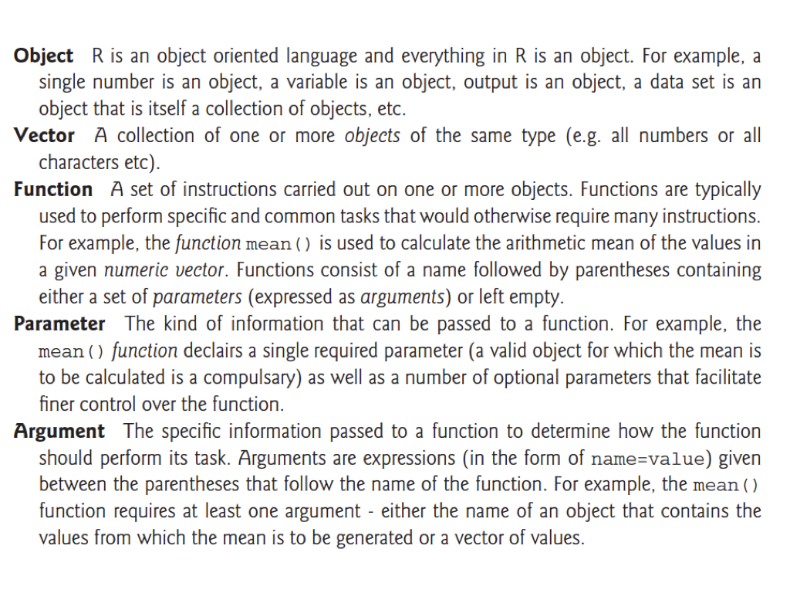
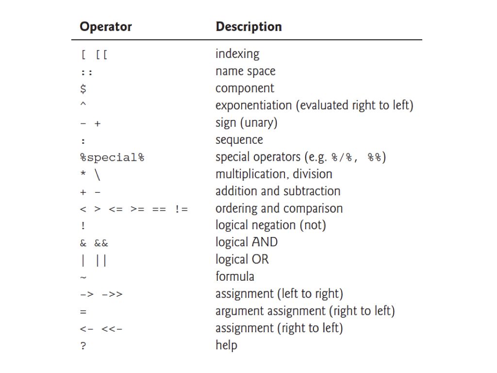

# R Programming Fundamentals {#sec-r-programming}

```{r}
#| label: ch07-setup
#| include: false
library(tidyverse)
library(gt)
theme_set(theme_minimal())
```

::: {.callout-note title="Learning Objectives"}
After completing this chapter, you will be able to:

- Explain why R is well-suited for scientific computing
- Understand R's object-oriented nature and examine objects with `class()`, `typeof()`, and `str()`
- Use Positron as an integrated development environment for R
- Perform basic arithmetic and variable assignment in R
- Work with vectors and understand vectorized operations
- Use logical operators and handle floating-point comparisons correctly
- Create and manipulate data frames, lists, and matrices
- Use built-in functions and access help documentation including vignettes
- Interpret common error messages and handle missing values (`NA`) correctly
- Manage the working directory by working in a project folder
- Install packages and resolve namespace conflicts
- Create basic visualizations
- Read and write data files
- Clean up your R environment and graphics devices
:::

## Why R for Scientific Computing? {#sec-why-r}

R is a programming language designed specifically for statistical computing and graphics [@rproject2024]. It is an offshoot of a language called **S**, developed in 1976 at Bell Laboratories by John Chambers and colleagues. R was created in 1991 by Ross Ihaka and Robert Gentleman at the University of Auckland, New Zealand (hence the name "R"), and has since become one of the most widely used tools in data science, statistics, and bioinformatics.

Unlike general-purpose languages that happen to have statistics libraries, R was built from the ground up for data analysis. This design choice permeates every aspect of the language—from how it handles vectors and missing values to how it creates publication-quality graphics with minimal code.

As an **interpreted language**, R code is translated to machine language by the R interpreter each time it runs, as opposed to being compiled beforehand. This makes R highly interactive and excellent for exploratory data analysis. You can type a command, see the result immediately, and adjust your approach—a rapid feedback loop that's essential for understanding data.

::: {.callout-tip title="Learning to Think in R"}
Learning R isn't just about memorizing syntax—it's about learning to think about data in a new way. R encourages you to work with entire vectors and data frames at once rather than processing elements one by one. This "vectorized thinking" may feel unfamiliar at first, but it leads to more concise, readable, and efficient code.
:::

::: {.callout-note title="Prefer Python, or need both?"}
This chapter teaches R, the language used for statistics and graphics throughout the book. @sec-python-programming covers the same ground in Python 3, section by section, and ends with an R-to-Python translation table (@tbl-r-python-translation). If you already know one language, reading the two chapters side by side is the fastest way to learn the other.
:::

R offers several advantages for researchers:

**Statistical Power.** R was built by statisticians for statistics. It includes comprehensive implementations of classical and modern statistical methods.

**Graphics Excellence.** R produces publication-quality graphics with fine-grained control over every aspect of visualization.

**Package Ecosystem.** Over 20,000 packages extend R's capabilities for virtually every analytical need, from genomics to machine learning.

**Reproducibility.** R scripts document your analysis completely. Combined with Quarto (which produced this book; see @sec-quarto-documents), you can create reproducible documents that integrate code, results, and narrative.

**Active Community.** A large, welcoming community provides abundant resources, tutorials, and support.

**Cost.** R is free and open-source, removing financial barriers to sophisticated analysis.

### The Console vs. Scripts {#sec-the-console-vs-scripts}

When you first start using R, you'll interact with it through the **console**—a command-line interface where you type commands and see results immediately. This is perfect for exploration: trying things out, checking your data, and learning how functions work.

But as your analyses become more complex, you'll want to save your work in **scripts**—text files (ending in `.R`) that contain a sequence of commands. Scripts are the foundation of reproducible research. When you run a script, R executes each command in order, exactly as you wrote it. This means:

1. **You can reproduce your analysis** by running the script again
2. **Others can verify your work** by reading and running your code
3. **You can modify and extend** your analysis without starting from scratch
4. **Your future self will understand** what you did and why

The workflow looks like this: explore in the console to understand your data, then move your successful commands into a script. Your script becomes the official record of your analysis—clean, organized, and executable.

A good script is self-contained: it holds every command needed to reproduce the analysis from a fresh R session, in order. A conventional layout is a comment header, then package loading, then data import, then the analysis, with comments (anything after `#`) explaining *why* rather than restating *what* the code does:

```{r}
#| label: script-template
#| eval: false

# Analysis of hydrogel mechanical properties
# Author: Your Name
# Date: 2026-10-01

# 1. Load packages ---------------------------------------------------------
library(tidyverse)

# 2. Read data -------------------------------------------------------------
hydrogel <- read.csv("data/hydrogel_data.csv")

# 3. Summarize -------------------------------------------------------------
summary(hydrogel)

# 4. Visualize -------------------------------------------------------------
ggplot(hydrogel, aes(x = concentration, y = compression)) +
  geom_boxplot()
```

In Positron or VS Code, create a script with File → New File (choose R), and run the current line or selection with `Ctrl+Enter` (`Cmd+Enter` on a Mac). Comment lines ending in four or more dashes, as above, become collapsible sections in the editor's outline. Quarto documents (@sec-quarto-documents) extend the same idea by interleaving code chunks with formatted narrative.

A script can also be run from the shell without opening an IDE at all, which is how analyses run on Talapas (@sec-hpc-talapas). The same small program looks like this in R and in Python; the shell side of running scripts is covered in @sec-rscript.

::: {.panel-tabset}
### R

```r
#!/usr/bin/env Rscript
# summarize.R - mean response per treatment
args <- commandArgs(trailingOnly = TRUE)
if (length(args) < 1) stop("Usage: Rscript summarize.R <file.csv>")

experiment <- read.csv(args[1])
means <- tapply(experiment$response, experiment$treatment, mean)
print(round(means, 2))
```

```bash
Rscript summarize.R experiment.csv
```

### Python

```python
#!/usr/bin/env python3
# summarize.py - mean response per treatment
import sys
import pandas as pd

if len(sys.argv) < 2:
    sys.exit("Usage: python3 summarize.py <file.csv>")

experiment = pd.read_csv(sys.argv[1])
means = experiment.groupby("treatment")["response"].mean()
print(means.round(2))
```

```bash
python3 summarize.py experiment.csv
```
:::

## Positron: Your R Environment {#sec-rstudio}

While R can run from the command line, most users work in an integrated development environment (IDE). In this course that is **Positron** (@sec-positron), which is built on the same core as VS Code and adds the panes a data scientist needs.

### The Positron Interface {#sec-the-rstudio-interface}

Positron organizes your workspace into a few key regions:

**Editor (center).** Where you write and edit scripts and Quarto documents. Code here isn't executed until you explicitly run it.

**Console (bottom).** The interactive R (or Python) session. Commands typed here execute immediately, and lines sent from the editor appear here with their output.

**Variables (right).** Shows the objects you've created in the current session, with their type and size; click a data frame to open it in the **Data Explorer**.

**Plots, Help, and Explorer (right and left).** The plot viewer, help documentation, and the file browser for the folder you have open.

::: {.callout-note title="R is not the IDE"}
`R` is the programming language; Positron (or VS Code) is the integrated development environment that lets you write and run R and Python comfortably. R must be installed first, and Positron then finds it. If you ever need to, you can run R directly from the shell by typing `R`.
:::

::: {.callout-tip}
Learn keyboard shortcuts! `Ctrl+Enter` (Windows/Linux) or `Cmd+Enter` (Mac) runs the current line or selection in the console. The essential editor shortcuts are collected in @sec-appendix-shortcuts.
:::

### Project Folders and the Working Directory {#sec-rstudio-projects}

Every R session has a **working directory**: the folder that relative paths such as `"data/results.csv"` are resolved against, exactly as in the shell (@sec-unix-fundamentals). You can inspect and change it from R:

```{r}
#| label: working-directory
#| eval: false

getwd()                       # Where am I?
setwd("/path/to/my/project")  # Move (avoid in scripts; see below)
list.files()                  # What files are here?
list.files("data")            # ...and in a subfolder
```

Working in a project folder removes the need for `setwd()` altogether:

1. Keep each project in its own directory (see @sec-quarto-projects for a typical layout)
2. In Positron, use **File → Open Folder** to open that directory, not a single file
3. The R console starts with the working directory set to that folder

Because the working directory is the project folder, paths in your scripts can be relative to the project root and the code runs unchanged on a collaborator's computer. A `setwd("/Users/yourname/...")` line at the top of a script is a red flag: it will fail for everyone but you.

## Understanding R: Everything is an Object {#sec-r-objects}

Before diving into R syntax, it helps to understand R's fundamental design philosophy: **everything in R is an object**. This object-oriented approach means that every piece of data you work with—numbers, text, datasets, even functions themselves—is stored as an object with specific properties.

```{r}
#| label: objects-concept

# Numbers are objects
x <- 42
class(x)
typeof(x)

# Text strings are objects
name <- "Gene Expression"
class(name)
typeof(name)

# Even functions are objects!
class(mean)
typeof(mean)

# And data frames are objects
samples_df <- data.frame(a = 1:3, b = c("x", "y", "z"))
class(samples_df)
typeof(samples_df)
```

Every object has:

- **A class**: Determines how the object behaves with functions (what `class()` returns)
- **A type**: The underlying storage mode (what `typeof()` returns)
- **Attributes**: Optional metadata like names, dimensions, or custom properties

The `str()` function provides a compact display of an object's structure:

```{r}
#| label: str-example

# Examine structure of different objects
str(x)
str(name)
str(samples_df)
```

Understanding this object-oriented nature helps you:

1. **Debug errors**: When functions fail, check what class of object you're passing
2. **Use generic functions**: Functions like `print()`, `summary()`, and `plot()` behave differently based on object class
3. **Extend R**: You can create custom classes with specialized behaviors

## R Basics: Arithmetic and Variables {#sec-r-basics}

### R as a Calculator {#sec-r-as-a-calculator}

The simplest use of R is arithmetic:

```{r}
#| label: basic-arithmetic

# Basic operations
4 * 4

# Order of operations applies
(4 + 3 * 2^2)

# More complex expressions
sqrt(144) + log(100)

# Integer division and modulo
17 %/% 5    # Integer division: how many times 5 goes into 17
17 %% 5     # Modulo: remainder after division
```

R follows standard mathematical order of operations (PEMDAS). The modulo operator (`%%`) is particularly useful for tasks like determining if a number is even or odd, cycling through indices, or extracting digits from numbers:

```{r}
#| label: modulo-examples

# Check if numbers are even (remainder 0 when divided by 2)
numbers <- 1:10
numbers %% 2 == 0

# Extract the last digit of a number
12345 %% 10
```

### Creating Variables {#sec-creating-variables}

Variables store values for later use. In R, the assignment operator is `<-`:

```{r}
#| label: variables

# Assign values to variables
x <- 2
y <- 5

# Use variables in calculations
x * 3
y + x

# Store results in new variables
z <- x * y
z
```

Notice that an assignment itself prints nothing: `z <- x * y` silently stores the value. To see what a variable holds, type its name alone or call `print()`:

```{r}
#| label: print-variable

z
print(z)
```

::: {.callout-note}
You can also use `=` for assignment in R, but `<-` is the traditional and preferred style. It makes assignment visually distinct from function arguments, which use `=`.
:::

### Variable Naming Rules {#sec-variable-naming-rules}

- Names must start with a letter
- Can contain letters, numbers, periods, and underscores
- Names cannot contain operators (`-`, `*`, `+`, spaces) because R would try to evaluate them
- R is case-sensitive: `Gene`, `gene`, and `GENE` are three different variables
- Use descriptive names: `sample_count` is better than `sc`
- Prefer underscores to periods: `sample.count` is legal R, but the period has a different meaning in Python (@sec-python-programming), and snake_case names move between the two languages without surprises

```{r}
#| label: naming
#| eval: false

# Valid names
gene_count <- 100
Sample.1 <- "control"
myData2 <- 42

# Invalid (would cause errors)
# 2samples <- 5      # Can't start with number
# 3*y <- 3           # Can't include operators
# my-data <- 10      # Hyphens not allowed (R reads this as my minus data)
```

### Reserved Words {#sec-reserved-words}

R has **reserved words** (@tbl-reserved-words) that cannot be used as variable names because they have special meaning in the language:

| Reserved Words | Description |
|:---------------|:------------|
| `if`, `else` | Conditional statements |
| `for`, `while`, `repeat` | Loop constructs |
| `function` | Function definition |
| `in` | Used in for loops |
| `next`, `break` | Loop control |
| `TRUE`, `FALSE` | Logical constants |
| `NULL` | Null object |
| `Inf`, `NaN`, `NA` | Special numeric values |

: R reserved words {#tbl-reserved-words}

R also has **semi-reserved words**—names of built-in constants and functions that you *can* overwrite but generally shouldn't:

```{r}
#| label: semi-reserved
#| eval: false

# These work but are dangerous:
T <- 5       # Overwrites TRUE abbreviation
F <- 10      # Overwrites FALSE abbreviation
c <- "text"  # Shadows the c() function
mean <- 42   # Shadows the mean() function

# If you accidentally overwrite something, use rm() to remove it
rm(c)        # Removes your 'c' variable, restoring access to c()
```

::: {.callout-warning title="Avoid Common Name Collisions"}
Avoid using `T` and `F` as variable names—they are common abbreviations for `TRUE` and `FALSE`. Similarly, never name variables `c`, `t`, `mean`, `sum`, `data`, or `df`: these are all existing R functions (`df()` is the F-distribution density and `data()` loads built-in datasets), and shadowing them leads to confusing errors such as `object of type 'closure' is not subsettable`, which means "you tried to index a function." Names like `experiment`, `counts`, or `samples_df` are safer and more descriptive.
:::

## Key R Terminology {#sec-r-terminology}

Before diving deeper into R, let's establish some fundamental terminology that you'll encounter throughout your R programming journey (@fig-r-terminology):

{#fig-r-terminology width="90%"}

Understanding R's operators is equally important. @fig-r-operators shows the main operators you'll use, listed in order of precedence (operations higher in the table are evaluated first):

{#fig-r-operators width="70%"}

::: {.callout-tip}
Note that R uses `<-` for assignment (right to left), while `=` is typically used for argument assignment within function calls. Both work for variable assignment, but `<-` is the conventional R style.
:::

## Vectors: R's Fundamental Data Structure {#sec-vectors}

R thinks in terms of **vectors**—ordered collections of values of the same type. Even a single number is a vector of length 1. Because all elements must share a type, mixing types in `c()` silently converts the whole vector to the most flexible one: `c(1, "a", TRUE)` becomes three character strings, and `c(1, TRUE)` becomes `1 1`.

### Creating Vectors {#sec-creating-vectors}

The `c()` function (for "combine" or "concatenate") creates vectors:

```{r}
#| label: vectors

# Numeric vector
measurements <- c(2, 3, 4, 2, 1, 2, 4, 5, 10, 8, 9)
measurements

# Character vector
samples <- c("control", "treatment_A", "treatment_B")
samples

# Logical vector
passed <- c(TRUE, FALSE, TRUE, TRUE, FALSE)
passed
```

A few functions tell you about any vector without printing all of it—essential once vectors have thousands of elements:

```{r}
#| label: vector-inspect

length(measurements)   # How many elements?
class(measurements)    # What type?
head(measurements, 3)  # First few
tail(measurements, 3)  # Last few
```

The numbers in square brackets at the start of each output line, such as `[1]`, are not part of the data: they give the index of the first element on that line, which helps you find your place in long output.

### Sequence Generation {#sec-sequence-generation}

For regular sequences, use shortcuts:

```{r}
#| label: sequences

# Integer sequence
1:10

# Sequence with step
seq(0, 10, by = 0.5)

# Specified length
seq(0, 1, length.out = 5)

# Repeated values
rep("A", 5)
rep(c(1, 2), times = 3)
rep(c(1, 2), each = 3)
```

### Sorting Vectors {#sec-sorting-vectors}

The `sort()` function returns a sorted vector:

```{r}
#| label: sort-vectors

# Sort in ascending order (default)
x <- c(5, 2, 8, 1, 9, 3)
sort(x)

# Sort in descending order
sort(x, decreasing = TRUE)

# Sorting character vectors (alphabetical)
genes <- c("BRCA1", "TP53", "EGFR", "KRAS")
sort(genes)
```

To get the indices that would sort a vector (useful for reordering related data), use `order()`:

```{r}
#| label: order-vectors

x <- c(5, 2, 8, 1, 9, 3)
order(x)  # Indices: 4th element is smallest, 2nd is next, etc.

# Use order() to sort one vector by another
names <- c("Sample_A", "Sample_B", "Sample_C")
values <- c(30, 10, 20)
names[order(values)]  # Names sorted by values
```

### Vectorized Operations {#sec-vectorized-operations}

R's power comes from **vectorized operations**—operations that apply to entire vectors at once:

```{r}
#| label: vectorized

x <- c(2, 3, 4, 2, 1, 2, 4, 5, 10, 8, 9)

# Operations apply to each element
x * 2
x^2
log(x)
sqrt(x)

# Operations between vectors (element-wise)
y <- 1:11
x + y
x * y
```

This is much faster and cleaner than writing loops!

### Vector Indexing {#sec-vector-indexing}

Access specific elements using square brackets:

```{r}
#| label: indexing

measurements <- c(2, 3, 4, 2, 1, 2, 4, 5, 10, 8, 9)

# Single element (1-indexed!)
measurements[1]
measurements[5]

# Multiple elements
measurements[c(1, 3, 5)]

# Range
measurements[2:5]

# Negative indices exclude
measurements[-1]          # All but first
measurements[-(1:3)]      # All but first three

# Logical indexing
measurements[measurements > 5]
```

::: {.callout-important}
R uses 1-based indexing! The first element is `[1]`, not `[0]` as in Python and most other languages (see @sec-r-python-translation).
:::

## Data Types in R {#sec-data-types}

R has several fundamental data types:

| Type | Tibble abbreviation | Description | Example |
|:-----|:--------------------|:------------|:--------|
| `numeric` (double) | `<dbl>` | Real numbers (default) | `3.14`, `42` |
| `integer` | `<int>` | Whole numbers | `1L`, `100L` |
| `character` | `<chr>` | Text strings | `"hello"`, `"gene1"` |
| `logical` | `<lgl>` | Boolean values | `TRUE`, `FALSE`, `NA` |
| `factor` | `<fct>` | Categorical variables | Treatment levels |
| `Date`, `POSIXct` | `<date>`, `<dttm>` | Dates and date-times | `Sys.Date()`, `Sys.time()` |

: R data types. The abbreviations are what tibbles (@sec-tidy-data) and `glimpse()` print under each column name. {#tbl-data-types}

Numbers are doubles by default: `42` is numeric, and you must write `42L` to get an integer. Integer and double vectors together are called **numeric** vectors.

```{r}
#| label: types

# Check types with class()
class(3.14)
class("hello")
class(TRUE)

# Type coercion
as.numeric("42")
as.character(123)
as.logical(0)    # FALSE
as.logical(1)    # TRUE
as.numeric("hello")  # NA, with a warning
```

::: {.callout-warning title="Coercing Factors to Numbers"}
`as.numeric()` on a factor returns the internal integer codes of the levels, not the numbers you can see:

```{r}
#| label: factor-coercion

doses <- factor(c("10", "50", "10", "100"))
as.numeric(doses)                # Level codes: 1, 3, 1, 2
as.numeric(as.character(doses))  # The actual values
```

Convert through `as.character()` first. This trap most often appears when a numeric column was read from a file as text or factor because of a stray non-numeric entry.
:::

### Factors {#sec-r-factors}

**Factors** are special vectors for representing categorical data with a fixed set of possible values called **levels**. They're essential for statistical modeling and data analysis in R:

```{r}
#| label: factors

# Create a factor from a character vector
treatment <- c("control", "drug_A", "drug_A", "control", "drug_B", "drug_B")
treatment_factor <- as.factor(treatment)
treatment_factor

# Check the levels
levels(treatment_factor)
```

::: {.callout-note}
Factor levels are stored **alphabetically** by default, regardless of the order they appear in your data. This affects how results are displayed and can impact statistical analyses (e.g., the reference level in regression models).
:::

To specify a custom level order, use the `levels` argument:

```{r}
#| label: factor-order

# Custom level order
treatment_ordered <- factor(treatment,
                            levels = c("control", "drug_A", "drug_B"))
levels(treatment_ordered)

# This matters for plotting and statistical models
# where "control" should be the reference level
```

Factors are memory-efficient because they store unique levels once and use integer indices to reference them. Use `str()` to see this internal representation:

```{r}
#| label: factor-str

str(treatment_factor)
```

### Special Values {#sec-special-values}

R has special values for missing data and undefined results (@tbl-special-values):

```{r}
#| label: special

# Missing value
NA

# Not a number (undefined)
0/0
log(-1)

# Infinity
1/0
-1/0
```

| Value | Meaning | Produced by | Test with |
|:------|:--------|:------------|:----------|
| `NA` | Not Available (missing data) | Blank cells in a file, failed coercion | `is.na()` |
| `NaN` | Not a Number (undefined math) | `0/0`, `sqrt(-1)` | `is.nan()` (also `is.na()`) |
| `Inf`, `-Inf` | Positive / negative infinity | `1/0`, `-1/0` | `is.infinite()`, `is.finite()` |
| `NULL` | The empty object | Missing list elements, functions that return nothing | `is.null()` |

: Special values in R {#tbl-special-values}

Handling `NA` values is a common task in data analysis. Any blank entry in a data file becomes `NA` when read into R, and `NA` is contagious: most arithmetic and summary functions return `NA` if any input is missing, so that a missing value is never silently ignored.

```{r}
#| label: na-handling

num <- c(0, 1, 2, NA, 4)

mean(num)               # NA: one missing value poisons the result
mean(num, na.rm = TRUE) # Most summary functions accept na.rm = TRUE

is.na(num)              # Which elements are missing?
sum(is.na(num))         # How many?
num[!is.na(num)]        # Keep only the non-missing values
```

::: {.callout-important title="Never test for missing values with `==`"}
`NA` means "unknown," so R cannot say whether an unknown value equals anything—`num == NA` returns `NA` for every element rather than `TRUE`/`FALSE`. Always use `is.na()`. Note also that `NA` is a logical constant (`class(NA)` is `"logical"`) and a reserved word: it is distinct from the string `"NA"`, from `0`, and from an empty string.
:::

### Logical Operators and Comparisons {#sec-logical-operators-and-comparisons}

R provides a rich set of operators for logical comparisons and Boolean operations:

```{r}
#| label: logical-operators

# Comparison operators
5 > 3     # Greater than
5 < 3     # Less than
5 >= 5    # Greater than or equal
5 <= 5    # Less than or equal
5 == 5    # Equal (note: two equals signs!)
5 != 3    # Not equal

# Logical operators
TRUE & FALSE   # AND
TRUE | FALSE   # OR
!TRUE          # NOT

# Vectorized logical operations
x <- c(1, 5, 10, 15, 20)
x > 5 & x < 18   # Both conditions must be true
x < 5 | x > 15   # Either condition can be true
```

The `%in%` operator is particularly useful for checking membership in a set:

```{r}
#| label: in-operator

# Check if values are in a set
genes <- c("BRCA1", "TP53", "EGFR", "KRAS")
target_genes <- c("TP53", "EGFR")

genes %in% target_genes

# Useful for subsetting
genes[genes %in% target_genes]
```

### Finding Indices with `which()` {#sec-which}

The `which()` function returns the indices where a logical condition is TRUE—useful when you need positions rather than values:

```{r}
#| label: which-function

x <- c(10, 5, 20, 15, 8, 25)

# Find indices where condition is TRUE
which(x > 12)

# Get the values at those positions
x[which(x > 12)]

# Find the index of the maximum value
which.max(x)

# Find the index of the minimum value
which.min(x)

# Find indices of specific values
which(x == 15)

# Practical example: find which samples exceed a threshold
expression_levels <- c(2.5, 8.1, 4.2, 12.3, 6.7, 15.2)
high_expression <- which(expression_levels > 10)
high_expression  # Indices 4 and 6
```

::: {.callout-tip}
While `which()` is useful, you often don't need it—logical vectors work directly for subsetting:
```{r}
#| label: which-vs-logical
# These are equivalent:
x[which(x > 12)]
x[x > 12]
```
Use `which()` when you specifically need the index positions (e.g., to report which samples, to use in loops, or for `which.max()`/`which.min()`).
:::

::: {.callout-important title="Operator Precedence"}
R evaluates operators in a specific order. From highest to lowest precedence:

1. `^` (exponentiation)
2. `-` (unary minus, for negation)
3. `:` (sequence)
4. `%any%` (special operators like `%%`, `%/%`, `%in%`)
5. `*`, `/` (multiplication, division)
6. `+`, `-` (addition, subtraction)
7. `<`, `>`, `<=`, `>=`, `==`, `!=` (comparisons)
8. `!` (logical NOT)
9. `&`, `&&` (logical AND)
10. `|`, `||` (logical OR)
11. `<-`, `=` (assignment)

Use parentheses to make your intentions clear and avoid unexpected results.
:::

### Floating-Point Precision {#sec-floating-point-precision}

A common source of confusion involves floating-point arithmetic. Computers represent decimal numbers with limited precision, which can lead to unexpected results:

```{r}
#| label: floating-point

# This seems wrong, but is due to floating-point representation
0.1 + 0.2 == 0.3

# See the actual values
print(0.1 + 0.2, digits = 20)
print(0.3, digits = 20)
```

Instead of using `==` for floating-point comparisons, use `all.equal()`:

```{r}
#| label: all-equal

# Safe comparison for floating-point numbers
all.equal(0.1 + 0.2, 0.3)

# Returns TRUE if values are nearly equal (within tolerance)
isTRUE(all.equal(0.1 + 0.2, 0.3))

# You can also specify a tolerance
all.equal(1.0, 1.0001, tolerance = 0.001)
```

::: {.callout-warning}
Always use `all.equal()` or check if the difference is within an acceptable tolerance when comparing floating-point numbers. Never rely on `==` for exact equality of decimal calculations.
:::

### Using `dplyr::near()` for Comparisons {#sec-dplyr-near}

The tidyverse provides `dplyr::near()` as a convenient alternative for checking near-equality, especially when working with data frames:

```{r}
#| label: near-function

library(dplyr)

# near() returns TRUE for values within a small tolerance
near(0.1 + 0.2, 0.3)

# Works well in filter() and mutate()
values <- tibble(x = c(0.1 + 0.2, 0.5, 0.3))
values |> filter(near(x, 0.3))

# You can specify a custom tolerance
near(1.0, 1.001, tol = 0.01)
```

Use `near()` when filtering or comparing numeric columns in data frames, and `all.equal()` when you need detailed comparison information.

## Functions {#sec-r-functions}

Functions perform operations on inputs and return outputs. R has thousands of built-in functions.

### Using Functions {#sec-using-functions}

```{r}
#| label: functions

x <- c(1, 2, 3, 4, 5, 6, 7, 8, 9, 10)

# Basic statistical functions
mean(x)
median(x)
sd(x)        # Standard deviation
var(x)       # Variance
sum(x)
length(x)
min(x)
max(x)
range(x)     # Returns min and max
```

### Function Arguments {#sec-function-arguments}

Functions take arguments that modify their behavior:

```{r}
#| label: arguments

# Round to 2 decimal places
round(3.14159, digits = 2)

# Sample with replacement
sample(1:10, size = 5, replace = TRUE)

# Mean with NA handling
values <- c(1, 2, NA, 4, 5)
mean(values)              # Returns NA
mean(values, na.rm = TRUE)  # Removes NA first
```

#### Argument Order and Naming

R functions expect arguments in a specific order. When you don't name arguments, R matches them by position:

```{r}
#| label: argument-order

# These are equivalent - arguments matched by position
set.seed(42)
x1 <- rnorm(5, 0, 10)  # n, mean, sd
x1

# Named arguments can be in any order
set.seed(42)
x2 <- rnorm(sd = 10, n = 5, mean = 0)
x2
```

::: {.callout-warning}
Relying on position order can lead to subtle bugs. If you accidentally swap arguments, you may get unexpected results without any error message:

```{r}
#| label: argument-order-danger

# Oops! We meant 1000 samples with mean=0 and sd=10
# But we got 10 samples with mean=1000 and sd=0
wrong <- rnorm(10, 1000, 0)
wrong  # All identical values!
```

When in doubt, name your arguments explicitly for clarity and safety.
:::

### Nesting Functions {#sec-nesting-functions}

One powerful feature of R is the ability to **nest** function calls—using the output of one function as the input to another without creating intermediate variables:

```{r}
#| label: nesting-functions

# Without nesting: create intermediate objects
z <- c(10, 20, 30)
result1 <- mean(z)
result1

# With nesting: more concise
result2 <- mean(c(10, 20, 30))
result2

# More complex nesting
# Calculate the mean of the square roots of 1 through 10
mean(sqrt(1:10))

# Nested functions are evaluated from inside out
round(mean(sqrt(c(4, 9, 16, 25))), digits = 2)
```

Nesting makes code more compact, but deeply nested expressions can become hard to read. As a rule of thumb, if you find yourself nesting more than 2-3 functions, consider breaking the expression into steps or using the pipe operator (covered in @sec-native-pipe).

### Getting Help {#sec-r-getting-help}

R has excellent built-in documentation:

```{r}
#| label: help
#| eval: false

# Get help on a function
?mean
help(mean)

# Search help
help.search("correlation")
??correlation

# See function arguments
args(mean)

# See examples
example(mean)

# Find functions containing a string in their name
apropos("mean")  # Returns: "colMeans", "mean", "mean.Date", etc.

# Find functions by partial name matching
apropos("cor")   # Returns all functions containing "cor"
```

#### Vignettes and Demos

Beyond function-level help, packages often include **vignettes**—comprehensive tutorials that demonstrate how to use the package:

```{r}
#| label: vignettes
#| eval: false

# List all available vignettes
vignette()

# List vignettes for a specific package
vignette(package = "dplyr")

# Open a specific vignette
vignette("dplyr")

# Browse vignettes in your browser
browseVignettes("ggplot2")
```

Some packages also include **demos**—interactive demonstrations of functionality:

```{r}
#| label: demos
#| eval: false

# List all available demos
demo()

# Run a specific demo
demo(graphics)    # Base R graphics demonstration
```

::: {.callout-tip}
Vignettes are often the best place to start when learning a new package. They provide context and workflows that function documentation alone cannot convey.
:::

The help page structure:

- **Description**: What the function does
- **Usage**: Function syntax
- **Arguments**: What inputs it accepts
- **Value**: What it returns
- **Examples**: Working code examples

#### Reading Error Messages {#sec-r-error-messages}

R's error messages are terse but informative once you know the common ones (@tbl-common-r-errors). Read them from the bottom up: the last line usually says what went wrong, and the lines above say where.

| Error message | Meaning | Fix |
|:--------------|:--------|:----|
| `object 'x' not found` | No variable with that name exists | Check spelling and case; run the line that creates it |
| `could not find function "read_csv"` | The package that provides it is not loaded | `library()` the package, or check spelling |
| `unexpected ')'` or `unexpected symbol` | Mismatched brackets or quotes, or a missing comma | Count opening and closing brackets; look at the line before |
| `non-numeric argument to binary operator` | Arithmetic on text (or a factor) | Check the object with `class()`; coerce with `as.numeric()` |
| `object of type 'closure' is not subsettable` | You indexed a function, usually because a variable was never created and its name matches a function (`df`, `data`) | Run the line that creates the object; rename it |
| `argument "x" is missing, with no default` | A required argument was not supplied | Check `args(fun)` or `?fun` |
| `cannot open file 'data.csv': No such file` | Wrong path or working directory | `getwd()`, `list.files()`; use a project and relative paths |
| `+` prompt in the console instead of `>` | R is waiting for you to finish an expression | Press `Esc` and fix the unbalanced bracket or quote |

: Common R error messages {#tbl-common-r-errors}

::: {.callout-tip title="Asking for Help"}
When the help page and a web search of the exact error text do not solve the problem, ask a person—but make it easy to help you. Provide a **minimal reproducible example**: the smallest piece of code that shows the problem, including a few rows of data (or a built-in dataset like `iris`), the exact error message, and what you expected instead. The `reprex` package formats such an example for pasting into Stack Overflow, a course forum, or an issue tracker. Preparing the example often reveals the bug by itself.
:::

## Installing and Loading Packages {#sec-packages}

Base R includes dozens of useful functions, but as you become a more advanced R user, you'll need functions for specialized analyses. Fortunately, thousands of additional functions are distributed in the form of R **packages**.

### Installing Packages {#sec-installing-packages}

Packages from the Comprehensive R Archive Network (CRAN) are easy to install:

```{r}
#| label: install-packages
#| eval: false

# Install a package from CRAN
install.packages("dplyr")

# Install multiple packages at once
install.packages(c("ggplot2", "readr", "tidyr"))
```

::: {.callout-note}
Package names are case-sensitive and must be in quotation marks when installing. You only need to install a package once on your system (and again after upgrading R). Positron offers the same thing through the Command Palette (Cmd/Ctrl-Shift-P → **R: Install Packages**), and `installed.packages()` or the Packages view lists what is installed. Bioconductor packages are installed with `BiocManager::install()` instead (@sec-install-checklist).
:::

### Loading Packages {#sec-loading-packages}

To use functions from an installed package, you must load it into your current session:

```{r}
#| label: load-packages
#| eval: false

# Load a package
library(dplyr)

# Check if a package is installed
installed.packages("dplyr")
```

Unlike installation, you need to call `library()` every time you start a new R session. Note that you don't need quotation marks with `library()`.

::: {.callout-tip}
It's good practice to load all required packages at the beginning of your script. This makes dependencies clear and helps others reproduce your work.
:::

### Namespace Conflicts {#sec-namespace-conflicts}

When you load multiple packages, function names can collide. The most recently loaded package "wins," masking functions from earlier packages:

```{r}
#| label: namespace-conflicts
#| eval: false

# Loading dplyr after another package
library(MASS)
library(dplyr)
# Warning: The following object is masked from 'package:MASS': select
```

When conflicts occur, you have several options:

**1. Use the package prefix (recommended)**

```{r}
#| label: namespace-prefix
#| eval: false

# Explicitly specify which package's function to use
dplyr::select(experiment, column1, column2)
MASS::select(object)

# This works even without loading the package
stats::filter(x, method = "convolution")
```

**2. Control loading order**

Load packages with conflicting names in the order that gives you the default behavior you want.

**3. Use the `conflicted` package**

```{r}
#| label: conflicted-package
#| eval: false

# Install and load conflicted
install.packages("conflicted")
library(conflicted)

# Now conflicts cause errors instead of silent masking
# You must explicitly choose which function to use:
conflict_prefer("filter", "dplyr")
conflict_prefer("select", "dplyr")
```

::: {.callout-warning}
The `filter()` and `lag()` functions from dplyr commonly conflict with base R's `stats::filter()` and `stats::lag()`. If your filtering code suddenly stops working, namespace conflicts are often the culprit.
:::

## Data Frames {#sec-data-frames}

**Data frames** are R's workhorse for tabular data—think spreadsheets or database tables. Each column is a vector, and columns can have different types.

### Creating Data Frames {#sec-creating-data-frames}

```{r}
#| label: dataframe-create

# Create vectors
sample_id <- c("S1", "S2", "S3", "S4", "S5")
treatment <- c("control", "drug_A", "drug_A", "drug_B", "drug_B")
concentration <- c(0, 10, 20, 10, 20)
response <- c(1.2, 3.4, 5.6, 2.8, 4.1)

# Combine into data frame
experiment <- data.frame(
  sample_id = sample_id,
  treatment = treatment,
  concentration = concentration,
  response = response
)

experiment
```

All columns must have the same length, and every column holds a single type—a numeric column cannot contain a stray `"n/a"` without turning the whole column into text (see @sec-data-types). Rows can optionally carry names, which appear in printed output and are useful for labelling samples:

```{r}
#| label: dataframe-rownames

labelled <- experiment
rownames(labelled) <- paste0("Sample_", 1:5)
labelled
```

::: {.callout-note}
Row names are a base R convenience. The tidyverse's tibbles (@sec-tidy-data) drop them, on the principle that a sample identifier is data and belongs in an ordinary column such as `sample_id`; `tibble::rownames_to_column()` makes the conversion. In this book we keep identifiers in columns.
:::

### Examining Data Frames {#sec-examining-data-frames}

```{r}
#| label: examine-df

# Structure
str(experiment)

# Dimensions
dim(experiment)
nrow(experiment)
ncol(experiment)

# Preview
head(experiment, 3)
tail(experiment, 2)

# Summary statistics
summary(experiment)

# Column names
names(experiment)
colnames(experiment)
```

In Positron, you can also use `View()` to open the Data Explorer, a spreadsheet-like viewer for interactive exploration:

```{r}
#| label: view-df
#| eval: false

# Opens data in the Data Explorer (Positron)
View(experiment)
```

::: {.callout-tip}
`View()` is useful for quick inspection, but avoid using it in scripts meant for non-interactive execution. For large datasets, `View()` can be slow—use `head()` instead.
:::

### Accessing Data Frame Elements {#sec-accessing-data-frame-elements}

```{r}
#| label: access-df

# Single column (returns vector)
experiment$response
experiment[["response"]]
experiment[, "response"]

# Multiple columns
experiment[, c("sample_id", "response")]

# Rows by index
experiment[1, ]
experiment[1:3, ]

# Combination
experiment[1:3, c("treatment", "response")]

# Conditional selection
experiment[experiment$treatment == "drug_A", ]
experiment[experiment$response > 3, ]
```

The `[row, column]` notation is the same one used for matrices: leaving a dimension empty selects everything along it, so `experiment[, 2]` is all rows of column 2 and `experiment[2, ]` is row 2 of every column. Conditional selection works because a comparison such as `experiment$response > 3` returns a logical vector with one `TRUE`/`FALSE` per row, and a logical vector inside the brackets keeps the `TRUE` rows:

```{r}
#| label: logical-row-index

experiment$response > 3
```

Of the three ways to pull out a column, `experiment$response` is the most readable and the one you will use most; `experiment[["response"]]` is the choice when the column name is stored in a variable; and `experiment[, "response"]` is the matrix-style form.

### Adding and Modifying Columns {#sec-adding-and-modifying-columns}

```{r}
#| label: modify-df

# Add a new column
experiment$replicate <- c(1, 1, 2, 1, 2)

# Calculated column
experiment$log_response <- log(experiment$response)

experiment
```

## Lists {#sec-lists}

**Lists** are flexible containers that can hold objects of different types and lengths. Unlike vectors, which require all elements to be the same type, lists can contain a mix of vectors, data frames, or even other lists.

### Creating Lists {#sec-creating-lists}

```{r}
#| label: create-lists

# Create individual vectors
measurements <- c(10, 20, 30, 40, 50)
categories <- c("high", "medium", "low")
status <- factor(c("active", "inactive"))

# Combine into a list
my_list <- list(
  values = measurements,
  labels = categories,
  status = status
)

my_list

# Check the structure
str(my_list)
```

### Indexing Lists {#sec-indexing-lists}

Lists use double square brackets `[[]]` to access individual elements:

```{r}
#| label: index-lists

# Access by position
my_list[[1]]

# Access by name
my_list[["labels"]]

# Access using $ notation
my_list$values

# Access element within a list component
my_list[[1]][3]  # Third element of first component
```

::: {.callout-note}
Single brackets `[]` return a sublist, while double brackets `[[]]` extract the actual element. This distinction matters when working with list components.
:::

## Matrices {#sec-matrices}

**Matrices** are two-dimensional arrays where all elements must be the same type. Unlike data frames, matrices don't have named columns by default and are optimized for mathematical operations.

### Creating Matrices {#sec-creating-matrices}

```{r}
#| label: create-matrices

# Create a matrix from a vector
mat <- matrix(1:12, nrow = 3, ncol = 4)
mat

# Create with row-wise filling
matrix(1:12, nrow = 3, ncol = 4, byrow = TRUE)

# From vectors using cbind (column bind) or rbind (row bind)
col1 <- c(1, 2, 3)
col2 <- c(4, 5, 6)
cbind(col1, col2)

rbind(col1, col2)
```

### Matrix Operations {#sec-matrix-operations}

```{r}
#| label: matrix-operations

# Dimensions
dim(mat)
nrow(mat)
ncol(mat)

# Transpose (swap rows and columns)
t(mat)

# Indexing: [row, column]
mat[1, 2]      # First row, second column
mat[1, ]       # Entire first row
mat[, 2]       # Entire second column
mat[1:2, 2:3]  # Submatrix
```

Matrices are particularly useful for linear algebra operations and when you need efficient numerical computations.

## Reading and Writing Data {#sec-reading-writing}

### Reading Files {#sec-r-reading-files}

```{r}
#| label: read-files
#| eval: false

# CSV files (comma-separated)
measurements <- read.csv("data.csv")

# Tab-separated files
measurements <- read.table("data.tsv", header = TRUE, sep = "\t")

# Excel files (requires readxl package)
library(readxl)
measurements <- read_excel("data.xlsx")

# Specify options
measurements <- read.csv("data.csv",
                 header = TRUE,
                 stringsAsFactors = FALSE,
                 na.strings = c("", "NA", "N/A"))
```

`read.csv()` is a convenience wrapper around the general `read.table()`, and the arguments mean the same thing in both:

- `header = TRUE`: the first line contains column names
- `sep`: the delimiter between fields (`","` for CSV, `"\t"` for tab-separated)
- `row.names = 1`: treat the first column as row names rather than data
- `na.strings`: which strings should become `NA`
- `stringsAsFactors`: whether text columns become factors (the default has been `FALSE` since R 4.0)

The tidyverse's **readr** package provides `read_csv()`, `read_tsv()`, and `read_delim()`, which are faster, never create row names or factors, report how each column was parsed, and return a **tibble** (an enhanced data frame). Both families are in everyday use and you will meet the readr versions in @sec-data-import-with-readr; the base functions are handy because they need no packages at all, for instance in a script run on a cluster.

```{r}
#| label: readr-preview
#| eval: false

library(readr)
measurements <- read_csv("data.csv")    # note the underscore
measurements <- read_tsv("data.tsv")
```

::: {.callout-warning title="Always check what you imported"}
Reading a file rarely fails loudly; it fails quietly by giving you the wrong column types. Immediately after any import, look at the result with `str()` or `glimpse()`, `head()`, `dim()`, and `summary()` (or `View()` in Positron). A numeric column that shows up as `character` means a non-numeric entry is hiding somewhere in the file.
:::

### Writing Files {#sec-r-writing-files}

```{r}
#| label: write-files
#| eval: false

# CSV output
write.csv(experiment, "experiment_results.csv", row.names = FALSE)

# Tab-separated
write.table(experiment, "results.tsv",
            sep = "\t",
            quote = FALSE,
            row.names = FALSE)

# readr equivalents (never write row names, never quote unnecessarily)
readr::write_csv(experiment, "experiment_results.csv")
readr::write_tsv(experiment, "results.tsv")
```

`row.names = FALSE` matters: without it, `write.csv()` adds an unnamed first column of row numbers that becomes a mystery column the next time the file is read. `quote = FALSE` keeps text fields free of quotation marks, which other programs (and shell tools such as `cut` and `awk`, @sec-files-pipes) expect.

::: {.callout-tip title="Never overwrite the raw data"}
Read the original data file, but write results to a *new* file with a different name. The raw file is the one thing in an analysis you cannot regenerate (@sec-preserving-raw-data).
:::

## Basic Visualization {#sec-basic-viz}

R excels at creating graphics. Here's a quick introduction to base R plotting; ggplot2, the approach used for the rest of the book, is covered in @sec-data-viz:

### Scatter Plots {#sec-scatter-plots}

```{r}
#| label: fig-base-scatter
#| fig-cap: "Basic scatter plot showing quadratic relationship"

x <- 1:10
y <- x^2

plot(x, y, 
     main = "Quadratic Relationship",
     xlab = "X values",
     ylab = "Y values",
     col = "darkblue",
     pch = 16)  # Filled circles
```

### Histograms {#sec-histograms}

```{r}
#| label: fig-base-histogram
#| fig-cap: "Histogram of normally distributed data"

# Generate random data
values <- rnorm(1000, mean = 50, sd = 10)

hist(values,
     main = "Distribution of Values",
     xlab = "Value",
     col = "steelblue",
     breaks = 30)
```

### Box Plots {#sec-box-plots}

```{r}
#| label: fig-base-boxplot
#| fig-cap: "Box plot comparing treatment groups"

# Create sample data
set.seed(42)
control <- rnorm(30, mean = 10, sd = 2)
treatment <- rnorm(30, mean = 15, sd = 3)

boxplot(control, treatment,
        names = c("Control", "Treatment"),
        main = "Treatment Effect",
        ylab = "Response",
        col = c("lightblue", "lightcoral"))
```

When the data live in a data frame, the **formula** interface is more convenient: `y ~ group` reads as "y broken down by group," and `data =` says where to find the columns. The same formula notation reappears in statistical models throughout R.

```{r}
#| label: fig-base-boxplot-formula
#| fig-cap: "Box plot of response by treatment using the formula interface"

boxplot(response ~ treatment, data = experiment,
        xlab = "Treatment", ylab = "Response",
        col = "steelblue")
```

### Common Plot Arguments {#sec-plot-arguments}

Most base graphics functions share the arguments in @tbl-plot-arguments.

| Argument | Controls | Example |
|:---------|:---------|:--------|
| `main` | Plot title | `main = "Growth curve"` |
| `xlab`, `ylab` | Axis labels | `ylab = "OD600"` |
| `xlim`, `ylim` | Axis limits | `ylim = c(0, 1.5)` |
| `type` | `"p"` points, `"l"` lines, `"b"` both, `"h"` vertical bars | `type = "l"` |
| `col` | Color (name, hex code, or `rgb()`) | `col = "steelblue"` |
| `pch` | Point character, 0–25 (`19` = filled circle) | `pch = 19` |
| `cex` | Size multiplier for points and text | `cex = 1.5` |
| `lwd`, `lty` | Line width and type | `lwd = 2, lty = "dashed"` |
| `breaks` | Number of bins (`hist()` only) | `breaks = 30` |
| `add = TRUE` | Draw onto the existing plot (`curve()`, `lines()`, `points()`) | `curve(dnorm(x), add = TRUE)` |

: Common arguments to base R plotting functions {#tbl-plot-arguments}

Graphical parameters such as `col`, `pch`, and `cex` are **vectorized**: give a vector with one entry per data point and each point gets its own value. Combined with `ifelse()` (@sec-ifelse) or a factor, this is how base graphics color points by group:

```{r}
#| label: fig-vectorized-col
#| fig-cap: "Vectorized graphical parameters: each point's color and shape come from a vector of the same length as the data"

x <- seq(0, 10, by = 0.1)
y <- 10 - x
point_colors <- ifelse(x < 3, "firebrick", "steelblue")

plot(x, y, col = point_colors, pch = 19,
     xlab = "x", ylab = "10 - x", main = "Two-color scatterplot")
```

### Multiple Plots {#sec-multiple-plots}

`par()` sets graphical parameters that persist for the rest of the session; `mfrow = c(rows, cols)` divides the plotting window into a grid that successive plots fill left to right, top to bottom.

```{r}
#| label: fig-multipanel
#| fig-cap: "Multiple plots in a single figure"

# Create 2x2 layout
par(mfrow = c(2, 2))

# Four different plots
plot(1:10, (1:10)^2, type = "l", main = "Line Plot")
hist(rnorm(100), main = "Histogram")
boxplot(rnorm(50), main = "Box Plot")
barplot(c(3, 5, 2, 7), names.arg = c("A", "B", "C", "D"), main = "Bar Plot")

# Reset to single plot
par(mfrow = c(1, 1))
```

Always reset with `par(mfrow = c(1, 1))` (or save the old settings with `old <- par(mfrow = c(2, 2))` and restore them with `par(old)`); otherwise every later plot in the session lands in the grid.

::: {.callout-tip}
For publication-quality graphics, explore the **ggplot2** package [@wickham2016ggplot2], which provides a powerful and consistent grammar of graphics. We cover ggplot2 in detail in @sec-data-viz.
:::

## The Split-Apply-Combine Approach {#sec-split-apply-combine}

A common pattern in data analysis is to split data by groups, apply a function to each group, and combine the results. This **split-apply-combine** workflow appears repeatedly in scientific computing.

### Using `tapply()` for Grouped Operations {#sec-tapply}

The `tapply()` function applies a function to subsets of a vector, split by a factor:

```{r}
#| label: tapply-example

# Sample data
values <- c(23, 45, 67, 34, 56, 78, 12, 89)
groups <- factor(c("A", "A", "A", "B", "B", "B", "C", "C"))

# Mean by group
tapply(values, groups, mean)

# Standard deviation by group
tapply(values, groups, sd)

# Custom summary: range
tapply(values, groups, function(x) max(x) - min(x))
```

### Using `aggregate()` for Data Frames {#sec-aggregate}

For data frames, `aggregate()` summarizes multiple columns at once:

```{r}
#| label: aggregate-example

# Using built-in iris data
head(iris)

# Mean of all numeric columns by Species
aggregate(. ~ Species, data = iris, FUN = mean)

# Multiple statistics (result contains a matrix column)
agg_result <- aggregate(Sepal.Length ~ Species, data = iris,
                        FUN = function(x) c(mean = mean(x), sd = sd(x)))

# Convert to a regular data frame for display
do.call(data.frame, agg_result)
```

### The `apply()` Family {#sec-apply-family}

R provides several related functions for different data structures (@tbl-apply-family):

| Function | Input | Applies Over |
|:---------|:------|:-------------|
| `apply()` | Matrix/data frame | Rows or columns |
| `lapply()` | List | Each element, returns list |
| `sapply()` | List | Each element, returns vector |
| `tapply()` | Vector + factor | Groups defined by factor |
| `mapply()` | Multiple vectors | Corresponding elements |

: The apply family of functions {#tbl-apply-family}

```{r}
#| label: apply-examples

# Apply to matrix columns
mat <- matrix(1:12, nrow = 3)
apply(mat, 2, sum)  # Column sums (MARGIN = 2)
apply(mat, 1, sum)  # Row sums (MARGIN = 1)

# Apply to each element of a list
my_list <- list(a = 1:5, b = 10:15, c = 100:110)
lapply(my_list, mean)
sapply(my_list, mean)  # Simplified output
```

::: {.callout-tip}
The tidyverse packages (covered in @sec-tidy-data) provide more intuitive alternatives like `group_by()` and `summarize()` for this workflow.
:::

## Basic Programming Constructs {#sec-programming-constructs}

As you develop your R skills, you'll encounter situations requiring conditional logic and iteration.

### Conditional Statements with `ifelse()` {#sec-ifelse}

The `ifelse()` function provides vectorized conditional logic:

```{r}
#| label: ifelse-example

# Basic ifelse
scores <- c(85, 72, 91, 68, 79)
ifelse(scores >= 80, "Pass", "Fail")

# Nested conditions
grades <- ifelse(scores >= 90, "A",
           ifelse(scores >= 80, "B",
             ifelse(scores >= 70, "C", "F")))
grades

# Useful for creating indicator variables
treatment <- c("control", "drug", "drug", "control", "drug")
colors <- ifelse(treatment == "drug", "red", "blue")
```

### Type-Safe Conditionals with `if_else()` {#sec-if-else-dplyr}

The tidyverse provides `dplyr::if_else()`, which is stricter than base R's `ifelse()`:

```{r}
#| label: if-else-example

library(dplyr)

x <- c(-2, -1, 0, 1, 2)

# if_else() requires matching types for true/false
if_else(x > 0, "positive", "non-positive")

# Handles NA explicitly with the 'missing' argument
y <- c(1, NA, 3, NA, 5)
if_else(y > 2, "high", "low", missing = "unknown")

# Creates a simple absolute value implementation
if_else(x < 0, -x, x)
```

::: {.callout-tip}
Use `dplyr::if_else()` over base `ifelse()` when:

- You want type checking (prevents accidentally mixing numbers and strings)
- You need explicit control over NA handling
- You're already using tidyverse functions
:::

### For Loops {#sec-r-for-loops}

While R is optimized for vectorized operations, loops are sometimes necessary:

```{r}
#| label: for-loop-example

# Simple loop
for (i in 1:5) {
  print(i^2)
}

# Loop with pre-allocated output (recommended for efficiency)
n <- 10
results <- numeric(n)  # Pre-allocate
for (i in 1:n) {
  results[i] <- i * 2
}
results
```

::: {.callout-warning}
In R, loops are often slower than vectorized alternatives. Before writing a loop, consider whether a vectorized function (`apply()`, `tapply()`, etc.) or built-in operation would work instead.
:::

### Writing Simple Functions {#sec-writing-simple-functions}

You can create your own functions for repeated tasks (@sec-writing-functions treats this in depth):

```{r}
#| label: custom-functions

# Define a function
calculate_cv <- function(x) {
  # Coefficient of variation: SD / mean * 100
  cv <- sd(x) / mean(x) * 100
  return(cv)
}

# Use the function
readings <- c(10, 12, 11, 13, 9, 14)
calculate_cv(readings)

# Function with multiple arguments and default values
summarize_data <- function(x, digits = 2) {
  result <- c(
    mean = round(mean(x), digits),
    sd = round(sd(x), digits),
    n = length(x)
  )
  return(result)
}

summarize_data(readings)
summarize_data(readings, digits = 3)
```

## Random Sampling and Simulation {#sec-random-sampling}

R makes it easy to generate random data and run simulations:

```{r}
#| label: fig-simulation
#| fig-cap: "Simulated data from a normal distribution with theoretical curve overlay"

# Set seed for reproducibility
set.seed(123)

# Random samples from distributions
uniform_sample <- runif(100, min = 0, max = 1)
normal_sample <- rnorm(1000, mean = 0, sd = 1)
poisson_sample <- rpois(100, lambda = 5)

# Visualize normal distribution
hist(normal_sample, 
     probability = TRUE,  # Density instead of counts
     main = "Sample vs. Theoretical Distribution",
     col = "lightblue")

# Add theoretical curve
curve(dnorm(x, mean = 0, sd = 1), 
      add = TRUE, 
      col = "red", 
      lwd = 2)
```

### Common Distribution Functions {#sec-common-distribution-functions}

For distribution `xxx` (e.g., `norm`, `unif`, `pois`, `binom`):

- `rxxx()` — Random samples
- `dxxx()` — Density/probability
- `pxxx()` — Cumulative distribution function
- `qxxx()` — Quantile function

```{r}
#| label: distributions

# Normal distribution
rnorm(5)        # 5 random values
dnorm(0)        # Density at x=0
pnorm(1.96)     # P(X ≤ 1.96)
qnorm(0.975)    # Value where P(X ≤ x) = 0.975
```

### Repeated Simulations with `replicate()` {#sec-replicate}

The `replicate()` function repeats an expression multiple times and collects the results—perfect for simulations (@fig-replicate-examples):

```{r}
#| label: fig-replicate-examples
#| fig-cap: "Sampling distribution of the mean from 1000 samples of size 30 generated with `replicate()`"

# Shuffle integers 1-10 five times
set.seed(42)
replicate(5, sample(1:10, size = 10, replace = FALSE))

# Simulate sampling distributions
# Take 1000 samples of size 30 and calculate mean of each
set.seed(123)
sample_means <- replicate(1000, mean(rnorm(30, mean = 100, sd = 15)))
hist(sample_means, main = "Distribution of Sample Means",
     col = "lightgreen", xlab = "Sample Mean")
```

The `replicate()` function belongs to the "apply" family and returns a matrix (if results are vectors of equal length) or a list (if results vary in length).

## Useful Numeric Transformations {#sec-numeric-transformations}

R and the tidyverse provide many functions for transforming numeric data. These are particularly useful within `mutate()` operations.

### Cumulative and Running Aggregates {#sec-cumulative-and-running-aggregates}

Base R provides functions for running (cumulative) calculations:

```{r}
#| label: cumulative-functions

x <- c(1, 2, 3, 4, 5)

cumsum(x)   # Running sum: 1, 3, 6, 10, 15
cumprod(x)  # Running product: 1, 2, 6, 24, 120
cummax(x)   # Running maximum
cummin(x)   # Running minimum

# Useful for time series data
daily_cases <- c(10, 15, 8, 22, 18)
cumsum(daily_cases)  # Total cases over time
```

### Offsets with `lead()` and `lag()` {#sec-lead-lag}

The `dplyr::lead()` and `dplyr::lag()` functions let you reference values before or after the current position:

```{r}
#| label: lead-lag

library(dplyr)

x <- c(10, 20, 30, 40, 50)

lag(x)   # Previous value: NA, 10, 20, 30, 40
lead(x)  # Next value: 20, 30, 40, 50, NA

# Calculate differences from previous value
x - lag(x)

# Detect changes
x != lag(x)

# Lag by more than one position
lag(x, n = 2)
```

This is invaluable for time series analysis, detecting changes, and calculating growth rates.

### Ranking Values {#sec-ranking-values}

dplyr provides several ranking functions:

```{r}
#| label: ranking-functions

x <- c(5, 1, 3, 2, 2, NA)

min_rank(x)      # Standard competition ranking (1, 2, 2, 4)
dense_rank(x)    # No gaps after ties (1, 2, 2, 3)
row_number(x)    # Unique ranks (ties broken by position)

# Rank in descending order
min_rank(desc(x))

# Practical example: find top 3 values
expr <- tibble(gene = c("A", "B", "C", "D", "E"),
               expression = c(5.2, 8.1, 3.4, 9.7, 6.5))
expr |> filter(min_rank(desc(expression)) <= 3)
```

### Binning Numbers with `cut()` {#sec-cut-bins}

The `cut()` function divides continuous data into discrete bins:

```{r}
#| label: cut-function

ages <- c(15, 25, 35, 45, 55, 65, 75)

# Create age groups
cut(ages, breaks = c(0, 18, 35, 55, 100))

# Custom labels
cut(ages,
    breaks = c(0, 18, 35, 55, 100),
    labels = c("minor", "young_adult", "middle_aged", "senior"))

# Include lowest value and control interval direction
cut(ages, breaks = c(0, 18, 35, 55, 100),
    include.lowest = TRUE, right = FALSE)
```

This is particularly useful for creating categorical variables from continuous measurements for analysis or visualization.

## Cleaning Up Your Environment {#sec-cleanup}

As you work in R, your environment accumulates objects. Periodically cleaning up helps manage memory and avoid confusion.

### Removing Objects {#sec-removing-objects}

Use `rm()` to remove objects from your environment:

```{r}
#| label: rm-examples
#| eval: false

# Remove a single object
rm(x)

# Remove multiple objects
rm(x, y, z)

# Remove all objects (use with caution!)
rm(list = ls())
```

::: {.callout-warning}
`rm(list = ls())` removes everything in your environment. Use it intentionally, typically at the start of a script to ensure a clean slate, but never in a shared function or package.
:::

### Closing Graphics Devices {#sec-closing-graphics-devices}

When working with plots, graphics devices can accumulate. Use `dev.off()` to close them:
```{r}
#| label: dev-off
#| eval: false

# Close the current graphics device
dev.off()

# Close all graphics devices
graphics.off()

# List open devices
dev.list()
```

This is especially important when saving plots to files—if you don't close the device, the file may not be properly saved:

```{r}
#| label: save-plot
#| eval: false

# Save a plot to PDF
pdf("my_plot.pdf")
plot(1:10, (1:10)^2)
dev.off()  # Essential! Closes the file and finalizes it

# Similarly for PNG
png("my_plot.png", width = 800, height = 600)
plot(1:10, (1:10)^2)
dev.off()
```

### Checking Your Environment {#sec-checking-your-environment}

```{r}
#| label: environment-check
#| eval: false

# List all objects in the environment
ls()

# List objects matching a pattern
ls(pattern = "data")

# Check if an object exists
exists("my_variable")

# See environment size
object.size(x)  # Size of one object
```

## Summary {#sec-r-summary}

This chapter introduced R programming fundamentals:

- R is designed for statistical computing with excellent graphics
- Everything in R is an object with a class and type; use `class()`, `typeof()`, and `str()` to explore objects
- Positron provides an integrated development environment with a console, Variables pane, Plots pane, and Data Explorer
- Variables are assigned with `<-`; R is case-sensitive; avoid reserved words and shadowing built-in functions
- Vectors are the fundamental data structure; operations are vectorized
- Logical operators (`&`, `|`, `!`, `%in%`) and comparison operators enable conditional logic
- Floating-point comparisons require `all.equal()` instead of `==`
- `NA` propagates through calculations; test for it with `is.na()`, never `== NA`, and drop it with `na.rm = TRUE`
- Data frames hold tabular data with columns of different types
- Lists can contain elements of different types and lengths
- Matrices are optimized for numerical computations
- Functions perform operations; use `?function`, vignettes, and demos for help, read error messages from the bottom up, and ask with a minimal reproducible example
- Packages extend R's capabilities; watch for namespace conflicts when loading multiple packages
- The split-apply-combine pattern (`tapply()`, `aggregate()`, `apply()`) is fundamental to data analysis
- Conditional logic (`ifelse()`) and loops enable programmatic control
- Writing custom functions allows you to encapsulate repeated operations
- R reads/writes CSV, TSV, and Excel files easily
- Basic plotting is built-in; ggplot2 offers advanced graphics
- Use `rm()` and `dev.off()` to clean up your environment and graphics devices

These fundamentals prepare you for more advanced R programming, including the tidyverse packages covered in @sec-tidy-data and @sec-data-viz. A command reference is in @sec-appendix-r.

::: {.callout-tip}
For a comprehensive reference of R commands and functions, including base R and tidyverse, see @sec-appendix-r.
:::

## Exercises {#sec-r-exercises .unnumbered}

::: {.callout-tip title="Practice Exercises"}
**Exercise 1: Vector Operations**

1. Create a vector of the first 20 integers
2. Calculate the mean, median, and standard deviation
3. Create a new vector containing only the even numbers
4. Calculate the sum of squares

**Exercise 2: Data Frame Practice**

Create a data frame representing an experiment:
1. Include columns for: sample_id, group (control/treatment), measurement
2. Add 10 rows of sample data
3. Calculate the mean measurement for each group
4. Add a new column with log-transformed measurements

**Exercise 3: Lists and Matrices**

1. Create a list containing three components: a numeric vector, a character vector, and a data frame
2. Use indexing to extract the second element of the first component
3. Create a 4x4 matrix filled with the numbers 1-16
4. Calculate row sums and column means using `apply()`

**Exercise 4: Split-Apply-Combine**

Using the built-in `mtcars` dataset:
1. Calculate the mean `mpg` for each number of cylinders (`cyl`) using `tapply()`
2. Use `aggregate()` to find the mean and standard deviation of `hp` by `cyl`
3. Write a custom function that returns the range (max - min) of a vector
4. Apply your function to find the range of `mpg` for each gear type

**Exercise 5: Programming Practice**

1. Use `ifelse()` to create a new vector that categorizes `mtcars$mpg` as "efficient" (≥25) or "inefficient" (<25)
2. Write a for loop that calculates the cumulative sum of the first 10 integers
3. Create a function called `standardize()` that takes a vector and returns z-scores: (x - mean) / sd
4. Test your function on a vector of your choice

**Exercise 6: Random Simulation**

1. Generate 1000 random samples from a normal distribution with mean=100 and sd=15
2. Create a histogram of the data
3. Calculate what proportion of values fall between 85 and 115
4. Compare to the theoretical proportion for a normal distribution

**Exercise 7: File I/O**

1. Create a data frame with experimental data
2. Save it as a CSV file
3. Read it back into a new variable
4. Verify the data matches the original
5. Repeat the round trip with `write.csv()` *without* `row.names = FALSE`, read the file back, and explain the extra column

**Exercise 8: Exploring Positron and the Help System**

1. Locate the editor, Console, Variables, and Plots panes; open the Help pane
2. Create a new R script and a new Quarto document (File → New File) and compare them
3. Run `?sd`, then `args(sd)` and `example(sd)`; from the help page alone, work out how to compute the standard deviation of a vector containing `NA`
4. Deliberately trigger three errors from @tbl-common-r-errors (an undefined object, a missing package, an unbalanced bracket) and confirm you can read each message

**Exercise 9: Base Plotting**

1. Create a sequence with `seq()` and plot it three times, changing `type` to `"p"`, `"l"`, and `"b"`
2. Generate 1000 values with `rnorm()` and draw histograms with `breaks = 10` and `breaks = 50`; what does `breaks` control?
3. Use `par(mfrow = c(2, 2))` to place all four plots in one figure, then reset the layout
4. Color the points in a scatterplot by whether they exceed a threshold, using a vector for `col`
:::

## Additional Resources {#sec-r-additional-resources .unnumbered}

**Official Documentation and Tutorials**

- [The R Project Homepage](https://www.r-project.org) — Official R website with downloads and documentation
- [An Introduction to R](https://cran.r-project.org/doc/manuals/R-intro.html) — Comprehensive official manual
- [R for Data Science](https://r4ds.hadley.nz) — Free online book covering the tidyverse approach

**Quick References**

- [Quick-R](https://www.statmethods.net) — Concise reference for common R tasks
- [Posit Cheat Sheets](https://posit.co/resources/cheatsheets/) — One-page references for popular packages

**Bioinformatics-Specific**

- [Bioconductor](https://www.bioconductor.org) — R packages for bioinformatics and computational biology
- [A Primer for Computational Biology](http://library.open.oregonstate.edu/computationalbiology/) — O'Neil, S.T. 2017

**Recommended Books**

- Logan, M. 2010. *Biostatistical Design and Analysis Using R* — Excellent introduction to R for statistical analysis in the life sciences
