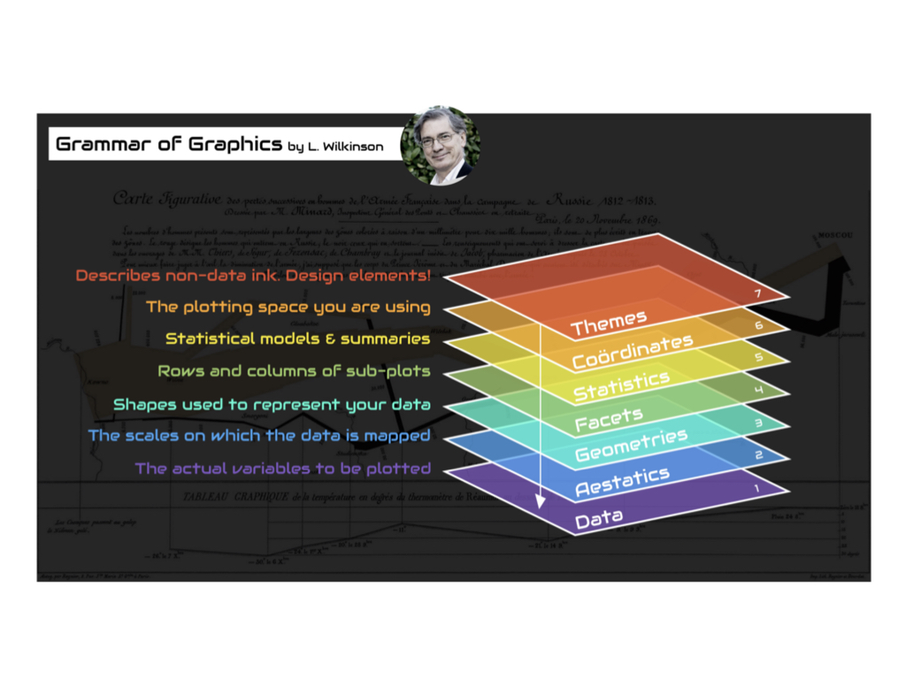
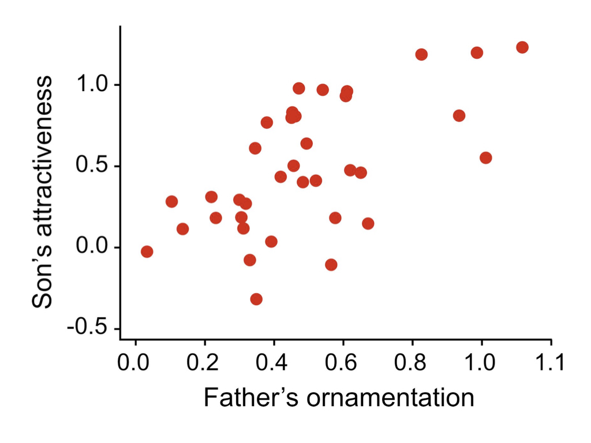
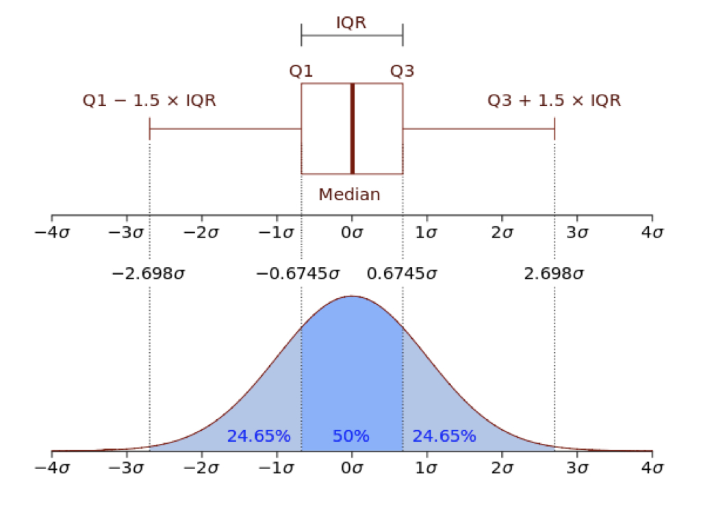
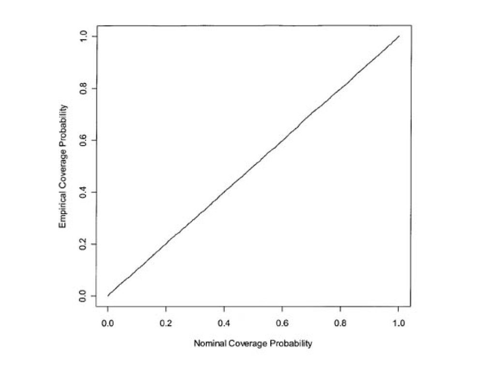
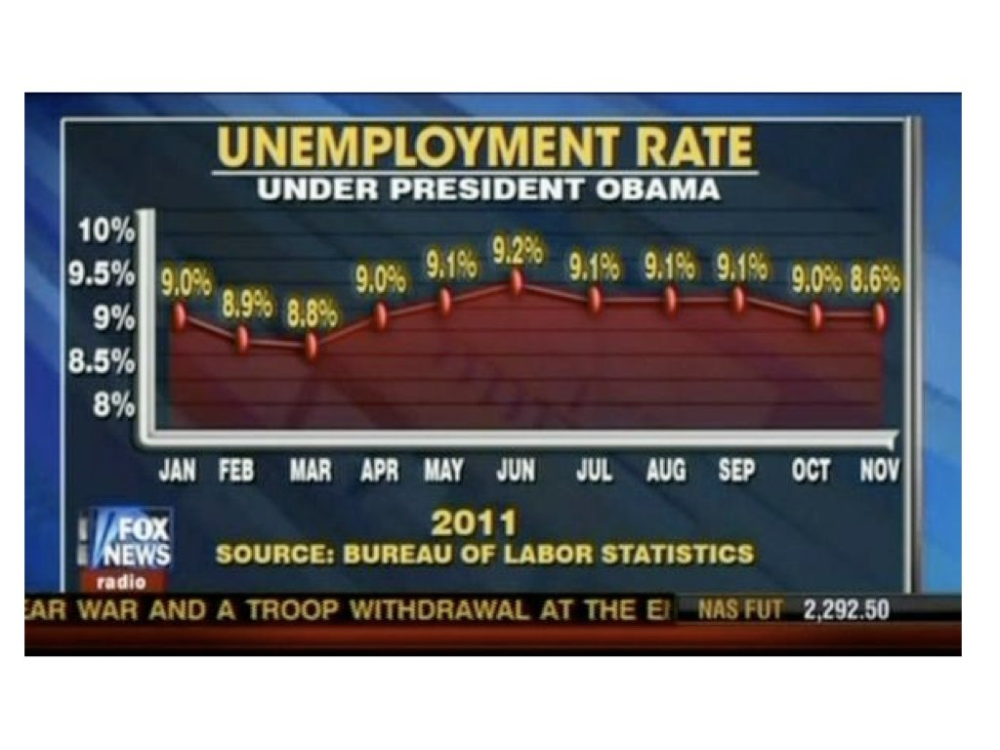
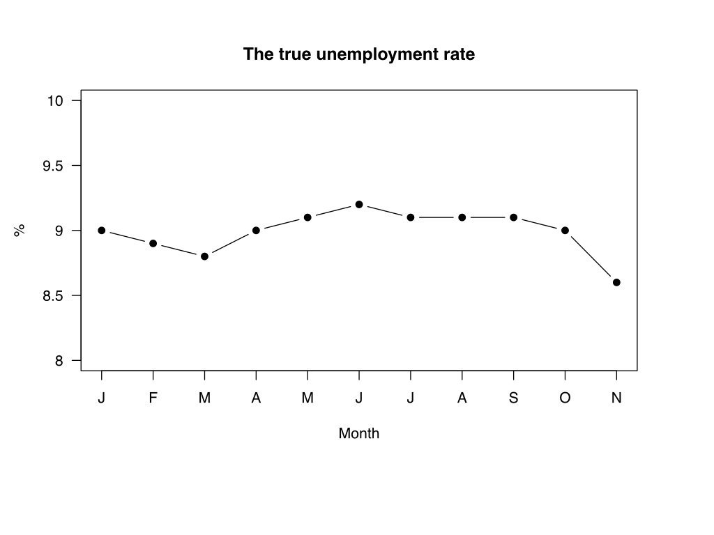
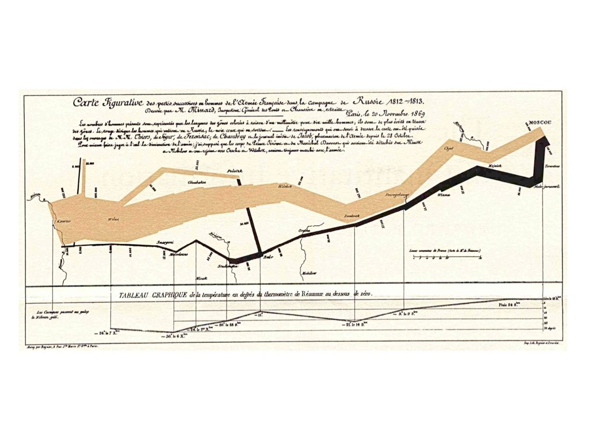
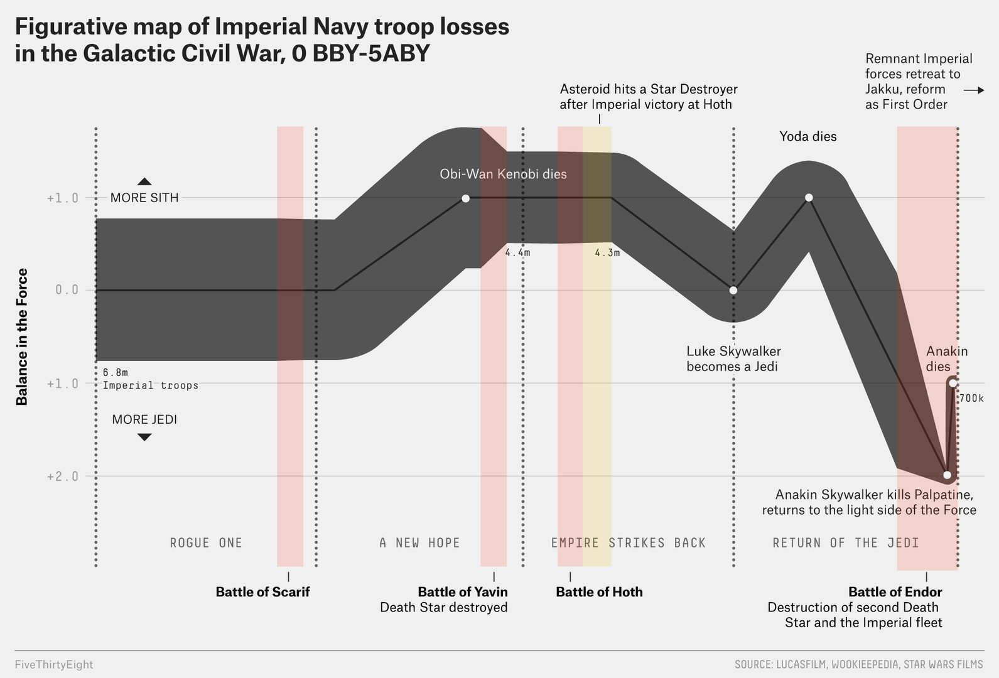

# Data Visualization with ggplot2 {#sec-data-viz}

```{r}
#| label: ch09-setup
#| include: false
library(tidyverse)
library(dslabs)
theme_set(theme_minimal())
```

::: {.callout-note title="Learning Objectives"}
After completing this chapter, you will be able to:

- Explain the Grammar of Graphics philosophy underlying ggplot2
- Distinguish between mapping an aesthetic to a variable and setting it to a constant
- Choose a chart type from the types of variables and the question being asked
- Create common plot types: scatter plots, histograms, box plots, bar charts
- Customize plots with colors, labels, scales, and themes
- Use faceting to create multi-panel figures
- Apply data visualization best practices, including honest axes and accessible colour
- Recognize and avoid common visualization pitfalls
- Save figures in the right format and resolution
:::

## Why Visualize Data? {#sec-why-visualize}

Before diving into the mechanics of creating plots, it's worth asking: why visualize data at all? Why not just report the numbers?

The answer lies in how our brains process information. The human visual system has evolved over millions of years to detect patterns, spot outliers, and perceive relationships. A well-designed visualization leverages this natural capability, allowing us to understand complex datasets almost instantly.

Consider the famous **Anscombe's Quartet**—four datasets that have nearly identical summary statistics (same mean, variance, and correlation) but tell completely different stories when plotted (@fig-anscombes):

```{r}
#| label: fig-anscombes
#| fig-cap: "Anscombe's Quartet: Four datasets with identical summary statistics but very different patterns"
#| fig-height: 6

# Anscombe's Quartet demonstration
anscombe_long <- anscombe |>
  pivot_longer(everything(),
               names_to = c(".value", "set"),
               names_pattern = "(.)(.)")

ggplot(anscombe_long, aes(x = x, y = y)) +
  geom_point(size = 2, color = "steelblue") +
  geom_smooth(method = "lm", se = FALSE, color = "coral") +
  facet_wrap(~set, ncol = 2) +
  labs(title = "Anscombe's Quartet",
       subtitle = "Same mean, variance, and correlation—different stories") +
  theme_minimal()
```

All four datasets have nearly identical statistical summaries, yet they represent fundamentally different phenomena: a linear relationship, a curved relationship, an outlier-driven relationship, and a vertical cluster with one outlier. This example powerfully demonstrates that summary statistics alone can hide important patterns. Visualization reveals what numbers cannot.

::: {.callout-important title="Always Visualize Your Data"}
Never trust summary statistics alone. Before running any analysis, plot the data to check its shape, spot outliers, and understand the patterns you are about to model.
:::

## The Grammar of Graphics {#sec-grammar-graphics}

**ggplot2** is R's most popular visualization package [@wickham2016ggplot2], built on Leland Wilkinson's "Grammar of Graphics"—a framework that describes the fundamental components from which every statistical graphic can be built. Just as grammar provides rules for constructing sentences from words, the grammar of graphics provides rules for constructing visualizations from components: data, aesthetic mappings that connect variables to visual properties, and geometric objects that represent the data, plus scales, statistical transformations, coordinate systems, and facets for finer control.

### Seven Components of a Graphic {#sec-seven-components-of-a-graphic}

Every ggplot2 visualization is built from these components (@tbl-grammar and @fig-grammar-graphics):

| Component | Description | Example |
|:----------|:------------|:--------|
| **Data** | The dataset being visualized | `mtcars`, `iris` |
| **Aesthetics** | Mappings from data to visual properties | x, y, color, size, shape |
| **Geometries** | Visual elements representing data | points, lines, bars |
| **Facets** | Subplots for data subsets | panels by category |
| **Statistics** | Transformations of data | binning, smoothing |
| **Coordinates** | The coordinate system | Cartesian, polar |
| **Themes** | Non-data visual elements | fonts, backgrounds |

: Components of the Grammar of Graphics {#tbl-grammar}

{#fig-grammar-graphics}

## Building a Plot Layer by Layer {#sec-plot-layers}

ggplot2 builds plots incrementally using the `+` operator (@fig-basic-ggplot):

```{r}
#| label: fig-basic-ggplot
#| fig-cap: "A minimal ggplot2 scatter plot of car weight against fuel efficiency"

# Start with data and aesthetics
ggplot(data = mtcars, aes(x = wt, y = mpg)) +
  # Add a geometry layer
  geom_point()
```

Let's break this down:

1. `ggplot()` initializes the plot with data
2. `aes()` maps variables to visual properties (aesthetics)
3. `geom_point()` adds the point geometry

### The Template {#sec-the-template}

Most ggplot2 code follows this template:

```r
ggplot(data = <DATA>, aes(<MAPPINGS>)) +
  <GEOM_FUNCTION>() +
  <OPTIONAL_LAYERS>
```

## Choosing the Right Chart Type {#sec-choose-chart}

One of the most important decisions in visualization is selecting the appropriate chart type for your data and message. Different charts excel at different tasks (@tbl-chart-types):

| Question | Chart Type | Why |
|:---------|:-----------|:----|
| How are values distributed? | Histogram, density plot | Shows shape, center, spread |
| How do groups compare? | Box plot, bar chart | Side-by-side comparison |
| How do two variables relate? | Scatter plot | Shows correlation, patterns |
| How does a value change over time? | Line plot | Connects sequential observations |
| What is the composition? | Stacked bar, pie chart | Shows parts of a whole |

: Matching questions to chart types {#tbl-chart-types}

::: {.callout-important title="Start with the Question"}
Before creating any visualization, ask yourself: "What question am I trying to answer?" The chart type should emerge from the question, not the other way around.
:::

The second input to the decision is the *type* of each variable you want to show (@sec-tidy-data-types). @fig-chart-selection walks through the choice:

- **One categorical variable**: bar chart of counts
- **One continuous variable**: histogram or density plot
- **One continuous and one categorical**: box plots or violin plots side by side
- **Two continuous variables**: scatter plot, with a line if the x variable is ordered (time)
- **Two categorical variables**: grouped or stacked bar chart, or a heat map of counts
- **Three or more variables**: map the extras to colour, shape, or size, or split them into facets (@sec-faceting)

{#fig-chart-selection width="90%"}

## Essential Geoms {#sec-geoms}

### Scatter Plots with `geom_point()` {#sec-geom-point}

Scatter plots show relationships between two continuous variables:

```{r}
#| label: fig-scatter
#| fig-cap: "Relationship between car weight and fuel efficiency"

ggplot(mtcars, aes(x = wt, y = mpg)) +
  geom_point() +
  labs(
    title = "Fuel Efficiency vs. Weight",
    x = "Weight (1000 lbs)",
    y = "Miles per Gallon"
  )
```

### Adding Color and Shape {#sec-adding-color-and-shape}

Map additional variables to aesthetics:

```{r}
#| label: fig-scatter-color
#| fig-cap: "Scatter plot with color representing cylinders"

ggplot(mtcars, aes(x = wt, y = mpg, color = factor(cyl))) +
  geom_point(size = 3) +
  labs(
    title = "Fuel Efficiency by Weight and Cylinders",
    x = "Weight (1000 lbs)",
    y = "Miles per Gallon",
    color = "Cylinders"
  )
```

{#fig-scatter-correlation width="60%"}

### Mapping vs. Setting Aesthetics {#sec-mapping-vs-setting}

The example above illustrates the single most common ggplot2 confusion. An aesthetic written *inside* `aes()` is **mapped** to a variable: ggplot2 picks a scale, assigns a different value to each level, and draws a legend. An aesthetic written *outside* `aes()`, as a plain argument to the geom, is **set** to a constant that applies to every observation.

```{r}
#| label: fig-mapping-vs-setting
#| fig-cap: "Left: colour mapped to a variable inside `aes()`, producing a legend. Right: colour set to a constant outside `aes()`."
#| fig-height: 3.5

library(patchwork)

p_mapped <- ggplot(mtcars, aes(x = wt, y = mpg, color = factor(cyl))) +
  geom_point(size = 3) +
  labs(title = "Mapped: color = factor(cyl)", color = "Cylinders")

p_set <- ggplot(mtcars, aes(x = wt, y = mpg)) +
  geom_point(size = 3, color = "steelblue") +
  labs(title = "Set: color = \"steelblue\"")

p_mapped + p_set
```

A classic mistake is writing `aes(color = "blue")`: ggplot2 treats the string `"blue"` as a one-level variable, maps it to the first colour of the default palette (salmon), and adds a legend labelled "blue". If you want every point the same colour, keep the argument outside `aes()`. The same logic applies to `size`, `shape`, `alpha` (transparency, useful for overlapping points), `fill`, and `linetype`.

### Histograms with `geom_histogram()` {#sec-geom-histogram}

Histograms show the distribution of a single continuous variable:

```{r}
#| label: fig-histogram
#| fig-cap: "Distribution of diamond prices"

ggplot(diamonds, aes(x = price)) +
  geom_histogram(binwidth = 500, fill = "steelblue", color = "white") +
  labs(
    title = "Distribution of Diamond Prices",
    x = "Price (USD)",
    y = "Count"
  )
```

### Frequency Polygons with `geom_freqpoly()` {#sec-geom-freqpoly}

Frequency polygons are an alternative to histograms, showing counts as lines instead of bars. They're especially useful for comparing multiple distributions:

```{r}
#| label: fig-freqpoly
#| fig-cap: "Comparing distributions with frequency polygons"

ggplot(diamonds, aes(x = price, color = cut)) +
  geom_freqpoly(binwidth = 1000, linewidth = 1) +
  labs(
    title = "Price Distribution by Cut Quality",
    x = "Price (USD)",
    y = "Count"
  )
```

### Density Plots with `geom_density()` {#sec-geom-density}

Smoothed version of histograms:

```{r}
#| label: fig-density
#| fig-cap: "Density plot comparing distributions by cut quality"

ggplot(diamonds, aes(x = price, fill = cut)) +
  geom_density(alpha = 0.5) +
  labs(
    title = "Price Distribution by Cut Quality",
    x = "Price (USD)",
    y = "Density"
  )
```

### Box Plots with `geom_boxplot()` {#sec-geom-boxplot}

Box plots show distribution summaries (@fig-boxplot-anatomy) and are excellent for comparisons:

```{r}
#| label: fig-boxplot
#| fig-cap: "Fuel efficiency by number of cylinders"

ggplot(mtcars, aes(x = factor(cyl), y = mpg, fill = factor(cyl))) +
  geom_boxplot(show.legend = FALSE) +
  labs(
    title = "Fuel Efficiency by Cylinder Count",
    x = "Number of Cylinders",
    y = "Miles per Gallon"
  )
```

{#fig-boxplot-anatomy width="60%"}

### Bar Charts with `geom_bar()` and `geom_col()` {#sec-geom-bar}

Use `geom_bar()` for counts and `geom_col()` for values:

```{r}
#| label: fig-bar
#| fig-cap: "Count of diamonds by cut quality"

ggplot(diamonds, aes(x = cut, fill = cut)) +
  geom_bar(show.legend = FALSE) +
  labs(
    title = "Diamond Count by Cut Quality",
    x = "Cut",
    y = "Count"
  )
```

#### Grouped Bar Charts with `position = "dodge"`

When you have two categorical variables, use `position = "dodge"` to place bars side-by-side:

```{r}
#| label: fig-bar-dodge
#| fig-cap: "Grouped bar chart showing cut quality by clarity"

ggplot(diamonds, aes(x = cut, fill = clarity)) +
  geom_bar(position = "dodge") +
  labs(
    title = "Diamond Count by Cut and Clarity",
    x = "Cut",
    y = "Count"
  )
```

#### Horizontal Bar Charts with `coord_flip()`

For long category names or many categories, flip the coordinates to make labels readable:

```{r}
#| label: fig-bar-horizontal
#| fig-cap: "Horizontal bar chart for better label readability"

ggplot(mpg, aes(x = class, fill = class)) +
  geom_bar(show.legend = FALSE) +
  coord_flip() +
  labs(
    title = "Vehicle Count by Class",
    x = NULL,
    y = "Count"
  )
```

### Line Plots with `geom_line()` {#sec-geom-line}

Line plots are ideal for time series or connected observations:

```{r}
#| label: fig-line
#| fig-cap: "Example line plot"

# Create sample time series data
set.seed(42)
time_data <- tibble(
  day = 1:30,
  value = cumsum(rnorm(30))
)

ggplot(time_data, aes(x = day, y = value)) +
  geom_line(color = "darkblue", linewidth = 1) +
  geom_point(color = "darkblue") +
  labs(
    title = "Simulated Time Series",
    x = "Day",
    y = "Value"
  )
```

## Combining Geoms {#sec-combining-geoms}

Layer multiple geoms to create richer visualizations:

```{r}
#| label: fig-combined
#| fig-cap: "Scatter plot with trend line"

ggplot(mtcars, aes(x = wt, y = mpg)) +
  geom_point(aes(color = factor(cyl)), size = 3) +
  geom_smooth(method = "lm", se = TRUE, color = "black") +
  labs(
    title = "Weight vs. MPG with Linear Trend",
    x = "Weight (1000 lbs)",
    y = "Miles per Gallon",
    color = "Cylinders"
  )
```

Notice that the colour mapping is placed inside `geom_point()` rather than in `ggplot()`, so it applies only to the points; the trend line is drawn once for all the data. Aesthetics in `ggplot()` are inherited by every layer, while aesthetics in a geom apply to that layer alone. With no `method` argument, `geom_smooth()` fits a LOESS curve (or a GAM for large data) and shades its confidence band; `method = "lm"` asks for a straight line instead.

::: {.callout-warning title="Choose Appropriate Models"}
When adding trend lines or smoothing to your data, choose methods that match your data structure and research questions. Overfitting with overly complex models can obscure real patterns rather than reveal them (@fig-curve-fitting-humor).

{#fig-curve-fitting-humor width="70%"}
:::

## Faceting: Small Multiples {#sec-faceting}

Faceting creates separate panels for subsets of data. The result is a set of **small multiples**—the same chart repeated for each subset—which Edward Tufte called "the best design solution for a wide range of problems in data presentation." Small multiples work because the eye can scan and compare panels quickly, every panel shares the same axes so comparisons are fair, and patterns or outliers stand out through repetition. Faceting is usually the best way to add a third (categorical) variable to a plot, and it scales far better than piling more colours and shapes into one panel.

### `facet_wrap()` for One Variable {#sec-facet-wrap}

```{r}
#| label: fig-facet-wrap
#| fig-cap: "MPG vs weight, faceted by cylinder count"

ggplot(mtcars, aes(x = wt, y = mpg)) +
  geom_point() +
  geom_smooth(method = "lm", se = FALSE) +
  facet_wrap(~cyl) +
  labs(
    title = "Fuel Efficiency by Weight (Panels by Cylinders)",
    x = "Weight (1000 lbs)",
    y = "Miles per Gallon"
  )
```

### `facet_grid()` for Two Variables {#sec-facet-grid}

```{r}
#| label: fig-facet-grid
#| fig-cap: "Two-dimensional faceting"

ggplot(mtcars, aes(x = wt, y = mpg)) +
  geom_point() +
  facet_grid(am ~ cyl, labeller = labeller(
    am = c("0" = "Automatic", "1" = "Manual"),
    cyl = c("4" = "4 cyl", "6" = "6 cyl", "8" = "8 cyl")
  )) +
  labs(
    title = "MPG by Weight, Transmission, and Cylinders",
    x = "Weight (1000 lbs)",
    y = "Miles per Gallon"
  )
```

By default every panel shares the same axis limits, which is what makes comparison fair. When the subsets have very different ranges, `scales = "free"` (or `"free_x"`, `"free_y"`) lets each panel choose its own; use it deliberately, because it removes exactly the shared reference that small multiples rely on.

## Customizing Your Plots {#sec-plot-customization}

### Labels and Titles {#sec-labels-and-titles}

```{r}
#| label: fig-labels
#| fig-cap: "Plot with comprehensive labels"

ggplot(mtcars, aes(x = wt, y = mpg)) +
  geom_point() +
  labs(
    title = "Car Fuel Efficiency",
    subtitle = "Data from the 1974 Motor Trend magazine",
    x = "Weight (1000 lbs)",
    y = "Miles per Gallon",
    caption = "Source: mtcars dataset"
  )
```

### Themes {#sec-themes}

ggplot2 includes several built-in themes:

```{r}
#| label: fig-themes
#| fig-cap: "Comparison of ggplot2 themes"
#| fig-height: 8

library(patchwork)

p <- ggplot(mtcars, aes(x = wt, y = mpg)) +
  geom_point() +
  labs(title = "")

p1 <- p + theme_gray() + labs(title = "theme_gray (default)")
p2 <- p + theme_minimal() + labs(title = "theme_minimal")
p3 <- p + theme_classic() + labs(title = "theme_classic")
p4 <- p + theme_bw() + labs(title = "theme_bw")

(p1 + p2) / (p3 + p4)
```

Other built-in themes include `theme_light()`, `theme_dark()`, and `theme_void()` (no axes at all, for maps and diagrams); the **ggthemes** package adds many more, including Tufte- and *Economist*-style themes. `theme_set()` at the top of a script or document, as in this chapter's setup chunk, applies one theme to every plot that follows.

#### Fine-Tuning with `theme()`

Complete themes set everything at once; `theme()` adjusts individual elements. The most frequent use is rotating axis labels when categories have long names, followed by moving or removing the legend:

```{r}
#| label: fig-theme-tweaks
#| fig-cap: "Rotated axis labels and a bottom legend via `theme()`"

ggplot(mpg, aes(x = manufacturer, y = hwy, fill = drv)) +
  geom_boxplot() +
  labs(x = NULL, y = "Highway MPG", fill = "Drive") +
  theme_classic() +
  theme(
    axis.text.x = element_text(angle = 45, hjust = 1),
    legend.position = "bottom"
  )
```

Elements are named by what they control (`axis.text.x`, `panel.grid.minor`, `plot.title`, `strip.text`) and are set with `element_text()`, `element_line()`, `element_rect()`, or `element_blank()` to remove them. `theme()` must come *after* a complete theme such as `theme_classic()`, otherwise the complete theme overwrites your tweaks.

### Log Scales {#sec-log-scales}

Many biological quantities—gene expression, cell counts, concentrations, population sizes—span several orders of magnitude and are strongly right-skewed. On a linear axis a handful of large values squash everything else into a corner. `scale_x_log10()` and `scale_y_log10()` transform the axis while keeping the tick labels in the original units:

```{r}
#| label: fig-log-scale
#| fig-cap: "The same simulated expression data on linear axes (left) and log axes (right)"
#| fig-height: 4

set.seed(123)
expression_sim <- tibble(
  gene_a = rlnorm(200, meanlog = 2, sdlog = 1.5),
  gene_b = rlnorm(200, meanlog = 3, sdlog = 1.2)
)

p_raw <- ggplot(expression_sim, aes(x = gene_a, y = gene_b)) +
  geom_point(alpha = 0.5) +
  labs(title = "Linear axes", x = "Gene A expression", y = "Gene B expression")

p_log <- p_raw +
  scale_x_log10() +
  scale_y_log10() +
  labs(title = "Log axes")

p_raw + p_log
```

Reach for a log scale when the data span several orders of magnitude, when relationships are multiplicative (fold changes, ratios), or when a distribution has a long right tail. Label the axis so readers know the scale is transformed, and remember that zero and negative values cannot be shown on a log axis (`log1p()` or a pseudo-log scale, `scale_y_continuous(transform = "pseudo_log")`, handles counts that include zero).

### Color Scales {#sec-color-scales}

Colour is the most powerful and the most misused aesthetic. The right scale depends on what kind of variable is mapped to it:

- **Qualitative** scales, for categories with no order: distinct hues of similar brightness (`scale_color_brewer(palette = "Set1")`, `scale_color_viridis_d()`)
- **Sequential** scales, for ordered or continuous values running from low to high: one hue varying in lightness (`scale_fill_viridis_c()`, `scale_fill_gradient()`)
- **Diverging** scales, for values with a meaningful midpoint such as zero or a log fold change of 0: two hues diverging from a neutral centre (`scale_fill_gradient2()`)

```{r}
#| label: fig-colors
#| fig-cap: "A qualitative ColorBrewer palette for an unordered categorical variable"

ggplot(mtcars, aes(x = wt, y = mpg, color = factor(cyl))) +
  geom_point(size = 3) +
  scale_color_brewer(palette = "Set1") +
  labs(
    title = "Using Color Brewer Palette",
    color = "Cylinders"
  ) +
  theme_minimal()
```

```{r}
#| label: fig-color-scale-types
#| fig-cap: "A sequential viridis scale for density (left) and a diverging scale centred on zero for correlations (right)"
#| fig-height: 4

p_seq <- ggplot(faithfuld, aes(waiting, eruptions, fill = density)) +
  geom_tile() +
  scale_fill_viridis_c() +
  labs(title = "Sequential", x = "Waiting (min)", y = "Eruption (min)")

corr_df <- cor(mtcars[, 1:6]) |>
  as.table() |>
  as.data.frame() |>
  setNames(c("var1", "var2", "correlation"))

p_div <- ggplot(corr_df, aes(var1, var2, fill = correlation)) +
  geom_tile() +
  scale_fill_gradient2(low = "steelblue", mid = "white", high = "firebrick",
                       midpoint = 0) +
  labs(title = "Diverging", x = NULL, y = NULL) +
  theme(axis.text.x = element_text(angle = 45, hjust = 1))

p_seq + p_div
```

The `scale_*` function names follow a pattern: the aesthetic (`color`/`colour` or `fill`), then the palette family, then `_d` for discrete or `_c` for continuous data. Using a continuous scale on a factor, or vice versa, is a frequent source of errors.

::: {.callout-warning title="Avoid Rainbow Scales"}
Rainbow colour maps (MATLAB's old "jet", or `rainbow()` in base R) are not perceptually uniform: yellow looks brighter than blue, so equal steps in the data do not look like equal steps in colour, and sharp hue changes create boundaries that are not in the data. They are also unreadable for colour-blind viewers. Use viridis, plasma, or another perceptually uniform scale for continuous data.
:::

## Data Visualization Best Practices {#sec-viz-best-practices}

Good data visualization communicates clearly and honestly. Edward Tufte, whose *The Visual Display of Quantitative Information* remains the standard reference, put it this way:

> "Graphical excellence is that which gives to the viewer the greatest number of ideas in the shortest time with the least ink in the smallest space."

His principles of graphical excellence are the ones that follow: **show the data**; **encourage the eye to compare** differences; **represent magnitudes honestly**; **draw graphical elements clearly, minimizing clutter**; and **make displays easy to interpret**.

### Show the Data {#sec-show-the-data}

"Above all else show the data." Don't hide your data behind summaries when individual points are informative:

```{r}
#| label: fig-show-data
#| fig-cap: "Showing raw data with summary statistics"

ggplot(mtcars, aes(x = factor(cyl), y = mpg)) +
  geom_boxplot(outlier.shape = NA, fill = "lightblue") +
  geom_jitter(width = 0.2, alpha = 0.5) +
  labs(
    title = "Show the Data, Not Just the Summary",
    x = "Cylinders",
    y = "MPG"
  )
```

### Use Position and Length for Precision {#sec-use-position-and-length-for-precision}

Every chart encodes numbers as **visual cues**—position, length, angle, area, colour—and we do not read all cues equally well. Cleveland and McGill's experiments ranked them from most to least accurately perceived:

1. **Position along a common scale** (scatter plots, dot plots)
2. **Position along non-aligned scales** (small multiples)
3. **Length** (bar charts)
4. **Angle and slope** (pie charts, some line charts)
5. **Area** (bubble charts, treemaps)
6. **Volume** (3D charts—avoid)
7. **Colour saturation and hue** (heat maps, choropleth maps)

Encode the quantity you most want the reader to compare using position or length, and keep colour and area for secondary information. This is why a bar chart beats a pie chart for the same data (@fig-bar-vs-pie): the bars ask the eye to compare lengths against a common baseline, the pie asks it to compare angles.

```{r}
#| label: fig-bar-vs-pie
#| fig-cap: "The same four values as a bar chart (lengths on a common scale) and a pie chart (angles): the ranking is instant on the left and requires effort on the right"
#| fig-height: 4

funding <- tibble(
  field = c("Engineering", "Medicine", "Natural Sciences", "Social Sciences"),
  pct = c(35, 28, 22, 15)
)

p_bar <- ggplot(funding, aes(x = reorder(field, pct), y = pct)) +
  geom_col(fill = "steelblue") +
  coord_flip() +
  labs(title = "Bar chart", x = NULL, y = "Funding (%)")

p_pie <- ggplot(funding, aes(x = "", y = pct, fill = field)) +
  geom_col(width = 1) +
  coord_polar("y") +
  labs(title = "Pie chart", fill = NULL) +
  theme_void() +
  theme(legend.position = "bottom")

p_bar + p_pie
```

::: {.callout-warning title="Avoid Pie Charts"}
Pie charts make comparisons difficult because humans are poor at judging angles, and they become unreadable beyond a handful of categories. Use bar charts (or dot plots) instead for categorical comparisons. Note that a pie chart in ggplot2 is literally a stacked bar in polar coordinates (`coord_polar()`), which shows how the grammar composes.
:::

### Order by Meaningful Values {#sec-order-by-meaningful-values}

By default, R orders categorical variables alphabetically, which is rarely meaningful. Use `reorder()` to order by a numeric value instead (the forcats tools in @sec-reordering-factor-levels do the same job for factors):

```{r}
#| label: fig-ordered
#| fig-cap: "Ordering categories by value aids comparison"

# Calculate mean mpg by manufacturer
mtcars_summary <- mtcars |>
  mutate(car = rownames(mtcars)) |>
  slice_head(n = 10) |>
  mutate(car = reorder(car, mpg))  # Order car names by mpg values

ggplot(mtcars_summary, aes(x = car, y = mpg)) +
  geom_col(fill = "steelblue") +
  coord_flip() +
  labs(
    title = "Fuel Efficiency by Car (Ordered)",
    x = NULL,
    y = "Miles per Gallon"
  )
```

The `reorder()` function takes a categorical variable and a numeric variable, then reorders the categories by the numeric values. You can also specify a summary function when there are multiple values per category (@fig-reorder-example):

```{r}
#| label: fig-reorder-example
#| fig-cap: "Highway MPG by vehicle class, with classes ordered by their median using `reorder()`"

# Order vehicle class by median highway mpg
ggplot(mpg, aes(x = reorder(class, hwy, FUN = median), y = hwy)) +
  geom_boxplot(fill = "lightblue") +
  coord_flip() +
  labs(
    title = "Highway MPG by Vehicle Class",
    subtitle = "Ordered by median MPG",
    x = NULL,
    y = "Highway MPG"
  )
```

### Represent Magnitudes Honestly: When to Include Zero {#sec-include-zero-for-bar-charts}

Whether the y-axis must start at zero is a perennial argument, and the answer depends on the encoding. In a bar chart the *length* of the bar is the magnitude, so a truncated axis misrepresents the data:

```{r}
#| label: fig-include-zero
#| fig-cap: "The same three values with a truncated axis (left) and a full axis (right). The left panel makes a 9% difference look like a several-fold one."
#| fig-height: 4

sales <- tibble(
  quarter = c("Q1", "Q2", "Q3"),
  revenue = c(100, 105, 109)
)

p_trunc <- ggplot(sales, aes(x = quarter, y = revenue)) +
  geom_col(fill = "coral") +
  coord_cartesian(ylim = c(98, 110)) +
  labs(title = "Truncated axis: misleading", x = NULL, y = "Revenue")

p_full <- ggplot(sales, aes(x = quarter, y = revenue)) +
  geom_col(fill = "coral") +
  labs(title = "Full axis: honest", x = NULL, y = "Revenue")

p_trunc + p_full
```

Note the mechanics: `coord_cartesian(ylim = ...)` zooms the view without discarding data, whereas `ylim()` or `scale_y_continuous(limits = ...)` *drops* observations outside the range, and for bars that silently removes every bar taller than the limit. Zoom with `coord_cartesian()` when you must.

For position-based encodings—line charts and scatter plots—the reader compares positions, not lengths, so forcing zero onto the axis can waste most of the plot and hide the variation you want to show:

```{r}
#| label: fig-zero-context
#| fig-cap: "Daily temperatures with zero forced onto the axis (left) and on their natural range (right). Zero has no special meaning here, so the right panel is the better plot."
#| fig-height: 4

set.seed(42)
temps <- tibble(day = 1:30, temp = rnorm(30, mean = 22, sd = 2))

p_zero <- ggplot(temps, aes(x = day, y = temp)) +
  geom_line(color = "firebrick") +
  expand_limits(y = 0) +
  labs(title = "Including zero: wastes space", y = "Temperature (°C)")

p_auto <- ggplot(temps, aes(x = day, y = temp)) +
  geom_line(color = "firebrick") +
  labs(title = "Natural range: shows variation", y = "Temperature (°C)")

p_zero + p_auto
```

::: {.callout-tip title="The Zero Rule"}
- **Bar charts**: always include zero; bar length *is* the magnitude
- **Line charts and scatter plots**: include zero if it is meaningful for the variable (counts, proportions); otherwise show the natural range of the data
- **When in doubt**: ask whether excluding zero could mislead a reader about the size of a difference. @fig-truncated-axis-news shows what happens when it does
:::

### Consider Color Blindness {#sec-consider-color-blindness}

About 8% of men and 0.5% of women have color vision deficiency. Use colorblind-friendly palettes:

```{r}
#| label: fig-colorblind
#| fig-cap: "Colorblind-friendly palette"

# Colorblind-friendly colors
cb_palette <- c("#E69F00", "#56B4E9", "#009E73", "#F0E442",
                "#0072B2", "#D55E00", "#CC79A7")

ggplot(mtcars, aes(x = wt, y = mpg, color = factor(cyl))) +
  geom_point(size = 3) +
  scale_color_manual(values = cb_palette) +
  labs(
    title = "Using a Colorblind-Friendly Palette",
    color = "Cylinders"
  ) +
  theme_minimal()
```

::: {.callout-tip}
The viridis color scales (`scale_color_viridis_d()`, `scale_fill_viridis_c()`) are designed to be colorblind-friendly and perceptually uniform, and the palette above (Okabe and Ito's) is the standard choice for up to eight categories. Avoid red versus green as the *only* distinguishing feature.
:::

Better still, do not rely on colour alone. Mapping the same variable to both `color` and `shape` (or using facets) means the plot still works in greyscale and for every viewer:

```{r}
#| label: fig-color-plus-shape
#| fig-cap: "Redundant encoding: drive type is mapped to both colour and shape, so the groups remain distinguishable without colour"

ggplot(mpg, aes(x = displ, y = hwy, color = drv, shape = drv)) +
  geom_point(size = 3) +
  scale_color_viridis_d() +
  labs(
    title = "Color + Shape: Accessible Design",
    x = "Engine Displacement (L)", y = "Highway MPG",
    color = "Drive Type", shape = "Drive Type"
  ) +
  theme_minimal()
```

Mapping one variable to two aesthetics produces a single merged legend, as long as both mappings use the same variable and the same legend title.

### Avoid Chart Junk {#sec-avoid-chart-junk}

Tufte's **data-ink ratio** is the share of a graphic's ink that actually represents data; the goal is to maximize it. Remove visual elements that convey no information:

- Avoid 3D effects, which distort perception without adding anything
- Remove unnecessary gridlines, borders, and backgrounds
- Don't use gradient fills for categorical data
- Skip decorative elements, clip art, and heavy legends

Two further mistakes are common enough to name. **Dual y-axes** (two different scales on the left and right of the same panel) are almost always misleading: the relationship between the two scales is arbitrary, and by choosing the ranges you can make any two series appear to track, cross, or diverge. Facet the two variables instead, or plot one against the other. **Overplotting**—thousands of points drawn on top of one another so the dense regions look like a solid blob—hides the structure you are trying to show; @sec-dense-data shows the remedies.

## Common Visualization Tasks {#sec-common-viz-tasks}

### Comparing Distributions {#sec-comparing-distributions}

```{r}
#| label: fig-distributions
#| fig-cap: "Comparing distributions with density plots"

ggplot(iris, aes(x = Sepal.Length, fill = Species)) +
  geom_density(alpha = 0.6) +
  scale_fill_brewer(palette = "Set2") +
  labs(
    title = "Sepal Length Distribution by Species",
    x = "Sepal Length (cm)",
    y = "Density"
  ) +
  theme_minimal()
```

### Before-After Comparisons {#sec-before-after-comparisons}

Slope charts effectively show changes between two time points:

```{r}
#| label: fig-slope
#| fig-cap: "Slope chart showing change over time"

# Sample before-after data
change_data <- tibble(
  subject = rep(LETTERS[1:5], 2),
  time = rep(c("Before", "After"), each = 5),
  value = c(10, 12, 8, 15, 11, 14, 15, 11, 18, 13)
)

ggplot(change_data, aes(x = time, y = value, group = subject)) +
  geom_line(aes(color = subject), linewidth = 1) +
  geom_point(aes(color = subject), size = 3) +
  labs(
    title = "Before-After Comparison",
    x = NULL,
    y = "Value"
  ) +
  theme_minimal()
```

### Dense Data and Overplotting {#sec-dense-data}

With thousands of observations, a plain scatter plot saturates. Three fixes, in increasing order of summarization: make the points transparent so density shows through, jitter or shrink them, or replace the points with a two-dimensional density estimate that draws the "third dimension" (how many points are here) as filled contours.

```{r}
#| label: fig-overplotting
#| fig-cap: "Five thousand points as opaque dots (left), with `alpha = 0.1` (centre), and as filled 2D density contours with `geom_density_2d_filled()` (right)"
#| fig-height: 3.5

set.seed(42)
dense <- tibble(x = rnorm(5000), y = rnorm(5000))

p_over <- ggplot(dense, aes(x, y)) +
  geom_point() +
  labs(title = "Overplotted")

p_alpha <- ggplot(dense, aes(x, y)) +
  geom_point(alpha = 0.1) +
  labs(title = "alpha = 0.1")

p_dens <- ggplot(dense, aes(x, y)) +
  geom_density_2d_filled(show.legend = FALSE) +
  labs(title = "2D density")

p_over + p_alpha + p_dens
```

`geom_hex()` and `geom_bin_2d()` do the same job with hexagonal or square bins and a colour scale for counts, which is often the clearest choice for very large datasets.

## Examples of Poor Graphics {#sec-poor-graphics}

Recognizing bad graphics is the fastest way to learn not to make them. Each of the following breaks one of the principles above.

{#fig-bad-ticker-tape width="75%"}

{#fig-bad-line width="75%"}

{#fig-bad-pies width="75%"}

Truncated axes are the most common way a graphic misrepresents magnitudes. @fig-truncated-axis-news shows a widely circulated example: a television news graphic of the US unemployment rate whose y-axis started well above zero, so that a change of about one percentage point filled the whole chart, alongside the same data plotted honestly.

::: {#fig-truncated-axis-news layout-ncol=2}
{#fig-truncated-news}

{#fig-truncated-fixed}

A truncated y-axis (left) and the honest version (right). Source: Fox News, 2011; Bureau of Labor Statistics data.
:::

"Graphical excellence begins with telling the truth about the data" (Tufte, 1983).

## A Famous Good Example {#sec-minard-map}

Charles Joseph Minard's 1869 map of Napoleon's Russian campaign (@fig-minard) is often cited as the best statistical graphic ever drawn. It displays six variables in a single coherent image: the size of the army (the width of the band), its position (latitude and longitude), the direction of movement (tan for the advance, black for the retreat), the temperature during the retreat (the line graph beneath), and the date.

{#fig-minard width="90%"}

The graphic tells a story without a legend: the army shrinks as it advances, the retreat is devastating, and the losses track the plummeting temperature. Every one of Tufte's principles is present—the data are shown, the eye is invited to compare the advance with the retreat, magnitudes are honest, there is no clutter, and the meaning is immediate. The same design has been reused for modern data (@fig-minard-modern), which shows that the idea is a general one: encode the most important quantity as position and width, and let secondary variables ride along as colour and annotation.

{#fig-minard-modern width="90%"}

## Saving Plots {#sec-saving-plots}

Use `ggsave()` to export plots; in a Quarto document, figures are instead saved automatically at render time (@sec-figure-options):

```{r}
#| label: ch09-save-plot
#| eval: false

# Create a plot
p <- ggplot(mtcars, aes(x = wt, y = mpg)) +
  geom_point() +
  theme_minimal()

# Save as PNG (good for web)
ggsave("my_plot.png", plot = p, width = 8, height = 6, dpi = 300)

# Save as PDF (good for publications)
ggsave("my_plot.pdf", plot = p, width = 8, height = 6)

# Save as SVG (good for editing)
ggsave("my_plot.svg", plot = p, width = 8, height = 6)
```

`ggsave()` infers the format from the file extension and, if `plot` is omitted, saves the last plot displayed. Always give explicit `width` and `height` (in inches by default) so that text and points are sized consistently between runs, and use `dpi = 300` or higher for raster formats destined for print. Vector formats (PDF, SVG) scale without loss and are what journals usually ask for.

## Summary {#sec-viz-summary}

ggplot2 provides a powerful and consistent framework for data visualization:

- Build plots layer by layer using the Grammar of Graphics
- Map data to aesthetics (x, y, color, size, shape) inside `aes()`; set constants outside it
- Add geometries to represent data visually
- Use faceting to create multi-panel figures (small multiples)
- Customize with themes, `theme()` tweaks, labels, log scales, and color scales matched to the variable type (qualitative, sequential, diverging)

Best practices for effective visualization:

- Show the data when possible
- Use position and length over angles and area; avoid pie charts
- Order categories meaningfully
- Include zero for bar charts; show the natural range for line and scatter plots
- Use colorblind-friendly palettes and redundant encodings (colour plus shape)
- Avoid chart junk, 3D effects, dual y-axes, and rainbow scales
- Use transparency or 2D density for dense data
- Save with explicit dimensions, and prefer vector formats for publication

::: {.callout-tip}
For a reference of ggplot2 functions and R visualization commands, see @sec-appendix-r.
:::

## Additional Reading {#sec-viz-additional-reading .unnumbered}

To master data visualization in R:

- **[ggplot2: Elegant Graphics for Data Analysis](https://ggplot2-book.org/)** by Hadley Wickham [@wickham2016ggplot2] — The comprehensive guide to ggplot2
- **[R Graphics Cookbook](https://r-graphics.org/)** by Winston Chang — Practical recipes for common visualization tasks
- **[Fundamentals of Data Visualization](https://clauswilke.com/dataviz/)** by Claus Wilke — Excellent guide to visualization principles
- **[Data Visualization: A Practical Introduction](https://socviz.co/)** by Kieran Healy — Thoughtful introduction with R examples
- **[ColorBrewer](https://colorbrewer2.org/)** — Tool for choosing effective color palettes

For publication-quality figures:

- **[cowplot Package](https://wilkelab.org/cowplot/)** — Combining and arranging ggplot figures
- **[patchwork Package](https://patchwork.data-imaginist.com/)** — Easy multi-panel figure composition
- **[ggpubr Package](https://rpkgs.datanovia.com/ggpubr/)** — Publication-ready plots with statistical annotations

## Exercises {#sec-viz-exercises .unnumbered}

::: {.callout-tip title="Practice Exercises"}

**Exercise 1: Basic Scatter Plot**

Using the `iris` dataset:
1. Create a scatter plot of `Sepal.Length` vs `Sepal.Width`
2. Color points by `Species`
3. Add appropriate labels and a title

**Exercise 2: Distribution Visualization**

Using the `diamonds` dataset:
1. Create a histogram of `carat`
2. Experiment with different bin widths
3. Add a density curve overlay

**Exercise 3: Grouped Comparisons**

Using `mtcars`:
1. Create box plots of `mpg` grouped by `cyl`
2. Add jittered points to show individual observations
3. Use a colorblind-friendly palette

**Exercise 4: Faceted Plot**

Using the `diamonds` dataset:
1. Create a scatter plot of `carat` vs `price`
2. Facet by `cut`
3. Add a smoothed trend line to each panel

**Exercise 5: Publication-Ready Figure**

Create a polished figure using any dataset that includes:
1. Meaningful title and axis labels
2. A clean theme
3. Appropriate colors
4. No chart junk
5. Save it as a high-resolution PNG

**Exercise 6: Mapped vs. Set**

1. Plot `hwy` against `displ` from `mpg` with `aes(color = "blue")` inside `aes()` and explain what you see
2. Fix it so all points are blue
3. Map `class` to colour and `drv` to shape in one plot; then facet by `drv` instead and decide which is easier to read

**Exercise 7: Scales and Honesty**

1. Plot `price` against `carat` for `diamonds` with and without `scale_x_log10()` and `scale_y_log10()`; which reveals the relationship?
2. Make a bar chart of mean `hwy` by `class` and truncate the y-axis with `coord_cartesian()`; then repeat with `ylim()` and explain why the two differ
3. Find a chart in a news article or paper that violates one of the principles in @sec-viz-best-practices, name the violation, and sketch (in ggplot2) how you would fix it
:::
