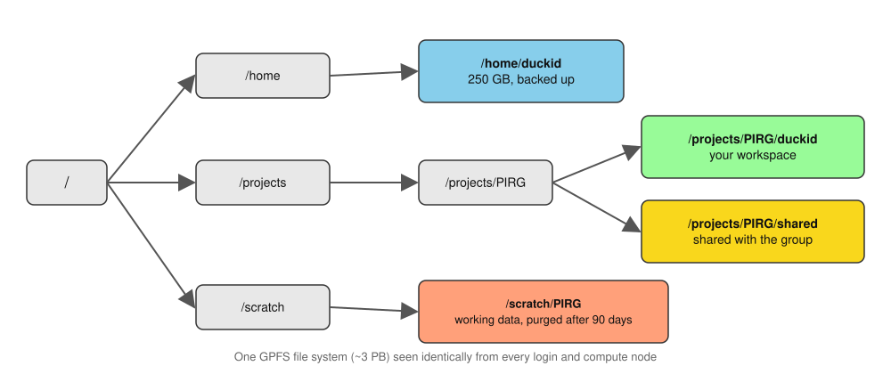

# High-Performance Computing with Talapas {#sec-hpc-talapas}

```{r}
#| label: ch11-setup
#| include: false
library(tidyverse)
library(gt)
theme_set(theme_minimal())
```

::: {.callout-note title="Learning Objectives"}
After completing this chapter, you will be able to:

- Explain what high-performance computing (HPC) is and when to use it
- Connect to Talapas via SSH, your editor's Remote-SSH extension, and Open OnDemand
- Navigate the storage system and understand quotas
- Explain how the SLURM scheduler decides which job runs next (fair-share, backfill, QOS limits)
- Write and submit batch jobs using SLURM
- Monitor job status, interpret pending reasons, and right-size requests with `seff` and `sacct`
- Use software modules, per-user environments, and containers
- Design a multi-step, multi-sample pipeline that checkpoints, logs, and scales out with job arrays or a workflow manager
- Follow best practices for responsible cluster use
:::

## What is High-Performance Computing? {#sec-what-is-hpc}

When your laptop isn't enough—when analyses run for days, require hundreds of gigabytes of memory, or need specialized hardware like GPUs—you need **high-performance computing** (HPC).

An HPC cluster is a collection of interconnected computers (called **nodes**) that work together to solve computational problems. Instead of upgrading your personal computer indefinitely, you submit jobs to a shared resource with far more capability.

### When to Use HPC {#sec-when-to-use-hpc}

Consider HPC when:

- Analyses take hours or days on your laptop
- Data is too large to fit in your computer's memory
- You need GPUs for machine learning
- You want to run many similar jobs in parallel
- Your analysis would monopolize your personal computer

### Talapas: UO's Computing Cluster {#sec-talapas-cluster}

**Talapas** is the University of Oregon's HPC cluster, named after a Chinook word for coyote (the educator and keeper of knowledge). It's managed by Research Advanced Computing Services (RACS).

Key resources:

- Over 14,520 CPU cores
- 129 TB of total memory
- 89 GPUs (including NVIDIA A100 and H100)
- 3+ petabytes of storage

## Talapas Architecture {#sec-talapas-architecture}

Understanding the cluster architecture (@fig-talapas-architecture; compare the generic layout in @fig-cluster-architecture) helps you use it effectively.

{#fig-talapas-architecture fig-align="center" width="85%"}

### Login Nodes vs. Compute Nodes {#sec-login-nodes-vs-compute-nodes}

::: {.callout-warning title="Never Run Jobs on Login Nodes"}
**Login nodes** are where you:

- Log in and manage files
- Edit scripts
- Submit jobs
- Check job status

**Do NOT** run computationally intensive work on login nodes! They're shared by everyone, and heavy processes will be terminated.

**Compute nodes** are where your actual work runs, accessed through the job scheduler (SLURM) [@yoo2003slurm].
:::

### Node Types {#sec-node-types}

The general-use node types are summarized in @tbl-node-types.

| Node type (general use) | How many | Cores per node | Memory per node | Purpose |
|:------------------------|:---------|:---------------|:----------------|:--------|
| Standard CPU (AMD Milan) | 43 | 128 | 512 GB | General computation |
| GPU | 24 | 48 | 256-512 GB | Machine learning, CUDA (52 NVIDIA A100 GPUs in total) |
| Large memory | a few | varies | up to 4 TB | Memory-intensive work (e.g., genome assembly) |
| Interactive | 19 | varies | varies | Testing, development, Open OnDemand sessions |

: Talapas general-use node types {#tbl-node-types}

Across the whole cluster (general-use and condo nodes together) Talapas offers 14,520+ CPU cores, 129 TB of memory, 89 GPUs (A100, H100, and V100), and roughly 3 PB of storage.

::: {.callout-note title="Condo Nodes"}
Research groups can also purchase **condo** nodes that their members get priority access to—about 166 additional researcher-owned CPU nodes plus V100, A100, and H100 GPUs. If your lab owns condo nodes, your PI can tell you which partition to use. Numbers here come from [RACS Services](https://racs.uoregon.edu/services); check the [Talapas Knowledge Base](https://uoracs.github.io/talapas2-knowledge-base/) for current counts, since the hardware changes as groups buy in.
:::

### Partitions (Queues) {#sec-partitions}

Jobs are submitted to **partitions** with different characteristics:

| Partition | Time Limit | Use It For |
|:----------|:-----------|:-----------|
| `compute` | 1 day | Generic CPU jobs (the default choice) |
| `computelong` | 14 days | Long-running CPU jobs |
| `gpu` | 1 day | Jobs that need a GPU |
| `gpulong` | 14 days | Long-running GPU jobs |
| `interactive` | 12 hours | Shorter interactive CPU sessions |
| `interactivegpu` | 8 hours | Shorter interactive GPU sessions |
| `memory` | 1 day | Memory-intensive jobs (up to 4 TB) |
| `memorylong` | 14 days | Long-running, memory-intensive jobs |

: Talapas partitions {#tbl-partitions}

Run `sinfo` on Talapas to see all partitions, including your lab's condo partitions.

## Getting Access {#sec-getting-access}

### Step 1: Join a PIRG {#sec-join-pirg}

Every Talapas user is sponsored by a UO principal investigator and belongs to that PI's **PIRG** (Principal Investigator Research Group). The PIRG is both your access group and the account your jobs are charged to. Your PI adds you to an existing PIRG; if your lab does not yet have one, your PI requests a new PIRG by emailing [racs@uoregon.edu](mailto:racs@uoregon.edu).

### Step 2: Request Access {#sec-request-talapas-access}

Access requests go through the [Talapas customer portal](https://hpcrcf.atlassian.net/servicedesk/customer/portal/1/group/1/create/9). You will need your PI's name and the PIRG you are joining.

Your credentials:

- **Username**: Your Duck ID
- **Password**: Your UO password (with Duo two-step verification)

::: {.callout-tip}
Ask early. Account creation requires your PI to confirm the request, and RACS processes requests during business hours, so allow several days before you need to run anything.
:::

## Connecting to Talapas {#sec-connecting-talapas}

### Option 1: SSH (Command Line) {#sec-talapas-ssh}

From your terminal (macOS Terminal, the Ubuntu (WSL) terminal on Windows, or the terminal in VS Code or Positron):

```bash
# Connect through the load balancer (works from anywhere)
$ ssh yourduckid@login.talapas.uoregon.edu
```

`login.talapas.uoregon.edu` is a **load balancer** that hands you to one of the four login nodes. Expect a Duo two-step prompt after you enter your password: no characters appear while you type the password (this is normal), and Duo then asks you to type `1` for a push notification to the Duo Mobile app, `2` for a text message, or `3` for a phone call. Mac and Linux users can set up an SSH key (`ssh-keygen -t ed25519`, then `ssh-copy-id`) to skip the password, but Duo will still prompt whenever policy requires it.

**Do you need the VPN?** The Talapas Knowledge Base says a UO VPN connection is *recommended*, not required. Without the VPN, connect to the load balancer as above and answer the Duo prompts. With the [UO VPN](https://service.uoregon.edu/TDClient/2030/Portal/KB/ArticleDet?ID=101392) connected, you can also SSH directly to a specific login node:

```bash
# With the UO VPN: connect to a specific login node
$ ssh yourduckid@login1.talapas.uoregon.edu   # or login2, login3, login4
```

Connecting to a specific node is useful when you want to reconnect to a `tmux` or `screen` session you left running there.

**Windows users**: Use the Ubuntu (WSL) terminal, or connect from VS Code or Positron with Remote-SSH (@sec-remote-ssh).

### Connecting Your Editor with Remote-SSH {#sec-remote-ssh}

{#fig-remote-ssh fig-align="center" width="90%"}

Editing scripts over a bare terminal gets old quickly. Both VS Code and Positron support **Remote - SSH**, which lets you run your familiar editor on your laptop while the files, terminal, and code execution live on Talapas.

1. Install the **Remote - SSH** extension in VS Code or Positron
2. Open the command palette, choose *Remote-SSH: Connect to Host...*, and enter `yourduckid@login.talapas.uoregon.edu`
3. Enter your UO password and complete the Duo prompt
4. Open a folder on Talapas (for example `/projects/myPIRG/yourduckid`) and work as usual

The editor's file browser, search, and integrated terminal now all point at Talapas. Two things to remember:

::: {.callout-warning title="Your Editor's Terminal Is a Login Node"}
The integrated terminal in a Remote-SSH session runs on a **login node**. Use it to edit files, run `sbatch` and `srun`, and check `squeue`, exactly as you would over SSH. Do not run heavy computation in it. If you want an interactive R or Python session with real resources, start an interactive job (@sec-interactive-jobs) or use Open OnDemand.
:::

A Remote-SSH connection uses SSH under the hood, so the same VPN guidance applies: connecting through `login.talapas.uoregon.edu` works from anywhere, and the VPN lets you target a specific login node.

### Option 2: Open OnDemand (Web Browser) {#sec-talapas-ondemand}

For a graphical interface with no setup at all, use **Open OnDemand** at [ondemand.talapas.uoregon.edu](https://ondemand.talapas.uoregon.edu). Log in with your Duck ID and UO password; a **Chrome or Firefox private window** avoids login problems caused by cached UO sessions.

Open OnDemand provides:

- **Interactive apps**: Jupyter Lab, and a remote desktop where you can run RStudio, MATLAB, or Stata with a full graphical interface
- **Shell access**: a terminal to a login node in your browser tab
- **File explorer**: browse your home and project directories, and upload and download files by drag-and-drop
- **Job composer**: build, submit, and monitor SLURM jobs from a form
- **Active jobs**: see what is running and what is queued

When you launch an interactive app, Open OnDemand submits a SLURM job on your behalf (on the `interactive` or `interactivegpu` partition) and connects your browser to it once it starts. Those sessions **keep running after you close the browser tab**, consuming your allocation until they hit their time limit. When you are done, go back to *My Interactive Sessions* and delete the session so the resources are released for everyone else.

Open OnDemand is the easiest way to start, and it remains the best option whenever you want a graphical application on cluster hardware.

### When Login Fails {#sec-login-troubleshooting}

Three problems account for almost every failed first connection:

- **`Permission denied (publickey,password)`.** Either the password was mistyped or your account is not active yet. Verify that you can sign in to any UO web service with the same Duck ID and password (reset it at [duckid.uoregon.edu](https://duckid.uoregon.edu/) if needed), then confirm with your PI that the PIRG request went through. If it persists, email RACS.
- **The Duo prompt never arrives.** Make sure the Duo Mobile app is open and your phone has a network connection. If pushes do not work, type `2` at the prompt for a text message or `3` for a phone call instead of `1`.
- **`srun: error: Invalid account or account/partition combination`.** You submitted a job without `--account=<myPIRG>` (or with a PIRG you do not belong to). Run `groups` to see which PIRGs you are in, then either add `--account=` to every `srun`/`sbatch` call or set it once in your shell profile (see @sec-slurm).

## Storage on Talapas {#sec-talapas-storage}

@fig-storage-structure shows the layout of the file system, and @tbl-storage lists the quota and purpose of each location.

{#fig-storage-structure fig-align="center" width="90%"}

### Directory Structure {#sec-directory-structure}

All of these live on a single ~3 PB parallel file system (IBM GPFS) that looks the same from every login and compute node, so a file you write on the login node is immediately visible to your jobs.

| Location | Quota | Purpose |
|:---------|:------|:--------|
| `/home/duckid` | 250 GB | Config files, small scripts, per-user software installs |
| `/projects/PIRG/duckid` | Shared (default 2 TB) | Large data, analysis |
| `/projects/PIRG/shared` | Shared | Files shared with group |
| `/scratch/PIRG` | Large per-PIRG quota | High-throughput working space; **files untouched for 90 days are purged** |
| `/tmp` (on compute nodes) | Local to node | Temporary scratch space for one job |

: Talapas storage locations {#tbl-storage}

### Storage Policies {#sec-scratch-policy}

Three policies shape where your files should live:

- **`/scratch` is purged.** Anything in `/scratch/<PIRG>/` that has not been accessed in 90 days is deleted automatically, without warning. It is the right place for large intermediate files while a pipeline runs (it is fast and has a generous quota), and the wrong place for anything you would miss. When a run finishes, copy the results you want to keep to `/projects/<PIRG>/` and delete the rest. If `/scratch` "looks empty after a few months," this is why.
- **Nothing is backed up.** RACS does not back up any Talapas file system. Some snapshotting exists for home and project directories, but it is not a substitute for your own copies. Keep code in Git (@sec-git-github) and irreplaceable data somewhere off the cluster.
- **Home is small and shared.** Your home directory is for dotfiles, scripts, and small software installs, not for sequencing data or reference genomes. Put those under `/projects` (shared with your lab) or `/scratch`.

### Moving Files On and Off Talapas {#sec-file-transfer}

For files up to a few gigabytes, `scp`, `rsync`, or the Open OnDemand file browser are enough:

```bash
# From your laptop: copy a file to your project directory
$ scp results.csv yourduckid@login.talapas.uoregon.edu:/projects/myPIRG/yourduckid/

# Sync a whole directory (only changed files are copied; -a keeps timestamps)
$ rsync -avz data/ yourduckid@login.talapas.uoregon.edu:/projects/myPIRG/yourduckid/data/
```

For large transfers (tens of gigabytes to terabytes, or thousands of files), RACS recommends [**Globus**](https://www.globus.org/). Globus moves data between "endpoints" (Talapas, your laptop with Globus Connect Personal, another university's cluster, or a cloud bucket) in the background, retries automatically after network interruptions, and verifies checksums on arrival. It is also the tool for moving data to and from UO's Large-Scale Research Storage (LSRS) for long-term archiving. Log in to Globus with your Duck ID, find the Talapas endpoint, and drag folders between panes; the transfer keeps running after you close the browser.

### Check Your Storage {#sec-check-your-storage}

```bash
# Home directory usage
$ df -h ~

# Project directory usage
$ du -sh /projects/myPIRG/myusername

# Detailed breakdown
$ du -h --max-depth=1 /projects/myPIRG/myusername
```

::: {.callout-important}
**Data is NOT automatically backed up!** You are responsible for backing up important files. Consider using Git for code (@sec-git-github) and external storage for irreplaceable data (@sec-protecting-research-data).
:::

## SLURM: The Job Scheduler {#sec-slurm}

**SLURM** (**S**imple **L**inux **U**tility for **R**esource **M**anagement) is the software that manages the cluster [@yoo2003slurm]. It:

- Allocates resources fairly among users
- Queues jobs when resources are busy
- Tracks resource usage

@fig-slurm-workflow traces a job from submission to completion.

{#fig-slurm-workflow fig-align="center" width="100%"}

Three words recur in everything that follows. A **job** is a unit of work you submit. A **partition** is a queue with its own hardware and time limits (@tbl-partitions). An **account** is the PIRG your usage is charged to.

SLURM is the dominant scheduler on academic and national-lab clusters worldwide, so everything in this chapter transfers to almost any cluster you will encounter. Its job is to decide *when*, *where*, and *with what resources* every job runs. The mental model is a request-and-grant transaction:

1. You **declare** what your job needs: how many CPU cores, how much memory, how long it will run, and whether it needs a GPU.
2. SLURM looks across all the nodes, finds one (or several) that can satisfy that request without conflicting with jobs already running there, and **reserves** those resources for you.
3. Your job runs on that reserved slice of a compute node. When it finishes, or when it exceeds the limits you declared, SLURM reclaims the resources and hands them to the next job in line.

::: {.callout-note title="Key concept: the resource declaration is a contract"}
You do not *take* resources on a cluster; you *ask* for them. SLURM keeps its side of the bargain by giving you exclusive access to the CPUs, memory, and GPUs you declared, and your job must keep its side by not exceeding them. Exceed your declared memory (`--mem`) and SLURM kills the job with state `OUT_OF_MEMORY`; exceed your declared wall-clock time (`--time`) and it is killed with `TIMEOUT`. Both are hard limits, not warnings. This is why the chapter keeps returning to *sizing requests honestly*: under-requesting kills jobs, and over-requesting wastes shared capacity and delays your own start.
:::

Every job at UO must also name an **account**, which is your PIRG. This is how usage is tracked and how fair-share accounting (next section) knows whose turn it is. If you do not know your PIRG, run `groups` after logging in. You can set it once in your shell profile so you never have to type `--account=` again:

```bash
$ echo 'export SLURM_ACCOUNT=myPIRG'  >> ~/.bash_profile
$ echo 'export SBATCH_ACCOUNT=myPIRG' >> ~/.bash_profile
$ source ~/.bash_profile
```

### How SLURM Decides Whose Turn It Is {#sec-scheduler-fairshare}

A naive scheduler would run jobs first-come, first-served. SLURM does something more equitable: **fair-share** scheduling. Each job gets a priority that depends in part on how much your PIRG has used the cluster *recently*. Groups that have consumed a lot of compute in the recent past are nudged down the queue; groups that have used little are nudged up. Over time this balances access so that no single heavy user can monopolize the machine. You can see the factors behind your own jobs' priority with `sprio` and your group's usage with `sshare -u $USER`.

Fair-share has a practical, almost counterintuitive implication for how you should size your jobs. Because SLURM also tries to fill small gaps in the schedule (a technique called **backfill**), a **small, well-sized job often starts sooner than a large one**, even if the large one was submitted first. If you ask for 4 cores and 16 GB for one hour, SLURM can slot you into a gap while a bigger job waits for a whole node to free up. If you ask for a whole node for two days, it has to wait until a node-sized gap opens. The lesson is not to game the queue (you cannot) but to **size your jobs honestly to what they need**, which both gets you running sooner and leaves resources for everyone else.

**QOS** (quality of service) limits ride alongside fair-share. A QOS caps how much one user can hold at once, for example a maximum number of simultaneously running jobs or a ceiling on total cores. These limits are why you will sometimes see a job sit in the queue with a reason like `QOSMaxCpuPerUserLimit`: you have not done anything wrong; you have hit a per-user cap, and earlier jobs must finish before the next one starts. @sec-pending-reasons lists the common reasons and what to do about each.

## Writing SLURM Batch Scripts {#sec-slurm-scripts}

A batch script combines SLURM directives with your commands:

```bash
#!/bin/bash
#SBATCH --job-name=my_analysis      # Job name (shows in queue)
#SBATCH --partition=compute         # Partition (queue)
#SBATCH --account=myPIRG            # Your PIRG name
#SBATCH --output=output_%j.log      # Standard output (%j = job ID)
#SBATCH --error=error_%j.log        # Standard error
#SBATCH --time=04:00:00             # Time limit (HH:MM:SS)
#SBATCH --nodes=1                   # Number of nodes
#SBATCH --ntasks-per-node=1         # Tasks per node
#SBATCH --cpus-per-task=4           # CPUs per task
#SBATCH --mem=16G                   # Memory per node

# Stop on the first error (see below)
set -euo pipefail

# Load required modules (inside the script, after the directives)
module purge
module load R/4.3.3

# Change to working directory
cd /projects/myPIRG/myusername/analysis

# Run your program
Rscript my_analysis.R
```

Three details in this script deserve emphasis.

**The `#SBATCH` lines are the resource declaration.** They must come at the very top, after `#!/bin/bash` and before any command. To the shell they are comments; to `sbatch` they are the contract described in @sec-slurm. Anything you can write as `#SBATCH --flag` you can also pass on the command line (`sbatch --mem=32G my_script.sh`), and the command-line version wins, which is handy for one-off overrides.

**`set -euo pipefail` should be the first real command.** This trio of shell options (@sec-strict-mode) makes the script exit immediately if any command fails (`-e`), treats unset variables as errors (`-u`), and makes a pipeline fail if any stage fails rather than only the last (`-o pipefail`). Without it, a script continues past a failed step: if `module load R/4.3.3` fails because the module name changed, the script carries on to `Rscript ...` with no R loaded and produces a confusing "command not found" (or, worse, silently uses a system R with none of your packages). With it, the script stops at the failed line and the `.err` log shows exactly where. See @sec-shell-scripting for more on these options.

**Modules must be loaded inside the script.** The environment of your login session does not follow the job to the compute node. A batch job starts on a fresh node with no modules loaded, so `module load R` on the login node before `sbatch` accomplishes nothing for the job. This is the most common source of "command not found" errors in first batch jobs; the fix is `module purge` followed by explicit `module load` lines inside the script, with version numbers (`R/4.3.3`, not `R`) so the job runs the same way next year.

### SLURM Directives {#sec-sbatch-directives-ch}

@tbl-slurm-directives collects the directives you will use most. Every job needs `--account`, `--partition`, and `--time`; the rest describe the size of the job and where its output goes.

| Directive | Purpose | Example |
|:----------|:--------|:--------|
| `--account=` | PIRG to charge (required) | `--account=myPIRG` |
| `--partition=` | Queue, and therefore hardware class (@tbl-partitions) | `--partition=compute` |
| `--job-name=` | Human-readable label shown in `squeue` | `--job-name=align_s01` |
| `--time=` | Wall-clock limit; exceed it and the job is killed (`TIMEOUT`) | `--time=04:00:00` or `1-12:00:00` (1 day 12 h) |
| `--time-min=` | Minimum acceptable wall-clock; lets backfill start the job in a shorter gap (e.g., before a maintenance window) | `--time-min=01:00:00` |
| `--nodes=` | Number of nodes (almost always 1 unless you use MPI) | `--nodes=1` |
| `--ntasks=` | Number of separate processes (MPI ranks); most bioinformatics tools want `--cpus-per-task` instead | `--ntasks=1` |
| `--cpus-per-task=` | Cores for a multi-threaded program | `--cpus-per-task=8` |
| `--mem=` | Total memory for the job on one node | `--mem=32G` |
| `--mem-per-cpu=` | Memory per core (alternative to `--mem`) | `--mem-per-cpu=4G` |
| `--gres=gpu:N` | Request GPUs (on the `gpu`/`gpulong` partitions) | `--gres=gpu:1` |
| `--array=` | Submit N independent sub-jobs from one script; index is `$SLURM_ARRAY_TASK_ID`; `%M` throttles concurrency | `--array=1-24%8` |
| `--output=` | Stdout log; `%j` is the job ID, `%x` the job name, `%A_%a` the array job and task IDs | `--output=logs/%x_%j.out` |
| `--error=` | Stderr log (same patterns); omit to merge stderr into `--output` | `--error=logs/%x_%j.err` |
| `--mail-type=` / `--mail-user=` | Email on `BEGIN`, `END`, `FAIL`, or `ALL` | `--mail-type=END,FAIL --mail-user=you@uoregon.edu` |
| `--dependency=` | Start only after another job finishes (`afterok:JOBID`) | `--dependency=afterok:12345678` |

: SLURM directives reference {#tbl-slurm-directives}

Two things about the log paths. First, `%j` in a filename embeds the job ID, so logs from repeated runs of the same script do not overwrite each other; for arrays use `%A_%a` so each task gets its own file. Second, **SLURM will not create the `logs/` directory for you.** If it does not exist the job fails immediately, often with no log to explain why (the log is exactly what could not be written). Run `mkdir -p logs` once in the directory you submit from.

For a complete list of directives and commands, see @sec-appendix-slurm.

::: {.callout-tip}
**Request only what you need!** Smaller resource requests run sooner (@sec-scheduler-fairshare). Start with a modest over-estimate, then use `seff` to right-size the next run (@sec-right-sizing).
:::

### Default Values Worth Memorizing {#sec-default-values-worth-memorizing}

- **Memory:** if you specify neither `--mem` nor `--mem-per-cpu`, you get roughly 3.7 GB per core (the node's memory divided by its cores). Ask explicitly for anything more.
- **Time:** the default on `compute` is the partition maximum (24 hours), which is often too long for small jobs (it makes them harder to backfill) and too short for large ones.
- **CPUs:** `--cpus-per-task` defaults to 1. Multi-threaded tools (`bwa -t`, `samtools -@`, R's `future` workers) need more; single-threaded scripts do not, and asking for 8 cores your code cannot use just delays your start.
- **Partition:** none. Every job must name one.

### SLURM Environment Variables {#sec-slurm-env-vars}

Inside a running job, SLURM sets environment variables describing the allocation. Use them instead of hard-coding numbers so the script and the `#SBATCH` header cannot drift apart (@tbl-slurm-env-vars):

| Variable | Contains | Typical use |
|:---------|:---------|:------------|
| `$SLURM_JOB_ID` | Numeric job ID | Naming output files and temporary directories |
| `$SLURM_JOB_NAME` | The `--job-name` | Log messages |
| `$SLURM_CPUS_PER_TASK` | Cores you were allocated | Pass to `-t`/`-@`/`--threads` flags: `bwa mem -t $SLURM_CPUS_PER_TASK` |
| `$SLURM_MEM_PER_NODE` | Memory in MB | Sizing Java heaps or R `future` limits |
| `$SLURM_ARRAY_TASK_ID` | This task's index in a job array | Selecting which sample to process (@sec-hpc-job-arrays) |
| `$SLURM_ARRAY_JOB_ID` | The parent array's job ID | Grouping array logs |
| `$SLURM_SUBMIT_DIR` | Directory you ran `sbatch` from | `cd "$SLURM_SUBMIT_DIR"` at the top of a script |
| `$SLURM_JOB_NODELIST` | Node(s) the job landed on | Debugging node-specific failures |

: SLURM environment variables available inside a job {#tbl-slurm-env-vars}

## Submitting and Managing Jobs {#sec-job-management}

### Submit a Job {#sec-submit-a-job}

```bash
# Submit batch job
$ sbatch my_script.sh
Submitted batch job 12345678
```

### Check Job Status {#sec-check-job-status}

```bash
# Your jobs
$ squeue -u $USER

# All jobs on a partition
$ squeue -p compute

# Detailed job info
$ scontrol show job 12345678
```

### Job Status Codes {#sec-job-status-codes}

The `ST` column of `squeue` uses the codes in @tbl-status-codes.

| Code | Meaning |
|:-----|:--------|
| PD | Pending (waiting in queue) |
| R | Running |
| CG | Completing |
| CD | Completed |
| F | Failed |
| CA | Cancelled |

: SLURM job status codes {#tbl-status-codes}

`squeue` shows the *current* state of a job while it is in the system. Once a job finishes it leaves the queue, and you must use `seff` or `sacct` (below) to learn anything about it. Many beginners check `squeue`, see nothing, and conclude the job never ran, when in fact it completed and left the queue before they looked. Pair `squeue` (live monitoring) with `seff` (post-mortem accounting).

### Why Is My Job Pending? {#sec-pending-reasons}

A job sitting in `PD` is normal far more often than it is broken. The `NODELIST(REASON)` column of `squeue -u $USER` (or `squeue -j <jobid> --start`, which also estimates a start time) says which. @tbl-pending-reasons lists the reasons you will see most.

| Pending reason | What it means | What to do |
|:---------------|:--------------|:-----------|
| `Priority` | Jobs with higher fair-share priority are ahead of you | Wait; nothing to fix |
| `Resources` | The resources you asked for are not free yet | Wait; consider whether `--mem`, `--cpus-per-task`, or `--time` is larger than needed |
| `QOSMaxCpuPerUserLimit` | You are already using the maximum cores one user may hold | Wait for your earlier jobs to finish; use `%M` throttling on arrays |
| `QOSMaxJobsPerUserLimit` | You have hit the per-user cap on simultaneous jobs | Wait for earlier jobs to finish |
| `QOSMaxMemoryPerUser` | Your running jobs already hold the per-user memory cap | Wait, or reduce `--mem` on queued jobs |
| `ReqNodeNotAvail, Reserved for maintenance` | Your `--time` runs past an upcoming maintenance window | Shorten `--time`, or add `--time-min` so the job can start in a shorter gap |
| `AssocGrpCPUMinutesLimit` | Your PIRG has exhausted its CPU-minute allocation | Contact RACS (and your PI) |
| `Dependency` | You used `--dependency=` and the upstream job has not finished | Normal in dependency chains |
| `PartitionTimeLimit` | Your `--time` exceeds the partition's maximum (@tbl-partitions) | Shorten `--time` or move to the `*long` partition |
| `InvalidAccount` / `InvalidQOS` | The `--account` is missing or not one of your PIRGs | Run `groups`; fix `--account=` |

: Common `squeue` pending reasons and the recommended response. For more detail on any job run `scontrol show job <jobid>`. {#tbl-pending-reasons}

Most pending states require no action; they resolve when resources free up. Cancelling a `Priority` job and resubmitting it with smaller requests rarely helps: you move to the back of a queue whose front is held up by the same contention. The two reasons that do need intervention are `ReqNodeNotAvail, Reserved for maintenance` (add `--time-min` or shorten `--time`) and `AssocGrpCPUMinutesLimit` (contact RACS). The Talapas Knowledge Base article [*Why is my SLURM job not running?*](https://uoracs.github.io/talapas2-knowledge-base/docs/faqs/why_is_my_job_not_running/) covers the rarer cases.

### Cancel a Job {#sec-cancel-a-job}

```bash
# Cancel specific job
$ scancel 12345678

# Cancel all your jobs
$ scancel -u $USER

# Cancel only your pending (not yet running) jobs
$ scancel -u $USER -t PENDING
```

### Check Resource Usage {#sec-check-resource-usage}

After a job completes:

```bash
$ seff 12345678
$ sacct -j 12345678 --format=JobID,JobName,ReqMem,MaxRSS,Elapsed,State,ExitCode
```

`seff` prints a friendly summary (state, CPU efficiency, memory efficiency, wall-clock time); `sacct` gives the same facts in tabular form that you can script against. Reading these after every job is the foundation of the next section.

## Right-Sizing Your Requests {#sec-right-sizing}

Resource requests pull in two opposite directions, and learning to balance them is the single most valuable HPC skill. On one side, **smaller requests run sooner**: the backfill scheduler slots small jobs into gaps a large job could never fit, so over-asking for memory or time directly delays your own work. On the other side, **you must request enough**: exceed `--mem` and the job dies with `OUT_OF_MEMORY`; exceed `--time` and it dies with `TIMEOUT`, often after hours of progress.

The resolution is empirical. The first time you run a new step, err *slightly* on the high side so it does not die. Then read `seff` to see what it really needed, and trim subsequent submissions toward that number with a modest safety margin. @tbl-seff-fields explains what to look at.

| Field | Source | What it means | How to use it |
|:------|:-------|:--------------|:--------------|
| `State` | `seff`, `sacct` | `COMPLETED`, `FAILED`, `OUT_OF_MEMORY`, `TIMEOUT`, `CANCELLED` | Anything other than `COMPLETED` means the job did not finish cleanly; read the `.err` log |
| `ExitCode` | `sacct` | Process exit code as `code:signal` | `0:0` is clean; `COMPLETED` with a non-zero code means *your program* failed inside a job that SLURM considers finished |
| `Memory Utilized` / `MaxRSS` | `seff` / `sacct` | Peak memory the job actually touched (high-water mark) | The definitive right-sizing number: next `--mem` = `MaxRSS` × 1.2 |
| `Memory Efficiency` | `seff` | `MaxRSS` ÷ memory requested | Consistently under 50%? Shrink `--mem` and move up the queue |
| `Job Wall-clock time` / `Elapsed` | `seff` / `sacct` | How long the job actually ran | Next `--time` = `Elapsed` × 1.2 |
| `CPU Efficiency` | `seff` | CPU time used ÷ (cores allocated × elapsed) | Low on a single-core request is normal; low on an 8-core request means the tool is not parallelizing, so drop `--cpus-per-task` |
| `ReqMem` | `sacct` | What you asked for | Compare with `MaxRSS` |

: What to look at in `seff` and `sacct` output after a job finishes {#tbl-seff-fields}

In practice this is a two-submission loop. **First run:** generous but not absurd limits, for example `--mem=32G --time=04:00:00 --cpus-per-task=4` for an unknown step, then `seff <jobid>` as soon as it finishes. **Second and later runs:** `--mem` at `MaxRSS × 1.2`, `--time` at `Elapsed × 1.2`, and `--cpus-per-task` at whatever the tool actually used. A step that requested 64 GB and used 12 GB has a new request of about 15 GB, a fourfold reduction that noticeably improves its queue position. After one pass through a multi-step pipeline you have an accurate resource profile for every step, and subsequent runs start promptly because each asks only for what it needs.

::: {.callout-warning title="A finished job is not necessarily a successful job"}
Before treating a run as done, check two things together: `seff` reports `State: COMPLETED` with exit code `0:0`, *and* the output file you expected exists and is complete (for example, the script's final "Wrote ..." message appears in the `.out` log). A job killed by `OUT_OF_MEMORY` or `TIMEOUT` mid-write leaves a truncated file on disk that looks valid but is not, and the next step in your pipeline then fails with a confusing downstream error instead of the real cause.
:::

## Interactive Jobs {#sec-interactive-jobs}

For testing and development, use interactive jobs instead of batch:

```bash
# Start interactive session
$ srun --pty --partition=interactive --account=myPIRG \
       --time=2:00:00 --cpus-per-task=4 --mem=8G /bin/bash
```

The `interactive` partition is reserved for exactly this kind of session, with a 12-hour limit; use `interactivegpu` if you need a GPU to test against.

Your prompt will change from `login1` to something like `n049`, indicating you're on a compute node.

Interactive jobs are ideal for:

- Testing workflows before batch submission
- Debugging code
- Quick data exploration
- Running GUI applications via Open OnDemand

The discipline that goes with them: **type `exit` the moment you are done.** An interactive session holds its reserved cores and memory whether or not you are typing, and an idle session is pure waste that someone else could be using. Use an interactive session when you intend to *watch* the work; use `sbatch` for anything you intend to *walk away from*, because a batch job survives your laptop sleeping, your network dropping, and you logging off for the night.

## Software Modules {#sec-modules}

Talapas uses the **Lmod** module system to manage software. This lets multiple versions coexist without conflicts.

### Basic Module Commands {#sec-basic-module-commands}

```bash
# List available modules
$ module avail

# Search for specific software
$ module spider R
$ module spider python

# Load a module
$ module load R/4.3.3
$ module load miniconda3/20240410

# See loaded modules
$ module list

# Unload a module
$ module unload R

# Reset to default state
$ module purge
```

### In Batch Scripts {#sec-in-batch-scripts}

::: {.callout-important}
Always load modules **after** the `#SBATCH` directives in your batch scripts:

```bash
#!/bin/bash
#SBATCH --job-name=analysis
#SBATCH --partition=compute
#SBATCH --account=myPIRG
# ... other directives ...

# Load modules here
module load R/4.3.3

# Now run your code
Rscript analysis.R
```
:::

Modules are loaded **per shell**. They do not persist between logins, and (as @sec-slurm-scripts explained) they do not travel from the login node into a batch job. Specify version numbers (`R/4.3.3`, not `R`) so that a default-version change on the cluster cannot silently change your results.

### The Three Software Layers {#sec-software-layers}

Lmod modules are the first of three ways to get software onto Talapas, and most real projects use two of them together. @tbl-software-layers summarizes the trade-offs.

| Layer | What it is | Best for | Limits |
|:------|:-----------|:---------|:-------|
| **Lmod modules** | Centrally installed software, loaded with `module load` | Compilers, CUDA, R and Python interpreters, common tools (`samtools`, `bwa`, `apptainer`) | Only what RACS has installed; versions change over time |
| **Per-user environments** | Packages you install into your own space: an R library (`~/Rlibs`) pinned with `renv`, or a conda/`venv` environment | Your project's R or Python packages, at exact versions | Lives in your home or project directory; must be rebuilt on another cluster |
| **Containers (Apptainer)** | A single image file holding an entire operating system plus software stack | Complex tool chains, exact reproduction of a published environment, moving between clusters | Larger to build; you (or a collaborator) must maintain the image |

: Three ways to get software onto the cluster {#tbl-software-layers}

**Layer 2: per-user environments.** The system R and Python modules are read-only, so packages you install go into your own directory. For R, create a per-user library once and point R at it; `install.packages()` and `BiocManager::install()` will then write there:

```bash
$ mkdir -p ~/Rlibs
$ echo 'R_LIBS_USER=~/Rlibs' >> ~/.Renviron
```

To make a project reproducible, record the exact package versions with **renv**: `renv::init()` in the project, `renv::snapshot()` to write `renv.lock`, and `renv::restore()` on a fresh clone to reinstall the same versions. Commit `renv.lock` (not the library itself) to Git. For Python the equivalent is a conda environment (`module load miniconda3/20240410`, `conda create -n myenv python=3.12 numpy pandas`, `conda activate myenv`) or a `venv`; many bioinformatics tools are one `conda install` away thanks to the Bioconda channel [@gruning2018bioconda]. Either way, export the environment (`conda env export > environment.yml`) and version-control the file. Activate the environment inside the job script, exactly as you load modules.

**Layer 3: containers.** A container packages the *entire* software stack, from operating-system libraries up, into one portable, versioned file. **Docker** [@merkel2014docker] is the standard on laptops and in the cloud, but it requires root privileges, so clusters do not run it. **Apptainer** (formerly Singularity) [@kurtzer2017singularity] is its HPC-safe counterpart: it runs as an ordinary user, mounts your home and project directories automatically, and can pull Docker images directly, so an image built on a laptop runs unchanged on Talapas:

```bash
# On a compute node (interactive session), not the login node
$ module load apptainer
$ apptainer pull docker://rocker/tidyverse:4.4.1     # one-time: creates tidyverse_4.4.1.sif
$ apptainer exec tidyverse_4.4.1.sif Rscript analysis.R
```

Inside a batch script the last line becomes `apptainer exec /path/to/image.sif Rscript analysis.R`. Containers are the strongest reproducibility guarantee available: a collaborator with the same `.sif` file gets the same results, on any cluster, years later.

::: {.callout-tip title="Which layer should I use?"}
- Just need R or Python and a few packages? Modules plus a per-user library (layers 1 + 2), pinned with `renv` or an `environment.yml`.
- Reproducing a published pipeline or moving between clusters? A container (layer 3), usually run with a module-provided `apptainer`.
- Working from a workflow manager (@sec-workflow-managers)? Snakemake and Nextflow can create conda environments or pull containers per step automatically.
:::

## GPU Jobs {#sec-gpu-jobs}

For machine learning and GPU-accelerated computing:

```bash
#!/bin/bash
#SBATCH --job-name=gpu_job
#SBATCH --partition=gpu             # GPU partition
#SBATCH --account=myPIRG
#SBATCH --time=1-00:00:00           # 1 day
#SBATCH --nodes=1
#SBATCH --gres=gpu:1                # Request 1 GPU
#SBATCH --mem=32G

# Load CUDA and your software
module load cuda/12.4
module load miniconda3/20240410

# Activate your environment
conda activate ml_env

# Run GPU code
python train_model.py
```

Check available GPUs:

```bash
$ /packages/racs/bin/slurm-show-gpus
```

## A Complete Example {#sec-hpc-example}

Let's walk through a realistic bioinformatics workflow:

### 1. Prepare Your Script {#sec-hpc-prepare-script}

Create `genome_analysis.sh`:

```bash
#!/bin/bash
#SBATCH --job-name=genome_analysis
#SBATCH --partition=compute
#SBATCH --account=myPIRG
#SBATCH --output=logs/genome_%j.out
#SBATCH --error=logs/genome_%j.err
#SBATCH --time=08:00:00
#SBATCH --cpus-per-task=8
#SBATCH --mem=32G

# Exit on error, unset variable, or failed pipeline stage
set -euo pipefail

# Load modules
module purge
module load bwa/0.7.17
module load samtools/1.17

# Set variables
GENOME="/projects/myPIRG/shared/reference/human_GRCh38.fa"
READS_R1="/projects/myPIRG/myuser/data/sample_R1.fastq.gz"
READS_R2="/projects/myPIRG/myuser/data/sample_R2.fastq.gz"
OUTPUT="/projects/myPIRG/myuser/results"

# Create output directory
mkdir -p "$OUTPUT"

# Log start time and where we landed
echo "Job $SLURM_JOB_ID starting on $(hostname) at $(date)"

# Run alignment, using the cores SLURM actually gave us
bwa mem -t "$SLURM_CPUS_PER_TASK" "$GENOME" "$READS_R1" "$READS_R2" | \
    samtools sort -@ "$SLURM_CPUS_PER_TASK" -o "$OUTPUT/aligned.bam"

# Index BAM file
samtools index "$OUTPUT/aligned.bam"

# Log completion
echo "Analysis completed at $(date)"
```

The alignment step uses `samtools` [@li2009samtools; @danecek2021twelve] to sort and index the BAM output; the `-t` and `-@` thread counts come from `$SLURM_CPUS_PER_TASK` so that changing the `#SBATCH --cpus-per-task` line is the only edit needed to scale the job.

### 2. Submit and Monitor {#sec-hpc-submit-monitor}

```bash
# Create logs directory
$ mkdir -p logs

# Submit job
$ sbatch genome_analysis.sh
Submitted batch job 12345678

# Monitor status
$ squeue -u $USER
             JOBID PARTITION     NAME     USER  ST       TIME  NODES NODELIST(REASON)
          12345678   compute genome_a   duckid   R       5:32      1 n042

# Check output in real-time
$ tail -f logs/genome_12345678.out
```

## Designing a Pipeline on the Cluster {#sec-cluster-pipeline}

One job is easy. Real projects are a *chain* of steps (align, then count, then model, then plot) run over many samples, and the cluster rewards a particular way of organizing that chain. The habits below turn a pile of scripts into a pipeline that can be re-run, resumed after a failure, and scaled from one sample to a hundred without rewriting anything. They apply whether the steps are shell, R, or Python, and they are the same habits that @sec-parallel-computing recommends within a single R session (test sequentially first, then scale out).

### Stage Data, Then Checkpoint Every Step {#sec-hpc-stage-checkpoint}

**Stage data on fast storage.** Put inputs and intermediates for a run under `/scratch/<PIRG>/<duckid>/<project>/` and keep only code and final results in `/projects` (@sec-scratch-policy). Do not hard-code that location: read it from an environment variable or a small config file so the same scripts run unchanged on your laptop, on scratch, or in a collaborator's directory.

```bash
# In the job script (or ~/.bash_profile): where this run's data live
export DATA_DIR="${DATA_DIR:-/scratch/myPIRG/$USER/hydrogel_rnaseq}"
mkdir -p "$DATA_DIR"/{raw,aligned,counts,logs}
```

Inside R the same idea is `data_dir <- Sys.getenv("DATA_DIR", unset = "data")`; in Python, `os.environ.get("DATA_DIR", "data")`.

**Write a checkpoint after every step.** Each step reads a named file, does its work, and writes a new named file that the next step reads. The file is a *checkpoint*: a self-contained snapshot of the analysis at that stage. If step 4 fails because of a memory spike, you fix the request and rerun step 4; steps 1 through 3 are untouched. Without checkpoints, a failure anywhere forces a rerun from scratch. The cost is disk space and one discipline: verify the checkpoint (`State: COMPLETED`, output present and complete) before launching the step that consumes it.

**Skip work that is already done.** Once outputs are checkpoints, the script can test for them and move on, which makes re-running the whole pipeline after a partial failure safe and cheap:

```bash
if [[ -s "$DATA_DIR/aligned/${SAMPLE}.bam" ]]; then
    echo "$SAMPLE already aligned, skipping"
else
    bwa mem -t "$SLURM_CPUS_PER_TASK" "$GENOME" "$R1" "$R2" \
        | samtools sort -@ "$SLURM_CPUS_PER_TASK" -o "$DATA_DIR/aligned/${SAMPLE}.bam.tmp"
    mv "$DATA_DIR/aligned/${SAMPLE}.bam.tmp" "$DATA_DIR/aligned/${SAMPLE}.bam"
fi
```

Writing to a `.tmp` name and renaming only after success means a job killed mid-write never leaves a truncated file that the `-s` test would mistake for a finished one.

### Log Everything, Test on a Subset, Then Scale Out {#sec-hpc-log-test-scale}

**Log everything.** A batch job has no terminal, so its logs are your only window into what happened. Print a line at the start (`echo "Job $SLURM_JOB_ID on $(hostname), $(date)"`), one per major step, and one at the end ("Wrote ..."), and keep `--output`/`--error` in a `logs/` directory named with `%x_%j` so you can match a log to a job weeks later. Record software versions too (`module list 2>&1`, `R --version`, `samtools --version`), because "which version did I use?" is the first question a reviewer asks.

**Test on a subset first.** Before submitting a 12-hour job, run the script on a tiny input: the first 100,000 reads (`zcat R1.fastq.gz | head -n 400000 | gzip > test_R1.fastq.gz`), one chromosome, one sample. Run it in an interactive session (@sec-interactive-jobs) where you can watch it fail quickly. Only when the small run finishes cleanly and `seff` gives you a resource profile should you submit the full-size job with right-sized requests (@sec-right-sizing).

**Scale out with job arrays, not copies of the script.** When the same step must run on many samples, do not write one script per sample. Write one script and submit it as a **job array**.

### Job Arrays: One Script, Many Samples {#sec-hpc-job-arrays}

`--array=1-N` submits N independent sub-jobs from a single script, each with its own `$SLURM_ARRAY_TASK_ID` (1 through N) and its own log, time limit, and resource accounting. The script uses the task ID to pick a sample from a list, so adding a sample means adding a line to `samples.txt`, not editing code:

```bash
#!/bin/bash
#SBATCH --job-name=align
#SBATCH --partition=compute
#SBATCH --account=myPIRG
#SBATCH --time=02:00:00
#SBATCH --cpus-per-task=8
#SBATCH --mem=16G
#SBATCH --array=1-24%8               # 24 samples, at most 8 running at once
#SBATCH --output=logs/%x_%A_%a.out   # %A = array job ID, %a = task ID
#SBATCH --error=logs/%x_%A_%a.err

set -euo pipefail
module purge
module load bwa/0.7.17 samtools/1.17

# Line N of samples.txt is this task's sample
SAMPLE=$(sed -n "${SLURM_ARRAY_TASK_ID}p" samples.txt)
echo "Task $SLURM_ARRAY_TASK_ID: aligning $SAMPLE on $(hostname)"

R1="$DATA_DIR/raw/${SAMPLE}_R1.fastq.gz"
R2="$DATA_DIR/raw/${SAMPLE}_R2.fastq.gz"
OUT="$DATA_DIR/aligned/${SAMPLE}.bam"

if [[ -s "$OUT" ]]; then
    echo "$SAMPLE already done"; exit 0
fi
bwa mem -t "$SLURM_CPUS_PER_TASK" "$GENOME" "$R1" "$R2" \
    | samtools sort -@ "$SLURM_CPUS_PER_TASK" -o "$OUT.tmp"
mv "$OUT.tmp" "$OUT"
samtools index "$OUT"
echo "Wrote $OUT"
```

Submit it with `sbatch --export=ALL,DATA_DIR=/scratch/myPIRG/$USER/proj,GENOME=/projects/myPIRG/shared/ref.fa align.sh`, or set those variables in the script. The `%8` throttle limits how many tasks run at once, which keeps you under per-user QOS caps (@tbl-pending-reasons) and leaves room for other users. Each task is right-sized independently, so a failure in sample 17 does not touch the other 23, and resubmitting the array skips the samples whose BAM already exists. Chain steps with `--dependency=afterok:<array job ID>` so the counting step starts only when every alignment task has succeeded.

### Workflow Managers: Snakemake and Nextflow {#sec-workflow-managers}

Shell scripts with checkpoints and arrays are a hand-rolled version of what a **workflow manager** automates. Both **Snakemake** [@molder2021snakemake] and **Nextflow** [@ditommaso2017nextflow] describe a pipeline as a graph of steps connected by their input and output files. The manager works out the order, re-runs only steps whose inputs changed or whose outputs are missing, runs independent branches in parallel, and, crucially for this chapter, **submits each step to SLURM for you** with per-step resource requests. Both can also create a conda environment [@gruning2018bioconda] or pull a container [@kurtzer2017singularity] for each step, which takes care of the software layers in @sec-software-layers.

**Snakemake** uses a Python-flavored `Snakefile` of *rules*. Each rule names its inputs, outputs, and the command that turns one into the other; wildcards (`{sample}`) let one rule cover every sample:

```python
SAMPLES = [line.strip() for line in open("samples.txt")]

rule all:
    input: expand("aligned/{sample}.bam.bai", sample=SAMPLES)

rule align:
    input:
        r1 = "raw/{sample}_R1.fastq.gz",
        r2 = "raw/{sample}_R2.fastq.gz",
        ref = "ref/genome.fa"
    output: "aligned/{sample}.bam"
    threads: 8
    resources: mem_mb = 16000, runtime = 120
    shell:
        "bwa mem -t {threads} {input.ref} {input.r1} {input.r2} "
        "| samtools sort -@ {threads} -o {output}"

rule index:
    input: "aligned/{sample}.bam"
    output: "aligned/{sample}.bam.bai"
    shell: "samtools index {input}"
```

Run it on Talapas with the SLURM executor plugin: `snakemake --executor slurm --jobs 20 --default-resources slurm_account=myPIRG slurm_partition=compute`. Snakemake submits one job per rule instance, waits for them, and stops if anything fails; rerunning the same command afterwards picks up where it left off.

**Nextflow** uses *processes* connected by *channels* (streams of files). The same pipeline looks like this:

```groovy
process ALIGN {
    cpus 8
    memory '16 GB'
    time '2h'

    input:
    tuple val(sample), path(r1), path(r2)
    path ref

    output:
    tuple val(sample), path("${sample}.bam")

    script:
    """
    bwa mem -t ${task.cpus} ${ref} ${r1} ${r2} \\
        | samtools sort -@ ${task.cpus} -o ${sample}.bam
    """
}

workflow {
    reads = Channel.fromFilePairs("raw/*_R{1,2}.fastq.gz")
                   .map { id, files -> tuple(id, files[0], files[1]) }
    ALIGN(reads, file("ref/genome.fa"))
}
```

A short `nextflow.config` with `process.executor = 'slurm'` and `process.clusterOptions = '--account=myPIRG --partition=compute'` sends every process to SLURM; `nextflow run main.nf -resume` reuses cached results after a failure. Nextflow's main attraction is the [nf-core](https://nf-co.re/) collection of community-maintained, tested pipelines (RNA-seq, variant calling, ATAC-seq, and dozens more) that you can run on Talapas with a single command and a sample sheet.

For a handful of steps on one dataset, a well-written shell script with checkpoints is clear and sufficient. Once a pipeline grows past that, or must run on many datasets, the learning investment in a workflow manager pays for itself in the first rerun.

## Best Practices {#sec-hpc-best-practices}

### Do {#sec-hpc-do}

- Request only the resources you need, and check `seff` after every job
- Test with small datasets first, in an interactive session
- Use `--time` conservatively (but not too short)
- Start every job script with `set -euo pipefail` and load modules inside it
- Put large intermediates in `/scratch` and results you care about in `/projects`
- Clean up old files regularly, and keep your own backups
- Document your workflows and record software versions
- Acknowledge RACS in publications

### Don't {#sec-hpc-dont}

- Run heavy computation on login nodes
- Leave idle interactive sessions or Open OnDemand apps running
- Store sensitive data without encryption
- Ignore error messages
- Request maximum resources or the `memory` partition "just in case"
- Leave anything you would miss in `/scratch`

### Acknowledgment {#sec-hpc-acknowledgment}

When publishing research using Talapas, include this acknowledgment:

> "The authors acknowledge Research Advanced Computing Services (RACS) at the University of Oregon for providing computing resources that have contributed to the research results reported within this publication."

## Getting Help {#sec-hpc-help}

### Resources {#sec-hpc-resources}

- **Documentation**: [uoracs.github.io/talapas2-knowledge-base](https://uoracs.github.io/talapas2-knowledge-base/)
- **Service Desk**: [hpcrcf.atlassian.net/servicedesk](https://hpcrcf.atlassian.net/servicedesk/customer/portal/1)
- **Email**: racs@uoregon.edu
- **Office Hours**: Knight Library, Dream Lab 122E (Wednesdays 1-3pm)

## Running Example: The Stickleback Data {#sec-hpc-stickle}

::: {.callout-note title="Running example"}
This section applies the chapter to the course dataset described in @sec-course-dataset (80 stickleback, 4 treatment groups, 600 genes). The same steps appear on the Week 8 slides, so the book and the lecture can be read side by side.
:::

Nothing about an analysis has to change to run on Talapas; what changes is *where* it runs and *who* starts it. Put the pipeline from @sec-data-wrangling in a script, `stickle_means.R`, that reads the data file and writes `results/gene_means.tsv`. Then wrap it in a SLURM batch script that asks for modest resources, loads R, and runs it:

```bash
#!/bin/bash
#SBATCH --job-name=stickle_means
#SBATCH --account=<your_pirg>
#SBATCH --partition=compute
#SBATCH --time=00:10:00
#SBATCH --mem=4G
#SBATCH --cpus-per-task=1
#SBATCH --output=logs/stickle_%j.out
#SBATCH --error=logs/stickle_%j.err

module load R/4.4.0
cd ~/projects/comptools
Rscript stickle_means.R data/Stickle_RNAseq.tsv results/gene_means.tsv
```

Submit it, watch it in the queue, and read what it wrote:

```bash
mkdir -p logs results
sbatch stickle_means.sbatch          # Submitted batch job 1234567
squeue -u $USER                      # is it running?
cat logs/stickle_1234567.out         # what did it print?
head results/gene_means.tsv
```

A 160 KB file does not need a cluster, of course, and the job will finish in seconds. The point is the pattern: the same `Rscript` call you ran on your laptop, launched by `sbatch` instead of by you, with its output in a log file you read afterwards. For the term project, the identical pattern handles files a thousand times larger, and @sec-parallel-computing shows how to use more than one core when it does.

## Summary {#sec-hpc-summary}

High-performance computing extends your analytical capabilities beyond personal computers:

- Talapas provides 14,520+ CPU cores, 89 GPUs, 129 TB of memory, and about 3 PB of storage
- Connect via SSH (with or without the VPN), Remote-SSH from VS Code or Positron, or the Open OnDemand web interface
- SLURM manages job scheduling and resource allocation; fair-share and backfill mean honestly sized jobs start sooner
- Batch scripts combine `#SBATCH` resource requests with your commands; use `set -euo pipefail`, load modules inside the script, and read `$SLURM_*` variables instead of hard-coding
- `seff` and `sacct` tell you what a job actually used; right-size the next run from `MaxRSS` and `Elapsed`
- Software comes in three layers: Lmod modules, per-user environments (`renv`, conda), and Apptainer containers
- `/scratch` is fast but purged after 90 days; nothing on Talapas is backed up
- Pipelines on the cluster stage data, checkpoint every step, log everything, test on a subset, and scale out with job arrays or a workflow manager
- Responsible use ensures fair access for everyone

Start simple—submit small test jobs, verify they work, then scale up. The HPC learning curve is real, but the capability it provides is essential for modern computational research.

::: {.callout-tip}
For a complete reference of SLURM commands and batch script directives, see @sec-appendix-slurm.
:::

## Additional Reading {#sec-hpc-additional-reading .unnumbered}

For more on HPC and cluster computing:

- **[Talapas Knowledge Base](https://uoracs.github.io/talapas2-knowledge-base/)** — Official UO documentation for Talapas
- **[SLURM Documentation](https://slurm.schedmd.com/documentation.html)** — The official SLURM workload manager documentation
- **[HPC Carpentry](https://www.hpc-carpentry.org/)** — Introductory HPC lessons for researchers
- **[Introduction to High-Performance Scientific Computing](https://pages.tacc.utexas.edu/~eijkhout/istc/html/)** — Comprehensive textbook on HPC concepts

For workflow management and reproducible environments at scale:

- **[Snakemake for HPC](https://snakemake.readthedocs.io/en/stable/executing/cluster.html)** [@molder2021snakemake] — Running Snakemake workflows on clusters
- **[Nextflow Executors](https://www.nextflow.io/docs/latest/executor.html)** [@ditommaso2017nextflow] — Running Nextflow on SLURM and other schedulers; [nf-core](https://nf-co.re/) for ready-made pipelines
- **[Apptainer documentation](https://apptainer.org/docs/)** [@kurtzer2017singularity] — Containers on HPC, including how to pull Docker images [@merkel2014docker]
- **[Bioconda](https://bioconda.github.io/)** [@gruning2018bioconda] — Conda channel with thousands of bioinformatics tools
- The scheduler's original design is described by Yoo, Jette, and Grondona [@yoo2003slurm]

## Exercises {#sec-hpc-exercises .unnumbered}

::: {.callout-tip title="Practice Exercises"}
**Exercise 1: First Connection**

1. Log into Talapas via SSH
2. Check which login node you're on with `hostname`
3. Explore your home directory and check your quota
4. Find your project directory

**Exercise 2: Module Practice**

1. Search for available R versions
2. Load R and verify with `R --version`
3. Search for Python versions
4. Create a script that loads both R and Python

**Exercise 3: Interactive Job**

1. Start an interactive session with 2 CPUs and 4GB memory
2. Note how your prompt changes
3. Run a simple R command
4. Exit the interactive session

**Exercise 4: Batch Job**

1. Write a batch script that:
   - Requests 1 hour, 2 CPUs, 8GB memory
   - Starts with `set -euo pipefail` and loads R inside the script
   - Runs a simple R script that generates a plot
2. Submit the job
3. Monitor its progress
4. Examine the output files, then run `seff` on the job. What was the memory efficiency? What would you request next time?

**Exercise 5: Job Array**

1. Create `samples.txt` with five made-up sample names
2. Write an array job (`--array=1-5`) that reads its sample name with `sed -n "${SLURM_ARRAY_TASK_ID}p" samples.txt` and writes `results/<sample>.txt` containing the hostname and date
3. Use `%A_%a` in the log names and confirm you get five separate logs
4. Delete two of the result files and resubmit. Add a skip-if-exists test so only those two are recomputed
:::
