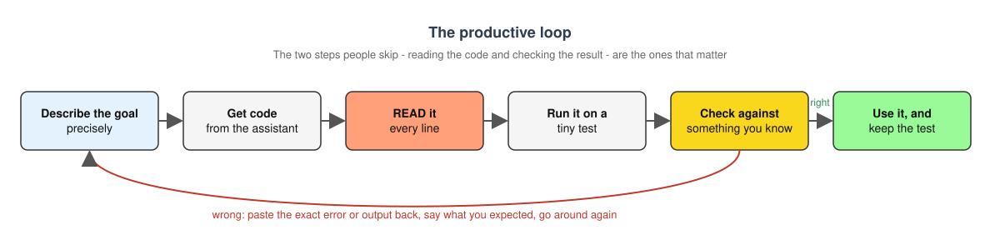

# Coding with AI Assistants {#sec-ai-assisted-coding}

```{r}
#| label: ch17-setup
#| include: false
library(tidyverse)
theme_set(theme_minimal())
```

::: {.callout-note title="Learning Objectives"}
After completing this chapter, you will be able to:

- Describe what large language model (LLM) coding assistants are and how chat, in-editor, and agentic tools differ
- Explain what "vibe coding" means and why it is both powerful and risky in scientific work
- Use a disciplined loop (describe, read, test, check, iterate) to get correct code from an assistant
- Recognize the kinds of tasks assistants do well and the kinds of mistakes they make
- Write prompts that give an assistant the context it needs
- Decide what data and information must never be pasted into an AI tool
- Follow the course policy on AI assistance and document AI help appropriately
- Use an assistant to learn programming rather than to avoid learning it
:::

## What Are AI Coding Assistants? {#sec-what-are-ai-assistants}

Every tool in this book so far has been deterministic: `grep` finds exactly what your pattern says, `dplyr::filter()` keeps exactly the rows that satisfy your condition, and SLURM runs exactly the script you submit. The tools in this chapter are different. A **large language model** (LLM) is a statistical model trained on an enormous amount of text, including a great deal of publicly available source code. Given a prompt, it produces the continuation that its training makes most probable. When the prompt is "write me an R function that reads a FASTA file," the most probable continuation is usually a plausible-looking R function.

That single word, *plausible*, is the whole story of this chapter. An LLM does not run the code it writes, does not know whether the package it names exists, and has no way to check its answer against your data. It produces text that looks like a correct answer. Often it *is* a correct answer, because correct answers are common in the training data. Sometimes it is confidently, fluently wrong. Your job as a scientist is to tell the difference, and this chapter is about how to do that efficiently.

Used well, an assistant can make you dramatically faster at the parts of programming that are tedious and make the parts that are hard more approachable. Used badly, it produces analyses that nobody, including you, actually understands. In this course we use the phrase **"vibe coding" with the help of large language models** deliberately and a little ironically: we want you to know what the phrase means, get the benefit, and avoid the trap.

The assistants in this chapter are all built on **generative** models: rather than learning to label inputs, as a classifier that calls a cell "healthy" or "diseased" does, they learn the distribution of their training text well enough to produce new text that is likely to follow a prompt (@fig-discriminative-generative-ai). That is why they are fluent, and also why they are confidently wrong: the model is producing *plausible* code, and plausibility is not correctness.

{#fig-discriminative-generative-ai width="80%"}

### A Spectrum of Tools {#sec-ai-tool-spectrum}

AI coding assistants come in three broad flavors, and it helps to keep them distinct because the risks differ.

**Chat assistants**
:   A web page or app where you type a question and get an answer. Examples include ChatGPT, Claude, Gemini, and Microsoft Copilot Chat. The University of Oregon provides Microsoft Copilot Chat to students and staff; when you sign in with your UO account it runs under UO's data-protection agreement, which matters for what you are allowed to paste into it (see @sec-ai-what-not-to-paste). Chat assistants see only what you paste into the conversation. They cannot see your files or run anything.

**In-editor assistants**
:   Tools that live inside your editor and see the file you are working on. **GitHub Copilot** in VS Code offers inline suggestions as you type (ghost text you accept with a keystroke) plus a chat panel that can reference open files. GitHub Copilot is free for verified students through the [GitHub Student Developer Pack](https://education.github.com/pack). **Positron Assistant** plays a similar role in Positron and can see your console, the variables in your R or Python session, and your plots. Most editors also offer an *inline chat* where you select a block of code, ask for a change, and review a diff before accepting it. The exact menus and keybindings change from release to release, so check your editor's documentation rather than memorizing them.

**Agentic tools**
:   Assistants that do not just propose code but *act*: they create and edit files, run commands in your terminal, read the output, and try again. Examples include Claude Code and GitHub Copilot's agent mode. These are the most powerful and the most dangerous. An agent that can run `rm` or overwrite a data file will occasionally do exactly that. Use them in a Git repository with a clean working tree so that every change is reviewable and reversible (@sec-git-github), and read what they did before you commit it.

::: {.callout-tip title="Which Should You Use?"}
Start with a chat assistant or the chat panel in your editor. Those keep you in control: you read every line before it goes into your project. Move to inline suggestions once you can quickly judge whether a suggestion is right. Try agentic tools only when you are comfortable reviewing diffs and you have everything under version control.
:::

## What "Vibe Coding" Means {#sec-vibe-coding}

The phrase **vibe coding** was coined in early 2025 to describe a style of programming in which you describe what you want in plain language, accept whatever the model writes, run it, paste any error back to the model, and repeat until something works, without ever really reading the code. You are coding by vibes rather than by understanding.

For a throwaway weekend project this can be delightful. For science it is a problem, for three reasons:

1. **You have to defend the result.** A reviewer, your advisor, or your future self will ask why the analysis does what it does. "The model wrote it" is not an answer.
2. **Bugs in scientific code are often silent.** Code that crashes is the easy case. The dangerous case is code that runs to completion and produces a number that is wrong: an off-by-one in a window, a filter that drops the controls, a mean where a median was requested. Nothing in the vibe-coding loop catches that.
3. **You stop learning.** The skills this book teaches compound. If the model does all the thinking, you never build the mental model that lets you spot when it is wrong.

So our version of vibe coding keeps the speed and drops the blindness. The assistant writes, you read, and a tiny test decides who is right.

## The Productive Loop {#sec-ai-loop}

Here is the workflow we recommend (@fig-ai-loop). It is short enough to memorize.

{#fig-ai-loop fig-align="center" width="100%"}

1. **Describe the goal precisely.** Say what language, what input, what output, and what you already know. Vague prompts get vague code.
2. **Get code.** Let the assistant write a first draft.
3. **Read it.** Every line. If there is a function you do not recognize, look it up or ask the assistant to explain it. If you cannot explain a line, you are not done.
4. **Run it on a tiny test.** Make a three-line input file or a five-row data frame where you can compute the right answer by hand.
5. **Check the result against something you know.** Does the count match what you counted? Does the mean of `c(1, 2, 3)` come out to 2?
6. **Iterate.** Paste the exact error or the wrong output back, say what you expected, and go around again.

The two steps people skip are 3 and 5. Do not skip them.

### A Worked Example in R {#sec-ai-example-r}

Suppose you have a data frame of qPCR measurements with columns `sample`, `gene`, and `ct`, and you want the median Ct per gene along with how many samples contributed. A precise prompt looks like this:

> I am using R 4.4 with the tidyverse. I have a tibble `qpcr` with columns `sample` (character), `gene` (character), and `ct` (numeric, may contain `NA`). Write a function `summarize_ct(qpcr)` that returns one row per gene with the **median** `ct` (ignoring `NA`) and the number of non-missing measurements. Please use dplyr and explain each step briefly.

A plausible response:

```r
summarize_ct <- function(qpcr) {
  qpcr |>
    group_by(gene) |>
    summarize(
      median_ct = median(ct, na.rm = TRUE),
      n         = sum(!is.na(ct)),
      .groups   = "drop"
    )
}
```

Now read it. `group_by(gene)` groups by gene, `median(ct, na.rm = TRUE)` is the median ignoring missing values, and `sum(!is.na(ct))` counts the non-missing entries. That all matches the request. Next, test it on something small enough to check by hand:

```{r}
#| label: qpcr-test
#| echo: true
library(dplyr)

summarize_ct <- function(qpcr) {
  qpcr |>
    group_by(gene) |>
    summarize(
      median_ct = median(ct, na.rm = TRUE),
      n         = sum(!is.na(ct)),
      .groups   = "drop"
    )
}

toy <- tibble(
  sample = c("s1", "s2", "s3", "s1", "s2", "s3"),
  gene   = c("actb", "actb", "actb", "gapdh", "gapdh", "gapdh"),
  ct     = c(20, 22, 100, 18, NA, 19)
)

summarize_ct(toy)
```

You can verify this in your head. For `actb` the values are 20, 22, and 100, so the median is 22 and `n` is 3; a *mean* would have been 47.3, so if you had seen 47.3 you would know the assistant had quietly substituted `mean()` for `median()`. For `gapdh` one value is missing, so `n` is 2 and the median of 18 and 19 is 18.5. The function is correct. Keep `toy` around; it is now a test you can re-run every time you touch the function (@sec-writing-functions).

### A Worked Example in Bash {#sec-ai-example-bash}

Now a shell task: you have a directory of FASTA files and want to know how many sequences each contains. A FASTA record starts with a line beginning with `>`, so counting sequences means counting those lines (@sec-grep-regex).

> I am on Linux with bash. In the current directory there are files ending in `.fasta`. Write a short script that prints, for each file, the file name and the number of sequences it contains (lines starting with `>`). Output one line per file as `filename<TAB>count`.

A plausible response:

```bash
#!/bin/bash
# Count sequences in every FASTA file in the current directory
for f in *.fasta; do
    n=$(grep -c '^>' "$f")
    printf '%s\t%d\n' "$f" "$n"
done
```

Read it. `for f in *.fasta` loops over the files, `grep -c '^>'` counts lines that begin with `>`, and `printf` writes the file name, a tab, and the count. The `"$f"` is quoted, which matters if a file name contains a space (@sec-shell-scripting). This looks right. Now verify it with inputs whose answer you know:

```bash
$ mkdir ai_test && cd ai_test
$ printf '>seq1\nACGT\n>seq2\nGGCC\n' > two.fasta
$ printf '>only\nACGTACGT\n' > one.fasta
$ printf '' > empty.fasta
$ bash count_fasta.sh
empty.fasta	0
one.fasta	1
two.fasta	2
```

Two sequences in `two.fasta`, one in `one.fasta`, zero in the empty file. The script passes. Notice that the empty file was a deliberately awkward case; assistants frequently produce loops that misbehave on empty input or on a directory with no matching files, and a thirty-second test catches that.

::: {.callout-warning title="One Thing the Assistant Did Not Tell You"}
If there are *no* `.fasta` files in the directory, bash leaves the pattern `*.fasta` unexpanded and the loop runs once with `f` set to the literal string `*.fasta`, producing a confusing `grep` error. A more careful script would add `shopt -s nullglob` before the loop (see @sec-shell-for-loops). The assistant's code was not wrong for the case you asked about, but it was not robust either. You only find this out by reading and testing.
:::

### A Third Example: Debugging an Error {#sec-ai-example-debugging}

The loop works just as well when you start from broken code instead of from a goal. Suppose you wrote this and it failed:

```r
results <- read_csv("data/expression.csv") |>
  filter(condition == "treated") |>
  group_by(gene) |>
  summarise(mean_expr = mean(expression))

ggplot(results, aes(x = gene, y = mean_expr)) +
  geom_col()
```

```
Error in `filter()`:
! Problem while computing `..1 = condition == "treated"`.
Caused by error:
! object 'condition' not found
```

The wrong way to ask is "my code doesn't work, fix it." The right way includes the code, the exact error, and what you know about the data:

> R 4.4, tidyverse. This code fails with the error below. The CSV has columns `gene_id`, `sample`, `treatment`, and `expression`. What is wrong?

The assistant will almost certainly point out that there is no column named `condition`; the column is called `treatment`. (It may also notice that `gene` should be `gene_id`.) That is a correct diagnosis, and it is one you could have reached yourself with `names(results)`, which is worth remembering: the assistant is fastest when it is doing what you would have done anyway, only quicker.

Now the important part. Before you accept the fix, ask yourself what *else* changed. If the response silently rewrote `mean(expression)` as `mean(expression, na.rm = TRUE)`, that is a real change to your analysis: rows with missing expression values are now ignored rather than propagating `NA`. It may be what you want. It may not. The point is that you should decide, not the model. Compare the fixed code with the original line by line, the same way you would review a collaborator's pull request (@sec-git-github).

## What Assistants Are Good At {#sec-ai-strengths}

Assistants shine on tasks where the answer is common, well documented, and easy for you to verify.

- **Boilerplate.** Argument parsing, a SLURM header (@sec-hpc-talapas), a ggplot2 theme, the skeleton of a Quarto document (@sec-quarto-documents). This is code you have written before and will write again.
- **Explaining error messages.** Paste the exact error and the few lines around it. Assistants are very good at translating `object of type 'closure' is not subsettable` into "you used `df` as a variable name but it is also a function, and you probably forgot to run the line that creates your data frame."
- **Translating between languages.** "Here is a Python function; write the equivalent in R." Because you already understand the original, you can check the translation.
- **Regular expressions.** Describe the pattern in words, get a regex, and then *test it* against examples that should match and examples that should not (@sec-grep-regex).
- **Documentation.** Ask for a roxygen header for a function, or a README paragraph describing what a script does. Then edit it so it is true.
- **Refactoring.** "This loop does the same thing three times with different column names; rewrite it as a function." You know what the code does, so you can check that the refactored version does the same.
- **Learning unfamiliar syntax.** "How do I do a left join in `data.table`?" or "What does the `|>` operator do?" These questions have well-known answers.

The common thread: in every case you either already know the answer or can check it cheaply.

## Where Assistants Fail {#sec-ai-failures}

Now the other side. These are not rare edge cases; every one of them will happen to you in the first month.

**Hallucinated functions, packages, and arguments.**
:   The model may call `read_fasta()` from a package that does not exist, or pass `na.ignore = TRUE` to a function whose real argument is `na.rm`. The code looks fine and fails at runtime, or worse, the package name is close enough to a real one that you install the wrong thing. Whenever a function is new to you, confirm it in the package documentation before you rely on it.

**Outdated APIs.**
:   Training data has a cutoff, and packages change. You may get `gather()` and `spread()` when `pivot_longer()` and `pivot_wider()` replaced them, or an old version of a Bioconductor interface. Tell the assistant which package versions you are using, and check the current documentation when something looks old-fashioned.

**Subtly wrong statistics.**
:   The model will happily compute a standard error as `sd(x) / n` instead of `sd(x) / sqrt(n)`, use a paired test on unpaired data, or default to `var.equal = TRUE`. It will also report a p-value with great confidence and no mention of assumptions. Statistical code deserves the most careful reading of all.

**Off-by-one and precedence errors.**
:   In R, `x[1:n-1]` is not "all but the last element." Because `:` binds tighter than `-`, it evaluates to `x[(1:n) - 1]`, which is `x[0:(n-1)]`, and index zero is silently dropped. The correct expression is `x[1:(n-1)]` or, better, `head(x, -1)`. Assistants generate this bug regularly, and it often does not crash.

**Silently changing your data.**
:   A "cleanup" step that drops rows with any `NA`, converts a factor to integer codes, or sorts a data frame and thereby breaks an alignment with another table. Always compare `nrow()` before and after, and look at `head()` of the result.

**Confident nonsense.**
:   Assistants rarely say "I don't know." Ask about an obscure bioinformatics file format and you may get a detailed, authoritative, invented specification. If it matters, find the primary documentation.

**Security-sensitive code.**
:   Anything involving passwords, tokens, file permissions, or shell commands built from user input. Assistants tend to produce code that works in the demo and is unsafe in practice, such as building a shell command by pasting strings together. Treat generated code that touches credentials or deletes files with particular suspicion, and never let an agentic tool run such code without reviewing it first.

::: {.callout-important title="The Assistant Does Not Know Your Data"}
Every failure above has the same root cause: the model is predicting text, not reasoning about your specific data, packages, or question. The fix is always the same too. Read the code, and test it on an input where you know the answer.
:::

### A Review Checklist for Generated Code {#sec-ai-review-checklist}

Reading code carefully is a skill, and a checklist helps until it becomes habit. Before you accept anything an assistant wrote, go through the questions in @tbl-ai-review-checklist:

| Question | What you are looking for |
|:---------|:-------------------------|
| Do I recognize every function? | Look up any you do not. Confirm the package exists and the arguments are real. |
| Does it use the statistic I asked for? | `mean` vs. `median`, `sd` vs. `var`, paired vs. unpaired, one-sided vs. two-sided. |
| What happens to missing values? | Are they dropped, propagated, or replaced? Was that your decision? |
| What happens at the edges? | Empty input, one row, one file, a name with a space, the last element of a vector. |
| Does the row count survive? | Compare `nrow()` or `wc -l` before and after every join, filter, or "cleanup." |
| Are indices and ranges right? | Look for `1:n-1`, `0`-based vs. `1`-based indexing, `<` vs. `<=`. |
| Does it write or delete anything? | Any `write_csv()`, `rm`, `mv`, `>` redirection, or `unlink()` deserves a second look. |
| Does it touch secrets or the network? | Credentials, `system()` calls, `curl`, `download.file()`. |
| Can I explain it to someone else? | If not, ask the assistant to explain it, then verify the explanation. |

: A checklist for reviewing assistant-generated code {#tbl-ai-review-checklist}

None of these takes more than a moment once you know to look. Together they catch the large majority of the failures in @sec-ai-failures.

## Prompting Well {#sec-ai-prompting}

A good prompt is a good bug report: it contains everything a competent stranger would need to help you. Include:

- **The language and environment.** "R 4.4 with tidyverse 2.0" or "bash on Ubuntu 24.04" or "Python 3.12 with pandas." Without this you may get Python when you wanted R, or base R when you wanted dplyr.
- **Package versions when they matter.** Especially for packages that have changed their interface.
- **Sample input and expected output.** Three rows of your data frame (fabricated or de-identified; see the next section) and what you want the result to look like. This single habit eliminates most misunderstandings.
- **Constraints.** "Do not load any packages beyond the tidyverse." "Must handle files larger than memory." "Must run without an internet connection."
- **The exact error message.** Copy the whole thing, including the traceback. Do not paraphrase it.
- **What you already tried.** So you do not get the same wrong answer back.

Then ask for more than code:

- **Ask for an explanation.** "Explain what each step does and why." This forces the model to produce reasoning you can check, and it teaches you something.
- **Ask for tests.** "Write three small test cases with expected outputs." You will often find that the tests the model writes fail against the code the model wrote, which is exactly the point.
- **Ask for alternatives.** "What are two other ways to do this, and what are the trade-offs?" Often the second option is the one you should use.
- **Ask what could go wrong.** "What inputs would break this?" Models are surprisingly good at criticizing code, including their own.

::: {.callout-tip title="A Prompt Template"}
> I am using [language and version] with [packages]. I have [description of input, with a small example]. I want [description of output, with an example]. Constraints: [anything that matters]. Please write the code, explain each step briefly, and give two small test cases with expected results.
:::

## What You Must Never Paste {#sec-ai-what-not-to-paste}

When you paste text into a chat assistant, it leaves your computer and goes to a company's servers. Depending on the tool and the account, it may be stored, reviewed by people, or used to train future models. For most coding questions this is fine: a bash loop or a ggplot call is not sensitive. For some things it is a serious problem, and it can be a violation of federal law, your IRB protocol, or your funding agreement.

Never paste into an AI tool:

- **Unpublished data or results.** Your lab's sequencing data, measurements, or manuscript drafts are not yours alone to share. Use fabricated or de-identified example rows to describe the shape of your data instead.
- **Human-subjects data or protected health information (PHI).** Anything covered by an IRB protocol or HIPAA is high-risk ("red") data at UO. This includes de-identified data in many cases; ask your PI and the IRB before assuming otherwise.
- **Credentials.** API keys, passwords, SSH private keys, tokens, and `.Renviron` or `.env` files. If you accidentally paste a key, treat it as compromised and rotate it immediately.
- **Anything above "green" classification unless the tool is UO-supported.** UO classifies data as green (low risk), amber (medium), or red (high). Unsupported AI tools are approved for green data only. Microsoft Copilot Chat signed in with your UO account is covered by UO's agreement and is approved for more. The current list is in UO's AI Service Offerings knowledge base article; @sec-computing-at-uo covers UO's AI services and data classification in more detail.

::: {.callout-warning title="Editors Send Context Too"}
In-editor assistants automatically include the open file, and sometimes neighboring files or your terminal output, as context for every request. If you have a data file, a credentials file, or a spreadsheet of participant IDs open in your editor, it may be sent along with your question about a for-loop. Close sensitive files before asking, and keep secrets out of your project directory entirely (put them in environment variables and add the file that sets them to `.gitignore`).
:::

The safe habit is simple: describe the *structure* of your data with a tiny made-up example, never the data itself.

## Reproducibility, Attribution, and the Course Policy {#sec-ai-reproducibility}

Everything in this book about reproducibility (@sec-quarto-documents, @sec-git-github; see also @sandve2013ten and @wilson2017good) applies to AI-assisted code, plus one more requirement: **keep the human in the loop.** A pipeline that nobody understands is not reproducible even if it runs, because nobody can tell whether it is doing the right thing.

### Recording AI Assistance {#sec-recording-ai-assistance}

Where an assistant contributed materially to code you publish or submit, say so. A sentence in your methods section or README is enough:

> Portions of the data-cleaning scripts were drafted with GitHub Copilot (VS Code, 2026) and subsequently reviewed, tested, and modified by the authors.

Journals and funders are converging on the position that AI tools cannot be authors, that their use should be disclosed, and that the human authors remain fully responsible for correctness. Check the specific policy of the journal or agency you are submitting to; they vary and are changing quickly. Recording the tool and approximate version also helps you later, when you are trying to understand why an old script was written the way it was.

### The Course Policy {#sec-the-course-policy}

For BioE 610 the policy is:

::: {.callout-important title="Course Policy on AI Assistance"}
AI assistants may help you **learn, explore, and debug**. You may ask them to explain concepts, explain error messages, suggest approaches, and review code you have written.

**Submitted work must be your own.** You must be able to explain every line of code you turn in: what it does, why it is there, and what would happen if you removed it. If an assistant helped, note that in a comment or in your README.

If you cannot explain it, do not submit it. We may ask you to walk through your code in person.
:::

This is not primarily an integrity rule; it is a description of what it means to be a computational scientist. The goal of the course is that *you* can do this work. An assistant that writes code you do not understand has not helped you meet that goal, however impressive the output.

## Using Assistants to Learn {#sec-ai-learning}

The same tool that can be used to avoid learning is, used differently, one of the best tutors available, because it is patient, available at 2 a.m., and never tired of the question "why?"

- **Ask "why", not just "how".** After getting code, ask "why did you use `map()` here instead of a for-loop?" or "why `na.rm = TRUE`?" Then check the answer against the documentation.
- **Have it quiz you.** "Give me five short exercises on dplyr joins with hidden answers, then check my solutions." Or paste a function you wrote and ask "what will this return for an empty input?" before you run it.
- **Compare with the documentation.** When the assistant explains a function, open the help page (`?median` in R, `man grep` in the shell) and see whether it told you the truth. Over time you will develop a sense for where it is reliable.
- **Ask for a worse version.** "Show me how a beginner might write this incorrectly, and what the bug would be." Seeing common mistakes inoculates you against them.
- **Explain your code to it.** Paste your own code and say "I think this does X because Y; am I right?" Being corrected on a misconception is the fastest way to lose it.
- **Turn off inline suggestions sometimes.** When you are learning new syntax, autocomplete robs you of the retrieval practice that makes it stick. Write it yourself first, then ask the assistant to review.

A useful test of whether you are learning: after a session with the assistant, close it and rewrite the core piece from memory. If you cannot, you were vibe coding.

### When Not to Reach for the Assistant {#sec-ai-when-not}

Some tasks are better done without one, at least at first:

- **The first time you meet a core tool.** Write your first `for` loop, first `dplyr` pipeline, and first SLURM script by hand, from the documentation and this book. You need the struggle once.
- **Anything you will be examined on.** In this course, in your qualifying exam, in a job interview. Practice the way you will be tested.
- **The statistical model itself.** Choosing a test, a transformation, or a model structure is a scientific decision. An assistant can list options and explain them, but it cannot know your experimental design. Talk to your advisor or a statistician.
- **When you cannot construct a test.** If you have no way to check the answer, you have no way to know whether the assistant is right. Build the test first, or find a smaller problem where you can.

Conversely, once you have written something by hand three times, letting the assistant write the fourth is not cheating; it is exactly what the tool is for.

## AI in Your Editor {#sec-ai-in-editors}

We deliberately keep this section short. Vendor interfaces change every few months, and anything specific we write here will be stale by the time you read it. The concepts, however, are stable.

**GitHub Copilot in VS Code.**
:   Install the GitHub Copilot extension and sign in with the GitHub account you registered for the Student Developer Pack. You get two things: *inline suggestions*, where gray "ghost text" appears as you type and you accept or ignore it, and a *chat panel*, where you can ask questions about the open file, ask for a function, or ask for an explanation of selected code. Most versions also offer an *inline chat* on a selection, which proposes an edit as a diff you can accept or reject.

**Positron Assistant.**
:   Positron, the data-science IDE from Posit, ships an assistant that can see your R or Python console, your variables, and your plots pane. That context makes it unusually good at questions like "why is this ggplot empty?" because it can look at the data you are plotting. The same caution applies: it will also happily rewrite your analysis in ways you did not ask for, so read the diff.

**Agent modes.**
:   Both editors (and standalone tools such as Claude Code) offer modes where the assistant edits multiple files and runs terminal commands on its own. Before you try these, make sure your project is a Git repository with everything committed (@sec-git-github), so that `git diff` shows you exactly what the agent did and `git restore` undoes it.

### Working With an Agent Safely {#sec-ai-agent-safety}

An agentic session looks something like this. You describe a task ("add a command-line argument for the output directory to `process.sh` and update the README"), the agent proposes a plan, edits the files, perhaps runs the script to check that it still works, and reports back. Most tools ask for permission before running each command or writing each file; keep those confirmations turned on until you have a feel for what the agent tends to do.

A few practices make this safe:

1. **Start from a clean, committed state.** `git status` should show nothing before you begin.
2. **Give a narrow task.** "Fix the bug in `count_fasta.sh` where empty directories cause an error" rather than "clean up my scripts."
3. **Read the diff, not the summary.** The agent's description of what it did is itself generated text. `git diff` is the truth.
4. **Never let it run on real data.** Point it at a copy, or at the tiny test inputs you built in @sec-ai-loop.
5. **Commit or discard promptly.** Either `git commit` the reviewed changes or `git restore .` to throw them away. Do not leave an unreviewed working tree overnight.

Agents are excellent for mechanical, wide-ranging edits (renaming a function everywhere it is used, adding the same header to twenty scripts) and for scaffolding a new project. They are a poor choice for anything where you do not already know what the right answer looks like.

::: {.callout-tip title="Editor Hygiene"}
Whatever tool you use, a few habits keep you safe:

- Work in a Git repository and commit before asking for large changes
- Close files containing data or secrets before invoking the assistant
- Read every diff before accepting it
- Keep a small test (a toy data frame or input file) next to the code and re-run it after every accepted change
:::

## Summary {#sec-ai-summary}

AI coding assistants are a genuinely new kind of tool: fast, fluent, and frequently right, but with no ability to check their own work.

- The spectrum runs from **chat** (you paste, it answers) to **in-editor** (it sees your file) to **agentic** (it edits and runs things); the more autonomy, the more review is required
- **Vibe coding** means accepting code you have not read; in science that produces results you cannot defend
- The **productive loop** is describe, get code, **read**, run a tiny test, **check against a known answer**, iterate
- Assistants are excellent at boilerplate, error messages, translation, regex, documentation, and explaining syntax
- They fail through hallucinated functions, outdated APIs, subtly wrong statistics, off-by-one and precedence bugs, silent data changes, and confident nonsense
- Good prompts give language, versions, example input and output, constraints, and the exact error; ask for explanations and tests
- **Never paste** unpublished data, human-subjects or health data, credentials, or anything above green classification into an unsupported tool
- **Course policy**: AI may help you learn and debug, but submitted work is yours and you must be able to explain every line
- Used as a tutor, an assistant accelerates learning; used as a substitute, it prevents it

The assistant writes. You are responsible.

## Additional Reading {#sec-ai-additional-reading .unnumbered}

- [UO AI Service Offerings](https://service.uoregon.edu/TDClient/2030/Portal/KB/Article/140911/AI-Service-Offerings) — Which AI tools UO supports and which data classifications each is approved for
- [GitHub Student Developer Pack](https://education.github.com/pack) — Free GitHub Copilot and other tools for verified students
- [GitHub Copilot documentation](https://docs.github.com/copilot) — Current setup and usage instructions for VS Code
- [Positron documentation](https://positron.posit.co/) — Including the Positron Assistant
- [The Turing Way: Reproducible Research](https://book.the-turing-way.org/) — Community guide to reproducible, ethical research practices

## Exercises {#sec-ai-exercises .unnumbered}

::: {.callout-tip title="Practice Exercises"}
**Exercise 1: Write Tests for Generated Code**

Ask an assistant (Copilot, Positron Assistant, UO Copilot Chat, or another chat tool) for an R function `gc_content(seq)` that returns the fraction of G and C bases in a DNA string, ignoring case and treating `N` as not counting toward the length. Then, *without* asking the assistant:

1. Write three test cases with answers you have computed by hand, including one with lowercase letters and one containing `N`
2. Run them. Did the function pass all three?
3. If it failed, fix it yourself and explain in a comment what was wrong

**Exercise 2: Find the Planted Bug (R)**

A student asked an assistant for "a function that returns the median of each numeric column, and the values of a vector except its last element." Here is what came back. Find both bugs without running the code, then confirm by running it on a small example.

```r
column_summary <- function(df) {
  df |>
    summarize(across(where(is.numeric), \(x) mean(x, na.rm = TRUE)))
}

drop_last <- function(x) {
  n <- length(x)
  x[1:n-1]
}
```

Hint: try `drop_last(c(10, 20, 30))` and compare with what you expected.

**Exercise 3: Find the Planted Bug (Bash)**

The following script was generated to count sequences in every FASTA file and print the total. Read it carefully. What happens when a file name contains a space? What happens when no `.fasta` files exist? Fix both problems.

```bash
#!/bin/bash
total=0
for f in $(ls *.fasta); do
    n=$(grep -c '>' $f)
    total=$((total + n))
    echo "$f: $n"
done
echo "Total: $total"
```

There is also a subtler issue with the pattern given to `grep`. What is it?

**Exercise 4: Prompt Comparison**

Choose a small task you actually need (a plot, a data reshaping, a shell one-liner). Ask for it twice: once with a one-sentence prompt, and once using the template in @sec-ai-prompting with a sample input and expected output. Compare the two answers. Which one did you have to fix, and why?

**Exercise 5: Learn Something, Then Prove It**

Pick a function or syntax you have never used (for example, `purrr::reduce()`, `awk` associative arrays, or `git rebase`). Spend fifteen minutes asking an assistant "why" questions about it, checking each answer against the official documentation. Then close the assistant and write a five-line example from memory that uses it correctly.
:::
