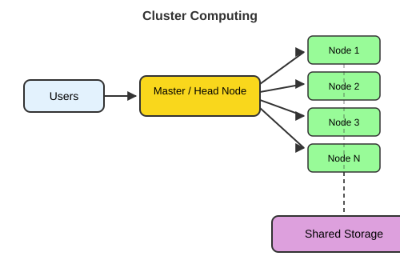
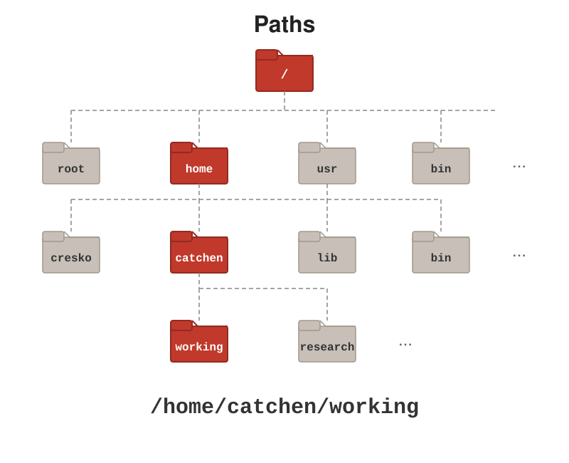

```{r}
#| label: setup
#| include: false

# Packages used in the lecture examples
library(tidyverse)
library(gt)
library(readxl)

# Consistent theme for all plots
theme_set(theme_minimal(base_size = 14))

# Reproducible random numbers
set.seed(2026)
```

## Welcome to the Bootcamp

::: {.callout-tip title="This is a practical morning - we will learn by doing"}
-   By 1:00pm every one of you should have a **working computational toolkit** on your own laptop
-   You should know **where UO keeps your files and software**
-   You should be able to **move around your computer from the command line**
-   And you should be able to **write and render a Markdown document**
:::

## Class Introductions

::: {.callout-tip title="Who are you?"}
-   Your name
-   Your home lab or rotation lab
-   What kind of computer are you using today (Mac, Windows, Linux)?
-   What has your experience with programming been like?
:::

## Plan for the morning

| Time          | Block                                                              | Install along the way                |
|---------------|--------------------------------------------------------------------|--------------------------------------|
| 9:00 - 9:50   | **Part 1** - Why computing? Why scripting? Where computing happens  | Start WSL (Windows), Xcode tools (Mac) |
| 9:50 - 10:00  | *Break*                                                            |                                      |
| 10:00 - 10:50 | **Part 2** - The shell and paths                                   | Finish Ubuntu (Windows)              |
| 10:50 - 11:00 | *Break*                                                            |                                      |
| 11:00 - 11:50 | **Part 3** - The UO computing ecosystem                            | VS Code, R, Python                   |
| 11:50 - 12:00 | *Break*                                                            |                                      |
| 12:00 - 1:00  | **Part 4** - IDEs, Markdown, and rendering                          | Quarto, TinyTeX, Positron            |

::: callout-tip
Installs are **spread through the morning** so downloads can run while we talk. Work with your neighbors - if you finish early, help someone else!
:::

## Before we start - is your laptop ready?

::: incremental
-   **RAM:** at least 8 GB (16 GB recommended)
-   **Free disk space:** at least **20 GB** - we'll install several GB of software today
-   **Operating system:** an up-to-date macOS, Windows 10/11, or Linux
-   **Administrator rights** to install software (a lab- or department-managed laptop may need IT's help)
-   **Chromebooks and iPads won't work** for this course
-   **Plug in** - installs drain batteries
:::

::: callout-note
Don't have a suitable laptop? Talk to me today - we'll find a solution.
:::

## What kind of computer do I have?

Some installers (like R) come in different versions for different processors.

| System  | How to check                                             | You'll see                        |
|---------|----------------------------------------------------------|-----------------------------------|
| macOS   | Apple menu  → **About This Mac**                        | **Chip: Apple M1/M2/M3/M4** (Apple silicon) or **Processor: Intel** |
| Windows | **Settings → System → About**                            | Processor, RAM, "64-bit operating system" |
| Any Unix shell | `uname -m`                                        | `arm64` (Apple silicon/ARM) or `x86_64` (Intel/AMD) |

::: callout-tip
Write down your chip type, RAM, and free disk space - you'll use them in a few minutes when we compare your laptop to Talapas.
:::

## Start these installs now (they take a while)

::::: columns
::: {.column width="50%"}
**Windows users - start WSL now**

1.  Right-click **Windows PowerShell** → **Run as administrator**
2.  Type `wsl --install` and press Enter
3.  When it finishes, **restart** your computer (at the break is fine)

We'll finish setting up Ubuntu in Part 2.
:::

::: {.column width="50%"}
**Mac users - install the developer tools**

1.  Open **Terminal** (`Cmd-Space`, type "Terminal")
2.  Type:

``` bash
xcode-select --install
```

3.  Click **Install** in the pop-up and let it run

(If it says they're already installed, you're done!)
:::
:::::

## Where the bootcamp fits - the 10-week roadmap

```{mermaid}
%%| label: lec00-mermaid-course-roadmap
flowchart LR
  B["<b>00 Bootcamp</b><br/>setup + first look<br/>at everything"] --> C
  subgraph C["Computers & the shell"]
    direction TB
    L1["01 Computer systems"] --> L2["02 Local / cluster / cloud<br/>+ command line"] --> L3["03 Files, pipes,<br/>tidy data"] --> L4["04 Streams &<br/>big genomic files"] --> L5["05 grep &<br/>regular expressions"]
  end
  C --> S
  subgraph S["Scripting"]
    direction TB
    L6["06 Shell scripts"] --> L7["07 R and Python"]
  end
  S --> R
  subgraph R["Reproducibility"]
    direction TB
    L8["08 Quarto, LaTeX,<br/>AI assistants, Git"] --> L9["09 Git, GitHub,<br/>GitHub Pages"]
  end
  R --> H["<b>10 Talapas</b><br/>HPC & SLURM"]
```

Almost everything today is a **first look** - each topic comes back in more depth later.

## Why computational literacy matters

::: incremental
-   Modern bioengineering generates **data at scale**: imaging, sequencing, simulations, sensors, device logs
-   The lab generates the data; **the computer turns it into results**
-   Every analytical decision - filtering, normalizing, plotting, testing - is **a line of code**
-   **Reproducibility** requires that every step is recorded, versioned, and re-runnable
:::

::: callout-tip
You do not need to become a software engineer. You need to know your tools well enough to use them confidently and understand what they are doing.
:::

## The computational stack for this course

::: incremental
-   **Hardware** - your laptop now; UO's HPC cluster **Talapas** later in the term
-   **Operating system** - macOS, Linux, or Windows (with WSL) - all speaking the same Unix shell
-   **Command line** - navigate, move data, run scripts, chain tools together
-   **Languages** - **R** and **Python** for analysis
-   **IDEs** - **VS Code** and **Positron** to write and run code
-   **Markdown / Quarto / LaTeX** - prose + code + math + figures in one reproducible document
-   **Institutional services** - Microsoft 365, Dropbox, site-licensed software
:::

# Part 1 - Why Computing? Why Scripting? {background-color="#2c3e50"}

## Why script instead of point-and-click?

::: incremental
-   **Reproducibility** - a script is an exact, re-runnable record of what you did (your lab notebook for data)
-   **Scale** - the same command works on 1 file or 10,000 files
-   **Automation** - rerun the whole analysis when new data arrive, with one command
-   **Fewer errors** - no mis-clicks, no copy-paste slips, no forgotten steps
-   **Sharing** - collaborators, reviewers, and future-you can see and rerun every step
-   **Access** - many scientific tools *only* run from the command line, and clusters like Talapas have no mouse
:::

::: callout-tip
Imagine renaming 500 microscope images, or re-making 12 figures after a reviewer asks for a different normalization. By hand: an afternoon. With a script: seconds.
:::

## A cautionary tale: Excel changed the genes

::: incremental
-   Spreadsheets "helpfully" auto-convert text: gene **SEPT2** becomes the date **2-Sep**, **MARCH1** becomes **1-Mar**
-   A 2016 survey found gene-name errors in the supplementary Excel files of **about 1 in 5** genomics papers that shared gene lists (Ziemann, Eren & El-Osta, *Genome Biology*)
-   The problem was so persistent that in 2020 the official gene nomenclature committee **renamed the genes** (SEPT2 → *SEPTIN2*, MARCH1 → *MARCHF1*)
:::

::: callout-important
**The lessons:** keep raw data in **plain-text** files (CSV/TSV), never "fix" data by hand in a spreadsheet, and let **scripts** do the transformations so every step is recorded. Much more on tidy data in **Lecture 03**.
:::

## A taste of scripting (just watch - you'll write these later!)

::::: columns
::: {.column width="50%"}
**Shell (Lecture 06)** - rename 500 images at once

``` bash
for f in IMG_*.tif; do
  mv "$f" "scaffold_day3_${f#IMG_}"
done
```

Count the lines in every data file:

``` bash
for f in data/raw/*.csv; do
  echo "$f: $(wc -l < "$f") lines"
done
```
:::

::: {.column width="50%"}
**R (Lecture 07)** - summarize every file

``` r
files <- list.files("data/raw",
                    pattern = "\\.csv$",
                    full.names = TRUE)
for (f in files) {
  d <- read.csv(f)
  cat(f, "mean stiffness:",
      mean(d$stiffness), "\n")
}
```
:::
:::::

::: callout-note
Different languages, same idea: **describe the task once, let the computer repeat it**.
:::

## Coding vs. scripting: compiled and interpreted languages

| | **Compiled** languages | **Interpreted** (scripting) languages |
|---|---|---|
| Examples | C, C++, Fortran, Rust | Bash, R, Python, MATLAB |
| How they run | Translated to machine code **before** running | Read and run **line by line** |
| Speed | Very fast | Slower (but often fast enough) |
| Flexibility | Write → compile → run | Try things interactively, one line at a time |
| Typical use | Simulation engines, core libraries | Data analysis, automation, figures |

::: callout-note
The line is blurry - Julia compiles "just in time", and fast R and Python packages are usually compiled C/C++ underneath. Most modern pipelines **mix** both.
:::

## Languages you'll meet as a bioengineer

| Language | What it's great for | In this course |
|---|---|---|
| **Bash** (the shell) | Moving and inspecting files, running programs, gluing tools together, clusters | Lectures 02 - 06, 10 |
| **R** | Statistics, data wrangling, publication-quality figures, Bioconductor genomics | Lecture 07 (and BioE stats) |
| **Python** | General programming, image analysis, machine learning, instrument control | Lecture 07, side by side with R |
| **MATLAB** | Signal processing, modeling, many engineering labs (UO site license) | - |
| **Markdown / LaTeX** | Writing documents, reports, slides, and equations | Today and Lecture 08 |

::: callout-tip
**Learn one well, and the next is much easier.** The concepts - variables, loops, functions, files - transfer between languages. And like a spoken language: use it or lose it!
:::

# Good Habits From Day One {background-color="#2c3e50"}

## Organizing a project

``` bash
my_project/
├── data/
│   ├── raw/          # original data - never modify these!
│   └── processed/    # cleaned / intermediate data
├── scripts/          # .R, .py, .sh, .qmd files
├── output/
│   ├── figures/      # plots made by your scripts
│   └── tables/       # result tables
└── docs/             # notes, manuscripts, reports
```

::: incremental
-   **`data/raw/` is read-only** - always read from it, never write to it
-   **`output/` is expendable** - it can be regenerated from `scripts/` + `data/raw/`
-   Use **relative paths** inside your scripts so the project is portable
:::


## Naming conventions that save headaches

::: incremental
-   **No spaces** - use `_` or `-` (`cell_counts.csv`, not `cell counts.csv`)
-   **No special characters** - avoid `& ? * / \ : ( ) ' "`
-   **Be consistent with case** - Unix treats `Data.csv` and `data.csv` as *different* files
-   **Dates as `YYYY-MM-DD`** so they sort correctly: `2026-09-24_plate_reader.csv`
-   **Number scripts** to show their order: `01_clean.R`, `02_analyze.R`, `03_plot.R`
-   **Descriptive, not "final"**: `figure2_v3_final_FINAL.png` is a cry for help (and for Git - Lecture 08)
:::


# Where Computing Happens {background-color="#2c3e50"}

## The three parts of a computer that matter most

-   **CPU** - does the processing
    -   Made of **cores** (independent workers) running at some clock speed (GHz)
    -   More cores = more tasks at once (if the software is written to use them)
-   **RAM** - fast, *volatile* working memory. Your data must fit here while you analyze it. **Lost when power is off.**
-   **Disk** - slower, *persistent* storage (SSD or hard drive). Where your files live.

::: callout-tip
The most common bottleneck for data analysis is **RAM**. "Out of memory" usually means *get more RAM or move to the cluster*, not "get a faster CPU." More on this in **Lecture 01**.
:::

## Where can computation happen?

::: panel-tabset
### Local

{fig-align="center" width="60%"}

Your **laptop or lab workstation**: fast to start, fully under your control - but limited RAM, storage, and uptime.

### Cluster

{fig-align="center" width="60%"}

Many computers (**nodes**) working together, shared by many users through a scheduler - this is **Talapas**.

### Cloud

{fig-align="center" width="60%"}

Rented computing (AWS, Azure, Google Cloud): scales up on demand, pay by the hour.
:::

::: callout-note
Much more in **Lecture 02** (local, cluster, cloud) and **Lecture 10** (Talapas).
:::

## Your laptop vs. Talapas

|                     | Typical laptop        | One standard Talapas node | Talapas large-memory node | All of Talapas     |
|---------------------|-----------------------|---------------------------|---------------------------|--------------------|
| **CPU cores**       | 8 - 12                | **128**                   | varies                    | **14,500+**        |
| **RAM**             | 8 - 16 GB             | **512 GB**                | **up to 4 TB**            | **~129 TB**        |
| **GPUs**            | integrated            | -                         | -                         | **89** (NVIDIA A100, H100, V100) |
| **Storage**         | 0.5 - 1 TB SSD        | shared                    | shared                    | **~3 PB** (3,000 TB) |

::: incremental
-   One standard node has roughly **30x the RAM** and **10x the cores** of your laptop - and Talapas has *hundreds* of nodes
-   Your storage on Talapas: **250 GB** in your home directory, plus your lab's **project space** (2 TB by default)
-   When an analysis says "out of memory" or would take days on your laptop - that's a job for Talapas
:::

## Research Advanced Computing Services (RACS)

**RACS** runs Talapas and helps UO researchers with computing of all kinds - <https://racs.uoregon.edu>

::: incremental
-   **Talapas HPC cluster** - CPU, GPU, and large-memory nodes, 225+ scientific software packages
-   **Research data storage** - large-scale storage (about \$35/TB/year) beyond what Talapas includes
-   **Globus** - fast, reliable transfer of very large datasets (e.g. from a sequencing core or collaborator)
-   **Consulting** - software installs, optimizing code, data security, choosing hardware
-   **Grant support** - help writing the computing and data-management parts of proposals
-   **Beyond UO** - access to national supercomputers (NSF ACCESS) and cloud (AWS, Azure) consulting
:::

::: callout-tip
Contact: **racs\@uoregon.edu** or the [RACS service desk](https://hpcrcf.atlassian.net/servicedesk/customer/portal/1). They are there to help - ask early!
:::

## Getting on Talapas - and Open OnDemand

::::: columns
::: {.column width="50%"}
**Getting an account**

-   Every Talapas user belongs to at least one **PIRG** (Principal Investigator Research Group) - your PI is responsible for it
-   **Ask your PI (or rotation PI) to add you** - setup can take a few days, so do it early
-   For this course, we'll arrange class access through CBDS before Lecture 10
-   Documentation: [Talapas Knowledge Base](https://uoracs.github.io/talapas2-knowledge-base/)
:::

::: {.column width="50%"}
**Open OnDemand - Talapas in your web browser**

-   Go to <https://ondemand.talapas.uoregon.edu> and log in with your **Duck ID** (Chrome or Firefox; a private window avoids login glitches)
-   **Jupyter Lab** notebooks running on Talapas
-   A full **remote desktop** with **RStudio**, **MATLAB**, and Stata
-   A **shell** in the browser
-   A **file explorer** - drag-and-drop files between your laptop and Talapas
-   A **job composer** for submitting jobs
:::
:::::

::: callout-note
OnDemand apps run as jobs on compute nodes - they **keep running even if you close your browser**, so remember to end sessions you no longer need. Command-line access (SSH) and job scheduling come in **Lecture 10**.
:::

# BREAK - back at 10:00 {background-color="#2c3e50"}

# Part 2 - The Shell and Paths {background-color="#2c3e50"}

## What is a shell?

::: incremental
-   The **shell** is a program that takes typed commands and hands them to the operating system
-   **`bash`** and **`zsh`** are the most common shells (macOS uses `zsh` by default; Ubuntu uses `bash`)
-   You access the shell through a **terminal** window
-   Why bother when there's a GUI?
    -   **Scriptable** - record every step and re-run it with one command
    -   **Composable** - chain small tools into powerful pipelines
    -   **Scalable** - handles huge files and thousands of files at once
    -   **Universal** - the same commands work on your laptop and on Talapas
:::

## Getting a shell - macOS and Linux

::: {.callout-note title="You already have one!"}
-   **macOS:** open **Applications → Utilities → Terminal** (or press `Cmd-Space` and type "Terminal")
-   **Linux:** open your **Terminal** application (often `Ctrl-Alt-T`)
-   Optional: install a nicer terminal such as **iTerm2** (macOS)
:::

``` bash
# Type this and press Enter
echo $SHELL      # which shell am I using?
whoami           # who am I?
```

::: callout-tip
Mac users: if the `xcode-select --install` you started in Part 1 is still running, let it finish - you can use Terminal in the meantime.
:::

## Getting a shell - Windows (finish setting up WSL + Ubuntu)

You started this in Part 1. If you haven't yet:

1.  Right-click **Windows PowerShell** → **Run as administrator**, type `wsl --install`, and **restart**

Then:

2.  Open **Ubuntu** from the Start menu; wait while it finishes installing
3.  Create a **Linux username and password** (they do *not* need to match your Windows login - but remember them!)
4.  When you type your password, **nothing appears on screen** - that's normal; just type it and press Enter

::: callout-note
`wsl --install` installs Ubuntu by default. Requires Windows 11 or an up-to-date Windows 10.
:::

## Windows - after Ubuntu is installed

``` bash
# Update Ubuntu's software (you'll be asked for your Linux password)
sudo apt update
sudo apt upgrade -y
```

::: incremental
-   Your **Linux home** is `/home/yourname` - work here for speed
-   Your **Windows drive** is visible from Ubuntu at `/mnt/c/`
    -   e.g. `/mnt/c/Users/yourname/Documents`
-   From Windows File Explorer, Ubuntu files appear under **Linux** in the sidebar
-   Tip: install **Windows Terminal** from the Microsoft Store for a nicer terminal with tabs
:::

## Windows: which side am I on?

With WSL you have **two operating systems** on one computer - it matters which one you're typing into.

|                       | **Windows side**                    | **Ubuntu (WSL) side**                   |
|-----------------------|-------------------------------------|-----------------------------------------|
| Terminal              | PowerShell / Command Prompt         | **Ubuntu** app, or VS Code "WSL: Ubuntu" |
| Prompt looks like     | `PS C:\Users\you>`                  | `you@laptop:~$`                          |
| Your home folder      | `C:\Users\you`                      | `/home/you` (`~`)                        |
| The *other* side's files | `\\wsl$\Ubuntu\home\you`         | `/mnt/c/Users/you`                       |
| Unix commands (`ls`, `grep`...) | mostly **no**              | **yes**                                  |

::: callout-tip
**In this course:** type shell commands in **Ubuntu**. Install R, Python, VS Code, and Positron on the **Windows** side (today). In VS Code, the green **WSL: Ubuntu** badge (bottom-left) tells you it is connected to Ubuntu.
:::

## The file system is a tree

{fig-align="center" width="75%"}

-   Files live in a **tree** of directories (folders) starting at the **root**, `/`
-   Your **home directory** (`~`) is your own branch of the tree

## Paths - addresses in the tree

::: incremental
-   A **path** is the address of a file or directory
-   **Absolute path** - starts at the root `/`, works from anywhere
    -   `/Users/wcresko/projects/bootcamp/data/samples.csv` (macOS)
    -   `/home/wcresko/projects/bootcamp/data/samples.csv` (Linux / WSL)
-   **Relative path** - starts from where you are right now
    -   `data/samples.csv`
    -   `../scripts/analysis.R`
-   Shortcuts:
    -   `.` = the current directory
    -   `..` = one level up (the parent)
    -   `~` = your home directory
:::

## Paths in the tree

{fig-align="center" width="85%"}

## Anatomy of a shell command

{fig-align="center" width="80%"}

-   **Prompt** - the shell is ready (often ends in `$` or `%`)
-   **Command** - what to do
-   **Options/flags** - change how it does it (e.g. `-l`)
-   **Arguments** - what to do it to (e.g. a file or directory)

## Where am I? What's here?

``` bash
pwd                 # print working directory - the absolute path you're in
ls                  # list files & folders in the current directory
ls -F               # mark directories with /, executables with *
ls -l               # long format: permissions, owner, size, date
ls -la              # long format + hidden "dot" files (.zshrc, .config ...)
ls -lh              # human-readable file sizes (K, M, G)
```

## Moving around with `cd`

``` bash
cd ~                   # go home (~ is always your home directory)
cd                     # same thing - cd with no argument goes home
cd /                   # go to the root of the file system
cd ~/Documents         # absolute path (via ~) - works from anywhere
cd Documents           # relative path - only works if Documents is here
cd ..                  # up one level
cd ../..               # up two levels
cd -                   # back to where you just were
pwd                    # confirm where you landed
```

::: callout-tip
Press **Tab** to auto-complete file and directory names. Press it twice to see all the options. This saves typing *and* typos.
:::

## Time-savers and getting help

| Key / command      | What it does                                          |
|--------------------|-------------------------------------------------------|
| **Tab**            | Auto-complete a file or directory name (press twice to see options) |
| **↑ / ↓**          | Scroll back through commands you've already typed      |
| `history`          | List your recent commands                              |
| **Ctrl-C**         | Stop the command that's running (your emergency exit)  |
| **Ctrl-A / Ctrl-E**| Jump to the start / end of the line                    |
| `clear` or **Ctrl-L** | Clear the screen                                    |

::: callout-tip
**Getting help:** `man ls` opens the manual page for `ls` (`q` quits, `/word` searches). Many commands also accept `--help`. And the internet - or a UO-supported AI assistant - is fine for "how do I...?" questions.
:::

## Spaces in names are trouble

``` bash
cd University of Oregon Dropbox        # FAILS - the shell sees 4 arguments
cd "University of Oregon Dropbox"      # works - quotes group the words
cd University\ of\ Oregon\ Dropbox     # works - backslash "escapes" each space
```

::: incremental
-   The shell uses **spaces** to separate arguments
-   So names with spaces must be **quoted** or **escaped**
-   Tab completion adds the escapes for you
-   Best solution: **don't put spaces in your own file and folder names**
:::

## Making and managing files and directories

``` bash
mkdir bootcamp                 # make a new directory
cd bootcamp
touch notes.txt                # create an empty file
cp notes.txt notes_backup.txt  # copy a file
mv notes.txt readme.txt        # rename (move within the same directory)
mkdir archive
mv notes_backup.txt archive/   # move a file into a subdirectory
ls -F                          # see the result
```

``` bash
rm archive/notes_backup.txt    # remove a file - NO UNDO
rmdir archive                  # remove an *empty* directory
# rm -r somedir                # remove a directory AND everything in it
```

::: callout-warning
`rm` has **no Trash**. `rm -r` is permanent and recursive - always double-check the path first.
:::

## Looking inside files

``` bash
cat readme.txt          # print a whole (small) file to the screen
head big_file.txt       # first 10 lines
head -n 3 big_file.txt  # first 3 lines
tail big_file.txt       # last 10 lines
wc -l big_file.txt      # count lines
less big_file.txt       # page through: SPACE = down, b = up, /word = search, q = quit
```

::: callout-warning
Never `cat` a huge file - a 3 GB sequence file will flood your terminal. Use `head`, `tail`, or `less`.
:::

## Hidden files and the special directories `.` and `..`

``` bash
ls -a
# .   ..   .zshrc   .gitignore   data   scripts
```

::: incremental
-   Names that start with a **`.`** are **hidden** - usually settings files (`.zshrc`, `.bashrc`, `.gitignore`)
-   Every directory contains two special entries:
    -   **`.`** - this directory itself (e.g. `./myscript.sh` = "the script right here")
    -   **`..`** - the parent directory, one level up
-   So `cd ..` isn't magic - you're moving into the entry named `..`
:::

## Moving up the tree with `..`

{fig-align="center" width="85%"}

## Wildcards - one command, many files

``` bash
ls *.csv              # every file ending in .csv
ls sample_*           # everything starting with sample_
ls sample_0?.csv      # ? matches exactly one character
cp data/raw/*.csv backup/     # copy every CSV at once
```

| Pattern | Matches                                   |
|---------|-------------------------------------------|
| `*`     | Any number of characters (including none) |
| `?`     | Exactly one character                     |
| `[abc]` | Any one of the listed characters          |

::: callout-warning
The shell expands wildcards *before* running the command - `rm *.csv` deletes every CSV instantly. Run `ls *.csv` first to see what will be affected.
:::

## Redirection - send output to a file

::::: columns
::: {.column width="50%"}
{width="100%"}
:::

::: {.column width="50%"}
{width="100%"}
:::
:::::

``` bash
ls -l > listing.txt              # write output to a file (OVERWRITES it)
echo "run on $(date)" >> log.txt # append to the end of a file
wc -l < samples.csv              # feed a file in as input
```

::: callout-warning
`>` silently replaces an existing file. Use `>>` when you want to add to it.
:::

## Pipes - chain commands together

{fig-align="center" width="85%"}

``` bash
ls | wc -l                         # how many files are here?
head -n 50 big_file.txt | tail -n 5   # lines 46-50
sort names.txt | uniq -c           # count how many times each name appears
history | grep cd                  # which cd commands did I run?
```

::: callout-tip
This is the **Unix philosophy**: small tools that each do one thing well, snapped together with `|`. Build pipelines one step at a time, checking the output as you go.
:::

## Practice - redirection and pipes

``` bash
cd ~/bootcamp
printf "7\n3\n12\n3\n9\n12\n1\n" > numbers.txt   # make a small file
cat numbers.txt
```

::: incremental
1.  Sort the numbers **numerically** (`sort -n`) and save them to `sorted.txt`
2.  Show only the **three largest** numbers (hint: `sort -n`, then `tail`)
3.  Count how many **unique** numbers there are (hint: `sort -n | uniq | wc -l`)
4.  **Append** that count to `sorted.txt` with `>>`, then check it with `cat`
:::

## Paths practice

You are in `/home/you/bootcamp/data`. The layout is:

``` bash
bootcamp/
├── data/          <- you are here
│   └── samples.csv
├── scripts/
│   └── analysis.R
└── output/
```

::: incremental
-   Go to `scripts/` with an **absolute** path: `cd /home/you/bootcamp/scripts`
-   Go to `scripts/` with a **relative** path: `cd ../scripts`
-   From `scripts/`, list the data folder without moving: `ls ../data`
-   From anywhere, go home: `cd ~`
:::

::: callout-note
Relative paths are **portable** - move the whole project and they still work. Absolute paths are unambiguous but break if anything above them moves.
:::

## Exercise - build a project directory

``` bash
cd ~
mkdir -p bootcamp/{data/{raw,processed},scripts,output/{figures,tables},docs}
cd bootcamp
ls -R            # list recursively
```

::: incremental
1.  Use `touch` to make `data/raw/samples.csv` and `scripts/01_explore.R`
2.  Use `pwd` in three different directories and write down the absolute paths
3.  From `output/figures`, use a **relative** path to list `data/raw`
4.  Find the path to your **OneDrive** (or Dropbox) folder and `cd` into it
:::

## A command-line reference card

| Task             | Command              |
|------------------|----------------------|
| Where am I?      | `pwd`                |
| What's here?     | `ls -lF`             |
| Go somewhere     | `cd path`            |
| Go home / up     | `cd ~` / `cd ..`     |
| Make a directory | `mkdir name`         |
| Make empty file  | `touch name`         |
| Copy             | `cp src dst`         |
| Move / rename    | `mv src dst`         |
| Delete file      | `rm file`            |
| Peek at a file   | `head` / `tail` / `less` |
| Count lines      | `wc -l file`         |
| Get help         | `man command`        |
| Many files at once | `*.csv`, `sample_?` |
| Save output      | `cmd > file` / `cmd >> file` |
| Chain commands   | `cmd1 \| cmd2`       |

::: callout-note
Much more in Lectures 02 - 06: streams and error output, working with large files, `grep` and regular expressions, and writing shell scripts.
:::

# BREAK - back at 11:00 {background-color="#2c3e50"}

# Part 3 - Your Editor and the UO Computing Ecosystem {background-color="#2c3e50"}

## What is an IDE?

::: incremental
-   An **Integrated Development Environment** bundles an **editor**, a **terminal**, a **console**, and tools like **version control** in one window
-   Plain text editors (`nano`, `vim`) are fine for quick edits but don't scale to real projects
-   A good IDE:
    -   shows your **whole project** at once
    -   **color-codes** your code (syntax highlighting) and catches mistakes early
    -   lets you **run code** right where you write it
-   You'll spend *hours* in your IDE - a small upfront investment pays back every day
:::

## Installing VS Code

::: incremental
-   Download from <https://code.visualstudio.com/download> - free, no account needed
-   Run the installer for your operating system
-   Open VS Code; allow any permissions it asks for
-   **Windows users:** when prompted, install the **WSL** extension so VS Code can work inside Ubuntu
    -   From an Ubuntu terminal, `code .` opens the current directory in VS Code
:::

::: callout-tip
On macOS, open the Command Palette (`Cmd-Shift-P`) and run **"Shell Command: Install 'code' command in PATH"** so you can type `code .` in your terminal.
:::

## The VS Code layout

-   **Activity Bar** (far left) - switch between Explorer, Search, Source Control, Extensions
-   **Explorer** - the file tree for your open folder
-   **Editor** - open multiple files in tabs; split with `Cmd/Ctrl-\`
-   **Integrated terminal** - a full shell at the bottom; toggle with ``Ctrl-` ``
-   **Command Palette** - `Cmd/Ctrl-Shift-P` - find *any* command by typing

::: callout-tip
Always use **File → Open Folder** on your whole project, not a single file. VS Code (and Positron) work best when they can see the entire project. The terminal opens in that folder automatically.
:::

## VS Code extensions for this course

Open the **Extensions** panel (`Cmd/Ctrl-Shift-X`), search, and click **Install**:

::: incremental
-   **Quarto** - edit and render `.qmd` documents
-   **Python** (Microsoft) - Python language support
-   **R** (REditorSupport) - R language support
-   **Jupyter** - notebooks and interactive Python
-   **WSL** (Windows users) - work inside Ubuntu
-   *Later in the term:* **Remote - SSH** for Talapas (Lecture 10)
:::

::: callout-note
You can add or remove extensions any time. Start with this short list.
:::

## Keyboard shortcuts worth memorizing

| Action                  | macOS          | Windows / Linux |
|-------------------------|----------------|-----------------|
| Command Palette         | `Cmd-Shift-P`  | `Ctrl-Shift-P`  |
| Toggle terminal         | ``Ctrl-` ``    | ``Ctrl-` ``     |
| Toggle comment          | `Cmd-/`        | `Ctrl-/`        |
| Indent / un-indent      | `Cmd-]` / `Cmd-[` | `Ctrl-]` / `Ctrl-[` |
| Find in file            | `Cmd-F`        | `Ctrl-F`        |
| Search whole project    | `Cmd-Shift-F`  | `Ctrl-Shift-F`  |
| Save                    | `Cmd-S`        | `Ctrl-S`        |

::: callout-tip
The backtick (`` ` ``) is usually on the key above **Tab** - *not* the apostrophe. These same shortcuts work in Positron.
:::

## Install R and Python now

Start both downloads now - they can install while we talk about UO resources.

::::: columns
::: {.column width="50%"}
**R** - <https://cran.r-project.org>

-   **macOS**: the `.pkg` that matches your chip (**arm64** for Apple silicon, **x86_64** for Intel)
-   **Windows**: "base" → download and run the installer
-   Accept the defaults
:::

::: {.column width="50%"}
**Python** - <https://www.python.org/downloads/>

-   **macOS**: run the python.org installer
-   **Windows**: **check "Add python.exe to PATH"** on the first screen!
-   **Ubuntu/WSL**: Python is already there; add the extras:

``` bash
sudo apt install -y python3-pip python3-venv
```
:::
:::::

::: callout-note
**Windows users:** install R and Python on the **Windows** side (for VS Code and Positron). We'll check that they work at the end of Part 3.
:::

## Your UO digital identity

::: incremental
-   **Duck ID** - your UO username and password; it is the key to almost everything today
    -   Manage it at <https://duckid.uoregon.edu>
-   **Two-step login (Duo)** - required for most UO services; set it up on your phone *before* you need it
-   **UO email** (`you@uoregon.edu`) - also your sign-in name for Microsoft 365 and Dropbox
-   **UO VPN (Cisco Secure Client)** - only needed off-campus for campus-restricted resources (some library databases, departmental file shares, some licensed software)
    -   Download from <https://uovpn.uoregon.edu>
:::

::: callout-note
Most UO services - email, Canvas, Microsoft 365, Teams, Zoom - work from anywhere **without** the VPN.
:::

## Where to get help at UO

-   **UO Service Portal** - <https://service.uoregon.edu> - knowledge base and help tickets for everything in this section
-   **Technology Service Desk** - phone 541-346-4357 or live chat
-   **UO Libraries Data Services** - <https://library.uoregon.edu/data-services>
    -   **Free workshops** on R, Python, data analysis, and more
    -   **One-on-one consultations** (in person or Zoom): statistics, R, Python, version control, data management plans
    -   **Drop-in help desk** in Knight Library, Monday - Friday, 11am - 4pm
-   **RACS** - Talapas and research computing - racs\@uoregon.edu
-   **CBDS** and **Knight Campus** support - next slide

::: callout-tip
When something doesn't work, search the Service Portal knowledge base first - most questions already have an article.
:::

## Knight Campus computing support and CBDS

<!-- TODO (Bill): fill in details for CBDS and Knight Campus IT support -->

::::: columns
::: {.column width="50%"}
**Center for Biomedical Data Science (CBDS)**

-   *Details to be added*
-   What CBDS offers graduate students (training, consulting, events)
-   How to get in touch
:::

::: {.column width="50%"}
**Knight Campus computing support**

-   *Details to be added*
-   Who to contact for IT help at the Knight Campus
-   Shared lab storage and computing resources
:::
:::::

## How to ask for help (and get a fast answer)

::: incremental
-   **Say what you were trying to do** - "I'm trying to install R on my M2 Mac"
-   **Copy the exact error message** - as text, not a blurry photo (a screenshot is OK if you can't copy it)
-   **Show the command or code you ran**, and what you expected to happen
-   **Say what you've already tried** - restarted? searched the error? checked the path with `pwd`?
-   **Include your system** - macOS/Windows/Ubuntu, chip type
-   For code problems, make a **minimal example** - the smallest piece of code that still shows the problem
:::

::: callout-tip
Half the time, writing a good question makes you solve it yourself. The other half, it lets someone else answer in one reply.
:::

## The Microsoft 365 stack

UO students and employees all have a **Microsoft 365 A5** license:

| Tool                     | What it's for                                                   |
|--------------------------|-----------------------------------------------------------------|
| **Outlook**              | UO email and calendar (100 GB mailbox)                          |
| **Word, Excel, PowerPoint, OneNote** | Desktop, web, and mobile apps - install on your own devices |
| **Teams**                | Chat, meetings, and shared files for groups and labs            |
| **OneDrive**             | Your personal cloud storage (1 TB)                              |
| **SharePoint / Teams files** | Shared storage owned by a group, not one person             |
| **Copilot Chat**         | UO-protected generative AI assistant (sign in with UO account)  |

::: callout-note
Sign in at <https://office.uoregon.edu> with your **UO email address**. Install the Office desktop apps from there.
:::

## OneDrive - your personal cloud storage

::: incremental
-   Available **at no cost to all UO students and employees** - **1 TB** each
-   Sync app on Mac and Windows puts a `OneDrive` folder on your computer - files you save there are backed up automatically
-   Share files and folders with UO colleagues and outside collaborators
-   Approved for **FERPA** and **HIPAA** data
-   Individual files can be up to **250 GB**
:::

::: callout-warning
OneDrive belongs to **you**. Data that belongs to a **lab** should live in shared storage (SharePoint/Teams, a lab Dropbox team folder, or Talapas project space) so it doesn't leave when you do.
:::

## UO Dropbox

::: incremental
-   UO has an institutional Dropbox contract (renewed through March 2028)
-   **Who has access:** faculty, staff, officers of administration, and **graduate employees (GEs)**
    -   Students who are *not* UO employees lost access in March 2026 - use OneDrive instead
    -   Your lab may also share a **Dropbox team folder** with you
-   **2 TB** of individual storage; team storage is purchased by departments/labs
-   Sign in with your UO email; install the **desktop app** so files sync to a local folder
-   Upload files up to 50 GB on the web, larger via the desktop app
:::

::: callout-warning
Dropbox is approved for **green** and **amber** data (including FERPA) but **not** for HIPAA or **red** (high-risk) data.
:::

## A note on synced folders and paths

Both Dropbox and OneDrive create a **real folder** on your computer - which means it has a **path** you can use from the command line:

``` bash
# macOS - examples (yours will look similar)
~/Library/CloudStorage/OneDrive-UniversityofOregon
~/University\ of\ Oregon\ Dropbox/Your\ Name

# Windows - the same folders seen from Ubuntu/WSL
/mnt/c/Users/yourname/OneDrive\ -\ University\ of\ Oregon
```

::: incremental
-   Names like `University of Oregon Dropbox` contain **spaces** - remember the trouble with spaces from Part 2 - quote or escape them
-   Your exact path may differ - find yours with `cd`, `ls`, and Tab completion
-   Synced folders are great for documents; **large or rapidly-changing analysis files** are better on Talapas or local disk
:::

## Data classification - what can go where?

UO classifies data by risk. **Know the class of your data before you choose where to put it.**

| Class      | Examples                                                    | OK in                              |
|------------|-------------------------------------------------------------|------------------------------------|
| **Green** (low)  | Published data, your code, most de-identified research data | Almost anywhere, including AI tools |
| **Amber** (medium) | FERPA student records, unpublished research data       | OneDrive, Dropbox, Teams/SharePoint |
| **Red** (high)   | HIPAA / protected health information, SSNs, credit cards | Only approved systems (e.g., OneDrive for HIPAA) - ask first! |

::: callout-important
Only **green** data may be entered into AI tools that are not officially supported by UO. Microsoft Copilot Chat signed in with your UO account is approved for more.
:::

## Protecting research data

::: incremental
-   **Human-subjects data** (anything covered by your **IRB** protocol) and **protected health information (HIPAA)** are **red / high-risk** data
    -   Store them only where your IRB protocol and UO approve - e.g. UO **OneDrive/Teams** is approved for HIPAA; **Dropbox is not**
    -   Never put them on personal cloud accounts (personal Google Drive, iCloud), in email attachments, or in AI tools that UO doesn't support
-   **De-identify** data as early as possible, and keep the linking key separately and securely
-   **Encrypt your laptop** (FileVault on Mac, BitLocker/Device Encryption on Windows) and use a screen lock
-   **Unpublished data and code** are valuable - don't post them publicly until your PI agrees
:::

::: callout-important
When in doubt, **ask before you store or share** - your PI, the IRB, or the UO Service Portal. It is much easier than fixing a data breach.
:::

## Back up your work: the 3-2-1 rule

::::: columns
::: {.column width="45%"}
**3** copies of anything important

**2** different kinds of storage

**1** copy off-site (i.e., in the cloud)
:::

::: {.column width="55%"}
**For example:**

-   Your laptop (working copy)
-   An external drive with **Time Machine** (Mac) or **File History** (Windows)
-   **OneDrive** or your lab's Dropbox/server (off-site)
-   **Code** on **GitHub** (Lectures 08 - 09) - every commit is a backup
:::
:::::

::: callout-warning
A **synced folder is not a backup by itself** - if you delete or overwrite a file, the change syncs everywhere. Keep versioned backups, and **test that you can restore** a file before you need to. Every year, someone loses a thesis chapter to a dead laptop or a stolen backpack.
:::

## Choosing where to store your work

| Storage                 | Best for                                                | Revisited |
|-------------------------|---------------------------------------------------------|-----------|
| Your laptop's disk      | Active work - fast, but **not backed up** by itself     | Lec 01    |
| OneDrive                | Personal documents, drafts, backups                     | -         |
| Dropbox (if eligible)   | Lab-shared folders, collaboration                       | -         |
| Teams / SharePoint      | Group-owned documents                                   | -         |
| **GitHub**              | **Code** and small text files, with full version history | Lec 08-09 |
| **Talapas**             | Large datasets and heavy computation                    | Lec 10    |

::: callout-tip
Rule of thumb: **code → GitHub, documents → OneDrive/Dropbox, big data → Talapas.** And always keep your raw data somewhere backed up and untouched.
:::

## Managing references: Zotero

::: incremental
-   **Zotero** (<https://www.zotero.org>) - a free, open-source reference manager
-   **Browser connector**: one click saves a paper's citation (and PDF) from a journal page or PubMed
-   **Group libraries** - share a reading list with your lab or rotation group
-   Inserts citations and bibliographies in **Word**, and in **Quarto** documents (Insert → Citation in the visual editor)
-   Start now - by your qualifying exam you'll have hundreds of papers
:::

::: callout-note
We'll use citations in Quarto in **Lecture 08** - a Zotero library makes that painless.
:::

## Generative AI at UO

::: incremental
-   **Microsoft Copilot Chat** - sign in with your **UO account** for a UO-protected AI assistant (<https://copilot.microsoft.com>)
-   UO-supported AI tools are approved for specific **data classifications**; unsupported tools are approved for **green (low-risk) data only** - see UO's [AI Service Offerings](https://service.uoregon.edu/TDClient/2030/Portal/KB/Article/140911/AI-Service-Offerings)
-   **Course policy** (see the [Policies](../Policies.qmd) page): you *may* use AI to help you learn, debug, and get suggestions - but the work you submit must be **your own**
-   AI assistants are great at explaining error messages and suggesting code - and **confidently wrong** surprisingly often. Always read, run, and understand the code
:::

::: callout-note
We'll look at AI coding assistants ("vibe coding") in depth in **Lecture 08**.
:::

## Site-licensed software

UO pays for a number of software licenses you can install for free:

::: incremental
-   **UO Software Downloads** - <https://software.uoregon.edu> (log in with Duck ID)
    -   **MATLAB**, **Mathematica**, **LabVIEW**, **SPSS / SPSS Amos**, **ESRI ArcGIS**, and more
    -   Some titles need a license code or a UO network/VPN connection to activate
-   **Microsoft 365 apps** - install from <https://office.uoregon.edu>
-   **Adobe** - students get **Adobe Express** on personal devices; full **Creative Cloud** is available in campus computer labs
-   UO-managed computers (not your personal laptop) use the **Software Center** app to install approved software
:::

::: callout-note
Check the Software Downloads site for the current list and eligibility - availability can differ for students and employees.
:::

## Checkpoint: R and Python

Open a terminal in **VS Code** (``Ctrl-` ``) and run:

``` bash
R --version
python3 --version     # Windows PowerShell: try  py --version
```

::: incremental
-   Each should print a version number - **not** "command not found"
-   Didn't work? Close and reopen VS Code (the terminal only sees programs installed before it opened)
-   Still stuck? See the **troubleshooting** slide in Part 4 - or raise your hand
:::

## A preview: Python environments

::: incremental
-   Different projects need different package **versions** - installing everything into one Python eventually breaks something
-   An **environment** is an isolated set of packages for one project:
:::

``` bash
python3 -m venv .venv            # create an environment in this project folder
source .venv/bin/activate        # turn it on (Windows PowerShell: .venv\Scripts\activate)
pip install numpy pandas         # install packages into it
deactivate                       # turn it off
```

::: callout-note
On Talapas you'll use **conda** environments (Lecture 10); `uv` is a fast modern alternative; R has the same idea in the **renv** package. Nothing to do today - just know the word "environment".
:::

## R and Python side by side: running code

Both languages work the same way - type into a **console** to experiment, or save commands in a **script** and run the whole file.

::: panel-tabset
### R

``` bash
R                          # interactive console  (quit with q())
Rscript hello.R            # run a script file, top to bottom
Rscript -e '2 + 2'         # one line, no file
```

```{r}
#| label: lec00-hello-r
#| echo: true
#| eval: true

# hello.R
x <- 2 + 2
print(x)
```

### Python

``` bash
python3                    # interactive console / REPL  (quit with exit() or Ctrl-D)
python3 hello.py           # run a script file, top to bottom
python3 -c 'print(2 + 2)'  # one line, no file
```

```{python}
#| label: lec00-hello-py
#| echo: true
#| eval: false

# hello.py
x = 2 + 2
print(x)
# 4
```
:::

::: callout-tip
In **Positron** or **VS Code**, open the script, put the cursor on a line, and press `Cmd/Ctrl-Enter` to send it to the console - same shortcut for both languages.
:::

## R and Python side by side: variables, vectors and a function

::: panel-tabset
### R

```{r}
#| label: lec00-basics-r
#| echo: true
#| eval: true

stiffness <- c(12.5, 14.1, 9.8, 11.2)   # a vector  (R counts from 1)
stiffness[1]                            # first value
mean(stiffness)

to_mpa <- function(kpa) {               # define a function
  kpa / 1000
}
to_mpa(stiffness)                       # works on the whole vector
```

### Python

```{python}
#| label: lec00-basics-py
#| echo: true
#| eval: false

stiffness = [12.5, 14.1, 9.8, 11.2]     # a list  (Python counts from 0)
stiffness[0]                            # first value
# 12.5
sum(stiffness) / len(stiffness)
# 11.9

def to_mpa(kpa):                        # define a function - note the : and indentation
    return kpa / 1000

[to_mpa(s) for s in stiffness]          # apply it to every value
# [0.0125, 0.0141, 0.0098, 0.0112]
```
:::

-   `<-` vs `=`, `c()` vs `[ ]`, curly braces vs indentation - the **ideas** are identical
-   For R-style whole-vector math in Python, use `numpy`: `np.array(stiffness) / 1000`

## R and Python side by side: reading a CSV and summarising it

`samples.csv` has columns `sample`, `treatment`, `stiffness`. Read it and get the mean stiffness per treatment.

::: panel-tabset
### R (readr + dplyr)

```{r}
#| label: lec00-csv-r
#| echo: true
#| eval: false

library(tidyverse)

samples <- read_csv("data/raw/samples.csv")
samples |>
  group_by(treatment) |>
  summarise(n = n(), mean_stiffness = mean(stiffness))
```

### Python (pandas)

```{python}
#| label: lec00-csv-py
#| echo: true
#| eval: false

import pandas as pd

samples = pd.read_csv("data/raw/samples.csv")
(samples
   .groupby("treatment")
   .agg(n=("stiffness", "size"), mean_stiffness=("stiffness", "mean")))
#            n  mean_stiffness
# treatment
# control    4           11.90
# drug       4            8.45
```
:::

-   A **data frame** (R) and a **DataFrame** (pandas) are the same idea: one row per sample, one column per variable
-   R chains steps with the pipe `|>`; pandas chains **methods** with `.`

## R and Python side by side: installing packages

::: panel-tabset
### R

``` r
install.packages("tidyverse")   # download & install - once per computer (from CRAN)
library(tidyverse)              # load - in every script or session that uses it
```

-   Genomics packages come from **Bioconductor**: `BiocManager::install("DESeq2")`
-   Packages install into one shared library; `renv` can pin versions per project

### Python

``` bash
python3 -m venv .venv && source .venv/bin/activate   # make + activate a project environment
pip install pandas matplotlib                        # download & install - once per environment
# alternatives:  uv add pandas      conda install pandas
```

``` python
import pandas as pd             # load - in every script or session that uses it
```

-   `pip` installs from **PyPI**; `conda` also installs compiled tools (bioconda); `uv` is a fast newer all-in-one
-   Always install *inside* an environment - "which Python did that go into?" is the #1 Python headache
:::

::: callout-note
That's the whole tour for today. **Lecture 07** goes deep on both languages - every example there is shown in R *and* Python.
:::

# BREAK - back at 12:00 {background-color="#2c3e50"}

# Part 4 - Positron, Markdown, and Rendering {background-color="#2c3e50"}

## Install Quarto and LaTeX now

**Quarto** turns Markdown + code into HTML pages, PDFs, Word documents, and slides - including these slides!

1.  Download and run the installer from <https://quarto.org/docs/get-started/>
2.  Then, in a terminal, install **TinyTeX** - a small LaTeX distribution Quarto uses to make PDFs:

``` bash
quarto --version
quarto install tinytex     # takes several minutes - let it run while we continue
```

::: callout-tip
**LaTeX** is the standard for typesetting mathematics. Full distributions (MacTeX, MiKTeX) are several GB - TinyTeX installs only what's needed. If you already have one, Quarto will find it.
:::

## Installing Positron

::: incremental
-   **Positron** is a free, next-generation data-science IDE from **Posit** (the makers of RStudio)
-   Download from <https://positron.posit.co/download>
-   Install **R and Python first** - Positron finds them automatically and lets you switch between them
-   Open Positron and use **File → Open Folder** on your `bootcamp` project
-   Start an **R** or **Python** console from the interpreter picker at the top right
:::

::: callout-note
If you've used **RStudio** before - it's still a great R IDE, and we'll see it in Lecture 07. Positron brings the RStudio-style data-science panes to a VS Code-style editor, for both R and Python.
:::

## The Positron layout

-   Everything from VS Code: **Explorer**, **editor** tabs, **terminal**, **Command Palette**
-   Plus data-science panes:
    -   **Console** - an interactive R or Python session
    -   **Variables** - every object you've created
    -   **Plots** - your figures, with history
    -   **Data Explorer** - a spreadsheet-style view of data frames
    -   **Help** - documentation for functions

::: callout-tip
Write code in the **editor** (so it's saved in a file) and send lines to the **console** with `Cmd/Ctrl-Enter`. Use the console only for quick experiments.
:::

## VS Code vs. Positron

::::: columns
::: {.column width="50%"}
**The same**

-   Positron is **built on Code OSS**, the open-source core of VS Code
-   Same editor, Command Palette, terminal, keyboard shortcuts, and settings
-   Both are free and run on macOS, Windows, and Linux
-   Both support **extensions** and render **Quarto**
-   Both can connect to remote machines over **SSH**
:::

::: {.column width="50%"}
**Different**

-   **Positron** is built *for data science*: R and Python are built in, with a Console, Variables, Plots, and Data Explorer panes
-   **VS Code** is general-purpose: any language via extensions; the most extensions and the biggest community
-   Positron's extensions come from **Open VSX**, not Microsoft's marketplace - a few Microsoft-only extensions aren't available (Positron has its own equivalents)
-   The VS Code **R extension** is *not* used in Positron - R support is native
:::
:::::

## Which should I use?

| If you mostly...                                  | Try          |
|---------------------------------------------------|--------------|
| Analyze data interactively in R or Python         | **Positron** |
| Write shell scripts, edit config files, work in many languages | **VS Code** |
| Work on remote servers like Talapas               | Either       |
| Already love RStudio for pure R work              | RStudio is fine too! |

::: callout-tip
You don't have to choose forever. They share a lot of muscle memory - learn one and you mostly know the other. This term we will use both.
:::

## AI assistants inside your editor

::: incremental
-   **GitHub Copilot** in VS Code - suggests code as you type and answers questions in a chat panel (free for verified students through the GitHub Student Developer Pack)
-   **Positron Assistant** - an AI chat built into Positron that can see your console, variables, and plots
-   Both are useful for explaining errors, writing boilerplate, and learning unfamiliar syntax
-   Both can be **confidently wrong** - read and test everything, and never paste sensitive data
-   Follow the course [AI policy](../Policies.qmd) and UO's data-classification rules
:::

::: callout-note
We'll try these (carefully!) in **Lecture 08** - no need to set them up today.
:::

## What is Markdown?

::: incremental
-   A **lightweight markup language** - plain text with a few simple symbols for formatting
-   Created to be **easy to read as plain text** and easy to convert to HTML
-   Used everywhere: GitHub READMEs, Jupyter and Quarto notebooks, Slack, lab wikis, websites, **these slides**
-   Plain text means it is **future-proof**, small, and works perfectly with Git
:::

::: callout-note
You write the plain-text **source**. A program then **renders** it into a formatted document.
:::

## Markdown basics

::::: columns
::: {.column width="50%"}
**You type**

``` markdown
# A big header
## A smaller header

Plain text, *italic*, **bold**,
and `code`.

-   a bullet
-   another bullet
    -   a sub-bullet

1.  first
2.  second

[a link](https://quarto.org)


```
:::

::: {.column width="50%"}
**You get**

-   **Headers** of different sizes
-   Text that is *italic*, **bold**, or `code`
-   Bulleted and numbered lists
-   Clickable links
-   Images
:::
:::::

## Tables and code blocks in Markdown

``` markdown
| Sample | Treatment | Cells |
|--------|-----------|-------|
| S1     | control   | 5200  |
| S2     | drug      | 4800  |
```

| Sample | Treatment | Cells |
|--------|-----------|-------|
| S1     | control   | 5200  |
| S2     | drug      | 4800  |

````markdown
```bash
ls -l data/
```
````

::: callout-tip
Three back-ticks start and end a **code block**. Add a language name for syntax highlighting.
:::

## Rendering - from source to document

```{mermaid}
%%| label: lec00-mermaid-render-pipeline
flowchart LR
    A[".md / .qmd<br/>plain-text source"] --> B["Quarto<br/>(runs code, calls Pandoc)"]
    B --> C["HTML page"]
    B --> D["PDF<br/>(via LaTeX)"]
    B --> E["Word .docx"]
    B --> F["Slides"]
```

::: incremental
-   **Rendering** converts your source into a finished document
-   One source → **many output formats**
-   **PDF** output goes through **LaTeX** - that's why we installed TinyTeX
:::

## Exercise - your first Markdown document

1.  In VS Code or Positron, open your `bootcamp` folder
2.  Create `docs/hello.md` and type:

``` markdown
# Hello, Bootcamp

My name is **your name** and I work in the *your lab* lab.

## Things I installed today

-   R
-   Python
-   Quarto
```

3.  Preview it: in VS Code, `Cmd/Ctrl-Shift-V` opens the Markdown preview
4.  Render it from the terminal:

``` bash
cd ~/bootcamp/docs
quarto render hello.md --to html
ls            # what new file appeared?
```

## What is Quarto Markdown (`.qmd`)?

::: incremental
-   A `.qmd` file is Markdown **plus**:
    -   a **YAML header** at the top that controls document settings
    -   **code chunks** in R, Python, bash, and more that **run when you render**
-   The output - tables, figures, numbers - is woven into the document
-   This is **literate programming**: the document *is* the analysis
:::

## Anatomy of a `.qmd` file

````markdown
---
title: "My first Quarto document"
author: "Your Name"
format: html
---

## Introduction

This document mixes text and code.

```{{r}}
x <- c(4, 8, 15, 16, 23, 42)
mean(x)
```

```{{python}}
print("Hello from Python!")
```
````

-   **YAML header** between the `---` lines
-   **Markdown** prose
-   **Code chunks** marked with ```` ```{r} ```` or ```` ```{python} ````

## Exercise - render a Quarto document

1.  Create `docs/first.qmd` with the content from the previous slide
2.  Render it to HTML:

``` bash
quarto render first.qmd
```

3.  Or click **Preview** / **Render** in VS Code or Positron (`Cmd/Ctrl-Shift-K`)
4.  Now make a **PDF** (this uses LaTeX!):

``` bash
quarto render first.qmd --to pdf
```

::: callout-note
The R chunk needs R and the Python chunk needs Python. If the Python chunk fails, `python3 -m pip install jupyter` usually fixes it - Quarto uses Jupyter to run Python.
:::

## A taste of LaTeX math in Markdown

Put LaTeX between dollar signs:

``` markdown
Inline: the mean is $\bar{x} = \frac{1}{n}\sum_{i=1}^{n} x_i$

Display:
$$
\sigma^2 = \frac{1}{n-1}\sum_{i=1}^{n}(x_i - \bar{x})^2
$$
```

Inline: the mean is $\bar{x} = \frac{1}{n}\sum_{i=1}^{n} x_i$

$$
\sigma^2 = \frac{1}{n-1}\sum_{i=1}^{n}(x_i - \bar{x})^2
$$

::: callout-tip
Much more on Quarto, chunk options, and LaTeX math in **Lecture 08**.
:::

## Jupyter notebooks vs. Quarto documents

::::: columns
::: {.column width="50%"}
**Jupyter notebook (`.ipynb`)**

-   Cells of code + Markdown, with output saved **inside** the file
-   Very popular for **Python**, machine learning, image analysis
-   Runs in JupyterLab, VS Code, Positron - and on Talapas via **Open OnDemand**
-   Stored as JSON - hard to read and diff in Git
:::

::: {.column width="50%"}
**Quarto document (`.qmd`)**

-   **Plain text** - easy to read, edit, and track with Git
-   Runs **R, Python, Julia, and Bash**
-   Renders to HTML, PDF, Word, slides, websites
-   Output is regenerated every time you render
:::
:::::

::: callout-tip
You don't have to choose: Quarto can **render Jupyter notebooks** too (`quarto render notebook.ipynb`). This course uses Quarto; many of your labs may use Jupyter.
:::

## Why literate programming for science?

::: incremental
-   **Reproducibility** - re-render to re-run everything, from raw data to final figure
-   **Transparency** - every figure comes with the code that made it
-   **Narrative** - your reasoning lives right next to your results
-   **One source, many outputs** - lab notebook, report, manuscript, website, slides
-   Think of a Quarto document as an **electronic lab notebook for your analyses**
:::

## Checkpoint - does everything work?

Open a terminal (in VS Code or Positron) and run:

``` bash
echo $SHELL
R --version
python3 --version     # Windows (not WSL): try  py --version
quarto --version
quarto check          # checks for R, Python, and LaTeX
```

::: incremental
-   Every command should print a version (or a list of checks) - **not** "command not found"
-   Open **Positron** and start an **R** console and a **Python** console
-   Still stuck? The next slide has common fixes
:::

## Troubleshooting installs

| Symptom | Likely cause | Try this |
|---|---|---|
| `command not found` | Program not on your **PATH**, or terminal opened before install | Close and reopen the terminal (or restart VS Code/Positron) |
| Windows: `python` opens the Microsoft Store | The "app execution alias" is intercepting it | Use `py`, or reinstall Python with **Add to PATH** checked |
| "Permission denied" | Need admin rights, or file isn't executable | Run installer as administrator; on Unix use `sudo` only when told to |
| Installer fails / "disk full" | Not enough free space | Check with `df -h ~`; free up at least 20 GB |
| Mac: "cannot be opened because the developer cannot be verified" | Gatekeeper security | Right-click the app → **Open**, or System Settings → Privacy & Security |
| Download is crawling | 20 people on the same Wi-Fi | Pair up, or finish this one at home tonight |

::: callout-tip
Still stuck? Copy the **exact error message** and raise your hand - see "How to ask for help" from Part 3.
:::

# Wrap-up {background-color="#2c3e50"}

## What to remember from today

::: incremental
-   **Scripts beat clicks** for reproducibility, scale, and fewer errors
-   **Talapas** = hundreds of nodes, each far bigger than your laptop; **RACS** helps; **Open OnDemand** gets you in through a browser
-   **Duck ID + Duo** unlock UO services; **OneDrive (1 TB)** for everyone, **Dropbox** for faculty/staff/GEs; know your **data classification** and follow **3-2-1** backups
-   **Help:** Service Portal, Libraries Data Services, RACS, CBDS - and ask good questions
-   **Paths**: absolute (from `/`) vs relative (from here); `pwd`, `ls`, `cd`, `mkdir`, `cp`, `mv`, `rm`; wildcards, `>`, `|`
-   **Toolkit**: shell, VS Code, R, Python, Quarto, LaTeX, Positron
-   **Markdown** is plain text; **Quarto renders** it (with code!) into HTML, PDF, and more
:::

## Before Monday

-   Make sure every command on the **checkpoint** slide works on your laptop
-   Practice moving around your file system with `pwd`, `ls`, and `cd` for 10 minutes
-   Create and render one more `.qmd` document about your research
-   Confirm you can sign in to **OneDrive** (and **Dropbox**, if you are a GE) with your UO account
-   Set up a **backup** for your laptop, and install **Zotero** if you don't use a reference manager
-   Ask your PI about being added to a **Talapas PIRG**
-   Bookmark the course [Resources](../Resources.qmd) page - the online **course book** ([Unix Fundamentals](../book/chapters/03-unix-fundamentals.html) and [Reproducible Documents with Quarto](../book/chapters/12-quarto-documents.html)) goes deeper on today's topics

::: callout-tip
Stuck on an install? Email me or come to office hours (Tuesday 3:00 - 4:00, KC Connector) **before** Monday's class.
:::

## Coming later: SSH keys and GitHub

::: incremental
-   An **SSH key** is a matched pair of files - a **public** key (the lock, safe to share) and a **private** key (the key, never share it)
-   You give the public key to a server once; after that it recognizes your computer - no password typing
-   You'll use SSH keys to connect to **GitHub** (Lecture 09) and **Talapas** (Lecture 10)
-   We'll create them together with one command: `ssh-keygen -t ed25519`
:::

::: callout-note
No need to set up Git, GitHub, or SSH keys today - we'll do it together in Lectures 08 - 10.
:::

## Coming up

| Date     | Lecture                                                            |
|----------|--------------------------------------------------------------------|
| Mon 9/28 | **01** - Course introduction and computer systems                  |
| Mon 10/5 | **02** - Local, cluster and cloud computing; intro to the command line |
| Mon 10/12 | **03** - Unix navigation, files, pipes and tidy data              |

::: callout-note
Class meets **Mondays 4:00 - 5:00pm in KC2 213**. Bring your laptop every week!
:::
