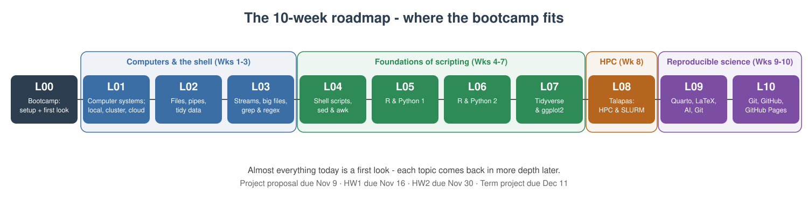
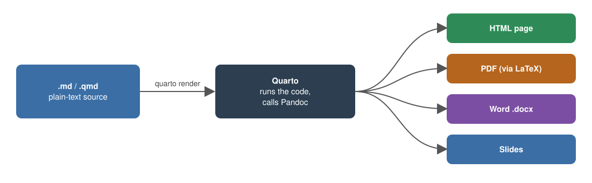

```{r}
#| label: setup
#| include: false

# Packages used in the lecture examples
library(tidyverse)
library(gt)
library(readxl)

# Consistent theme for all plots
theme_set(theme_minimal(base_size = 14))

# Reproducible random numbers
set.seed(2026)
```

## Welcome to the Bootcamp - Core Info

**Website**: https://wcresko.github.io/BioE_Comp_Tools_Fa2026/

::: {.callout-tip title="This is a practical morning - we will learn by doing"}
- By 1:00pm every one of you should have a **working computational toolkit** on your own laptop
- You should know **where UO keeps your files and software**
- You should be able to **move around your computer from the command line**
- And you should be able to **write and render a Markdown document**
:::

::: callout-note
**If you fall behind today, that's fine.**

- Everything here is in the course book (Chapters 1-5), the slides stay online

- Get the installs working; the rest can be re-read

- And take the term-long course and learn everything in more detail!
:::

## Welcome to the Bootcamp - Book Readings

- [Ch. 1: Introduction to Computational Tools](../book/chapters/01-introduction.html)
- [Ch. 2: Your Computational Toolkit](../book/chapters/02-your-toolkit.html)
- [Ch. 3: Computing Resources at UO](../book/chapters/03-computing-at-uo.html)
- [Ch. 4: Unix Fundamentals](../book/chapters/04-unix-fundamentals.html)
- [Ch. 5: Reproducible Documents with Quarto](../book/chapters/05-quarto-documents.html)
- *Reference:* [App. A: Keyboard Shortcuts Reference](../book/chapters/appendix-A-shortcuts.html)

## Class Introductions

::: {.callout-tip title="Who are you?"}
- Your name
- Your home lab or rotation lab
- What kind of computer are you using today (Mac, Windows, Linux)?
- What has your experience with programming been like?
:::

## Before we start - is your laptop ready?

- **RAM:** at least 8 GB (16 GB recommended)
- **Free disk space:** at least **20 GB** - we'll install several GB of software today
- **Operating system:** an up-to-date macOS, Windows 10/11, or Linux
- **Administrator rights** to install software (a lab- or department-managed laptop may need IT's help)
- **Chromebooks and iPads won't work** for this course
- **Plug in** - installs drain batteries

::: callout-note
Don't have a suitable laptop? Talk to me today - we'll find a solution.
:::

## Plan for the morning

| Time | Block | Install along the way |
|-------------------|----------------------------------|--------------------|
| 9:00 - 9:50 | **Part 1** - Why computing? UO's computational infrastructure; your IDE | **Positron**; start WSL (Windows) / Xcode tools (Mac) |
| 9:50 - 10:00 | *Break* |  |
| 10:00 - 10:50 | **Part 2** - Unix and the shell, in Positron's terminal | Finish Ubuntu (Windows) |
| 10:50 - 11:00 | *Break* |  |
| 11:00 - 11:50 | **Part 3** - Scripting languages: R and Python | R, Python |
| 11:50 - 12:00 | *Break* |  |
| 12:00 - 1:00 | **Part 4** - Markdown and rendering with Quarto | (nothing new - Quarto ships with Positron) |

::: callout-tip
- Installs are **spread through the morning** so downloads can run while we talk.

- Work with your neighbors - if you finish early, help someone else!
:::

## The full term BioE610 course at a glance

**By the end of the term you will be able to**

- Set up and use a **computational toolkit**: shell, R, Python, Quarto, Git, and an IDE
- Work at the **Unix command line**: paths, files, pipes, `grep`, and large data files
- Write **scripts** in bash, R and Python, wrangle data frames, and make publication-quality figures
- Run big jobs on UO's cluster **Talapas** with Slurm
- Practice **reproducible science**: Quarto and LaTeX documents, responsible use of AI assistants, Git and GitHub

{fig-align="center" width="100%"}

## Why computational literacy matters

::: incremental
- Modern bioengineering generates **data at scale**:

  - imaging
  - sequencing
  - simulations
  - sensors
  - device logs

- The lab generates the data and then **the computer turns it into results**

- Every analytical decision - filtering, normalizing, plotting, testing - is **a line of code**

- **Reproducibility** requires that every step is recorded, versioned, and re-runnable
:::

::: callout-tip
You do not need to become a software engineer. You need to know your tools well enough to use them confidently and understand what they are doing.
:::

## The computational stack for this course

::: incremental
- **Hardware** - your laptop now; UO's HPC cluster **Talapas** later in the term
- **Operating system** - macOS, Linux, or Windows (with WSL) - all speaking the same Unix shell
- **Institutional services** - Microsoft 365, Dropbox, site-licensed software
- **Command line** - navigate, move data, run scripts, chain tools together
- **Languages** - **R** and **Python** for analysis
- **IDEs** - **VS Code**, **Positron** (and **RStudio**) to write and run code
- **Markdown / Quarto / LaTeX** - prose + code + math + figures in one reproducible document
:::

# Part 1 - Why Scripting? {background-color="#2c3e50"}

## Why script instead of point-and-click?

::: incremental
- **Reproducibility** - a script is an exact, re-runnable record of what you did (your lab notebook for data)
- **Scale** - the same command works on 1 file or 10,000 files
- **Automation** - rerun the whole analysis when new data arrive, with one command
- **Fewer errors** - no mis-clicks, no copy-paste slips, no forgotten steps
- **Sharing** - collaborators, reviewers, and future-you can see and rerun every step
- **Access** - many scientific tools *only* run from the command line, and clusters like Talapas have no mouse
:::

::: callout-tip
- Imagine renaming 500 microscope images, or re-making 12 figures after a reviewer asks for a different normalization.

- By hand: an afternoon. With a script: seconds.
:::

## Scripting helps you not make mistakes

::: incremental
- Spreadsheets "helpfully" auto-convert text:
  - gene **SEPT2** becomes the date **2-Sep**,
  - gene **MARCH1** becomes **1-Mar**
- A 2016 survey found gene-name errors in the supplementary Excel files of **about 1 in 5** genomics papers that shared gene lists (Ziemann, Eren & El-Osta, *Genome Biology*)
- The problem was so persistent that in 2020 the official gene nomenclature committee **renamed the genes** (SEPT2 → *SEPTIN2*, MARCH1 → *MARCHF1*)
:::

::: callout-important
**The lessons:**

- keep raw data in **plain-text** files (CSV/TSV)
- never "fix" data by hand in a spreadsheet
- and let **scripts** do the transformations so every step is recorded.
- Much more on tidy data in **Lecture 02**.
:::

## Scripting helps you work faster

::::: columns
::: {.column width="50%"}
**Shell (Lecture 04)** - rename 500 images at once

``` bash
for f in IMG_*.tif; do
  mv "$f" "scaffold_day3_${f#IMG_}"
done
```

Count the lines in every data file:

``` bash
for f in data/raw/*.csv; do
  echo "$f: $(wc -l < "$f") lines"
done
```
:::

::: {.column width="50%"}
**R (Lecture 05)** - summarize every file

``` r
files <- list.files("data/raw",
                    pattern = "\\.csv$",
                    full.names = TRUE)
for (f in files) {
  d <- read.csv(f)
  cat(f, "mean stiffness:",
      mean(d$stiffness), "\n")
}
```
:::
:::::

::: callout-note
Different languages, same idea: **describe the task once, let the computer repeat it**.
:::

## Languages you'll meet as a bioengineer

| Language | What it's great for | In this course |
|------------------------|------------------------|------------------------|
| **Bash** (the shell) | Moving and inspecting files, running programs, gluing tools together, clusters | Today and Lectures 01 - 04, 08 |
| **R** | Statistics, data wrangling, publication-quality figures, Bioconductor genomics | Today and Lectures 05-07 |
| **Python** | General programming, image analysis, machine learning, instrument control | Today and Lectures 05-07 |
| **MATLAB** | Signal processing, modeling, many engineering labs (UO site license) | \- |
| **Markdown / LaTeX** | Writing documents, reports, slides, and equations | Today and Lecture 09 |

::: callout-tip
**Learn one well, and the next is much easier.**

- The concepts - variables, loops, functions, files - transfer between languages.

- And like a spoken language: use it or lose it!
:::

# UO's Computational Infrastructure {background-color="#2c3e50"}

## The three parts of a computer that matter most

- **CPU** - does the processing
  - Made of **cores** (independent workers) running at some clock speed (GHz)
  - More cores = more tasks at once (if the software is written to use them)
- **RAM** - fast, *volatile* working memory. Your data must fit here while you analyze it. **Lost when power is off.**
- **Disk** - slower, *persistent* storage (SSD or hard drive). Where your files live.

::: callout-tip
- The most common bottleneck for data analysis is **RAM**.

- "Out of memory" usually means *get more RAM or move to the cluster*, not "get a faster CPU."

- More on this in **Lecture 01**.
:::

## Where can computation happen?

::: panel-tabset
### Local

{fig-align="center" width="60%"}

Your **laptop or lab workstation**:

- fast to start, fully under your control

- but limited RAM, storage, and uptime.

### Cluster

{fig-align="center" width="61%"}

Many computers (**nodes**) working together, shared by many users through a scheduler - this is **Talapas**.

### Cloud

{fig-align="center" width="60%"}

Rented computing (AWS, Azure, Google Cloud): scales up on demand, pay by the hour.
:::

## Your laptop vs. Talapas - the short version

|               | Typical laptop | One Talapas node        | All of Talapas |
|---------------|----------------|-------------------------|----------------|
| **CPU cores** | 8 - 12         | **128**                 | **14,500+**    |
| **RAM**       | 8 - 16 GB      | **512 GB** (up to 4 TB) | **\~129 TB**   |
| **Storage**   | 0.5 - 1 TB     | shared                  | **\~3 PB**     |

::: incremental
- One node has roughly **30x the RAM** and **10x the cores** of your laptop - and Talapas has *hundreds* of nodes, plus **89 GPUs**
- When an analysis says "out of memory" or would take days on your laptop - that's a job for Talapas (Week 8)
- Full specs and the storage you get (250 GB home, 2 TB lab project space) are in the book, [Chapter 3](../book/chapters/03-computing-at-uo.html#sec-your-laptop-vs-talapas)
:::

## Research Advanced Computing Services (RACS)

**RACS** runs Talapas and helps UO researchers with computing of all kinds - <https://racs.uoregon.edu>

::: {}
- **Talapas HPC cluster** - CPU, GPU, and large-memory nodes, 225+ scientific software packages
- **Research data storage** - large-scale storage (about \$35/TB/year) beyond what Talapas includes
- **Globus** - fast, reliable transfer of very large datasets (e.g. from a sequencing core or collaborator)
- **Consulting** - software installs, optimizing code, data security, choosing hardware
- **Grant support** - help writing the computing and data-management parts of proposals
- **Beyond UO** - access to national supercomputers (NSF ACCESS) and cloud (AWS, Azure) consulting
:::

::: callout-tip
Contact: **racs\@uoregon.edu** or the [RACS service desk](https://hpcrcf.atlassian.net/servicedesk/customer/portal/1). They are there to help - ask early!
:::

## Getting on Talapas - and Open OnDemand

**Getting an account**

- Every Talapas user belongs to at least one **PIRG** (Principal Investigator Research Group) - your PI is responsible for it
- **Ask your PI (or rotation PI) to add you** - setup can take a few days, so do it early. The request form is at <https://racs.uoregon.edu/request-access>
- For this course, we'll arrange class access through CBDS before Lecture 08
- Documentation: [Talapas Knowledge Base](https://uoracs.github.io/talapas2-knowledge-base/)

## Getting on Talapas - and Open OnDemand

- Go to <https://ondemand.talapas.uoregon.edu> and log in with your **Duck ID** (Chrome or Firefox; a private window avoids login glitches)
- **Jupyter Lab** notebooks running on Talapas
- A full **remote desktop** with RStudio Server, **MATLAB**, and Stata
- A **shell** in the browser
- A **file explorer** - drag-and-drop files between your laptop and Talapas
- A **job composer** for submitting jobs

::: callout-note
OnDemand apps run as jobs on compute nodes - they **keep running even if you close your browser**, so remember to end sessions you no longer need. Command-line access (SSH) and job scheduling come in **Lecture 08**.
:::

## Your UO digital identity

- **Duck ID** - your UO username and password; it is the key to almost everything today
  - Manage it at <https://duckid.uoregon.edu>
- **Two-step login (Duo)** - required for most UO services; set it up on your phone *before* you need it
- **UO email** (`you@uoregon.edu`) - also your sign-in name for Microsoft 365 and Dropbox
- **UO VPN (Cisco Secure Client)** - only needed off-campus for campus-restricted resources (some library databases, departmental file shares, some licensed software)
  - Download from <https://uovpn.uoregon.edu>

::: callout-note
Most UO services - email, Canvas, Microsoft 365, Teams, Zoom - work from anywhere **without** the VPN.
:::

## Where to get help at UO

- **UO Service Portal** - <https://service.uoregon.edu> - knowledge base and help tickets for everything in this section
- **Technology Service Desk** - phone 541-346-4357 or live chat
- **UO Libraries Data Services** - <https://library.uoregon.edu/data-services>
  - **Free workshops** on R, Python, data analysis, and more
  - **One-on-one consultations** (in person or Zoom): statistics, R, Python, version control, data management plans
  - **Drop-in help desk** in Knight Library, Monday - Friday, 11am - 4pm
- **RACS** - Talapas and research computing - racs\@uoregon.edu
- **CBDS** - the Center for Biomedical Data Science at the Knight Campus: data-science workshops and consulting for Knight Campus researchers - ask me

::: callout-tip
When something doesn't work, search the Service Portal knowledge base first - most questions already have an article.
:::

## Where your files live at UO

Every UO student and employee has a **Microsoft 365 A5** license (sign in at <https://office.uoregon.edu> with your UO email):

::: incremental
- **OneDrive - 1 TB for everyone.**
  - The sync app puts a `OneDrive` folder on your laptop
  - approved for **FERPA and HIPAA** data.
  - It belongs to *you* - lab data should live in shared storage so it doesn't leave when you do
- **Teams / SharePoint** - group-owned files and chat for labs;
- **Outlook** (100 GB mailbox);
- **Microsoft** Word, Excel, PowerPoint on your own devices
- **Copilot Chat** - a UO-protected generative AI assistant when signed in with your UO account
- **UO Dropbox (2 TB)** - faculty, staff and **graduate employees (GEs)** only; students who aren't UO employees lost access in March 2026. Approved for green/amber data (incl. FERPA), **not** HIPAA. Your lab may share a Dropbox team folder with you
:::

::: callout-tip
Synced folders (OneDrive, Dropbox) are great for documents. **Large or rapidly-changing analysis files** are better on local disk or Talapas - and a synced folder is *not* a backup (next slides). Details: [Chapter 3](../book/chapters/03-computing-at-uo.html#sec-microsoft-365).
:::

## Software UO licenses for you

UO pays for a lot of software you can install for free - sign in with your **Duck ID**:

| Where | What you get |
|-------------------------|-----------------------------------------------|
| <https://office.uoregon.edu> | **Microsoft 365**: Word, Excel, PowerPoint, OneNote, Outlook, Teams - desktop, web and mobile apps on your own devices, plus OneDrive (1 TB) |
| <https://software.uoregon.edu> | **UO Software Downloads**: MATLAB, Mathematica, LabVIEW, SPSS, ArcGIS and more (some need a license code or the UO VPN to activate) |
| <https://copilot.microsoft.com> | **Copilot Chat** - UO-protected generative AI when signed in with your UO account |
| <https://uoregon.zoom.us> | **Zoom** with your UO login |
| [Adobe at UO](https://service.uoregon.edu/TDClient/2030/Portal/KB/ArticleDet?ID=85434) | **Adobe Express** on personal devices for students; the full Creative Cloud suite in campus computer labs (faculty, staff and GEs have separate access) |

::: callout-note
Availability differs a little between students and employees - the Software Downloads site shows the current list. UO-managed computers install approved software through the **Software Center** app instead. Everything at the center of *this* course (shell, R, Python, Positron, Quarto, Git) is free and open source and needs no license at all.
:::

## Data classification - and protecting research data

UO classifies data by risk. **Know the class of your data before you choose where to put it.**

| Class | Examples | OK in |
|------------------|----------------------------------|--------------------|
| **Green** (low) | Published data, your code, most de-identified research data | Almost anywhere, including AI tools |
| **Amber** (medium) | FERPA student records, unpublished research data | OneDrive, Dropbox, Teams/SharePoint |
| **Red** (high) | HIPAA / protected health information, IRB human-subjects data, SSNs | Only approved systems (e.g., OneDrive for HIPAA; **not** Dropbox) - ask first! |

::: callout-important
When in doubt, **ask before you store or share** - your PI, the IRB, or the UO Service Portal. It is much easier than fixing a data breach.
:::

## Back up your work: the 3-2-1 rule

::::: columns
::: {.column width="45%"}
**3** copies of anything important

**2** different kinds of storage

**1** copy off-site (i.e., in the cloud)
:::

::: {.column width="55%"}
**For example:**

- Your laptop (working copy)
- An external drive with **Time Machine** (Mac) or **File History** (Windows)
- **OneDrive** or your lab's Dropbox/server (off-site)
- **Code** on **GitHub** (Lectures 09 - 10) - every commit is a backup
:::
:::::

::: callout-warning
A **synced folder is not a backup by itself** - if you delete or overwrite a file, the change syncs everywhere. Keep versioned backups, and **test that you can restore** a file before you need to. Every year, someone loses a thesis chapter to a dead laptop or a stolen backpack.
:::

## Choosing where to store your work

| Storage | Best for | Revisited |
|------------------|------------------------------------|------------------|
| Your laptop's disk | Active work - fast, but **not backed up** by itself | Lec 01 |
| OneDrive | Personal documents, drafts, backups | \- |
| Dropbox (if eligible) | Lab-shared folders, collaboration | \- |
| Teams / SharePoint | Group-owned documents | \- |
| **GitHub** | **Code** and small text files, with full version history | Lec 09-10 |
| **Talapas** | Large datasets and heavy computation | Lec 08 |

::: callout-tip
Rule of thumb: **code → GitHub, documents → OneDrive/Dropbox, big data → Talapas.** And always keep your raw data somewhere backed up and untouched.
:::

## Generative AI at UO

- **Microsoft Copilot Chat** - sign in with your **UO account** for a UO-protected AI assistant (<https://copilot.microsoft.com>)
- UO-supported AI tools are approved for specific **data classifications**; unsupported tools are approved for **green (low-risk) data only** - see UO's [AI Service Offerings](https://service.uoregon.edu/TDClient/2030/Portal/KB/Article/140911/AI-Service-Offerings)
- **Course policy** (see the [Policies](../Policies.qmd) page): you *may* use AI to help you learn, debug, and get suggestions - but the work you submit must be **your own**
- AI assistants are great at explaining error messages and suggesting code - and **confidently wrong** surprisingly often. Always read, run, and understand the code

::: callout-note
We'll look at AI coding assistants ("vibe coding") in depth in **Lecture 09**.
:::

# Let's get coding!

## What is an IDE?

::: incremental
- An **Integrated Development Environment** bundles an **editor**, a **terminal**, a **console**, and tools like **version control** in one window
- Plain text editors (`nano`, `vim`) are fine for quick edits but don't scale to real projects
- A good IDE:
  - shows your **whole project** at once
  - **color-codes** your code (syntax highlighting) and catches mistakes early
  - lets you **run code** right where you write it
- You'll spend *hours* in your IDE - a small upfront investment pays back every day
:::

## The minimum viable toolkit - install these today

| Install **today** | Why |
|--------------------------|----------------------------------------------|
| **Positron** (now) | The IDE we use in class - its built-in **terminal** is where we do Part 2; **Quarto is bundled** |
| A **Unix shell** (Part 2) | Built in on macOS/Linux; WSL + Ubuntu on Windows |
| **R** and **Python** (Part 3) | The two languages we script in; Positron finds them when you restart it |

::: callout-important
**In class I will demo Positron.** 

- Everything also works in VS Code (same editor underneath) and, for R, in RStudio - use them if you prefer, but if you are new to all of this, follow along in Positron.
- The [Software](../Software.html) page has full instructions for every tool.

:::

| Install **later, when we need it** | When |
|-----------------------------------|-------------------------------------|
| **TinyTeX** (small LaTeX, for PDFs) | Week 9 - Quarto, LaTeX and PDF output |
| **Git** + a GitHub account | Weeks 9-10 (Macs already have Git from the Xcode tools) |
| **VS Code**, **RStudio** | Optional alternatives to Positron - any time you like |


## Installing Positron

::: incremental
- **Positron** is a free, next-generation data-science IDE from **Posit** (the makers of RStudio)
- Download from <https://positron.posit.co/download>
- We install **R and Python in Part 3**; Positron finds them when you restart it, and lets you switch between them
- Positron **includes Quarto** and the Quarto extension - nothing extra to install for Markdown and rendering
- Open Positron, then open the **terminal** with **Ctrl-\`** (backtick) - that is the shell we use in Part 2
- Later: **File → Open Folder** on your project, and an **R**/**Python** console from the interpreter picker at the top right
:::

::: callout-note
If you've used **RStudio** before - it's still a great R IDE, and we'll see it alongside Positron in Lecture 05. Positron brings the RStudio-style data-science panes to a VS Code-style editor, for both R and Python.
:::

## The Positron layout

- **Explorer** (file tree for your open folder), **editor** tabs, an integrated **terminal** (toggle with **Ctrl-\`**), and the **Command Palette** (`Cmd/Ctrl-Shift-P` - find *any* command by typing)
- Plus data-science panes:
  - **Console** - an interactive R or Python session
  - **Variables** - every object you've created
  - **Plots** - your figures, with history
  - **Data Explorer** - a spreadsheet-style view of data frames
  - **Help** - documentation for functions

::: callout-tip
Always use **File → Open Folder** on your whole project, not a single file - the terminal and console then start in that folder. Write code in the **editor** (so it's saved in a file) and send lines to the **console** with `Cmd/Ctrl-Enter`.
:::

## Keyboard shortcuts worth memorizing

| Action               | macOS             | Windows / Linux     |
|----------------------|-------------------|---------------------|
| Command Palette      | `Cmd-Shift-P`     | `Ctrl-Shift-P`      |
| Toggle terminal      | **Ctrl-\`**       | **Ctrl-\`**         |
| Send line to console | `Cmd-Enter`       | `Ctrl-Enter`        |
| Toggle comment       | `Cmd-/`           | `Ctrl-/`            |
| Indent / un-indent   | `Cmd-]` / `Cmd-[` | `Ctrl-]` / `Ctrl-[` |
| Find in file         | `Cmd-F`           | `Ctrl-F`            |
| Search whole project | `Cmd-Shift-F`     | `Ctrl-Shift-F`      |
| Save                 | `Cmd-S`           | `Ctrl-S`            |

::: callout-tip
The backtick (\`) is usually on the key above **Tab** - *not* the apostrophe. These shortcuts are identical in Positron and VS Code.
:::

## Positron vs. VS Code - which should I use?

**The same:** 

- Positron is built on **Code OSS**, the open-source core of VS Code
- same editor, Command Palette, terminal, shortcuts and settings; 
- both free, cross-platform, extensible, render Quarto, and connect over SSH.

**Different:** 

- Positron is built *for data science*
- R and Python built in, with Console, Variables, Plots and Data Explorer panes. 
- VS Code is general-purpose with the biggest extension library. 

**RStudio** is Posit's classic R-only IDE.


## AI assistants inside your editor

::: incremental
- **GitHub Copilot** in VS Code - suggests code as you type and answers questions in a chat panel (free for verified students through the GitHub Student Developer Pack)
- **Positron Assistant** - an AI chat built into Positron that can see your console, variables, and plots
- Both are useful for explaining errors, writing boilerplate, and learning unfamiliar syntax
- Both can be **confidently wrong** - read and test everything, and never paste sensitive data
- Follow the course [AI policy](../Policies.qmd) and UO's data-classification rules
:::

::: callout-note
We'll try these (carefully!) in **Lecture 09** - no need to set them up today.
:::

## Checkpoint - Positron is ready

Two minutes, everyone, before the break:

1.  Open **Positron**
2.  Open the terminal: **Terminal → New Terminal**, or **Ctrl-\`** (the backtick key, above Tab)
3.  Type these and press Enter after each:

``` bash
echo hello          # the shell repeats what you typed
pwd                 # where am I? - your home directory
```

::: incremental
- You should see `hello` and a path like `/Users/you` or `/home/you` - that terminal is where all of Part 2 happens
- **Windows users:** for now this is PowerShell; after the break you will switch it to **Ubuntu (WSL)**
- Didn't work? Raise your hand now so I can help you fix it.
:::

## Start these installs now - they run over the break

::::: columns
::: {.column width="50%"}
**Windows users - start WSL now**

1.  Right-click **Windows PowerShell** → **Run as administrator**
2.  Type `wsl --install` and press Enter
3.  When it finishes, **restart** your computer **over the break**

We finish setting up Ubuntu at the start of Part 2.
:::

::: {.column width="50%"}
**Mac users - install the developer tools**

1.  Open Positron's terminal (**Ctrl-\`**) - or the macOS **Terminal** app
2.  Type:

``` bash
xcode-select --install
```

3.  Click **Install** in the pop-up and let it run

(If it says they're already installed, you're done!)
:::
:::::

# BREAK {background-color="#2c3e50"}

# Part 2 - Unix and the Shell {background-color="#2c3e50"}

## What is a shell?

::: incremental
- The **shell** is a program that takes typed commands and hands them to the operating system
- **`bash`** and **`zsh`** are the most common shells (macOS uses `zsh` by default; Ubuntu uses `bash`)
- You access the shell through a **terminal** window
- Why bother when there's a GUI?
  - **Scriptable** - record every step and re-run it with one command
  - **Composable** - chain small tools into powerful pipelines
  - **Scalable** - handles huge files and thousands of files at once
  - **Universal** - the same commands work on your laptop and on Talapas
:::

## Getting a shell - macOS and Linux

::: {.callout-note title="You already have one!"}
- **In Positron:** **Terminal → New Terminal**, or **Ctrl-\`** (backtick) - this is what we will use all morning
- **macOS** also has **Applications → Utilities → Terminal**; **Linux** has a Terminal app (often `Ctrl-Alt-T`) - same shell, different window
- Optional: a nicer standalone terminal such as **iTerm2** (macOS)
:::

``` bash
# Type this and press Enter
echo $SHELL      # which shell am I using?
whoami           # who am I?
```

::: callout-tip
Mac users: if the `xcode-select --install` you started a moment ago is still running, let it finish - you can use Terminal in the meantime.
:::

## Getting a shell - Windows (finish setting up WSL + Ubuntu)

::: callout-tip
Once Ubuntu is installed, Positron's terminal can open it directly: click the **▾** next to the **+** in the terminal panel and choose **Ubuntu (WSL)**.
:::

You started this before the break. If you haven't yet:

1.  Right-click **Windows PowerShell** → **Run as administrator**, type `wsl --install`, and **restart**

Then:

2.  Open **Ubuntu** from the Start menu; wait while it finishes installing
3.  Create a **Linux username and password** (they do *not* need to match your Windows login - but remember them!)
4.  When you type your password, **nothing appears on screen** - that's normal; just type it and press Enter

::: callout-note
`wsl --install` installs Ubuntu by default. Requires Windows 11 or an up-to-date Windows 10.
:::

## Windows - after Ubuntu is installed

``` bash
# Update Ubuntu's software (you'll be asked for your Linux password)
sudo apt update
sudo apt upgrade -y
```

- Your **Linux home** is `/home/yourname` - work here for speed
- Your **Windows drive** is visible from Ubuntu at `/mnt/c/`
  - e.g. `/mnt/c/Users/yourname/Documents`
- From Windows File Explorer, Ubuntu files appear under **Linux** in the sidebar
- Tip: install **Windows Terminal** from the Microsoft Store for a nicer terminal with tabs


## Windows: which side am I on?

With WSL you have **two operating systems** on one computer - it matters which one you're typing into.

|   | **Windows side** | **Ubuntu (WSL) side** |
|------------------|--------------------------|----------------------------|
| Terminal | PowerShell / Command Prompt | **Ubuntu** app, or Positron's "Ubuntu (WSL)" terminal |
| Prompt looks like | `PS C:\Users\you>` | `you@laptop:~$` |
| Your home folder | `C:\Users\you` | `/home/you` (`~`) |
| The *other* side's files | `\\wsl$\Ubuntu\home\you` | `/mnt/c/Users/you` |
| Unix commands (`ls`, `grep`...) | mostly **no** | **yes** |

::: callout-tip
**In this course:** type shell commands in **Ubuntu**. Install R, Python, and Positron on the **Windows** side (today). In VS Code, the green **WSL: Ubuntu** badge (bottom-left) tells you it is connected to Ubuntu.
:::

## The file system is a tree

{fig-align="center" width="75%"}

- Files live in a **tree** of directories (folders) starting at the **root**, `/`
- Your **home directory** (`~`) is your own branch of the tree

## Paths - addresses in the tree

::: incremental
- A **path** is the address of a file or directory
- **Absolute path** - starts at the root `/`, works from anywhere
  - `/Users/wcresko/projects/bootcamp/data/samples.csv` (macOS)
  - `/home/wcresko/projects/bootcamp/data/samples.csv` (Linux / WSL)
- **Relative path** - starts from where you are right now
  - `data/samples.csv`
  - `../scripts/analysis.R`
- Shortcuts:
  - `.` = the current directory
  - `..` = one level up (the parent)
  - `~` = your home directory
:::

{fig-align="center" width="70%"}

## Synced folders have paths too

Dropbox and OneDrive create **real folders** on your computer - so they have paths you can use from the shell:

``` bash
# macOS - examples (yours will look similar)
~/Library/CloudStorage/OneDrive-UniversityofOregon
~/University\ of\ Oregon\ Dropbox/Your\ Name

# Windows - the same folders seen from Ubuntu/WSL
/mnt/c/Users/yourname/OneDrive\ -\ University\ of\ Oregon
```

::: incremental
- Names like `University of Oregon Dropbox` contain **spaces** - the next slides show why that is trouble, and how to quote or escape them
- Your exact path may differ - find yours with `cd`, `ls`, and Tab completion
:::

## Anatomy of a shell command

{fig-align="center" width="80%"}

- **Prompt** - the shell is ready (often ends in `$` or `%`)
- **Command** - what to do
- **Options/flags** - change how it does it (e.g. `-l`)
- **Arguments** - what to do it to (e.g. a file or directory)

## Where am I? What's here?

``` bash
pwd                 # print working directory - the absolute path you're in
ls                  # list files & folders in the current directory
ls -F               # mark directories with /, executables with *
ls -l               # long format: permissions, owner, size, date
ls -la              # long format + hidden "dot" files (.zshrc, .config ...)
ls -lh              # human-readable file sizes (K, M, G)
```

## Moving around with `cd`

``` bash
cd ~                   # go home (~ is always your home directory)
cd                     # same thing - cd with no argument goes home
cd /                   # go to the root of the file system
cd ~/Documents         # absolute path (via ~) - works from anywhere
cd Documents           # relative path - only works if Documents is here
cd ..                  # up one level
cd ../..               # up two levels
cd -                   # back to where you just were
pwd                    # confirm where you landed
```

::: callout-tip
Press **Tab** to auto-complete file and directory names. Press it twice to see all the options. This saves typing *and* typos.
:::

## Time-savers and getting help

| Key / command | What it does |
|-----------------------|-------------------------------------------------|
| **Tab** | Auto-complete a file or directory name (press twice to see options) |
| **↑ / ↓** | Scroll back through commands you've already typed |
| `history` | List your recent commands |
| **Ctrl-C** | Stop the command that's running (your emergency exit) |
| **Ctrl-A / Ctrl-E** | Jump to the start / end of the line |
| `clear` or **Ctrl-L** | Clear the screen |
| **Copy / paste** | macOS: `Cmd-C` / `Cmd-V`. Windows & Linux terminals: `Ctrl-Shift-C` / `Ctrl-Shift-V` (plain `Ctrl-C` *stops* a command!) |

::: callout-tip
**Getting help:** `man ls` opens the manual page for `ls` (`q` quits, `/word` searches). Many commands also accept `--help`. And the internet - or a UO-supported AI assistant - is fine for "how do I...?" questions.
:::

## Spaces in names are trouble

``` bash
cd University of Oregon Dropbox        # FAILS - the shell sees 4 arguments
cd "University of Oregon Dropbox"      # works - quotes group the words
cd University\ of\ Oregon\ Dropbox     # works - backslash "escapes" each space
```

::: incremental
- The shell uses **spaces** to separate arguments
- So names with spaces must be **quoted** or **escaped**
- Tab completion adds the escapes for you
- Best solution: **don't put spaces in your own file and folder names**
:::

## Making and managing files and directories

``` bash
mkdir bootcamp                 # make a new directory
cd bootcamp
touch notes.txt                # create an empty file
cp notes.txt notes_backup.txt  # copy a file
mv notes.txt readme.txt        # rename (move within the same directory)
mkdir archive
mv notes_backup.txt archive/   # move a file into a subdirectory
ls -F                          # see the result
```

``` bash
rm archive/notes_backup.txt    # remove a file - NO UNDO
rmdir archive                  # remove an *empty* directory
# rm -r somedir                # remove a directory AND everything in it
```

::: callout-warning
`rm` has **no Trash**. `rm -r` is permanent and recursive - always double-check the path first.
:::

## Looking inside files

``` bash
cat readme.txt          # print a whole (small) file to the screen
head big_file.txt       # first 10 lines
head -n 3 big_file.txt  # first 3 lines
tail big_file.txt       # last 10 lines
wc -l big_file.txt      # count lines
less big_file.txt       # page through: SPACE = down, b = up, /word = search, q = quit
```

::: callout-warning
Never `cat` a huge file - a 3 GB sequence file will flood your terminal. Use `head`, `tail`, or `less`.
:::

## Hidden files and the special directories `.` and `..`

``` bash
ls -a
# .   ..   .zshrc   .gitignore   data   scripts
```

::: incremental
- Names that start with a **`.`** are **hidden** - usually settings files (`.zshrc`, `.bashrc`, `.gitignore`)
- Every directory contains two special entries:
  - **`.`** - this directory itself (e.g. `./myscript.sh` = "the script right here")
  - **`..`** - the parent directory, one level up
- So `cd ..` isn't magic - you're moving into the entry named `..`
:::

## Hidden files and the special directories `.` and `..`

{fig-align="center" width="70%"}

## Wildcards - one command, many files

``` bash
ls *.csv              # every file ending in .csv
ls sample_*           # everything starting with sample_
ls sample_0?.csv      # ? matches exactly one character
cp data/raw/*.csv backup/     # copy every CSV at once
```

| Pattern | Matches                                   |
|---------|-------------------------------------------|
| `*`     | Any number of characters (including none) |
| `?`     | Exactly one character                     |
| `[abc]` | Any one of the listed characters          |

::: callout-warning
The shell expands wildcards *before* running the command - `rm *.csv` deletes every CSV instantly. Run `ls *.csv` first to see what will be affected.
:::


# Good Habits From Day One {background-color="#2c3e50"}

## Organizing a project

``` bash
my_project/
├── data/
│   ├── raw/          # original data - never modify these!
│   └── processed/    # cleaned / intermediate data
├── scripts/          # .R, .py, .sh, .qmd files
├── output/
│   ├── figures/      # plots made by your scripts
│   └── tables/       # result tables
└── docs/             # notes, manuscripts, reports
```

::: incremental
- **`data/raw/` is read-only** - always read from it, never write to it
- **`output/` is expendable** - it can be regenerated from `scripts/` + `data/raw/`
- Use **relative paths** inside your scripts so the project is portable
:::

## Naming conventions that save headaches

::: incremental
- **No spaces** - use `_` or `-` (`cell_counts.csv`, not `cell counts.csv`)
- **No special characters** - avoid `& ? * / \ : ( ) ' "`
- **Be consistent with case** - Unix treats `Data.csv` and `data.csv` as *different* files
- **Dates as `YYYY-MM-DD`** so they sort correctly: `2026-09-24_plate_reader.csv`
- **Number scripts** to show their order: `01_clean.R`, `02_analyze.R`, `03_plot.R`
- **Descriptive, not "final"**: `figure2_v3_final_FINAL.png` is a cry for help (and for Git - Lectures 09-10)
:::

## Exercise - build a project directory

``` bash
cd ~
mkdir -p bootcamp/{data/{raw,processed},scripts,output/{figures,tables},docs}
cd bootcamp
ls -R            # list recursively
```

::: incremental
1.  Use `touch` to make `data/raw/samples.csv` and `scripts/01_explore.R`
2.  Use `pwd` in three different directories and write down the absolute paths
3.  From `output/figures`, use a **relative** path to list `data/raw`
4.  Find the path to your **OneDrive** (or Dropbox) folder and `cd` into it
:::

## A command-line reference card

| Task               | Command                      |
|--------------------|------------------------------|
| Where am I?        | `pwd`                        |
| What's here?       | `ls -lF`                     |
| Go somewhere       | `cd path`                    |
| Go home / up       | `cd ~` / `cd ..`             |
| Make a directory   | `mkdir name`                 |
| Make empty file    | `touch name`                 |
| Copy               | `cp src dst`                 |
| Move / rename      | `mv src dst`                 |
| Delete file        | `rm file`                    |
| Peek at a file     | `head` / `tail` / `less`     |
| Count lines        | `wc -l file`                 |
| Get help           | `man command`                |
| Many files at once | `*.csv`, `sample_?`          |
| Save output        | `cmd > file` / `cmd >> file` |
| Chain commands     | `cmd1 \| cmd2`               |

::: callout-note
Much more in Lectures 01 - 04: streams and error output, working with large files, `grep` and regular expressions, and writing shell scripts.
:::

# BREAK {background-color="#2c3e50"}

# Part 3 - Scripting Languages: R and Python {background-color="#2c3e50"}

## What kind of computer do I have?

Some installers (like R) come in different versions for different processors.

| System | How to check | You'll see |
|------------------|----------------------------------|--------------------|
| macOS | Apple menu → **About This Mac** | **Chip: Apple M1/M2/M3/M4** (Apple silicon) or **Processor: Intel** |
| Windows | **Settings → System → About** | Processor, RAM, "64-bit operating system" |
| Any Unix shell | `uname -m` | `arm64` (Apple silicon/ARM) or `x86_64` (Intel/AMD) |

::: callout-tip
Write down your chip type - the R installer for macOS comes in two flavors, and you need to pick the right one.
:::

## Install R and Python now

Start both downloads now - they can install while we look at how the two languages compare.

::::: columns
::: {.column width="50%"}
**R** - <https://cran.r-project.org>

- **macOS**: the `.pkg` that matches your chip (**arm64** for Apple silicon, **x86_64** for Intel)
- **Windows**: "base" → download and run the installer, then also install [**Rtools**](https://cran.r-project.org/bin/windows/Rtools/) matching your R version (so packages can compile)
- Accept the defaults

:::

::: {.column width="50%"}
**Python** - <https://www.python.org/downloads/>

- **macOS**: run the python.org installer
- **Windows**: **check "Add python.exe to PATH"** on the first screen!
- **Ubuntu/WSL**: Python is already there; add the extras:

``` bash
sudo apt install -y python3-pip python3-venv
```
:::
:::::

::: callout-note
**Windows users:** install R and Python on the **Windows** side (where Positron lives). We'll check that they work on the next slide.
:::

## Checkpoint: R and Python

**Quit and reopen Positron** so it sees the new installs, then open its terminal (**Ctrl-\`**) and run:

``` bash
R --version
python3 --version     # Windows PowerShell: try  py --version
```

::: incremental
- Each should print a version number - **not** "command not found"
- Didn't work? Quit and reopen Positron again (a terminal only sees programs installed before it opened)
- Now start an **R console** and a **Python console** from the interpreter picker at the top right of Positron
- Still stuck? See the **troubleshooting** slide in Part 4 - or raise your hand
:::

## A preview: Python environments

::: incremental
- Different projects need different package **versions**
- installing everything into one Python eventually breaks something
- An **environment** is an isolated set of packages for one project:
:::

``` bash
python3 -m venv .venv            # create an environment in this project folder
source .venv/bin/activate        # turn it on (Windows PowerShell: .venv\Scripts\activate)
pip install numpy pandas         # install packages into it
deactivate                       # turn it off
```

::: callout-note
- On Talapas you'll use **conda** environments (Lecture 08)
- `uv` is a fast modern alternative
- R has the same idea in the **renv** package
- Nothing to do today - just know the word "environment"
:::

## R and Python side by side: running code

Both languages work the same way - type into a **console** to experiment, or save commands in a **script** and run the whole file.

::: panel-tabset
### R

``` bash
R                          # interactive console  (quit with q())
Rscript hello.R            # run a script file, top to bottom
Rscript -e '2 + 2'         # one line, no file
```

```{r}
#| label: lec00-hello-r
#| echo: true
#| eval: true

# hello.R
x <- 2 + 2
print(x)
```

### Python

``` bash
python3                    # interactive console / REPL  (quit with exit() or Ctrl-D)
python3 hello.py           # run a script file, top to bottom
python3 -c 'print(2 + 2)'  # one line, no file
```

```{python}
#| label: lec00-hello-py
#| echo: true
#| eval: false

# hello.py
x = 2 + 2
print(x)
# 4
```
:::

::: callout-tip

- In **Positron** or **VS Code**, open the script, put the cursor on a line, and press `Cmd/Ctrl-Enter` to send it to the console
- same shortcut for both languages.
:::

## R and Python side by side: variables, vectors and a function

::: panel-tabset
### R

```{r}
#| label: lec00-basics-r
#| echo: true
#| eval: true

stiffness <- c(12.5, 14.1, 9.8, 11.2)   # a vector  (R counts from 1)
stiffness[1]                            # first value
mean(stiffness)

to_mpa <- function(kpa) {               # define a function
  kpa / 1000
}
to_mpa(stiffness)                       # works on the whole vector
```

### Python

```{python}
#| label: lec00-basics-py
#| echo: true
#| eval: false

stiffness = [12.5, 14.1, 9.8, 11.2]     # a list  (Python counts from 0)
stiffness[0]                            # first value
# 12.5
sum(stiffness) / len(stiffness)
# 11.9

def to_mpa(kpa):                        # define a function - note the : and indentation
    return kpa / 1000

[to_mpa(s) for s in stiffness]          # apply it to every value
# [0.0125, 0.0141, 0.0098, 0.0112]
```
:::

- `<-` vs `=`, `c()` vs `[ ]`, curly braces vs indentation - the **ideas** are identical
- For R-style whole-vector math in Python, use `numpy`: `np.array(stiffness) / 1000`

## R and Python side by side: reading a CSV and summarising it

If a file `samples.csv` has columns `sample`, `treatment`, `stiffness`. Read it and get the mean stiffness per treatment.

::: panel-tabset
### R (readr + dplyr)

```{r}
#| label: lec00-csv-r
#| echo: true
#| eval: false

library(tidyverse)

samples <- read_csv("data/raw/samples.csv")
samples |>
  group_by(treatment) |>
  summarise(n = n(), mean_stiffness = mean(stiffness))
```

### Python (pandas)

```{python}
#| label: lec00-csv-py
#| echo: true
#| eval: false

import pandas as pd

samples = pd.read_csv("data/raw/samples.csv")
(samples
   .groupby("treatment")
   .agg(n=("stiffness", "size"), mean_stiffness=("stiffness", "mean")))
#            n  mean_stiffness
# treatment
# control    4           11.90
# drug       4            8.45
```
:::

- A **data frame** (R) and a **DataFrame** (pandas) are the same idea: one row per sample, one column per variable
- R chains steps with the pipe `|>`; pandas chains **methods** with `.`

## R and Python side by side: installing packages

::: panel-tabset
### R

``` r
install.packages("tidyverse")   # download & install - once per computer (from CRAN)
library(tidyverse)              # load - in every script or session that uses it
```

- Genomics packages come from **Bioconductor**: `BiocManager::install("DESeq2")`
- Packages install into one shared library; `renv` can pin versions per project

### Python

``` bash
python3 -m venv .venv && source .venv/bin/activate   # make + activate a project environment
pip install pandas matplotlib                        # download & install - once per environment
# alternatives:  uv add pandas      conda install pandas
```

``` python
import pandas as pd             # load - in every script or session that uses it
```

- `pip` installs from **PyPI**; `conda` also installs compiled tools (bioconda); `uv` is a fast newer all-in-one
- Always install *inside* an environment - "which Python did that go into?" is the #1 Python headache
:::

::: callout-note
That's the whole tour for today. **Lectures 05-07** go deep on both languages - every example there is shown in R *and* Python.
:::

# BREAK {background-color="#2c3e50"}

# Part 4 - Markdown and Rendering with Quarto {background-color="#2c3e50"}

## Quarto - already installed with Positron

- **Quarto** turns Markdown + code into HTML pages, PDFs, Word documents, and slides - including these slides! 
- Positron ships with the Quarto CLI and extension, so check it works from Positron's terminal:

``` bash
quarto --version
quarto check          # reports what it found: R, Python, and (not yet) LaTeX
```

::: callout-note

- **PDF output needs LaTeX.** We will install **TinyTeX** (`quarto install tinytex`) in a few minutes)
- In **Week 9**, when we cover Quarto and LaTeX in depth. 
- Today we render to **HTML** only. 
- If you use VS Code or RStudio instead, install Quarto separately from <https://quarto.org/docs/get-started/> 
- RStudio also bundles it.
:::

## What is Markdown?

::: incremental
- A **lightweight markup language** - plain text with a few simple symbols for formatting
- Created to be **easy to read as plain text** and easy to convert to HTML
- Used everywhere: GitHub READMEs, Jupyter and Quarto notebooks, Slack, lab wikis, websites, **these slides**
- Plain text means it is **future-proof**, small, and works perfectly with Git
:::

::: callout-note
You write the plain-text **source**. A program then **renders** it into a formatted document.
:::

## Markdown basics

::::: columns
::: {.column width="55%"}
**You type**

```` markdown
# A big header
## A smaller header

Plain text, *italic*, **bold**, and `code`.

-   a bullet
    -   a sub-bullet
1.  a numbered item

[a link](https://quarto.org)


| Sample | Treatment | Cells |
|--------|-----------|-------|
| S1     | control   | 5200  |

```bash
ls -l data/
```
````
:::

::: {.column width="45%"}
**You get**

- **Headers** of different sizes
- Text that is *italic*, **bold**, or `code`
- Bulleted and numbered lists
- Clickable links and images
- A table:

| Sample | Treatment | Cells |
|--------|-----------|-------|
| S1     | control   | 5200  |

- A **code block** - three back-ticks start and end it; add a language name for syntax highlighting
:::
:::::

## Rendering - from source to document

{fig-align="center" width="85%"}

::: incremental
- **Rendering** converts your source into a finished document
- One source → **many output formats**
- **PDF** output goes through **LaTeX** - we install TinyTeX for that in Week 9
:::

## Exercise - your first Markdown document

1.  In Positron, **File → Open Folder** on your `bootcamp` folder
2.  Create `docs/hello.md` and type:

``` markdown
# Hello, Bootcamp

My name is **your name** and I work in the *your lab* lab.

## Things I installed today

-   R
-   Python
-   Quarto
```

3.  Preview it: `Cmd/Ctrl-Shift-V` opens the Markdown preview
4.  Render it from the terminal:

``` bash
cd ~/bootcamp/docs
quarto render hello.md --to html
ls            # what new file appeared?
```

## What is Quarto Markdown (`.qmd`)?

::: incremental
- A `.qmd` file is Markdown **plus**:
  - a **YAML header** at the top that controls document settings
  - **code chunks** in R, Python, bash, and more that **run when you render**
- The output - tables, figures, numbers - is woven into the document
- This is **literate programming**: the document *is* the analysis
:::

## Anatomy of a `.qmd` file

```` markdown
---
title: "My first Quarto document"
author: "Your Name"
format: html
---

## Introduction

This document mixes text and code.

```{{r}}
x <- c(4, 8, 15, 16, 23, 42)
mean(x)
```

```{{python}}
print("Hello from Python!")
```
````

- **YAML header** between the `---` lines
- **Markdown** prose
- **Code chunks** marked with three backticks followed by `{r}` or `{python}`

## Exercise - render a Quarto document

1.  Create `docs/first.qmd` with the content from the previous slide
2.  Render it to HTML:

``` bash
quarto render first.qmd
```

3.  Or click **Preview** in Positron (`Cmd/Ctrl-Shift-K`)
4.  Try `quarto render first.qmd --to docx` - a Word document from the same source

(PDF output needs LaTeX, which we install in Week 9 - `--to pdf` will fail today, and that's expected.)

::: callout-note
The R chunk needs R and the Python chunk needs Python. If the Python chunk fails, `python3 -m pip install jupyter` usually fixes it - Quarto uses Jupyter to run Python.
:::

## A taste of LaTeX math in Markdown

Put LaTeX between dollar signs:

``` markdown
Inline: the mean is $\bar{x} = \frac{1}{n}\sum_{i=1}^{n} x_i$

Display:
$$
\sigma^2 = \frac{1}{n-1}\sum_{i=1}^{n}(x_i - \bar{x})^2
$$
```

Inline: the mean is $\bar{x} = \frac{1}{n}\sum_{i=1}^{n} x_i$

$$\sigma^2 = \frac{1}{n-1}\sum_{i=1}^{n}(x_i - \bar{x})^2$$

::: callout-tip
Much more on Quarto, chunk options, and LaTeX math in **Lecture 09**.
:::

## Jupyter notebooks vs. Quarto documents

::::: columns
::: {.column width="50%"}
**Jupyter notebook (`.ipynb`)**

- Cells of code + Markdown, with output saved **inside** the file
- Very popular for **Python**, machine learning, image analysis
- Runs in JupyterLab, VS Code, Positron - and on Talapas via **Open OnDemand**
- Stored as JSON - hard to read and diff in Git
:::

::: {.column width="50%"}
**Quarto document (`.qmd`)**

- **Plain text** - easy to read, edit, and track with Git
- Runs **R, Python, Julia, and Bash**
- Renders to HTML, PDF, Word, slides, websites
- Output is regenerated every time you render
:::
:::::

::: callout-tip

- You don't have to choose: Quarto can **render Jupyter notebooks** too (`quarto render notebook.ipynb`). 
- This course uses Quarto; many of your labs may use Jupyter. 
- Either way this is **literate programming**: re-render to re-run everything from raw data to final figure, every figure comes with the code that made it, and your reasoning lives next to your results
- These are an **electronic lab notebook for your analyses**.
:::

## Checkpoint - does everything work?

You checked the shell in Part 1 and R and Python in Part 3. Two more, in Positron's terminal:

``` bash
quarto --version
quarto check          # checks for R and Python (LaTeX comes in Week 9)
```

::: incremental
- Both should print versions / a list of passing checks - **not** "command not found"
- Render `docs/first.qmd` one more time and open the HTML it made
- Still stuck? The next slide has common fixes
:::

## Troubleshooting installs

| Symptom | Likely cause | Try this |
|------------------------|------------------------|------------------------|
| `command not found` | Program not on your **PATH**, or terminal opened before install | Close and reopen the terminal (or quit and reopen Positron) |
| Windows: `python` opens the Microsoft Store | The "app execution alias" is intercepting it | Use `py`, or reinstall Python with **Add to PATH** checked |
| "Permission denied" | Need admin rights, or file isn't executable | Run installer as administrator; on Unix use `sudo` only when told to |
| Installer fails / "disk full" | Not enough free space | Check with `df -h ~`; free up at least 20 GB |
| Mac: "cannot be opened because the developer cannot be verified" | Gatekeeper security | Right-click the app → **Open**, or System Settings → Privacy & Security |
| Download is crawling | 20 people on the same Wi-Fi | Pair up, or finish this one at home tonight |

::: callout-tip
Still stuck? Copy the **exact error message** and raise your hand - see "How to ask for help" from Part 1.
:::

# Wrap-up {background-color="#2c3e50"}

## What to remember from today

::: incremental
- **Scripts beat clicks** for reproducibility, scale, and fewer errors
- **Talapas** = hundreds of nodes, each far bigger than your laptop; 
    - **RACS** helps
    - **Open OnDemand** gets you in through a browser
- **Duck ID + Duo** unlock UO services; **OneDrive (1 TB)** for everyone, **Dropbox** for faculty/staff/GEs; know your **data classification** and follow **3-2-1** backups
- **Help:** Service Portal, Libraries Data Services, RACS, CBDS - and ask good questions; site-licensed software (MATLAB etc.) is at <https://software.uoregon.edu>
- **Paths**: absolute (from `/`) vs relative (from here); `pwd`, `ls`, `cd`, `mkdir`, `cp`, `mv`, `rm`; wildcards, `>`, `|`
- **Toolkit**: shell, R, Python, Positron (with Quarto built in); TinyTeX, Git and VS Code/RStudio come later
- **Markdown** is plain text; **Quarto renders** it (with code!) into HTML, PDF, and more
:::

