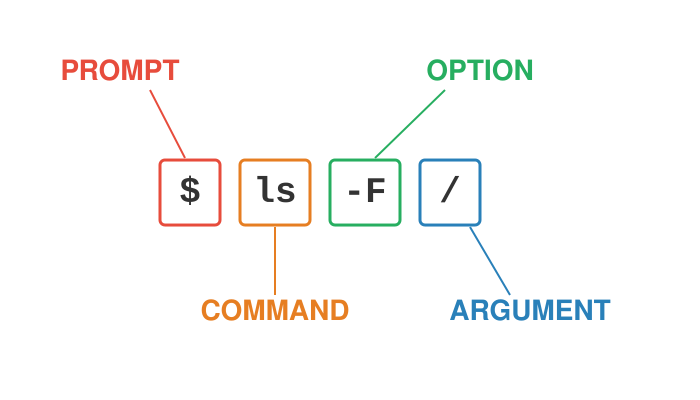
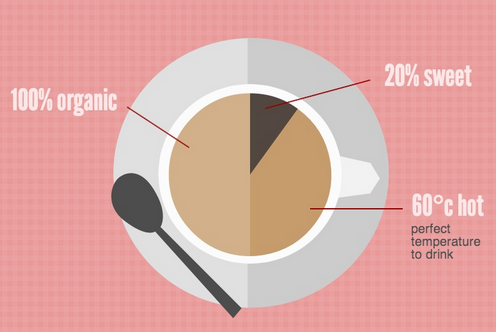

```{r}
#| label: setup
#| include: false

# Packages used in the lecture examples
library(tidyverse)
library(gt)
library(readxl)

# Consistent theme for all plots
theme_set(theme_minimal(base_size = 14))

# Reproducible random numbers
set.seed(2026)
```

## Welcome to the Bootcamp

::: {.callout-tip title="This is a practical morning - we will learn by doing"}
-   By 1:00pm every one of you should have a **working computational toolkit** on your own laptop
-   You should know **where UO keeps your files and software**
-   You should be able to **move around your computer from the command line**
-   And you should be able to **write and render a Markdown document**
:::

## Class Introductions

::: {.callout-tip title="Who are you?"}
-   Your name
-   Your home lab or rotation lab
-   What kind of computer are you using today (Mac, Windows, Linux)?
-   What has your experience with programming been like?
:::

## Plan for the morning

| Time          | Block                                             |
|---------------|---------------------------------------------------|
| 9:00 - 9:50   | **Part 1** - The UO computing ecosystem           |
| 9:50 - 10:00  | *Break*                                           |
| 10:00 - 10:50 | **Part 2** - Your computer, the shell, and paths  |
| 10:50 - 11:00 | *Break*                                           |
| 11:00 - 11:50 | **Part 3** - Installing your toolkit              |
| 11:50 - 12:00 | *Break*                                           |
| 12:00 - 1:00  | **Part 4** - Markdown and rendering               |

## Where the bootcamp fits

Today is a **first pass**. Almost everything we touch will come back in more depth:

| Today's topic                          | Revisited in                              |
|----------------------------------------|-------------------------------------------|
| Computers, operating systems, storage  | Lecture 01 - 02                           |
| The shell and paths                    | Lecture 02 - 03                           |
| Files, pipes, streams, large data      | Lecture 03 - 05                           |
| Scripting                              | Lecture 06 (shell), Lecture 07 (R)        |
| IDEs (VS Code, Positron, RStudio)      | Lecture 06 - 07                           |
| Markdown, Quarto, LaTeX                | Lecture 08                                |
| Git, GitHub, GitHub Pages              | Lecture 08 - 09                           |
| Talapas (UO's supercomputer)           | Lecture 10                                |

## Why computational literacy matters

::: incremental
-   Modern bioengineering generates **data at scale**: imaging, sequencing, simulations, sensors, device logs
-   The lab generates the data; **the computer turns it into results**
-   Every analytical decision - filtering, normalizing, plotting, testing - is **a line of code**
-   **Reproducibility** requires that every step is recorded, versioned, and re-runnable
:::

::: callout-tip
You do not need to become a software engineer. You need to know your tools well enough to use them confidently and understand what they are doing.
:::

## The computational stack for this course

::: incremental
-   **Hardware** - your laptop now; UO's HPC cluster **Talapas** later in the term
-   **Operating system** - macOS, Linux, or Windows (with WSL) - all speaking the same Unix shell
-   **Command line** - navigate, move data, run scripts, chain tools together
-   **Languages** - **R** and **Python** for analysis
-   **IDEs** - **VS Code** and **Positron** to write and run code
-   **Markdown / Quarto / LaTeX** - prose + code + math + figures in one reproducible document
-   **Institutional services** - Microsoft 365, Dropbox, site-licensed software
:::

# Part 1 - The UO Computing Ecosystem {background-color="#2c3e50"}

## Your UO digital identity

::: incremental
-   **Duck ID** - your UO username and password; it is the key to almost everything today
    -   Manage it at <https://duckid.uoregon.edu>
-   **Two-step login (Duo)** - required for most UO services; set it up on your phone *before* you need it
-   **UO email** (`you@uoregon.edu`) - also your sign-in name for Microsoft 365 and Dropbox
-   **UO VPN (Cisco Secure Client)** - only needed off-campus for campus-restricted resources (some library databases, departmental file shares, some licensed software)
    -   Download from <https://uovpn.uoregon.edu>
:::

::: callout-note
Most UO services - email, Canvas, Microsoft 365, Teams, Zoom - work from anywhere **without** the VPN.
:::

## Where to get help at UO

-   **UO Service Portal** - <https://service.uoregon.edu> - knowledge base articles and help tickets for everything on the next few slides
-   **Technology Service Desk** - phone 541-346-4357 or live chat
-   **Research Advanced Computing Services (RACS)** - Talapas and research computing
-   **Center for Biomedical Data Science (CBDS)** - Knight Campus data science support and training
-   **UO Libraries - Research Data Management** - data management plans, storage, and sharing

::: callout-tip
When something doesn't work, search the Service Portal knowledge base first - most questions already have an article.
:::

## The Microsoft 365 stack

UO students and employees all have a **Microsoft 365 A5** license:

| Tool                     | What it's for                                                   |
|--------------------------|-----------------------------------------------------------------|
| **Outlook**              | UO email and calendar (100 GB mailbox)                          |
| **Word, Excel, PowerPoint, OneNote** | Desktop, web, and mobile apps - install on your own devices |
| **Teams**                | Chat, meetings, and shared files for groups and labs            |
| **OneDrive**             | Your personal cloud storage (1 TB)                              |
| **SharePoint / Teams files** | Shared storage owned by a group, not one person             |
| **Copilot Chat**         | UO-protected generative AI assistant (sign in with UO account)  |

::: callout-note
Sign in at <https://office.uoregon.edu> with your **UO email address**. Install the Office desktop apps from there.
:::

## OneDrive - your personal cloud storage

::: incremental
-   Available **at no cost to all UO students and employees** - **1 TB** each
-   Sync app on Mac and Windows puts a `OneDrive` folder on your computer - files you save there are backed up automatically
-   Share files and folders with UO colleagues and outside collaborators
-   Approved for **FERPA** and **HIPAA** data
-   Individual files can be up to **250 GB**
:::

::: callout-warning
OneDrive belongs to **you**. Data that belongs to a **lab** should live in shared storage (SharePoint/Teams, a lab Dropbox team folder, or Talapas project space) so it doesn't leave when you do.
:::

## UO Dropbox

::: incremental
-   UO has an institutional Dropbox contract (renewed through March 2028)
-   **Who has access:** faculty, staff, officers of administration, and **graduate employees (GEs)**
    -   Students who are *not* UO employees lost access in March 2026 - use OneDrive instead
    -   Your lab may also share a **Dropbox team folder** with you
-   **2 TB** of individual storage; team storage is purchased by departments/labs
-   Sign in with your UO email; install the **desktop app** so files sync to a local folder
-   Upload files up to 50 GB on the web, larger via the desktop app
:::

::: callout-warning
Dropbox is approved for **green** and **amber** data (including FERPA) but **not** for HIPAA or **red** (high-risk) data.
:::

## A note on synced folders and paths

Both Dropbox and OneDrive create a **real folder** on your computer - which means it has a **path** you can use from the command line:

``` bash
# macOS - examples (yours will look similar)
~/Library/CloudStorage/OneDrive-UniversityofOregon
~/University\ of\ Oregon\ Dropbox/Your\ Name

# Windows - the same folders seen from Ubuntu/WSL
/mnt/c/Users/yourname/OneDrive\ -\ University\ of\ Oregon
```

::: incremental
-   Names like `University of Oregon Dropbox` contain **spaces** - we'll see why that matters in Part 2
-   Your exact path may differ - we'll find yours together with `pwd` and `ls`
-   Synced folders are great for documents; **large or rapidly-changing analysis files** are better on Talapas or local disk
:::

## Data classification - what can go where?

UO classifies data by risk. **Know the class of your data before you choose where to put it.**

| Class      | Examples                                                    | OK in                              |
|------------|-------------------------------------------------------------|------------------------------------|
| **Green** (low)  | Published data, your code, most de-identified research data | Almost anywhere, including AI tools |
| **Amber** (medium) | FERPA student records, unpublished research data       | OneDrive, Dropbox, Teams/SharePoint |
| **Red** (high)   | HIPAA / protected health information, SSNs, credit cards | Only approved systems (e.g., OneDrive for HIPAA) - ask first! |

::: callout-important
Only **green** data may be entered into AI tools that are not officially supported by UO. Microsoft Copilot Chat signed in with your UO account is approved for more.
:::

## Choosing where to store your work

| Storage                 | Best for                                                | Revisited |
|-------------------------|---------------------------------------------------------|-----------|
| Your laptop's disk      | Active work - fast, but **not backed up** by itself     | Lec 01    |
| OneDrive                | Personal documents, drafts, backups                     | -         |
| Dropbox (if eligible)   | Lab-shared folders, collaboration                       | -         |
| Teams / SharePoint      | Group-owned documents                                   | -         |
| **GitHub**              | **Code** and small text files, with full version history | Lec 08-09 |
| **Talapas**             | Large datasets and heavy computation                    | Lec 10    |

::: callout-tip
Rule of thumb: **code → GitHub, documents → OneDrive/Dropbox, big data → Talapas.** And always keep your raw data somewhere backed up and untouched.
:::

## Site-licensed software

UO pays for a number of software licenses you can install for free:

::: incremental
-   **UO Software Downloads** - <https://software.uoregon.edu> (log in with Duck ID)
    -   **MATLAB**, **Mathematica**, **LabVIEW**, **SPSS / SPSS Amos**, **ESRI ArcGIS**, and more
    -   Some titles need a license code or a UO network/VPN connection to activate
-   **Microsoft 365 apps** - install from <https://office.uoregon.edu>
-   **Adobe** - students get **Adobe Express** on personal devices; full **Creative Cloud** is available in campus computer labs
-   UO-managed computers (not your personal laptop) use the **Software Center** app to install approved software
:::

::: callout-note
Check the Software Downloads site for the current list and eligibility - availability can differ for students and employees.
:::

## Free and open-source tools - the core of this course

Almost everything we use this term is **free, open-source, and cross-platform**:

| Tool                  | What it does                              | Where to get it                        |
|-----------------------|-------------------------------------------|----------------------------------------|
| Unix shell (bash/zsh) | Command-line control of your computer     | Built in (Mac/Linux) or WSL (Windows)  |
| R                     | Statistics and data analysis              | <https://cran.r-project.org>           |
| Python                | General-purpose programming               | <https://www.python.org>               |
| VS Code               | Code editor / IDE                         | <https://code.visualstudio.com>        |
| Positron              | Data-science IDE for R and Python         | <https://positron.posit.co>            |
| Quarto                | Renders Markdown + code documents         | <https://quarto.org>                   |
| LaTeX (TinyTeX)       | Math typesetting and PDF output           | via Quarto (Part 3)                    |
| Git / GitHub          | Version control and collaboration         | Lectures 08 - 09                       |

## Research computing at UO - a preview

::: incremental
-   **Talapas** - UO's high-performance computing (HPC) cluster: thousands of CPU cores, GPUs, and very large storage
-   Accounts are tied to a **PIRG** (a PI's research group) - ask your PI, or CBDS for course access
-   You log in over **SSH** from the same shell we will use today
-   Documentation: <https://uoracs.github.io/talapas2-knowledge-base/>
:::

::: callout-tip
Everything you learn in the shell today works **unchanged** on Talapas - same commands, much bigger machine. Full details in **Lecture 10**.
:::

# BREAK - back at 10:00 {background-color="#2c3e50"}

# Part 2 - Your Computer, the Shell, and Paths {background-color="#2c3e50"}

## The three parts of a computer that matter most

-   **CPU** - does the processing
    -   Made of **cores** (independent workers) running at some clock speed (GHz)
    -   More cores = more tasks at once (if the software is written to use them)
-   **RAM** - fast, *volatile* working memory. Your data must fit here while you analyze it. **Lost when power is off.**
-   **Disk** - slower, *persistent* storage (SSD or hard drive). Where your files live.

::: callout-tip
The most common bottleneck for data analysis is **RAM**. "Out of memory" usually means *get more RAM or move to the cluster*, not "get a faster CPU." More on this in **Lecture 01**.
:::

## What an operating system does

::: incremental
-   The OS is the **manager** between you and the hardware
-   Runs many programs (**processes**) at once, sharing the CPU cores
-   Hands out **memory** and keeps programs from clobbering each other
-   Organizes storage into a **file system** of files and directories
-   Enforces **security** - users, groups, and permissions
:::

::: callout-note
macOS and Linux are both **Unix**-like. Windows is not - which is why Windows users will install a Linux environment (Ubuntu via WSL) in a few minutes.
:::

## What is a shell?

::: incremental
-   The **shell** is a program that takes typed commands and hands them to the operating system
-   **`bash`** and **`zsh`** are the most common shells (macOS uses `zsh` by default; Ubuntu uses `bash`)
-   You access the shell through a **terminal** window
-   Why bother when there's a GUI?
    -   **Scriptable** - record every step and re-run it with one command
    -   **Composable** - chain small tools into powerful pipelines
    -   **Scalable** - handles huge files and thousands of files at once
    -   **Universal** - the same commands work on your laptop and on Talapas
:::

## Getting a shell - macOS and Linux

::: {.callout-note title="You already have one!"}
-   **macOS:** open **Applications → Utilities → Terminal** (or press `Cmd-Space` and type "Terminal")
-   **Linux:** open your **Terminal** application (often `Ctrl-Alt-T`)
-   Optional: install a nicer terminal such as **iTerm2** (macOS)
:::

``` bash
# Type this and press Enter
echo $SHELL      # which shell am I using?
whoami           # who am I?
```

::: callout-tip
On macOS, the first time you use some developer tools you may be asked to install the **Xcode Command Line Tools**. Say **yes** - we'll need them.
:::

## Getting a shell - Windows (WSL + Ubuntu)

Windows users install the **Windows Subsystem for Linux (WSL 2)**, which runs a real Ubuntu Linux alongside Windows:

1.  Right-click **Windows PowerShell** → **Run as administrator**
2.  Type:

``` powershell
wsl --install
```

3.  **Restart** your computer when asked
4.  Open **Ubuntu** from the Start menu; wait while it finishes installing
5.  Create a **Linux username and password** (they do *not* need to match your Windows login - but remember them!)

::: callout-note
`wsl --install` installs Ubuntu by default. Requires Windows 11 or an up-to-date Windows 10.
:::

## Windows - after Ubuntu is installed

``` bash
# Update Ubuntu's software (you'll be asked for your Linux password)
sudo apt update
sudo apt upgrade -y
```

::: incremental
-   Your **Linux home** is `/home/yourname` - work here for speed
-   Your **Windows drive** is visible from Ubuntu at `/mnt/c/`
    -   e.g. `/mnt/c/Users/yourname/Documents`
-   From Windows File Explorer, Ubuntu files appear under **Linux** in the sidebar
-   Tip: install **Windows Terminal** from the Microsoft Store for a nicer terminal with tabs
:::

## The file system is a tree

{fig-align="center" width="75%"}

-   Files live in a **tree** of directories (folders) starting at the **root**, `/`
-   Your **home directory** (`~`) is your own branch of the tree

## Paths - addresses in the tree

::: incremental
-   A **path** is the address of a file or directory
-   **Absolute path** - starts at the root `/`, works from anywhere
    -   `/Users/wcresko/projects/bootcamp/data/samples.csv` (macOS)
    -   `/home/wcresko/projects/bootcamp/data/samples.csv` (Linux / WSL)
-   **Relative path** - starts from where you are right now
    -   `data/samples.csv`
    -   `../scripts/analysis.R`
-   Shortcuts:
    -   `.` = the current directory
    -   `..` = one level up (the parent)
    -   `~` = your home directory
:::

## Anatomy of a shell command

{fig-align="center" width="80%"}

-   **Prompt** - the shell is ready (often ends in `$` or `%`)
-   **Command** - what to do
-   **Options/flags** - change how it does it (e.g. `-l`)
-   **Arguments** - what to do it to (e.g. a file or directory)

## Where am I? What's here?

``` bash
pwd                 # print working directory - the absolute path you're in
ls                  # list files & folders in the current directory
ls -F               # mark directories with /, executables with *
ls -l               # long format: permissions, owner, size, date
ls -la              # long format + hidden "dot" files (.zshrc, .config ...)
ls -lh              # human-readable file sizes (K, M, G)
```

::: callout-tip
Getting help: `man ls` opens the manual page for `ls` (press `q` to quit). Many commands also accept `--help`.
:::

## Moving around with `cd`

``` bash
cd ~                   # go home (~ is always your home directory)
cd                     # same thing - cd with no argument goes home
cd /                   # go to the root of the file system
cd ~/Documents         # absolute path (via ~) - works from anywhere
cd Documents           # relative path - only works if Documents is here
cd ..                  # up one level
cd ../..               # up two levels
cd -                   # back to where you just were
pwd                    # confirm where you landed
```

::: callout-tip
Press **Tab** to auto-complete file and directory names. Press it twice to see all the options. This saves typing *and* typos.
:::

## Spaces in names are trouble

``` bash
cd University of Oregon Dropbox        # FAILS - the shell sees 4 arguments
cd "University of Oregon Dropbox"      # works - quotes group the words
cd University\ of\ Oregon\ Dropbox     # works - backslash "escapes" each space
```

::: incremental
-   The shell uses **spaces** to separate arguments
-   So names with spaces must be **quoted** or **escaped**
-   Tab completion adds the escapes for you
-   Best solution: **don't put spaces in your own file and folder names**
:::

## Making and managing files and directories

``` bash
mkdir bootcamp                 # make a new directory
cd bootcamp
touch notes.txt                # create an empty file
cp notes.txt notes_backup.txt  # copy a file
mv notes.txt readme.txt        # rename (move within the same directory)
mkdir archive
mv notes_backup.txt archive/   # move a file into a subdirectory
ls -F                          # see the result
```

``` bash
rm archive/notes_backup.txt    # remove a file - NO UNDO
rmdir archive                  # remove an *empty* directory
# rm -r somedir                # remove a directory AND everything in it
```

::: callout-warning
`rm` has **no Trash**. `rm -r` is permanent and recursive - always double-check the path first.
:::

## Looking inside files

``` bash
cat readme.txt          # print a whole (small) file to the screen
head big_file.txt       # first 10 lines
head -n 3 big_file.txt  # first 3 lines
tail big_file.txt       # last 10 lines
wc -l big_file.txt      # count lines
less big_file.txt       # page through: SPACE = down, b = up, /word = search, q = quit
```

::: callout-warning
Never `cat` a huge file - a 3 GB sequence file will flood your terminal. Use `head`, `tail`, or `less`.
:::

## Paths practice

You are in `/home/you/bootcamp/data`. The layout is:

``` bash
bootcamp/
├── data/          <- you are here
│   └── samples.csv
├── scripts/
│   └── analysis.R
└── output/
```

::: incremental
-   Go to `scripts/` with an **absolute** path: `cd /home/you/bootcamp/scripts`
-   Go to `scripts/` with a **relative** path: `cd ../scripts`
-   From `scripts/`, list the data folder without moving: `ls ../data`
-   From anywhere, go home: `cd ~`
:::

::: callout-note
Relative paths are **portable** - move the whole project and they still work. Absolute paths are unambiguous but break if anything above them moves.
:::

## Exercise - build a project directory

``` bash
cd ~
mkdir -p bootcamp/{data/{raw,processed},scripts,output/{figures,tables},docs}
cd bootcamp
ls -R            # list recursively
```

::: incremental
1.  Use `touch` to make `data/raw/samples.csv` and `scripts/01_explore.R`
2.  Use `pwd` in three different directories and write down the absolute paths
3.  From `output/figures`, use a **relative** path to list `data/raw`
4.  Find the path to your **OneDrive** (or Dropbox) folder and `cd` into it
:::

## Organizing a project

``` bash
my_project/
├── data/
│   ├── raw/          # original data - never modify these!
│   └── processed/    # cleaned / intermediate data
├── scripts/          # .R, .py, .sh, .qmd files
├── output/
│   ├── figures/      # plots made by your scripts
│   └── tables/       # result tables
└── docs/             # notes, manuscripts, reports
```

::: incremental
-   **`data/raw/` is read-only** - always read from it, never write to it
-   **`output/` is expendable** - it can be regenerated from `scripts/` + `data/raw/`
-   Use **relative paths** inside your scripts so the project is portable
:::

## Naming conventions that save headaches

::: incremental
-   **No spaces** - use `_` or `-` (`cell_counts.csv`, not `cell counts.csv`)
-   **No special characters** - avoid `& ? * / \ : ( ) ' "`
-   **Be consistent with case** - Unix treats `Data.csv` and `data.csv` as *different* files
-   **Dates as `YYYY-MM-DD`** so they sort correctly: `2026-09-24_plate_reader.csv`
-   **Number scripts** to show their order: `01_clean.R`, `02_analyze.R`, `03_plot.R`
-   **Descriptive, not "final"**: `figure2_v3_final_FINAL.png` is a cry for help (and for Git - Lecture 08)
:::

## A command-line reference card

| Task             | Command              |
|------------------|----------------------|
| Where am I?      | `pwd`                |
| What's here?     | `ls -lF`             |
| Go somewhere     | `cd path`            |
| Go home / up     | `cd ~` / `cd ..`     |
| Make a directory | `mkdir name`         |
| Make empty file  | `touch name`         |
| Copy             | `cp src dst`         |
| Move / rename    | `mv src dst`         |
| Delete file      | `rm file`            |
| Peek at a file   | `head` / `tail` / `less` |
| Count lines      | `wc -l file`         |
| Get help         | `man command`        |

::: callout-note
Much more in Lectures 02 - 05: pipes, redirection, wildcards, `grep`, and working with large files.
:::

# BREAK - back at 11:00 {background-color="#2c3e50"}

# Part 3 - Installing Your Toolkit {background-color="#2c3e50"}

## The installation checklist

| \#  | Tool             | Why we need it                            | Check it works              |
|-----|------------------|-------------------------------------------|-----------------------------|
| 1   | A shell          | Command line (Part 2)                     | `echo $SHELL`               |
| 2   | **R**            | Statistics and data analysis              | `R --version`               |
| 3   | **Python**       | General-purpose programming               | `python3 --version`         |
| 4   | **Quarto**       | Render Markdown + code documents          | `quarto --version`          |
| 5   | **LaTeX** (TinyTeX) | Math and PDF output                    | `quarto check`              |
| 6   | **VS Code**      | General-purpose code editor               | open it                     |
| 7   | **Positron**     | Data-science IDE for R and Python         | open it                     |

::: callout-tip
Install in this order. Work with your neighbors - if you finish early, help someone else!
:::

## Installing R

::: incremental
-   Go to **CRAN**: <https://cran.r-project.org>
-   Choose your operating system:
    -   **macOS** - download the `.pkg` that matches your chip (**Apple silicon / arm64** for M1-M4 Macs, **Intel / x86_64** for older Macs)
    -   **Windows** - "base" → download and run the installer
    -   **Linux / Ubuntu** - follow the Ubuntu instructions on CRAN (uses `apt`)
-   Accept the defaults
:::

``` bash
R --version        # in your terminal
```

::: callout-note
**Windows users:** install the **Windows** version of R (for Positron/VS Code). You can also install R inside Ubuntu later with `sudo apt install r-base`, but it isn't needed today.
:::

## Installing Python

::: incremental
-   **macOS** - download the installer from <https://www.python.org/downloads/> and run it
    -   (The `python3` that ships with macOS is a stub tied to Xcode tools - use the python.org version)
-   **Windows** - download from <https://www.python.org/downloads/>
    -   **Check the box "Add python.exe to PATH"** on the first installer screen!
-   **Ubuntu / WSL** - Python 3 is already installed; add the extras:
:::

``` bash
sudo apt install -y python3-pip python3-venv     # Ubuntu / WSL only
python3 --version                                # everyone
```

::: callout-tip
On Talapas and for bigger projects we will manage Python with **environments** (e.g. `conda` or `uv`) so that each project gets its own packages. More on this later in the term.
:::

## Installing Quarto

::: incremental
-   **Quarto** turns Markdown + code into HTML pages, PDFs, Word documents, and slides - including these slides!
-   Download the installer from <https://quarto.org/docs/get-started/>
-   Run it and accept the defaults
:::

``` bash
quarto --version
quarto check          # checks for R, Python, and LaTeX
```

::: callout-note
Positron and RStudio include a copy of Quarto, but installing it yourself means it also works from the **terminal** and in **VS Code**.
:::

## Installing LaTeX

::: incremental
-   **LaTeX** is a typesetting system - the standard for mathematical notation, and what Quarto uses to make **PDFs**
-   Full LaTeX distributions (MacTeX, MiKTeX, TeX Live) are several GB
-   **TinyTeX** is a small LaTeX distribution that installs extra pieces only when needed - and Quarto installs it for you:
:::

``` bash
quarto install tinytex
quarto check          # should now report a LaTeX installation
```

::: callout-tip
If you already have MacTeX, MiKTeX, or TeX Live, you can skip this - Quarto will find it.
:::

## What is an IDE?

::: incremental
-   An **Integrated Development Environment** bundles an **editor**, a **terminal**, a **console**, and tools like **version control** in one window
-   Plain text editors (`nano`, `vim`) are fine for quick edits but don't scale to real projects
-   A good IDE:
    -   shows your **whole project** at once
    -   **color-codes** your code (syntax highlighting) and catches mistakes early
    -   lets you **run code** right where you write it
-   You'll spend *hours* in your IDE - a small upfront investment pays back every day
:::

## Installing VS Code

::: incremental
-   Download from <https://code.visualstudio.com/download> - free, no account needed
-   Run the installer for your operating system
-   Open VS Code; allow any permissions it asks for
-   **Windows users:** when prompted, install the **WSL** extension so VS Code can work inside Ubuntu
    -   From an Ubuntu terminal, `code .` opens the current directory in VS Code
:::

::: callout-tip
On macOS, open the Command Palette (`Cmd-Shift-P`) and run **"Shell Command: Install 'code' command in PATH"** so you can type `code .` in your terminal.
:::

## The VS Code layout

-   **Activity Bar** (far left) - switch between Explorer, Search, Source Control, Extensions
-   **Explorer** - the file tree for your open folder
-   **Editor** - open multiple files in tabs; split with `Cmd/Ctrl-\`
-   **Integrated terminal** - a full shell at the bottom; toggle with ``Ctrl-` ``
-   **Command Palette** - `Cmd/Ctrl-Shift-P` - find *any* command by typing

::: callout-tip
Always use **File → Open Folder** on your whole project, not a single file. VS Code (and Positron) work best when they can see the entire project. The terminal opens in that folder automatically.
:::

## VS Code extensions for this course

Open the **Extensions** panel (`Cmd/Ctrl-Shift-X`), search, and click **Install**:

::: incremental
-   **Quarto** - edit and render `.qmd` documents
-   **Python** (Microsoft) - Python language support
-   **R** (REditorSupport) - R language support
-   **Jupyter** - notebooks and interactive Python
-   **WSL** (Windows users) - work inside Ubuntu
-   *Later in the term:* **Remote - SSH** for Talapas (Lecture 10)
:::

::: callout-note
You can add or remove extensions any time. Start with this short list.
:::

## Keyboard shortcuts worth memorizing

| Action                  | macOS          | Windows / Linux |
|-------------------------|----------------|-----------------|
| Command Palette         | `Cmd-Shift-P`  | `Ctrl-Shift-P`  |
| Toggle terminal         | ``Ctrl-` ``    | ``Ctrl-` ``     |
| Toggle comment          | `Cmd-/`        | `Ctrl-/`        |
| Indent / un-indent      | `Cmd-]` / `Cmd-[` | `Ctrl-]` / `Ctrl-[` |
| Find in file            | `Cmd-F`        | `Ctrl-F`        |
| Search whole project    | `Cmd-Shift-F`  | `Ctrl-Shift-F`  |
| Save                    | `Cmd-S`        | `Ctrl-S`        |

::: callout-tip
The backtick (`` ` ``) is usually on the key above **Tab** - *not* the apostrophe. These same shortcuts work in Positron.
:::

## Installing Positron

::: incremental
-   **Positron** is a free, next-generation data-science IDE from **Posit** (the makers of RStudio)
-   Download from <https://positron.posit.co/download>
-   Install **R and Python first** - Positron finds them automatically and lets you switch between them
-   Open Positron and use **File → Open Folder** on your `bootcamp` project
-   Start an **R** or **Python** console from the interpreter picker at the top right
:::

::: callout-note
If you've used **RStudio** before - it's still a great R IDE, and we'll see it in Lecture 07. Positron brings the RStudio-style data-science panes to a VS Code-style editor, for both R and Python.
:::

## The Positron layout

-   Everything from VS Code: **Explorer**, **editor** tabs, **terminal**, **Command Palette**
-   Plus data-science panes:
    -   **Console** - an interactive R or Python session
    -   **Variables** - every object you've created
    -   **Plots** - your figures, with history
    -   **Data Explorer** - a spreadsheet-style view of data frames
    -   **Help** - documentation for functions

::: callout-tip
Write code in the **editor** (so it's saved in a file) and send lines to the **console** with `Cmd/Ctrl-Enter`. Use the console only for quick experiments.
:::

## VS Code vs. Positron

::::: columns
::: {.column width="50%"}
**The same**

-   Positron is **built on Code OSS**, the open-source core of VS Code
-   Same editor, Command Palette, terminal, keyboard shortcuts, and settings
-   Both are free and run on macOS, Windows, and Linux
-   Both support **extensions** and render **Quarto**
-   Both can connect to remote machines over **SSH**
:::

::: {.column width="50%"}
**Different**

-   **Positron** is built *for data science*: R and Python are built in, with a Console, Variables, Plots, and Data Explorer panes
-   **VS Code** is general-purpose: any language via extensions; the most extensions and the biggest community
-   Positron's extensions come from **Open VSX**, not Microsoft's marketplace - a few Microsoft-only extensions aren't available (Positron has its own equivalents)
-   The VS Code **R extension** is *not* used in Positron - R support is native
:::
:::::

## Which should I use?

| If you mostly...                                  | Try          |
|---------------------------------------------------|--------------|
| Analyze data interactively in R or Python         | **Positron** |
| Write shell scripts, edit config files, work in many languages | **VS Code** |
| Work on remote servers like Talapas               | Either       |
| Already love RStudio for pure R work              | RStudio is fine too! |

::: callout-tip
You don't have to choose forever. They share a lot of muscle memory - learn one and you mostly know the other. This term we will use both.
:::

## Checkpoint - does everything work?

Open a terminal (in VS Code or Positron) and run:

``` bash
echo $SHELL
R --version
python3 --version     # Windows (not WSL): try  python --version  or  py --version
quarto --version
quarto check
```

::: incremental
-   Every command should print a version (or a list of checks) - **not** "command not found"
-   "command not found" usually means the program isn't on your **PATH** - the list of directories the shell searches for programs
-   Try closing and re-opening the terminal (or restarting the IDE) after installing
-   Still stuck? Raise your hand - we'll fix it together
:::

# BREAK - back at 12:00 {background-color="#2c3e50"}

# Part 4 - Markdown and Rendering {background-color="#2c3e50"}

## What is Markdown?

::: incremental
-   A **lightweight markup language** - plain text with a few simple symbols for formatting
-   Created to be **easy to read as plain text** and easy to convert to HTML
-   Used everywhere: GitHub READMEs, Jupyter and Quarto notebooks, Slack, lab wikis, websites, **these slides**
-   Plain text means it is **future-proof**, small, and works perfectly with Git
:::

::: callout-note
You write the plain-text **source**. A program then **renders** it into a formatted document.
:::

## Markdown basics

::::: columns
::: {.column width="50%"}
**You type**

``` markdown
# A big header
## A smaller header

Plain text, *italic*, **bold**,
and `code`.

-   a bullet
-   another bullet
    -   a sub-bullet

1.  first
2.  second

[a link](https://quarto.org)


```
:::

::: {.column width="50%"}
**You get**

-   **Headers** of different sizes
-   Text that is *italic*, **bold**, or `code`
-   Bulleted and numbered lists
-   Clickable links
-   Images
:::
:::::

## Tables and code blocks in Markdown

``` markdown
| Sample | Treatment | Cells |
|--------|-----------|-------|
| S1     | control   | 5200  |
| S2     | drug      | 4800  |
```

| Sample | Treatment | Cells |
|--------|-----------|-------|
| S1     | control   | 5200  |
| S2     | drug      | 4800  |

````markdown
```bash
ls -l data/
```
````

::: callout-tip
Three back-ticks start and end a **code block**. Add a language name for syntax highlighting.
:::

## Rendering - from source to document

```{mermaid}
flowchart LR
    A[".md / .qmd<br/>plain-text source"] --> B["Quarto<br/>(runs code, calls Pandoc)"]
    B --> C["HTML page"]
    B --> D["PDF<br/>(via LaTeX)"]
    B --> E["Word .docx"]
    B --> F["Slides"]
```

::: incremental
-   **Rendering** converts your source into a finished document
-   One source → **many output formats**
-   **PDF** output goes through **LaTeX** - that's why we installed TinyTeX
:::

## Exercise - your first Markdown document

1.  In VS Code or Positron, open your `bootcamp` folder
2.  Create `docs/hello.md` and type:

``` markdown
# Hello, Bootcamp

My name is **your name** and I work in the *your lab* lab.

## Things I installed today

-   R
-   Python
-   Quarto
```

3.  Preview it: in VS Code, `Cmd/Ctrl-Shift-V` opens the Markdown preview
4.  Render it from the terminal:

``` bash
cd ~/bootcamp/docs
quarto render hello.md --to html
ls            # what new file appeared?
```

## What is Quarto Markdown (`.qmd`)?

::: incremental
-   A `.qmd` file is Markdown **plus**:
    -   a **YAML header** at the top that controls document settings
    -   **code chunks** in R, Python, bash, and more that **run when you render**
-   The output - tables, figures, numbers - is woven into the document
-   This is **literate programming**: the document *is* the analysis
:::

## Anatomy of a `.qmd` file

````markdown
---
title: "My first Quarto document"
author: "Your Name"
format: html
---

## Introduction

This document mixes text and code.

```{{r}}
x <- c(4, 8, 15, 16, 23, 42)
mean(x)
```

```{{python}}
print("Hello from Python!")
```
````

-   **YAML header** between the `---` lines
-   **Markdown** prose
-   **Code chunks** marked with ```` ```{r} ```` or ```` ```{python} ````

## Exercise - render a Quarto document

1.  Create `docs/first.qmd` with the content from the previous slide
2.  Render it to HTML:

``` bash
quarto render first.qmd
```

3.  Or click **Preview** / **Render** in VS Code or Positron (`Cmd/Ctrl-Shift-K`)
4.  Now make a **PDF** (this uses LaTeX!):

``` bash
quarto render first.qmd --to pdf
```

::: callout-note
The R chunk needs R and the Python chunk needs Python. If the Python chunk fails, `python3 -m pip install jupyter` usually fixes it - Quarto uses Jupyter to run Python.
:::

## A taste of LaTeX math in Markdown

Put LaTeX between dollar signs:

``` markdown
Inline: the mean is $\bar{x} = \frac{1}{n}\sum_{i=1}^{n} x_i$

Display:
$$
\sigma^2 = \frac{1}{n-1}\sum_{i=1}^{n}(x_i - \bar{x})^2
$$
```

Inline: the mean is $\bar{x} = \frac{1}{n}\sum_{i=1}^{n} x_i$

$$
\sigma^2 = \frac{1}{n-1}\sum_{i=1}^{n}(x_i - \bar{x})^2
$$

::: callout-tip
Much more on Quarto, chunk options, and LaTeX math in **Lecture 08**.
:::

## Why literate programming for science?

::: incremental
-   **Reproducibility** - re-render to re-run everything, from raw data to final figure
-   **Transparency** - every figure comes with the code that made it
-   **Narrative** - your reasoning lives right next to your results
-   **One source, many outputs** - lab notebook, report, manuscript, website, slides
-   Think of a Quarto document as an **electronic lab notebook for your analyses**
:::

# Wrap-up {background-color="#2c3e50"}

## What to remember from today

::: incremental
-   **Duck ID + Duo** unlock UO services; **VPN** only when off-campus resources require it
-   **Microsoft 365**: Outlook, Teams, Office apps, **OneDrive (1 TB)** - for everyone
-   **Dropbox**: faculty, staff, and **graduate employees** (2 TB); mind the data classification
-   **Site-licensed software** at <https://software.uoregon.edu>
-   **Paths**: absolute (from `/`) vs relative (from here); `pwd`, `ls`, `cd`, `mkdir`, `cp`, `mv`, `rm`
-   **Toolkit**: shell, R, Python, Quarto, LaTeX, VS Code, Positron
-   **Markdown** is plain text; **Quarto renders** it (with code!) into HTML, PDF, and more
:::

## Before Monday

-   Make sure every command on the **checkpoint** slide works on your laptop
-   Practice moving around your file system with `pwd`, `ls`, and `cd` for 10 minutes
-   Create and render one more `.qmd` document about your research
-   Confirm you can sign in to **OneDrive** (and **Dropbox**, if you are a GE) with your UO account
-   Bookmark the course [Resources](../Resources.qmd) page - [Appendix A](../Resources_Folder/Appendix_A_Computer_Systems_Command_Line.qmd) (the shell) and [Appendix F](../Resources_Folder/Appendix_F_Quarto_Markdown.qmd) (Markdown and Quarto) go deeper on today's topics

::: callout-tip
Stuck on an install? Email me or come to office hours (Tuesday 3:00 - 4:00, KC Connector) **before** Monday's class.
:::

## Coming up

| Date     | Lecture                                                            |
|----------|--------------------------------------------------------------------|
| Mon 9/28 | **01** - Course introduction and computer systems                  |
| Mon 10/5 | **02** - Local, cluster and cloud computing; intro to the command line |
| Mon 10/12 | **03** - Unix navigation, files, pipes and tidy data              |

::: callout-note
Class meets **Mondays 4:00 - 5:00pm in KC2 213**. Bring your laptop every week!
:::
