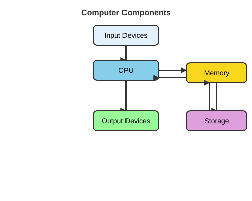
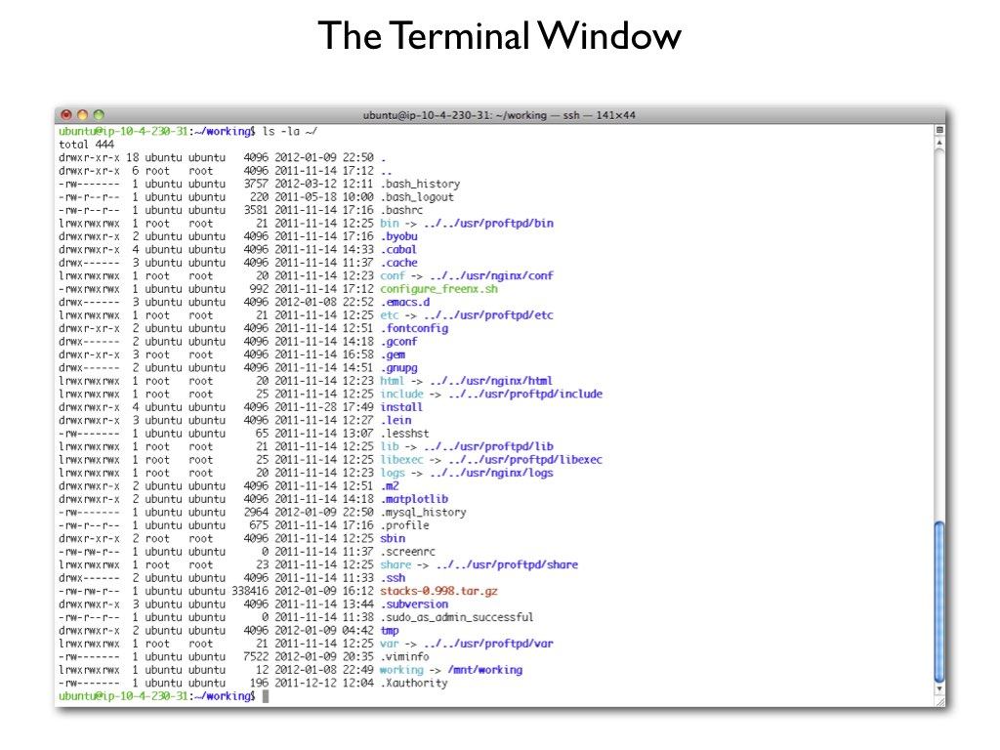

```{r}
#| label: setup
#| include: false

# Packages used in the lecture examples
library(tidyverse)
library(gt)
library(readxl)

# Consistent theme for all plots
theme_set(theme_minimal(base_size = 14))

# Reproducible random numbers
set.seed(2026)
```


## Book reading for this lecture

The course book goes deeper on everything in this lecture. Read before or after class:

-   [Ch. 1: Introduction to Computational Tools](../book/chapters/01-introduction.html)
-   [Ch. 6: Computer Systems Architecture](../book/chapters/06-computer-systems.html)
-   [Ch. 4: Unix Fundamentals](../book/chapters/04-unix-fundamentals.html)
-   *Reference:* [App. B: Unix Command Reference](../book/chapters/appendix-B-unix.html)

## Goals of the course

::: {.callout-tip title="This is a practical course and we will learn by doing"}
-   Teach fundamental skills for your scientific careers
-   Provide you with the computational tools necessary to carry out your work
-   To prepare you for more advanced statistics and programming education
:::

## 

{fig-align="center" width="100%"}

## 

{fig-align="center" width="100%"}

## Class Introductions

::: {.callout-tip title="Who are you?"}
-   Your name
-   Year in grad school
-   Home lab or rotation lab
-   What has your experience with programming/statistics been like?
-   What is your good news this week?
:::

## 

::: {.callout-tip title="What will you learn?"}
-   What is local, cluster and cloud computing
-   Unix paths, commands and scripts
-   Read and write basic scripts in R and Python
-   Implement reproducible research practices
-   Markdown and LaTeX
-   GitHub and GitHub Pages
-   Talapas and Amazon Web Services (AWS)
:::

## Class Logistics

-   Meet Mondays from 4:00pm - 5:00pm in KC2 213 (Sept 28 - Nov 30)
    -   Most of class time will be hands-on coding practice, less time lecturing
-   Kick-off bootcamp: Thursday, Sept 24, 9:00am - 1:00pm in the KC2 Seminar Room
-   Coding practice via two homeworks later in the term
    -   Available Tuesday of that week, due before class on Tuesday in two weeks
-   Weeks 10-11 you will complete a final coding project
    -   Design script(s) that works with your research and interests using the skills you've learned this term

## Required Materials

-   No textbooks or purchases required
-   Access to a laptop or computer running Windows, MacOS, or Linux operating systems
-   An account on Talapas (through your lab, or through CBDS)
-   Announcements and assignments posted on Canvas
-   The majority of course material on our class website `https://wcresko.github.io/BioE_Comp_Tools_Fa2026/`

# Installing Programs

## Computational Tools

::: {.callout-note title="Mac vs. Linux vs. Windows"}
-   Mac and Linux systems run using the same language, but previous versions of Windows lacks some of the basic features found on other systems
-   To help you practice and learn how to code in Unix, we will help you install some programs on your computer for running Unix
-   R and Python should work on any computer
-   Visual Studio Code will also work on any computer
-   Similarly, LaTeX and Git will work on any computer
:::

## Computational Tools

-   Need to make sure that you have `R` installed
    -   locally or on a server
    -   https://www.r-project.org
-   Can run R from the command line
    -   just type `R`
    -   can run it locally as well as on clusters

## Computational Tools

-   Also make sure that you have `Python` (version 3) installed
    -   locally or on a server
    -   https://www.python.org/downloads (Windows: tick "Add python.exe to PATH")
    -   already present on macOS and Ubuntu/WSL (`sudo apt install python3-pip python3-venv`)
-   Can run Python from the command line
    -   just type `python3` for an interactive session, `python3 script.py` to run a script
    -   can run it locally as well as on clusters (`module load python3` on Talapas)
-   Keep each project's packages in a *virtual environment*: `python3 -m venv .venv`

## Computational Tools

-   Install an *Integrated Development Environment* (IDE)
    -   Positron: https://positron.posit.co/download
    -   Makes working with R and Python much easier, particularly for a new user
    -   Runs on Windows, Mac or Linux OS; free
-   Other IDEs
    -   We will also use an IDE called Visual Studio Code
    -   And **Positron** (from Posit) - one IDE for both R and Python
    -   You will also use Jupyter Notebooks (`.ipynb`) for Python

# Accessing the Shell

## Accessing the shell - Mac and Linux

-   Mac users: open the "Terminal" app, or use another app like 'iTerm2'

-   Linux users: open one of several "Terminal" apps

    ::: callout-caution
    ## Windows users have a little more work to do

    See the next slides
    :::

## Accessing the shell - Windows

-   Guide: `https://learn.microsoft.com/windows/wsl/install`
-   Run Windows PowerShell as administrator
-   Install WSL2 *and* Ubuntu by typing `wsl --install` (Ubuntu is the default distribution)
-   Restart your computer
-   If Ubuntu does not appear in the Start menu afterwards, type `wsl --install -d Ubuntu` in PowerShell (or install Ubuntu from the Microsoft Store)

## Accessing the shell - Windows

-   Open `Ubuntu` and set up a username and password
    -   Does not have to match your login info for Windows; nothing appears while you type the password, which is normal
-   Note that this is the `Ubuntu` Linux operating system that you installed, not Windows PowerShell
-   Run `sudo apt update` then `sudo apt upgrade` to ensure everything is up to date
-   Create your course folders and files within your Ubuntu home directory (`~`)
-   You can also reach your Windows files and folders from Ubuntu using `cd /mnt/c`

# Coding and Scripting

## Why do we need coding and scripting?

-   It is incredibly fast and powerful, particularly for repeated actions
-   It allows you to do thousands of ‘clicks’ with single commands
-   Ability to analyze large datasets that Excel and other GUIs can't handle well
-   Access to thousands of free programs made for and by scientists
-   The commands work almost identically across platforms
-   Ability to use computer clusters like Talapas

## What is the difference between coding and scripting?

::: incremental
-   `coding` generally involves computer languages that use `compilers`
    -   C++, Fortran, Basic, etc
-   `scripting` generally involves computer languages that are `interpreted` on the fly
    -   Unix, Python, R, Julia, etc.
-   coding - faster but less flexible; scripting - flexible but slower
-   The distinction between the two has become somewhat fuzzy and most modern analytical pipelines contain a combination of both
:::

## Programming languages are *languages*

::: incremental
-   Learning to program is like learning a new spoken language - vocabulary, grammar, and lots of practice
-   Learning one language makes the next one much easier (the *ideas* transfer: variables, loops, functions, files)
-   **Use it or lose it!** Regular practice is the only way to keep the skill
:::

::: {.callout-tip title="Remember"}
Computers are literal. You must use explicit, pre-defined phrases to tell your computer exactly what you want - it will do what you *said*, not what you *meant*.
:::

# Computer Systems

## What is a Computer System?

::::: columns
::: {.column width="60%"}
-   **Hardware**: Physical components
-   **Software**: Programs and instructions
-   **Firmware**: Low-level software in hardware
-   **Data**: Information being processed
:::

::: {.column width="40%"}
{fig-align="center" width="100%"}
:::
:::::

## The Fetch-Decode-Execute Cycle

{fig-align="center" width="100%"}

### 

1.  **Fetch**: Retrieve instruction from memory
2.  **Decode**: Interpret what the instruction means
3.  **Execute**: Perform the operation
4.  **Store**: Save results to memory or register

::: notes
This is the fundamental cycle that every CPU performs billions of times per second
:::

# Hardware Components

## Central Processing Unit (CPU)

::::: columns
::: {.column width="50%"}
**Core Components**

-   **Control Unit (CU)**: Directs operations
-   **Arithmetic Logic Unit (ALU)**: Performs calculations
-   **Registers**: Ultra-fast temporary storage
-   **Cache**: High-speed memory buffer
:::

::: {.column width="50%"}
**Key Concepts**

-   **Clock Speed**: Cycles per second (GHz)
-   **Cores**: Independent processing units
-   **Threads**: Virtual cores for parallel processing
-   **Instruction Set**: CPU's language (x86, ARM)
:::
:::::

## Graphics Processing Unit (GPU)

::::: columns
::: {.column width="50%"}
**Core Components**

-   **Streaming Multiprocessors (SMs)**: Processing clusters
-   **CUDA Cores/Stream Processors**: Parallel compute units
-   **Video Memory (VRAM)**: Dedicated high-bandwidth memory
-   **Memory Controller**: Manages data flow to/from VRAM
:::

::: {.column width="50%"}
**Key Concepts**

-   **Parallel Architecture**: Thousands of cores for simultaneous tasks
-   **Memory Bandwidth**: Data throughput (GB/s)
-   **Compute Units**: Groups of processing cores
-   **APIs**: Programming interfaces (CUDA, OpenCL, Vulkan)
:::
:::::

------------------------------------------------------------------------

## CPU vs GPU Comparison

::::: columns
::: {.column width="50%"}
**CPU Characteristics**

-   **Design Focus**: Sequential processing & complex tasks
-   **Core Count**: 4-64 powerful cores
-   **Architecture**: Optimized for single-thread performance
-   **Memory**: Large cache, lower bandwidth
-   **Best For**:
    -   Operating systems & general computing
    -   Complex branching logic
    -   Low-latency operations
    -   Serial tasks
:::

::: {.column width="50%"}
**GPU Characteristics**

-   **Design Focus**: Parallel processing & high throughput
-   **Core Count**: Thousands of smaller cores
-   **Architecture**: Optimized for massive parallelism
-   **Memory**: Smaller cache, higher bandwidth
-   **Best For**:
    -   Graphics rendering
    -   Machine learning/AI
    -   Scientific simulations
    -   Parallel computations
:::
:::::

# Types of computer memory

## Random Access Memory (RAM)

::::: columns
::: {.column width="50%"}
***Types of RAM***

**DRAM (Dynamic RAM)**

-   Main system memory
-   Needs constant refresh
-   Cheaper, higher density
-   DDR4, DDR5 standards

**SRAM (Static RAM)**

-   Used in CPU cache
-   No refresh needed
-   Faster but expensive
-   Lower density
:::

::: {.column width="50%"}
***Key Characteristics***

-   **Volatile**: Data lost when power off
-   **Random Access**: Any location equally fast
-   **Bandwidth**: Data transfer rate
-   **Latency**: Access delay
-   **Dual Channel**: Parallel data paths
:::
:::::

## Persistent Storage Systems

::::: columns
::: {.column width="50%"}
**Hard Disk Drives (HDD)**

-   Mechanical spinning platters
-   Magnetic storage
-   Large capacity, low cost
-   \~100-200 MB/s throughput
-   Higher latency (\~10ms)
:::

::: {.column width="50%"}
**Solid State Drives (SSD)**

-   No moving parts (NAND Flash)
-   Electronic storage
-   Faster access (\~0.1ms)
-   500-7000 MB/s throughput
-   More expensive per GB
:::
:::::

## Input/Output (I/O) Systems

::::: columns
::: {.column width="50%"}
**Input Devices**

-   Keyboard & Mouse
-   Touchscreen
-   Microphone
-   Camera
-   Sensors
-   Network Interface
:::

::: {.column width="50%"}
**Output Devices**

-   Monitor/Display
-   Printer
-   Speakers
-   Network Interface
-   Actuators
:::
:::::

# Operating Systems

## What is an Operating System?

An OS is system software that manages computer hardware, software resources, and provides common services for computer programs.

::::: columns
::: {.column width="40%"}
**Key Roles**

-   Resource Manager
-   Extended Machine
-   User Interface Provider
-   Security Enforcer
:::

::: {.column width="60%"}
**Common Operating Systems**

-   **Desktop**: Windows, macOS, Unix, Linux
-   **Mobile**: Android, iOS
-   **Server**: Unix, Linux, Windows Server
-   **Specialized**: Supercomputers, IoT
:::
:::::

## Operating System Architecture

{fig-align="center" width="80%"}

## Core OS Functions

::::: columns
::: {.column width="50%"}
***1. Process Management***

-   **Process Creation & Termination**
-   **Process Scheduling**: CPU time allocation
-   **Inter-Process Communication (IPC)**
-   **Synchronization**
-   **Deadlock Handling**

------------------------------------------------------------------------

***3. File System Management***

-   **File Operations**: Create, read, write, delete
-   **Directory Structure**
-   **Access Control & Permissions**
-   **File Allocation Methods**
-   **Disk Space Management**
:::

::: {.column width="50%"}
***2. Memory Management***

-   **Memory Allocation/Deallocation**
-   **Virtual Memory**
-   **Paging & Segmentation**
-   **Memory Protection**
-   **Swap Space Management**

------------------------------------------------------------------------

***4. Device Management***

-   **Device Drivers**: Hardware abstraction
-   **I/O Scheduling**
-   **Buffering & Caching**
-   **Interrupt Handling**
-   **Plug and Play Support**
:::
:::::

## CPU Scheduling

::::: columns
::: {.column width="50%"}
**Scheduling Algorithms**

-   **First-Come-First-Served (FCFS)**
    -   Simple but can cause long waits
-   **Shortest Job First (SJF)**
    -   Optimal average wait time
-   **Round Robin (RR)**
    -   Fair time slices for all
-   **Priority Scheduling**
    -   Important tasks first
:::

::: {.column width="50%"}
**Performance Metrics**

-   **CPU Utilization**: Keep CPU busy
-   **Throughput**: Jobs completed/time
-   **Turnaround Time**: Total completion time
-   **Waiting Time**: Time in ready queue
-   **Response Time**: First response delay
:::
:::::

## Security & Protection

::::: columns
::: {.column width="50%"}
**Protection Mechanisms**

-   **Access Control Lists (ACLs)**
-   **User/Group Permissions**
-   **Memory Protection**: Segmentation
-   **CPU Modes**: User vs Kernel
-   **Sandboxing**: Isolate processes
:::

::: {.column width="50%"}
**Security Features**

-   **Authentication**: User verification
-   **Encryption**: Data protection
-   **Firewall**: Network protection
-   **Antivirus**: Malware detection
-   **Updates**: Patch vulnerabilities
:::
:::::

> "Every program and user should operate using the least amount of privilege necessary"


# Computing Evolution

## 

{fig-align="center" width="100%"}

### Key Drivers of Change

-   **Performance Needs**: Growing computational demands
-   **Economics**: Cost optimization and economies of scale
-   **Connectivity**: Internet bandwidth improvements
-   **Virtualization**: Hardware abstraction technologies

# Local Computing

## Local Computing Overview

:::: callout-note
::: callout-important
Computing resources that are physically present and directly controlled by the user or organization
:::
::::

::::: columns
::: {.column width="50%"}
**Characteristics**

-   [x] Complete control over hardware
-   [x] Data stays on-premises
-   [x] No network dependency for compute
-   [x] Predictable performance
-   [x] One-time purchase model
:::

::: {.column width="50%"}
**Common Setups**

-   Desktop workstations
-   Laptop computers
-   On-premises servers
-   Local development machines
:::
:::::

## Local Computing Architecture

{fig-align="center" width="85%"}

## Local Computing: Pros and Cons

::::: columns
::: {.column width="50%"}
### Advantages ✓

-   **Low Latency**: No network overhead
-   **Data Control**: Complete ownership
-   **Privacy**: Data never leaves premises
-   **Predictable Costs**: One-time investment
-   **Offline Capability**: Works without internet
-   **Customization**: Full hardware/software control
:::

::: {.column width="50%"}
### Disadvantages ✗

-   **Limited Scale**: Hardware constraints
-   **Maintenance**: User responsibility
-   **Upfront Costs**: High initial investment
-   **Disaster Recovery**: Manual backup needed
-   **Resource Waste**: Idle during off-hours
-   **Upgrade Complexity**: Physical intervention
:::
:::::

# Cluster Computing

## Cluster Computing Overview

A collection of interconnected computers working together as a single system

{fig-align="center" width="80%"}

**Key Components**

-   **Head Node**: Job scheduling and management
-   **Compute Nodes**: Worker machines
-   **Interconnect**: High-speed network (InfiniBand, 10GbE+)
-   **Shared Storage**: Parallel file systems (Lustre, GPFS)

## Resource Managers

**These are used to schedule computing jobs on computer clusters.**

| System     | Use Case        | Key Features                          |
|------------|-----------------|---------------------------------------|
| SLURM      | HPC             | Advanced scheduling, power management |
| PBS/Torque | Traditional HPC | Mature, stable, wide support          |
| SGE/UGE    | Mixed workloads | Flexible policies                     |
| Kubernetes | Containers      | Microservices, auto-scaling           |

::: callout-important
We use SLURM on Talapas at the University of Oregon for scheduling compute jobs
:::

## Cluster Computing: Pros and Cons

::::: columns
::: {.column width="50%"}
### Advantages ✓

-   **Scalability**: Add nodes as needed
-   **Performance**: Parallel processing power
-   **Cost-Effective**: Commodity hardware
-   **Fault Tolerance**: Node redundancy
-   **Resource Sharing**: Multiple users/projects
-   **Specialized Hardware**: GPUs, high-mem nodes
:::

::: {.column width="50%"}
### Disadvantages ✗

-   **Complexity**: Requires expertise
-   **Infrastructure**: Space, power, cooling
-   **Network Dependency**: Interconnect bottlenecks
-   **Software Licenses**: Per-node costs
-   **Maintenance**: Hardware failures
-   **Initial Setup**: Complex configuration
:::
:::::

# Cloud Computing

## Cloud Computing Overview

On-demand delivery of computing resources over the internet with pay-as-you-go pricing

{fig-align="center" width="85%"}

### Major Providers

-   **Amazon Web Services (AWS)**: Market leader, 200+ services
-   **Microsoft Azure**: Enterprise integration
-   **Google Cloud Platform**: AI/ML focus
-   **Others**: IBM Cloud, Oracle Cloud, Alibaba Cloud

## Cloud Computing: Pros and Cons

::::: columns
::: {.column width="50%"}
### Advantages ✓

-   **Elastic Scaling**: Instant resource adjustment
-   **Pay-per-Use**: No idle resource costs
-   **Global Reach**: Multiple regions
-   **Managed Services**: Reduced operations
-   **Innovation Speed**: Latest technologies
-   **Disaster Recovery**: Built-in redundancy
-   **No CAPEX**: Operating expense model
:::

::: {.column width="50%"}
### Disadvantages ✗

-   **Ongoing Costs**: Can exceed on-prem
-   **Vendor Lock-in**: Proprietary services
-   **Internet Dependency**: Connectivity required
-   **Data Transfer Costs**: Egress fees
-   **Compliance Complexity**: Data residency
-   **Less Control**: Shared responsibility
-   **Performance Variability**: Noisy neighbors
:::
:::::


# Computational Tools - The Command Line

{fig-align="center" width="90%"}

## What is Unix?

::: incremental
-   An operating system developed at Bell Labs in 1969, released in 1973
-   Now a family of operating systems: Linux, macOS, and others share the Unix design
-   Runs both locally on your computer and on large clusters like Talapas
-   Its **shell** gives you a scripting language for talking to the operating system
-   Linux is an open-source operating system built on the same design
:::

## What is a shell? {background-image="images/Lec02_img003.jpeg"}

-   The ‘shell’ is a program that runs UNIX and takes in commands and gives them to the operating system

-   **`bash`** (Linux, WSL, Talapas) and **`zsh`** (macOS default) are the common shells - nearly identical for our purposes

-   You can access the shell via a **`terminal window`**

##  {background-image="images/Lec02_img003.jpeg"}

{width="90%" fig-align="center"}

## Recipes for a shell command

-   **Prompt**: notation used to indicate your computer is ready to accept a new command
-   **Command**: the building blocks of programming, tell computer to do a specific task
-   **Options**: change the behavior of a command
-   **Argument**: what the command should operate on

{width="80%" fig-align="center"}

## Why use the shell?

::: incremental
-   Speed
-   Can handle extremely large file sizes
-   Use programs only available via shell
-   The commands work almost identically across platforms
-   You can even use them on a large computer cluster like Talapas and AWS
-   It is incredibly powerful particularly for repeated actions
-   It allows you to do thousands of ‘clicks’ with single commands
:::

## Where do you get help?

-   Manual pages!
    -   The shell has manuals for all basic commands
    -   Type `man [command_name]` to access the manual for a specific command
    -   Type `q` to exit
-   Also...the internet!
-   Also... Generative AI (ChatGPT, Claude, etc.) - but read and test what it gives you
