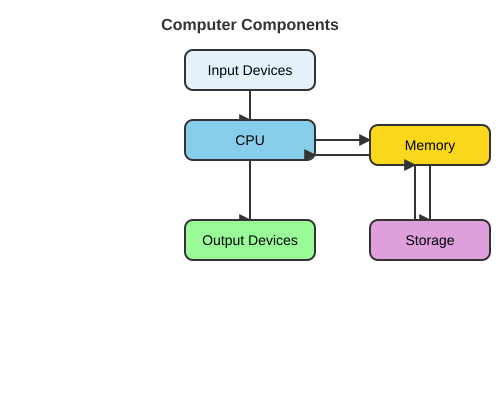
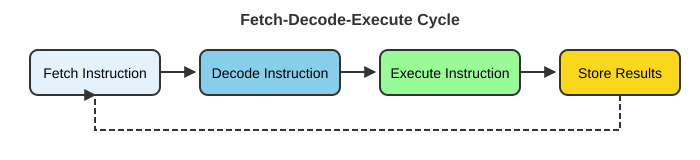
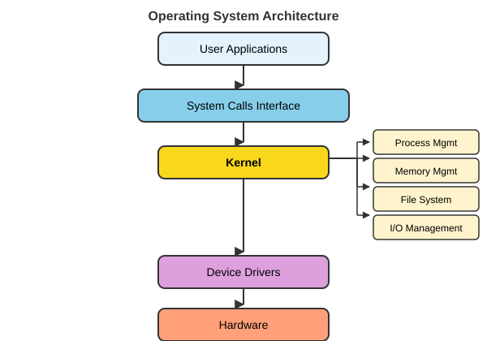
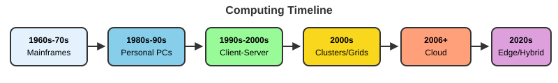
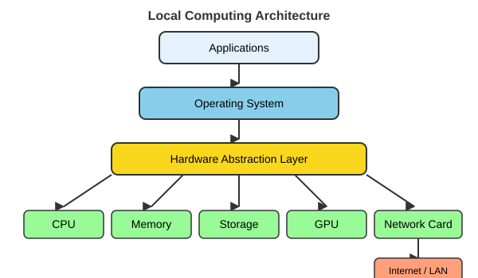
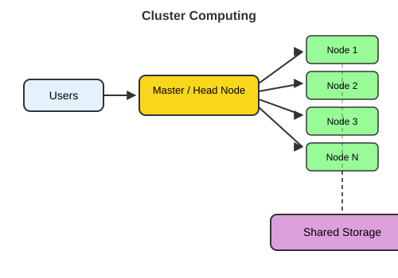
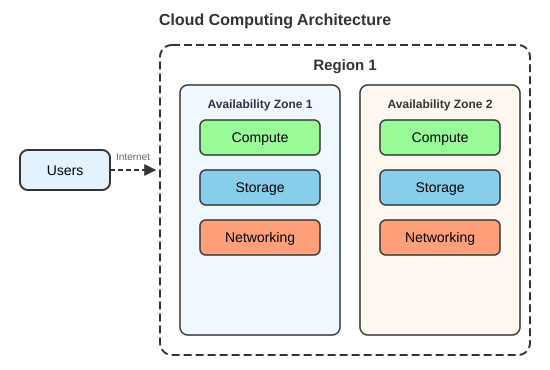
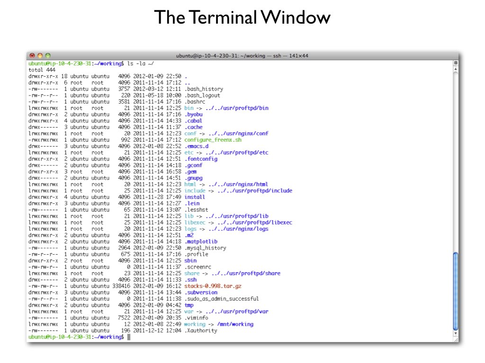
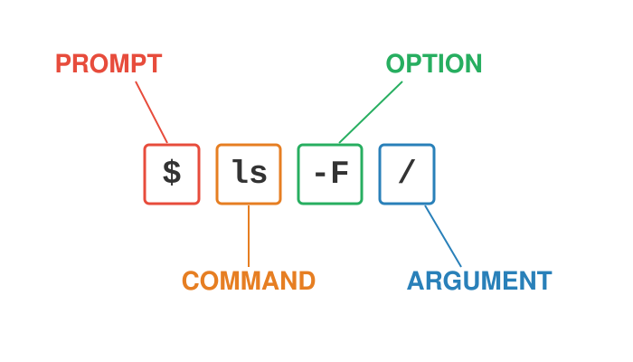

```{r}
#| label: setup
#| include: false

# Packages used in the lecture examples
library(tidyverse)
library(gt)
library(readxl)

# Consistent theme for all plots
theme_set(theme_minimal(base_size = 14))

# Reproducible random numbers
set.seed(2026)
```

## Book reading for this lecture

The course book goes deeper on everything in this lecture. Read before or after class:

- [Ch. 1: Introduction to Computational Tools](../book/chapters/01-introduction.html)
- [Ch. 2: Your Computational Toolkit: Editors and IDEs](../book/chapters/02-your-toolkit.html)
- [Ch. 3: Computing Resources at the University of Oregon](../book/chapters/03-computing-at-uo.html)
- [Ch. 4: Unix Fundamentals](../book/chapters/04-unix-fundamentals.html)
- [Ch. 5: Reproducible Documents with Quarto](../book/chapters/05-quarto-documents.html)
- [Ch. 6: Computer Systems Architecture](../book/chapters/06-computer-systems.html)
- *Reference:* [App. A: Keyboard Shortcuts](../book/chapters/appendix-A-shortcuts.html), [App. B: Unix Command Reference](../book/chapters/appendix-B-unix.html)

## Goals of the course

**This is a practical course and we will learn by doing**

- Teach fundamental skills for your scientific careers
- Provide you with the computational tools necessary to carry out your work
- To prepare you for more advanced statistics and programming education

## 

{fig-align="center" width="100%"}

## 

{fig-align="center" width="100%"}

## Class Introductions

::: {.callout-tip title="Who are you?"}
- Your name
- Year in grad school
- Home lab or rotation lab
- What has your experience with programming/statistics been like?
- What is your good news this week?
:::

## What will you learn?


- What is local, cluster and cloud computing
- Unix paths, commands and scripts
- Read and write basic scripts in R and Python
- Implement reproducible research practices
- Markdown and LaTeX
- GitHub and GitHub Pages
- Talapas and Amazon Web Services (AWS)


## Class Logistics

- Meet Mondays from 4:00pm - 5:00pm in KC2 213 (Sept 28 - Nov 30)
  - Most of class time will be hands-on coding practice, less time lecturing
- Kick-off bootcamp: Thursday, Sept 24, 9:00am - 1:00pm in the KC2 Seminar Room
- Two problem sets, each assigned two weeks before it is due (Mondays, via Canvas) - 60% of grade
  - HW1: assigned Nov 2, due Nov 16 · HW2: assigned Nov 16, due Nov 30
- Term project: process a large dataset on Talapas and write it up as a reproducible Quarto document - 40% of grade
  - One-page proposal due Week 7 (Mon Nov 9); final project due finals week (Dec 7-11)

## Required Materials

- No textbooks or purchases required
- Access to a laptop or computer running Windows, MacOS, or Linux operating systems
- An account on Talapas (through your lab, or through CBDS)
- Announcements and assignments posted on Canvas
- The majority of course material on our class website `https://wcresko.github.io/BioE_Comp_Tools_Fa2026/`

# Your Toolkit - Quick Check

*Book: [Ch. 2, Your Computational Toolkit](../book/chapters/02-your-toolkit.html)*

## Your toolkit from the bootcamp

::: {.callout-note title="Mac vs. Linux vs. Windows"}
- macOS and Linux *are* Unix systems - the shell is already built in
- Windows gets the same shell through **WSL with Ubuntu** (installed at the bootcamp; next slides)
- Everything else - R, Python, Positron, Quarto, Git - runs on all three
:::

- **R** (<https://www.r-project.org>) and **Python 3** (<https://www.python.org/downloads>) - the two languages we script in
- **Positron** (<https://positron.posit.co/download>) - the one IDE we all use in class
  - Built on the same open-source core as **VS Code**, so the editor, shortcuts, and extensions carry over if you use VS Code elsewhere
  - R and Python support built in, and it **bundles Quarto** - nothing extra to install
  - Its terminal panel (**Ctrl-\`**) is where all of our shell work happens

## Toolkit check - run this now

In Positron's terminal (**Ctrl-\`**), run:

``` bash
echo $SHELL
R --version
python3 --version
quarto --version
```

::: incremental
- Each should print a version number, **not** "command not found"
- Command not found? Close and reopen the terminal (it only sees programs installed before it started)
- Still stuck? The troubleshooting tables in [Ch. 2](../book/chapters/02-your-toolkit.html#sec-toolkit-checkpoint) cover the common cases - and see me after class
:::

# Accessing the Shell

*Book: [Ch. 1, setup for your operating system](../book/chapters/01-introduction.html#sec-intro-setup)*

## Accessing the shell - Mac and Linux

- Mac users: open the "Terminal" app, or use another app like 'iTerm2'

- Linux users: open one of several "Terminal" apps

  ::: callout-caution
  ## Windows users have a little more work to do

  See the next slides
  :::

## Accessing the shell - Windows

- Guide: `https://learn.microsoft.com/windows/wsl/install`
- Run Windows PowerShell as administrator
- Install WSL2 *and* Ubuntu by typing `wsl --install` (Ubuntu is the default distribution)
- Restart your computer
- If Ubuntu does not appear in the Start menu afterwards, type `wsl --install -d Ubuntu` in PowerShell (or install Ubuntu from the Microsoft Store)

## Accessing the shell - Windows

- Open `Ubuntu` and set up a username and password
  - Does not have to match your login info for Windows; nothing appears while you type the password, which is normal
- Note that this is the `Ubuntu` Linux operating system that you installed, not Windows PowerShell
- Run `sudo apt update` then `sudo apt upgrade` to ensure everything is up to date
- Create your course folders and files within your Ubuntu home directory (`~`)
- You can also reach your Windows files and folders from Ubuntu using `cd /mnt/c`

# Coding and Scripting

*Book: [Ch. 1, Introduction to Computational Tools](../book/chapters/01-introduction.html#sec-coding-vs-scripting)*

## Why do we need coding and scripting?

- It is incredibly fast and powerful, particularly for repeated actions
- It allows you to do thousands of ‘clicks’ with single commands
- Ability to analyze large datasets that Excel and other GUIs can't handle well
- Access to thousands of free programs made for and by scientists
- The commands work almost identically across platforms
- Ability to use computer clusters like Talapas

## What is the difference between coding and scripting?

::: incremental
- `coding` generally involves computer languages that use `compilers`
  - C++, Fortran, Basic, etc
- `scripting` generally involves computer languages that are `interpreted` on the fly
  - Unix, Python, R, Julia, etc.
- coding - faster but less flexible; scripting - flexible but slower
- The distinction between the two has become somewhat fuzzy and most modern analytical pipelines contain a combination of both
:::

## Programming languages are *languages*

::: incremental
- Learning to program is like learning a new spoken language - vocabulary, grammar, and lots of practice
- Learning one language makes the next one much easier (the *ideas* transfer: variables, loops, functions, files)
- **Use it or lose it!** Regular practice is the only way to keep the skill
:::

::: {.callout-tip title="Remember"}
Computers are literal. You must use explicit, pre-defined phrases to tell your computer exactly what you want - it will do what you *said*, not what you *meant*.
:::

# Computer Systems

*Book: [Ch. 6, Computer Systems Architecture](../book/chapters/06-computer-systems.html)*

## What is a Computer System?

::::: columns
::: {.column width="60%"}
- **Hardware**: Physical components
- **Software**: Programs and instructions
- **Firmware**: Low-level software in hardware
- **Data**: Information being processed
:::

::: {.column width="40%"}
{fig-align="center" width="100%"}
:::
:::::

## Bits, bytes, and the units of data {.smaller}

A **bit** is a 0 or 1; a **byte** is 8 bits, about one character of text.

| Unit | Size | Holds, roughly |
|-----------------|-----------------|---------------------------------------|
| Megabyte (MB) | \~1,000 KB | a photo; the *E. coli* genome as text (4.6 million bases) |
| Gigabyte (GB) | \~1,000 MB | an RNA-seq FASTQ file; the human genome as text is \~3 GB |
| Terabyte (TB) | \~1,000 GB | a laptop's disk; a high-content imaging screen |
| Petabyte (PB) | \~1,000 TB | Talapas's shared storage (\~3 PB) |

::: incremental
- Numbers occupy fixed slots in memory: an integer \~4 bytes, a decimal (double) 8 bytes
- A 600-gene x 80-sample count table = 48,000 numbers = **under half a megabyte** - trivial anywhere
- A single-cell matrix (20,000 genes x 100,000 cells) = **\~16 GB dense** - more than your laptop's RAM
- Details and the KB-vs-KiB story: [Ch. 6](../book/chapters/06-computer-systems.html#sec-bits-bytes)
:::

## The Fetch-Decode-Execute Cycle

{fig-align="center" width="100%"}

### 

1.  **Fetch**: Retrieve instruction from memory
2.  **Decode**: Interpret what the instruction means
3.  **Execute**: Perform the operation
4.  **Store**: Save results to memory or register

::: notes
This is the fundamental cycle that every CPU performs billions of times per second
:::

# Hardware Components

*Book: [Ch. 6, CPUs and GPUs](../book/chapters/06-computer-systems.html#sec-cpu)*

## Central Processing Unit (CPU)

::::: columns
::: {.column width="50%"}
**Core Components**

- **Control Unit (CU)**: Directs operations
- **Arithmetic Logic Unit (ALU)**: Performs calculations
- **Registers**: Ultra-fast temporary storage
- **Cache**: High-speed memory buffer
:::

::: {.column width="50%"}
**Key Concepts**

- **Clock Speed**: Cycles per second (GHz)
- **Cores**: Independent processing units
- **Threads**: Virtual cores for parallel processing
- **Instruction Set**: CPU's language (x86, ARM)
:::
:::::

## Graphics Processing Unit (GPU)

::::: columns
::: {.column width="50%"}
**Core Components**

- **Streaming Multiprocessors (SMs)**: Processing clusters
- **CUDA Cores/Stream Processors**: Parallel compute units
- **Video Memory (VRAM)**: Dedicated high-bandwidth memory
- **Memory Controller**: Manages data flow to/from VRAM
:::

::: {.column width="50%"}
**Key Concepts**

- **Parallel Architecture**: Thousands of cores for simultaneous tasks
- **Memory Bandwidth**: Data throughput (GB/s)
- **Compute Units**: Groups of processing cores
- **APIs**: Programming interfaces (CUDA, OpenCL, Vulkan)
:::
:::::

------------------------------------------------------------------------

## CPU vs GPU Comparison

::::: columns
::: {.column width="50%"}
**CPU Characteristics**

- **Design Focus**: Sequential processing & complex tasks
- **Core Count**: 4-64 powerful cores
- **Architecture**: Optimized for single-thread performance
- **Memory**: Large cache, lower bandwidth
- **Best For**:
  - Operating systems & general computing
  - Complex branching logic
  - Low-latency operations
  - Serial tasks
:::

::: {.column width="50%"}
**GPU Characteristics**

- **Design Focus**: Parallel processing & high throughput
- **Core Count**: Thousands of smaller cores
- **Architecture**: Optimized for massive parallelism
- **Memory**: Smaller cache, higher bandwidth
- **Best For**:
  - Graphics rendering
  - Machine learning/AI
  - Scientific simulations
  - Parallel computations
:::
:::::

# Types of computer memory

*Book: [Ch. 6, memory and storage](../book/chapters/06-computer-systems.html#sec-memory-types)*

## Random Access Memory (RAM)

::::: columns
::: {.column width="50%"}
***Types of RAM***

**DRAM (Dynamic RAM)**

- Main system memory
- Needs constant refresh
- Cheaper, higher density
- DDR4, DDR5 standards

**SRAM (Static RAM)**

- Used in CPU cache
- No refresh needed
- Faster but expensive
- Lower density
:::

::: {.column width="50%"}
***Key Characteristics***

- **Volatile**: Data lost when power off
- **Random Access**: Any location equally fast
- **Bandwidth**: Data transfer rate
- **Latency**: Access delay
- **Dual Channel**: Parallel data paths
:::
:::::

## Persistent Storage Systems

::::: columns
::: {.column width="50%"}
**Hard Disk Drives (HDD)**

- Mechanical spinning platters
- Magnetic storage
- Large capacity, low cost
- \~100-200 MB/s throughput
- Higher latency (\~10ms)
:::

::: {.column width="50%"}
**Solid State Drives (SSD)**

- No moving parts (NAND Flash)
- Electronic storage
- Faster access (\~0.1ms)
- 500-7000 MB/s throughput
- More expensive per GB
:::
:::::

## The memory hierarchy - and the usual bottleneck

::: incremental
- Registers → cache → RAM → SSD → HDD: each level is bigger, cheaper, and **slower**
- RAM answers in \~100 nanoseconds; a disk in milliseconds - **six orders of magnitude** apart
- For data analysis the binding constraint is almost always **RAM**: your data must fit in memory while you work on it
:::

::: {.callout-tip title="Rule of thumb"}
Plan on RAM being **3-5x your data's size on disk** - files expand when parsed, and analysis steps make copies. A 1 GB CSV is comfortable on a 16 GB laptop; a 10 GB one is a job for Talapas (Lecture 08).
:::

## Input/Output (I/O) Systems

::::: columns
::: {.column width="50%"}
**Input Devices**

- Keyboard & Mouse
- Touchscreen
- Microphone
- Camera
- Sensors
- Network Interface
:::

::: {.column width="50%"}
**Output Devices**

- Monitor/Display
- Printer
- Speakers
- Network Interface
- Actuators
:::
:::::

# Operating Systems

*Book: [Ch. 6, operating systems](../book/chapters/06-computer-systems.html#sec-operating-systems)*

## What is an Operating System?

An OS is system software that manages computer hardware, software resources, and provides common services for computer programs.

::::: columns
::: {.column width="40%"}
**Key Roles**

- Resource Manager
- Extended Machine
- User Interface Provider
- Security Enforcer
:::

::: {.column width="60%"}
**Common Operating Systems**

- **Desktop**: Windows, macOS, Unix, Linux
- **Mobile**: Android, iOS
- **Server**: Unix, Linux, Windows Server
- **Specialized**: Supercomputers, IoT
:::
:::::

## Operating System Architecture

{fig-align="center" width="80%"}

## Core OS Functions

::::: columns
::: {.column width="50%"}
***1. Process Management***

- **Process Creation & Termination**
- **Process Scheduling**: CPU time allocation
- **Inter-Process Communication (IPC)**
- **Synchronization**
- **Deadlock Handling**

------------------------------------------------------------------------

***3. File System Management***

- **File Operations**: Create, read, write, delete
- **Directory Structure**
- **Access Control & Permissions**
- **File Allocation Methods**
- **Disk Space Management**
:::

::: {.column width="50%"}
***2. Memory Management***

- **Memory Allocation/Deallocation**
- **Virtual Memory**
- **Paging & Segmentation**
- **Memory Protection**
- **Swap Space Management**

------------------------------------------------------------------------

***4. Device Management***

- **Device Drivers**: Hardware abstraction
- **I/O Scheduling**
- **Buffering & Caching**
- **Interrupt Handling**
- **Plug and Play Support**
:::
:::::

## CPU Scheduling

::::: columns
::: {.column width="50%"}
**Scheduling Algorithms**

- **First-Come-First-Served (FCFS)**
  - Simple but can cause long waits
- **Shortest Job First (SJF)**
  - Optimal average wait time
- **Round Robin (RR)**
  - Fair time slices for all
- **Priority Scheduling**
  - Important tasks first
:::

::: {.column width="50%"}
**Performance Metrics**

- **CPU Utilization**: Keep CPU busy
- **Throughput**: Jobs completed/time
- **Turnaround Time**: Total completion time
- **Waiting Time**: Time in ready queue
- **Response Time**: First response delay
:::
:::::

## Security & Protection

::::: columns
::: {.column width="50%"}
**Protection Mechanisms**

- **Access Control Lists (ACLs)**
- **User/Group Permissions**
- **Memory Protection**: Segmentation
- **CPU Modes**: User vs Kernel
- **Sandboxing**: Isolate processes
:::

::: {.column width="50%"}
**Security Features**

- **Authentication**: User verification
- **Encryption**: Data protection
- **Firewall**: Network protection
- **Antivirus**: Malware detection
- **Updates**: Patch vulnerabilities
:::
:::::

> "Every program and user should operate using the least amount of privilege necessary"

# Computing Evolution

*Book: [Ch. 6, the evolution of scientific computing](../book/chapters/06-computer-systems.html#sec-computing-evolution)*

## 

{fig-align="center" width="100%"}

### Key Drivers of Change

- **Performance Needs**: Growing computational demands
- **Economics**: Cost optimization and economies of scale
- **Connectivity**: Internet bandwidth improvements
- **Virtualization**: Hardware abstraction technologies

# Local Computing

*Book: [Ch. 6, computing environments](../book/chapters/06-computer-systems.html#sec-local-computing)*

## Local Computing Overview

:::: callout-note
::: callout-important
Computing resources that are physically present and directly controlled by the user or organization
:::
::::

::::: columns
::: {.column width="50%"}
**Characteristics**

- [x] Complete control over hardware
- [x] Data stays on-premises
- [x] No network dependency for compute
- [x] Predictable performance
- [x] One-time purchase model
:::

::: {.column width="50%"}
**Common Setups**

- Desktop workstations
- Laptop computers
- On-premises servers
- Local development machines
:::
:::::

## Local Computing Architecture

{fig-align="center" width="85%"}

## Local Computing: Pros and Cons

::::: columns
::: {.column width="50%"}
### Advantages ✓

- **Low Latency**: No network overhead
- **Data Control**: Complete ownership
- **Privacy**: Data never leaves premises
- **Predictable Costs**: One-time investment
- **Offline Capability**: Works without internet
- **Customization**: Full hardware/software control
:::

::: {.column width="50%"}
### Disadvantages ✗

- **Limited Scale**: Hardware constraints
- **Maintenance**: User responsibility
- **Upfront Costs**: High initial investment
- **Disaster Recovery**: Manual backup needed
- **Resource Waste**: Idle during off-hours
- **Upgrade Complexity**: Physical intervention
:::
:::::

# Cluster Computing

*Book: [Ch. 6, cluster computing](../book/chapters/06-computer-systems.html#sec-cluster-computing) and [Ch. 3, RACS and Talapas](../book/chapters/03-computing-at-uo.html#sec-racs)*

## Cluster Computing Overview

A collection of interconnected computers working together as a single system

{fig-align="center" width="80%"}

**Key Components**

- **Head Node**: Job scheduling and management
- **Compute Nodes**: Worker machines
- **Interconnect**: High-speed network (InfiniBand, 10GbE+)
- **Shared Storage**: Parallel file systems (Lustre, GPFS)

## Resource Managers

**These are used to schedule computing jobs on computer clusters.**

| System     | Use Case        | Key Features                          |
|------------|-----------------|---------------------------------------|
| SLURM      | HPC             | Advanced scheduling, power management |
| PBS/Torque | Traditional HPC | Mature, stable, wide support          |
| SGE/UGE    | Mixed workloads | Flexible policies                     |
| Kubernetes | Containers      | Microservices, auto-scaling           |

::: callout-important
We use SLURM on Talapas at the University of Oregon for scheduling compute jobs
:::

## Your laptop vs. Talapas - by the numbers

|   | Typical laptop | One standard Talapas node | Talapas large-memory node | All of Talapas |
|---------------|---------------|---------------|---------------|---------------|
| **CPU cores** | 8 - 12 | **128** | varies | **14,500+** |
| **RAM** | 8 - 16 GB | **512 GB** | **up to 4 TB** | **\~129 TB** |
| **GPUs** | integrated | \- | \- | **89** (NVIDIA A100, H100, V100) |
| **Storage** | 0.5 - 1 TB SSD | shared | shared | **\~3 PB** (3,000 TB) |

::: incremental
- One standard node has roughly **30x the RAM** and **10x the cores** of your laptop - and Talapas has *hundreds* of nodes
- Your storage on Talapas: **250 GB** in your home directory, plus your lab's **project space** (2 TB by default)
- When an analysis says "out of memory" or would take days on your laptop - that's a job for Talapas (Lecture 08)
:::

## Cluster Computing: Pros and Cons

::::: columns
::: {.column width="50%"}
### Advantages ✓

- **Scalability**: Add nodes as needed
- **Performance**: Parallel processing power
- **Cost-Effective**: Commodity hardware
- **Fault Tolerance**: Node redundancy
- **Resource Sharing**: Multiple users/projects
- **Specialized Hardware**: GPUs, high-mem nodes
:::

::: {.column width="50%"}
### Disadvantages ✗

- **Complexity**: Requires expertise
- **Infrastructure**: Space, power, cooling
- **Network Dependency**: Interconnect bottlenecks
- **Software Licenses**: Per-node costs
- **Maintenance**: Hardware failures
- **Initial Setup**: Complex configuration
:::
:::::

# Cloud Computing

*Book: [Ch. 6, cloud computing](../book/chapters/06-computer-systems.html#sec-cloud-computing)*

## Cloud Computing Overview

On-demand delivery of computing resources over the internet with pay-as-you-go pricing

{fig-align="center" width="85%"}

### Major Providers

- **Amazon Web Services (AWS)**: Market leader, 200+ services
- **Microsoft Azure**: Enterprise integration
- **Google Cloud Platform**: AI/ML focus
- **Others**: IBM Cloud, Oracle Cloud, Alibaba Cloud

## Cloud Computing: Pros and Cons

::::: columns
::: {.column width="50%"}
### Advantages ✓

- **Elastic Scaling**: Instant resource adjustment
- **Pay-per-Use**: No idle resource costs
- **Global Reach**: Multiple regions
- **Managed Services**: Reduced operations
- **Innovation Speed**: Latest technologies
- **Disaster Recovery**: Built-in redundancy
- **No CAPEX**: Operating expense model
:::

::: {.column width="50%"}
### Disadvantages ✗

- **Ongoing Costs**: Can exceed on-prem
- **Vendor Lock-in**: Proprietary services
- **Internet Dependency**: Connectivity required
- **Data Transfer Costs**: Egress fees
- **Compliance Complexity**: Data residency
- **Less Control**: Shared responsibility
- **Performance Variability**: Noisy neighbors
:::
:::::

## Where should *your* work live?

| Kind of work | Home |
|--------------------------------------------------|----------------------|
| Code and scripts | **GitHub** - full version history (Weeks 9-10) |
| Documents and drafts | **OneDrive / Dropbox** - synced to the cloud |
| Large data and heavy compute | **Talapas** (Lecture 08) |
| Active analysis | your laptop's disk - fast, but **not backed up by itself** |

::: {.callout-warning title="A synced folder is not a backup"}
Deletions and overwrites sync everywhere within seconds. Follow the **3-2-1 rule**: three copies, two kinds of storage, one off-site - details in [Ch. 3](../book/chapters/03-computing-at-uo.html#sec-backups).
:::

# Computational Tools - The Command Line

*Book: [Ch. 4, Unix Fundamentals](../book/chapters/04-unix-fundamentals.html) · [App. B, Unix Command Reference](../book/chapters/appendix-B-unix.html)*

{fig-align="center" width="90%"}

## What is Unix?

::: incremental
- An operating system developed at Bell Labs in 1969, released in 1973
- Now a family of operating systems: Linux, macOS, and others share the Unix design
- Runs both locally on your computer and on large clusters like Talapas
- Its **shell** gives you a scripting language for talking to the operating system
- Linux is an open-source operating system built on the same design
:::

## What is a shell? {background-image="images/Lec02_img003.jpeg"}

- The ‘shell’ is a program that runs UNIX and takes in commands and gives them to the operating system

- **`bash`** (Linux, WSL, Talapas) and **`zsh`** (macOS default) are the common shells - nearly identical for our purposes

- You can access the shell via a **`terminal window`**

##  {background-image="images/Lec02_img003.jpeg"}

{width="90%" fig-align="center"}

## Recipes for a shell command

- **Prompt**: notation used to indicate your computer is ready to accept a new command
- **Command**: the building blocks of programming, tell computer to do a specific task
- **Options**: change the behavior of a command
- **Argument**: what the command should operate on

{width="80%" fig-align="center"}

## Five keys that make the shell livable

| Key       | What it does                                           |
|-----------|--------------------------------------------------------|
| `Tab`     | autocompletes commands and paths - use it *constantly* |
| `↑` / `↓` | scroll back through commands you already typed         |
| `Ctrl+R`  | search your command history                            |
| `Ctrl+C`  | cancel the running command                             |
| `Ctrl+L`  | clear the screen                                       |

::: {.callout-caution title="Ctrl+C does not copy!"}
In the terminal, `Ctrl+C` *cancels*. To copy/paste: `Cmd+C` / `Cmd+V` on a Mac; `Ctrl+Shift+C` / `Ctrl+Shift+V` in Ubuntu/WSL and most Linux terminals. Full list: [App. A](../book/chapters/appendix-A-shortcuts.html).
:::

## Shell gotchas to know on day one

::: incremental
- **Spaces separate arguments**: `cd University of Oregon Dropbox` fails - quote it (`cd "University of Oregon Dropbox"`), or let Tab completion escape the spaces for you
- **Case matters**: `Data.csv` and `data.csv` are different files on Linux and Talapas; your Mac forgives the mix-up - the cluster will not
- **There is no trash can**: `rm` deletes forever, and `mv`/`cp` silently overwrite - add `-i` to be asked first
- Paste commands from the web **one line at a time**, and beware "smart quotes" that arrive via word processors
:::

## Why use the shell?

::: incremental
- Speed
- Can handle extremely large file sizes
- Use programs only available via shell
- The commands work almost identically across platforms
- You can even use them on a large computer cluster like Talapas and AWS
- It is incredibly powerful particularly for repeated actions
- It allows you to do thousands of ‘clicks’ with single commands
:::

## Where do you get help?

**Manual pages** - every command ships with one:

``` bash
man ls        # the manual for ls
```

- Navigate: `Space` next page · `/pattern` to search · `q` to quit
- Quicker: `ls --help` prints a short usage summary
- The book's [App. B: Unix Command Reference](../book/chapters/appendix-B-unix.html) collects every command we use
- At UO: the [Service Portal](https://service.uoregon.edu), UO Libraries Data Services (drop-in desk, Knight Library, weekdays 11-4), and me
- AI assistants explain error messages well - but read and understand code before you run it (Lecture 09)

## Try it now - your first ten minutes in the shell

Open the terminal (in Positron: **Ctrl-\`**) and type each line yourself:

``` bash
whoami                  # who does the computer think you are?
pwd                     # where are you?
ls                      # what is here?
ls -lh                  # ...with sizes and dates
echo "hello world"      # your first command with an argument
man ls                  # read a manual page; press q to quit
mkdir -p ~/projects     # make a home for your course work
cd ~/projects && pwd    # go there and confirm
```

- Use **Tab** for every path and **↑** to repeat commands - build the habit now
- Done early? Help a neighbor, then try Exercises 1-2 in [Ch. 4](../book/chapters/04-unix-fundamentals.html#sec-unix-exercises)

## Before next week

::: incremental
- Today: what a computer is made of, where computing can happen (local / cluster / cloud), and your first shell commands
- **Next week (L02)**: navigating the file system, making and reading files, pipes, and tidy data
- **Read**: [Ch. 4](../book/chapters/04-unix-fundamentals.html) and [Ch. 7](../book/chapters/07-files-pipes.html); keep [App. A](../book/chapters/appendix-A-shortcuts.html) and [App. B](../book/chapters/appendix-B-unix.html) open while you practice
- If the toolkit check failed on your laptop, see [Ch. 2's troubleshooting tables](../book/chapters/02-your-toolkit.html#sec-setup-troubleshooting) or come find me
:::

- Type `man [command_name]` to access the manual for a specific command
- Type `q` to exit
- Also...the internet!
- Also... Generative AI (ChatGPT, Claude, etc.) - but read and test what it gives you