```{r}
#| label: setup
#| include: false

# Packages used in the lecture examples
library(tidyverse)
library(gt)
library(readxl)

# Consistent theme for all plots
theme_set(theme_minimal(base_size = 14))

# Reproducible random numbers
set.seed(2026)
```


## Book reading for this lecture

The course book goes deeper on everything in this lecture. Read before or after class:

-   [Ch. 4: Unix Fundamentals](../book/chapters/04-unix-fundamentals.html)
-   [Ch. 7: Files, Pipes, and Redirection](../book/chapters/07-files-pipes.html)
-   *Reference:* [App. B: Unix Command Reference](../book/chapters/appendix-B-unix.html)
-   Looking ahead to next week: [Ch. 8: Tidy Data Principles](../book/chapters/08-tidy-data.html)

## Goals for today

-   Navigating the file system: paths, `cd`, `ls`, wildcards
-   Making, reading and writing files
-   Redirection and Unix pipes
-   Your first shell scripts - and the file permissions (`chmod`) that let them run
-   Meet the course dataset (stickleback gut RNA-seq)

## Recap from last time

::: incremental
-   **Unix** is the family of operating systems (macOS, Linux, WSL) that share one command-line toolkit
-   A **shell** (bash, zsh) reads a command, runs it, and prints the result: `command -options arguments`
-   Use the shell because it is **scriptable, repeatable, and works the same on your laptop and on Talapas**
-   Help: `man cmd`, `cmd --help`, `tldr cmd`, and the book's [Unix Command Reference](../book/chapters/appendix-B-unix.html)
:::

## Try it now - your first ten minutes in the shell

Open the terminal (in Positron: **Ctrl-\`**) and type each line yourself:

``` bash
whoami                  # who does the computer think you are?
pwd                     # where are you?
ls                      # what is here?
ls -lh                  # ...with sizes and dates
echo "hello world"      # your first command with an argument
man ls                  # read a manual page; press q to quit
mkdir -p ~/projects     # make a home for your course work
cd ~/projects && pwd    # go there and confirm
```

-   Use **Tab** for every path and **↑** to repeat commands - build the habit now
-   Done early? Help a neighbor, then try Exercises 1-2 in [Ch. 4](../book/chapters/04-unix-fundamentals.html#sec-unix-exercises)

## Our course dataset: stickleback gut RNA-seq {.smaller}

- `Stickle_RNAseq.tsv` - RNA-seq read counts for **600 genes** in the guts of **80 threespine stickleback** from the Cresko Lab
- Two host **genotypes** (A, B) x two **microbiota** treatments (conventional, mono) = four groups of 20 fish
- Plain text, tab-separated: one row per fish; columns `Individual`, `Genotype`, `Microbiota`, `Geno&Micro`, and `Gene1`-`Gene600`
- We will use it all term: count its rows at the shell today, search it with `grep` (L03), read it into R and Python (L05-06), plot it (L06-07), and run it on Talapas (L08)

Download it once into your course folder:

```bash
mkdir -p ~/projects/comptools/data
curl -L -o ~/projects/comptools/data/Stickle_RNAseq.tsv \
  https://wcresko.github.io/BioE_Comp_Tools_Fa2026/Data_Folder/Stickle_RNAseq.tsv
```

More detail: [Ch. 1, The Course Dataset](../book/chapters/01-introduction.html#sec-course-dataset)

# The file system and paths

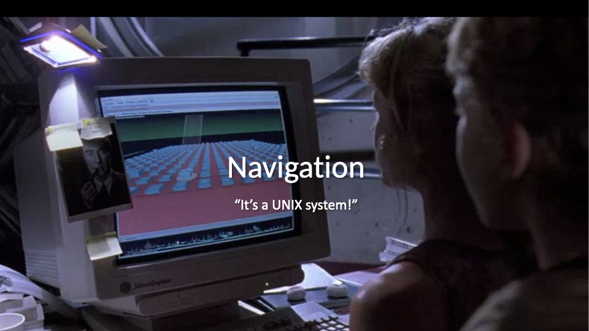{fig-align="center" width="90%"}

## 

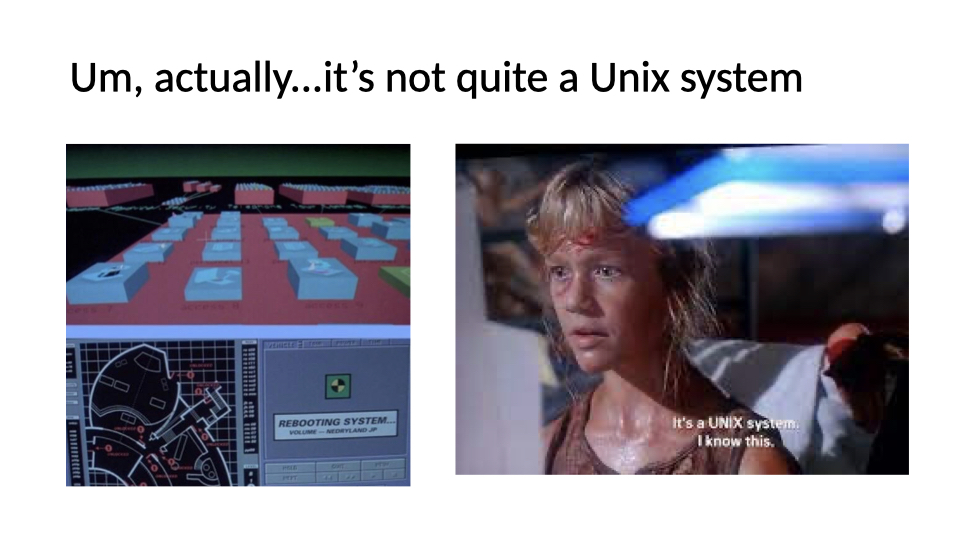{fig-align="center" width="90%"}

## The way you normally navigate

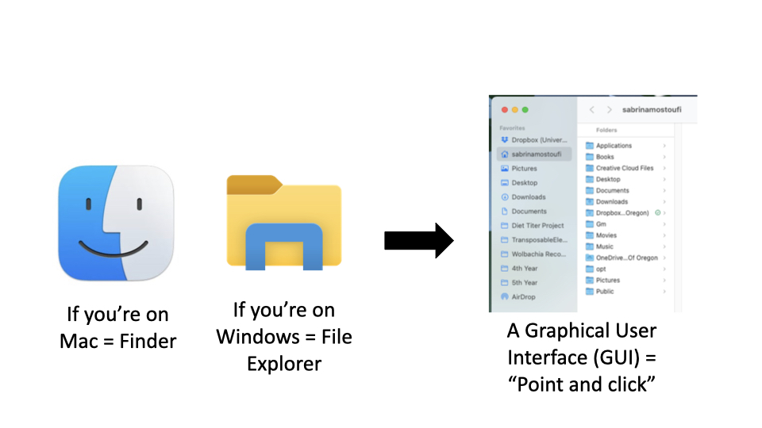{fig-align="center" width="90%"}

## 

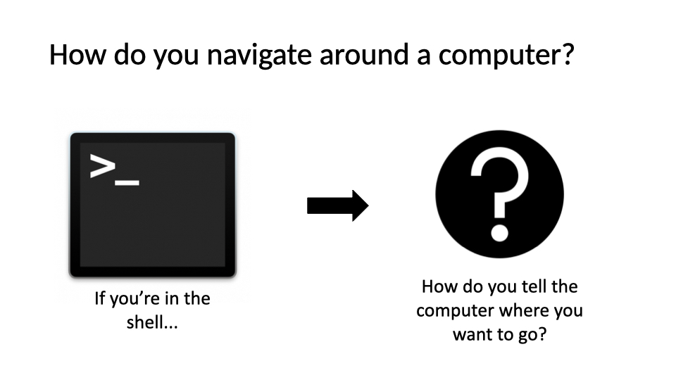{fig-align="center" width="90%"}

## How is a computer organized?

-   System of directories (folders) and files
-   / = the root directory, which holds all other directories
-   Most of your files will be located under /Users in a directory of your username
-   the `~` is shorthand for your home folder
-   Navigation in the shell consists of jumping up and down between directories and seeing what's in them
-   The "path" refers to the location a file is in
    -   ex: "/Users/wcresko/Documents"

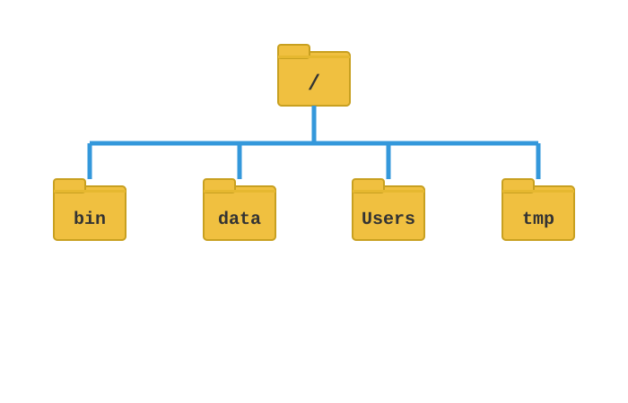{fig-align="center" width="100%"}

## The Unix file hierarchy

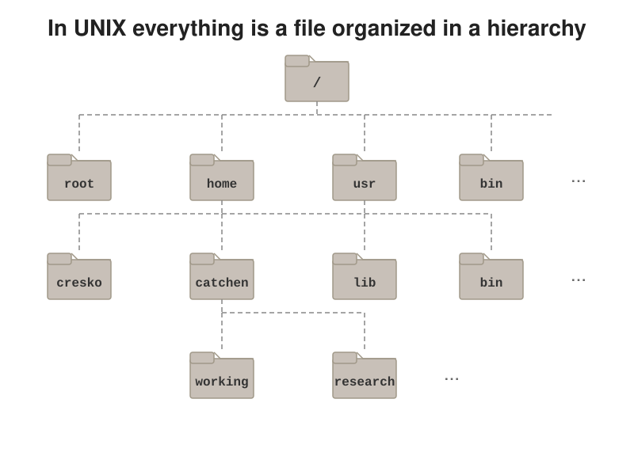{fig-align="center" width="90%"}

## Paths - the address of a file in the tree

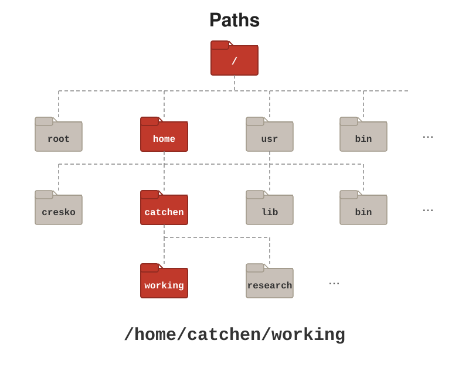{fig-align="center" width="90%"}

## Special files - the 'dot' entries

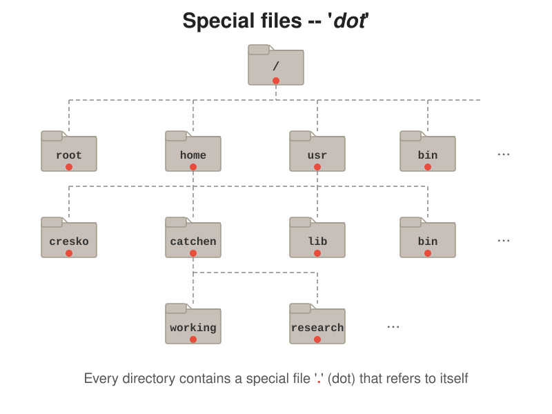{fig-align="center" width="90%"}

## `.` refers to the directory you are in

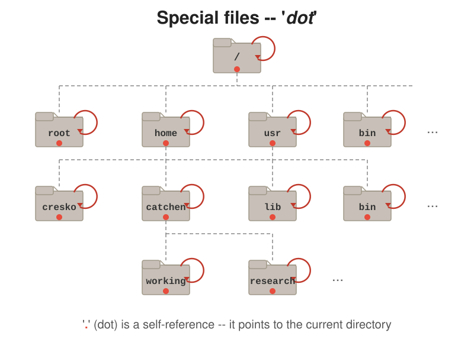{fig-align="center" width="90%"}

## `..` refers to the parent directory

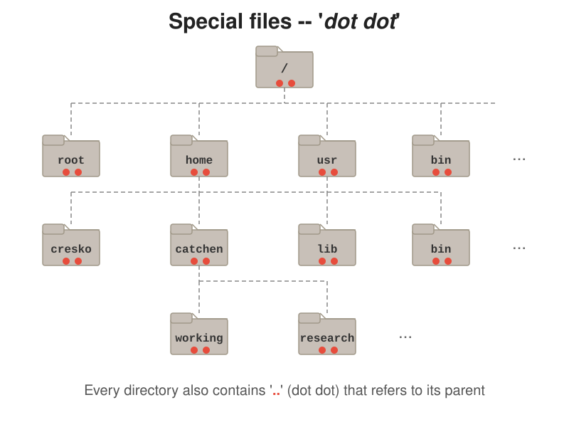{fig-align="center" width="90%"}

## Navigating with `..`

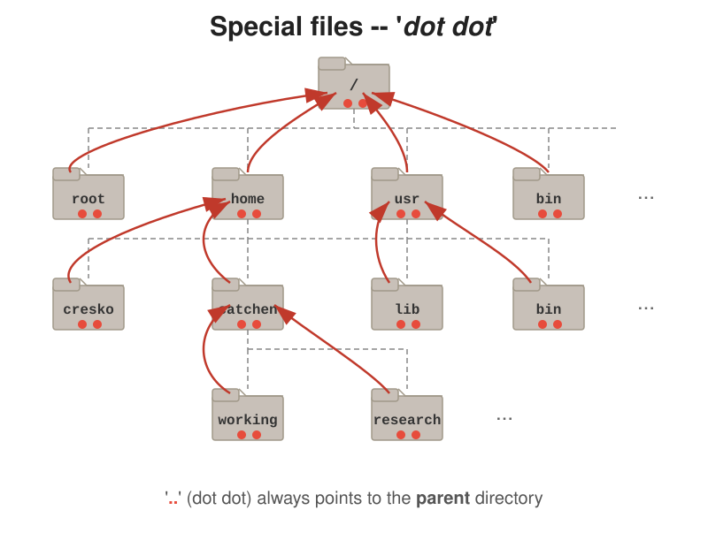{fig-align="center" width="90%"}

## Relative vs. absolute paths

::: panel-tabset
### Concept

-   **Absolute path**: the full path from the root `/` (e.g., `/Users/wcresko/Documents`) - works from anywhere
-   **Relative path**: the path from where you are right now (e.g., `../Documents`) - portable, but depends on your current directory
-   `.` refers to the current directory
-   `..` refers to the parent directory
-   `~` refers to your home directory

### Examples

``` bash
# Absolute path
cd /Users/wcresko/Documents

# Relative paths
cd ..           # Go up one directory
cd ./data       # Go into data directory (same as cd data)
cd ../scripts   # Go up one, then into scripts
cd ~            # Go to home directory
cd -            # Go to previous directory
```
:::

## Common navigation commands

::: incremental
-   **`pwd`** = "print working directory": where am I right now?
-   **`ls`** = "list" all directories and files in your current position
    -   `ls -F` = mark which results are directories, files, etc.
    -   `ls -l` = "long format": permissions, owner, sizes, dates
    -   `ls -S` = sort by **s**ize; `ls -t` = sort by **t**ime, newest first; add `-r` to **r**everse either order
-   **`cd`** = "change directory": move to a new position based on your path argument
    -   `cd ..` = go up one directory
    -   `cd ~` = go to my home directory
    -   `cd -` = go back to the directory you were in last (like a browser's back arrow)
:::

## Let's practice!

-   Try navigating around your computer using `cd` and `ls`
-   If you are on Ubuntu, you may need to create some empty directories in your Ubuntu folder before navigating in the terminal

# Working with files

## Making new files

::: incremental
-   Make new folders: `mkdir`
-   Make new files: `nano`, `touch`
-   Rename files: `mv`
-   Move files: `mv`
-   Copy files: `cp`
-   Delete files: `rm`
-   Delete directories: `rmdir`
-   Examining file length: `wc`
-   (Reading what's *inside* a file - `cat`, `less`, `head`, `tail` - gets its own section shortly)
:::

## Editing a file in the terminal: `nano`

``` bash
nano Practice.txt     # open the file (creating it if it doesn't exist)
```

-   Type normally; arrow keys move the cursor - no mouse here
-   The `^` shortcuts along the bottom mean **Ctrl**:
    -   `Ctrl-O`, then Enter = save ("write **O**ut")
    -   `Ctrl-X` = exit (it offers to save if you forgot)
    -   `Ctrl-K` cuts a whole line; `Ctrl-U` pastes it back
-   Prefer a familiar window? Positron edits the same files - but `nano` is what you'll have on **Talapas** (L08), where there is no point-and-click

## Things to keep in mind

-   The shell trusts you
    -   It will delete files you say to delete
    -   It will override files if you name 2 things the same
-   Naming conventions
    -   Avoid spaces
    -   Don't start with a -
    -   Stick to letters, numbers, . , -, and \_
-   Use appropriate file extensions in file names
    -   Some software expect files with certain extensions (.fasta, .txt, etc.)

## Let's try it out

-   Make a new directory called whatever you'd like.
-   Add a file named "Practice.txt" to the directory and add some text to it
-   Read the contents of the file and get its length
-   Rename the file to "Super_practice.txt"
-   Move the file to a new folder named "Testing"
-   Make a copy of the file named "Super_practice_copy.txt"
-   Read the contents of the file and get its length to make sure it's the same as Super_practice.txt
-   Delete the original "Super_practice.txt"

## Useful flags for file commands

| Command            | Effect                                                     |
|--------------------|------------------------------------------------------------|
| `ls -l`            | Long listing: permissions, owner, size, date               |
| `ls -a`            | Show hidden "dot" files (names starting with `.`)          |
| `ls -lh`           | Human-readable sizes (K, M, G)                             |
| `ls -lt`           | Sort by modification time, newest first                    |
| `cp -r src/ dst/`  | Copy a directory and everything in it                      |
| `rm -i file`       | Ask before deleting each file                              |
| `rm -r dir/`       | Delete a directory **and all its contents** - no undo!     |
| `mkdir -p a/b/c`   | Make nested directories in one step                       |

::: callout-warning
The shell has **no Trash**. Double-check the path before `rm -r`, and never combine it with a wildcard (`rm -r *`) without thinking twice.
:::

# Wildcards

## Wildcards - one command, many files

``` bash
touch sample_01.fastq sample_02.fastq sample_03.fastq control.fastq notes.md

ls *.fastq              # everything ending in .fastq
ls sample_*.fastq       # the three sample_ files
ls sample_0?.fastq      # ? matches exactly one character
ls sample_0[12].fastq   # only sample_01 and sample_02
ls *.{fastq,md}         # brace expansion: .fastq OR .md
```

| Pattern     | Matches                                   |
|-------------|-------------------------------------------|
| `*`         | Any string of characters (including none) |
| `?`         | Exactly one character                     |
| `[abc]`     | Any one character in the set              |
| `[a-z]`     | Any one character in the range            |
| `{foo,bar}` | Either `foo` or `bar` (brace expansion)   |

::: callout-tip
The **shell** expands wildcards *before* the command runs - so `rm *.fastq` deletes every matching file at once. Run `ls *.fastq` first to see exactly what will be affected. More in the [Unix Fundamentals chapter](../book/chapters/04-unix-fundamentals.html) of the course book.
:::

# Reading Files in Unix

## Commands for Reading Files

::: incremental
-   **`cat`** = concatenate and display files
    -   Shows entire file at once
    -   Good for small files
-   **`less`** = view file page by page
    -   Navigate with space (forward), b (back), q (quit)
    -   Search with /pattern
-   **`more`** = similar to less but simpler
    -   Space to go forward, q to quit
-   **`head`** = display first 10 lines (default)
    -   `head -n 20 file.txt` shows first 20 lines
-   **`tail`** = display last 10 lines (default)
    -   `tail -n 20 file.txt` shows last 20 lines
    -   `tail -f file.txt` follows file as it grows (useful for logs)
:::

## Input Redirection

::: incremental
-   **`<`** = redirect input from a file
    -   `command < input.txt`
    -   Sends contents of file as input to command
-   **`<<`** = here document (multi-line input)
    -   Allows you to provide multi-line input directly in the terminal
-   Example uses:
    -   `wc -l < data.txt` counts lines in data.txt
    -   `sort < names.txt` sorts contents of names.txt
    -   Many commands can read from files directly OR from `stdin`
:::

# Writing Files in Unix

## Output Redirection

::: incremental
-   **`>`** = redirect output to a file (overwrites)
    -   `ls -l > filelist.txt`
    -   Creates new file or overwrites existing
-   **`>>`** = append output to a file
    -   `echo "new line" >> existing.txt`
    -   Adds to the end of existing file
-   **`2>`** = redirect error messages
    -   `command 2> errors.txt`
    -   Captures error messages separately
-   **`&>`** = redirect both output and errors
    -   `command &> all_output.txt`
:::

## Redirection, visually

::::: columns
::: {.column width="50%"}
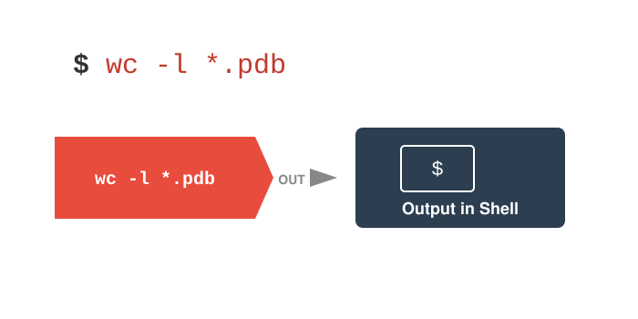{width="100%"}
:::

::: {.column width="50%"}
{width="100%"}
:::
:::::

# Unix Pipes

## What are Pipes?

::: incremental
-   **`|`** = the pipe operator
    -   Takes output from one command as input to another
    -   Chains commands together
    -   No intermediate files needed!
-   Basic syntax:
    -   `command1 | command2 | command3`
-   Power of Unix philosophy:
    -   Small tools that do one thing well
    -   Combine them to do complex tasks
:::

## Pipes, visually

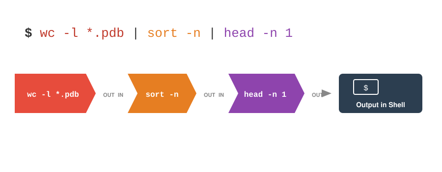{fig-align="center" width="90%"}

## Common Pipe Patterns

::: incremental
-   **Counting patterns:**
    -   `grep "pattern" file.txt | wc -l`
    -   Count lines matching a pattern
-   **Sorting and uniqueness:**
    -   `cat file.txt | sort | uniq`
    -   Sort lines and remove duplicates
-   **Finding top/bottom items:**
    -   `sort data.txt | head -5`
    -   Get top 5 after sorting
-   **Filtering and processing:**
    -   `ls -l | sort -k5,5n | tail -3`
    -   The three biggest files in a folder (column 5 of `ls -l` is the size)
:::

::: callout-note
A few of these examples **preview commands we haven't covered yet**: `grep` searches for text patterns (all of L03), and `cut` picks columns (you'll use it on the course data in a few slides). Focus on the *shape* of the pipelines today - the pieces get their own lectures.
:::

## Advanced Pipe Examples

::: incremental
-   **Multi-step data processing:**
    -   `cat data.csv | cut -d',' -f2 | sort | uniq -c | sort -rn`
    -   Extract column 2, count unique values, sort by frequency
-   **Real-time monitoring:**
    -   `tail -f logfile.txt | grep ERROR`
    -   Watch log file for errors in real-time
-   **Complex transformations:**
    -   `wc -l *.txt | sort -n`
    -   Line counts for every txt file, smallest first (`find` + `xargs` do this across whole directory trees - L04)
:::

## Combining It All Together

Example workflow:

``` bash
# Read a file, process it, save results, and display
cat data.txt | \
  grep -v "^#" | \       # Remove comment lines
  cut -f1,3 | \          # Extract columns 1 and 3
  sort -k2 -n | \        # Sort by column 2 numerically
  tee results.txt | \    # Save to file
  head -10               # Show top 10
```

::: notes
The backslash allows you to continue commands on multiple lines for readability
:::

## Practice Exercise: Files and Pipes

Try these exercises:

1.  Create a file with a list of numbers (one per line)
2.  Use pipes to sort them numerically
3.  Save the sorted list to a new file using redirection
4.  Use `tee` to display and save the top 5 numbers
5.  Count how many unique numbers you have using pipes
6.  Append the count to your results file

## Tips for Working with Files and Pipes

::: incremental
-   Test pipes step by step
    -   Build complex pipes incrementally
    -   Check output at each stage
-   Use `less` for large files instead of `cat`
-   Remember: `>` overwrites, `>>` appends
-   Pipe efficiency:
    -   Filter early in the pipeline
    -   Reduces data passed between commands
-   Save intermediate results when debugging complex pipes
:::

------------------------------------------------------------------------

# Shell scripts - saving commands to reuse

## From commands to scripts

::: incremental
-   A **shell script** is just a plain-text file of the commands you would have typed, run top to bottom
-   Anything you can type at the prompt - navigation, redirection, whole pipelines - can live in a script
-   Why bother?
    -   **Reproducibility** - an exact, re-runnable record of what you did (your lab notebook for data)
    -   **Automation** - rerun the whole thing with one command when new data arrive
    -   **Sharing** - hand a collaborator the script, not a list of instructions
-   Convention: name them with `.sh` and keep them in your project's `scripts/` folder
:::

## Your first shell script

Put these two lines in a file called `hello.sh` (using `nano`, Positron, or even `cat >`):

``` bash
#!/usr/bin/env bash
echo "Hello from $(whoami) on $(date '+%Y-%m-%d')"
```

::: incremental
-   Line 1 is the **shebang**: `#!` tells Unix *which program* should interpret the rest of the file - here, bash
-   Every other line starting with `#` is a **comment** - write lots of them
-   Now run it:

``` bash
./hello.sh
# bash: ./hello.sh: Permission denied
```

-   Denied! To understand why, we need to look at **file permissions**
:::

## File permissions - what `ls -l` is telling you

``` bash
ls -l hello.sh
# -rw-r--r--  1 bill  staff  63 Oct  5 16:10 hello.sh
```

That first column is ten characters: a file-type flag, then **three triplets** of `rwx`:

|  | Characters | Who | Meaning |
|-----------|:---------:|------------------|------------------------------|
| `-` | 1 | file type | `-` file, `d` directory, `l` link |
| `rw-` | 2-4 | **u**ser (owner) | owner can **r**ead and **w**rite |
| `r--` | 5-7 | **g**roup | group members can read |
| `r--` | 8-10 | **o**ther | everyone else can read |

::: incremental
-   `r` = read, `w` = write, `x` = **execute** - permission to *run* the file as a program
-   New files get `rw-` but never `x` - that is why `./hello.sh` was denied
-   On a **directory**, `x` means "may `cd` into it"
:::

## Changing permissions with `chmod`

`chmod` (*change mode*) adds or removes permissions: **who** (`u`/`g`/`o`/`a`) **+/-** **which** (`r`/`w`/`x`)

``` bash
chmod u+x hello.sh    # let the owner (you) execute it
chmod +x hello.sh     # the common shortcut: execute for everyone
./hello.sh            # now it runs!
# Hello from bill on 2026-10-05
```

More examples of the same pattern:

``` bash
chmod go-w notes.txt     # group and others may no longer write
chmod a-w data/raw/*     # nobody can write: protect your raw data!
chmod u+x scripts/*.sh   # make all your scripts runnable at once
ls -l                    # always verify what changed
```

::: callout-tip
**The habit to build today**: every time you write or download a script, it needs `chmod +x` once before `./script.sh` will work. (`bash script.sh` works without `x`, because there you are running `bash`, not the script.)
:::

## `chmod` by the numbers {.smaller}

You will often see permissions as three digits - each digit is one triplet, adding `r`=4, `w`=2, `x`=1:

| Number | Triplets | Meaning | Typical use |
|:------:|:-----------:|------------------------------|---------------|
| `755` | `rwxr-xr-x` | you do everything; others read + run | scripts |
| `644` | `rw-r--r--` | you read + write; others read | data, documents |
| `600` | `rw-------` | only you, at all | sensitive files |
| `444` | `r--r--r--` | read-only for everyone | raw data |

``` bash
chmod 755 hello.sh       # identical to: chmod u+rwx,go+rx hello.sh
chmod 444 data/raw/*.tsv # raw data: look, don't touch
```

-   Both styles are everywhere; read `755` out loud as its triplets until it feels natural
-   You will meet permissions again on Talapas (L08), where your **group** controls who in the lab sees shared files

## Four scripts to take home {.smaller}

Written for this course - download from the [Schedule](../Schedule.html) (week 2) or [Example Files](../Examples.html) page, read the comments, make them yours:

| Script | What it does |
|-----------------------|-----------------------------------------------|
| [`file_inventory.sh`](../Examples_Folder/scripts_week02/file_inventory.sh) | Reports every file in a folder - grouped by file type, largest total first, with each file's permissions and size - written out to a report file |
| [`make_project.sh`](../Examples_Folder/scripts_week02/make_project.sh) | Builds the Lecture 01 project structure (`data/raw`, `scripts/`, `output/`, `docs/`) with template `README.md`, `.R`, `.py` and `.qmd` files |
| [`filter_rows.sh`](../Examples_Folder/scripts_week02/filter_rows.sh) + [`total_counts.sh`](../Examples_Folder/scripts_week02/total_counts.sh) | A two-script **pipeline** for the course dataset: the output of one is the input of the other |
| [`backup_project.sh`](../Examples_Folder/scripts_week02/backup_project.sh) | Snapshots a project into a dated `.tar.gz` (skipping expendable `output/`) |

``` bash
chmod +x *.sh    # remember: once per download, or they won't run
```

## Scripts that feed each other

Because both pipeline scripts read **stdin** and write **stdout**, they chain with `|` exactly like built-in commands:

``` bash
# Which genotype-A fish have the most RNA-seq reads?
./filter_rows.sh Genotype A < Stickle_RNAseq.tsv |
    ./total_counts.sh |
    sort -t$'\t' -k2,2nr |
    head -5
```

::: incremental
-   `filter_rows.sh` keeps the header + the rows you ask for → `total_counts.sh` sums the 600 gene columns per fish
-   Then the *built-ins* take over: `sort` ranks, `head` trims - your scripts are now part of the Unix toolkit
-   This is the design to copy: small tools, plain text in and out, joined by pipes
-   Everything in today's lecture - paths, redirection, pipes, permissions - in four short files
:::

------------------------------------------------------------------------

# Running example: the stickleback RNA-seq table

## First look at a real data file

You downloaded it at the start of class - now use what you learned today:

``` bash
cd ~/projects/comptools

ls -lh data/                      # how big is it?
wc -l data/Stickle_RNAseq.tsv      # how many lines (fish + header)?
head -n 3 data/Stickle_RNAseq.tsv | cut -f 1-6     # first rows, first 6 columns only
cut -f 2 data/Stickle_RNAseq.tsv | sort | uniq -c  # how many fish per genotype?
cut -f 3 data/Stickle_RNAseq.tsv | sort | uniq -c  # ...and per microbiota treatment
head -n 1 data/Stickle_RNAseq.tsv | tr '\t' '\n' | wc -l   # how many columns?
```

::: callout-tip
`cut -f` picks **columns** from a tab-separated file, `sort | uniq -c` **counts** categories, and `tr '\t' '\n'` turns one wide header line into one name per line so `wc -l` can count them. Every one of these is a one-word answer to a question about the data - no spreadsheet needed.
:::

## Before next week

::: incremental
-   Today: paths and navigation, making and editing files, redirection, pipes - and your first shell scripts with `chmod +x`
-   Grab the four scripts from the [Schedule](../Schedule.html) (week 2) and run them on your own folders
-   **Next week (L03)**: is our dataset *tidy*? Tidy data principles, then `grep` and regular expressions for searching files
-   **Read**: [Ch. 7](../book/chapters/07-files-pipes.html), [Ch. 8](../book/chapters/08-tidy-data.html) and [Ch. 9](../book/chapters/09-grep-regex.html); keep [App. B](../book/chapters/appendix-B-unix.html) open while you practice
:::
