```{r}
#| label: setup
#| include: false

# Packages used in the lecture examples
library(tidyverse)
library(gt)
library(readxl)

# Consistent theme for all plots
theme_set(theme_minimal(base_size = 14))

# Reproducible random numbers
set.seed(2026)
```


## Goals for today

-   Deeper dive into Unix tools
-   Reading and writing files
-   Tidy data
-   Advanced Unix tools to manipulate large files

# Computational Tools - The Command Line

{fig-align="center" width="90%"}

## What is Unix?

-   An operating system developed at Bell Labs in 1969, released in 1973
-   Now a family of operating systems: Linux, macOS, and others share the Unix design
-   Runs both locally on your computer and on large clusters like Talapas
-   Its **shell** gives you a scripting language for talking to the operating system
-   Linux is an open-source operating system built on the same design

## What is a shell? {background-image="images/w1_shell.jpeg"}

-   The ‘shell’ is a program that runs UNIX and takes in commands and gives them to the operating system

-   **`bash`** (Linux, WSL, Talapas) and **`zsh`** (macOS default) are the common shells - nearly identical for our purposes

-   You can access the shell via a **`terminal window`**

##  {background-image="images/w1_shell.jpeg"}

{width="90%" fig-align="center"}

## Recipes for a shell command

-   **Prompt**: notation used to indicate your computer is ready to accept a new command
-   **Command**: the building blocks of programming, tell computer to do a specific task
-   **Options**: change the behavior of a command
-   **Argument**: what the command should operate on

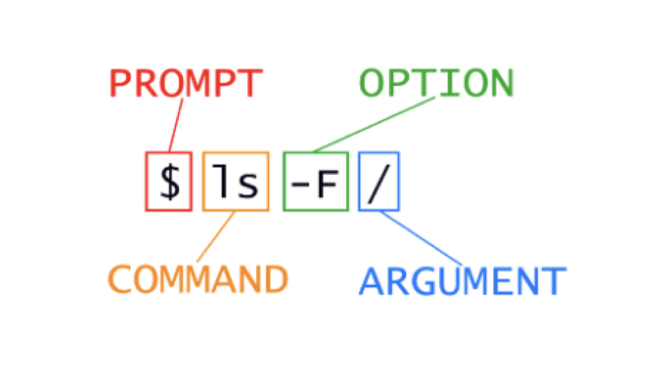{width="150%" fig-align="center"}

## Why use the shell?

::: incremental
-   Speed
-   Can handle extremely large file sizes
-   Use programs only available via shell
-   The commands work almost identically across platforms
-   You can even use them on a large computer cluster like Talapas and AWS
-   It is incredibly powerful particularly for repeated actions
-   It allows you to do thousands of ‘clicks’ with single commands
:::

## Where do you get help?

-   Manual pages!
    -   The shell has manuals for all basic commands
    -   Type `man [command_name]` to access the manual for a specific command
    -   Type `q` to exit
-   Also...the internet!
-   Also... Generative AI (ChaptGPT, Claude, etc..)

# Common navigation commands

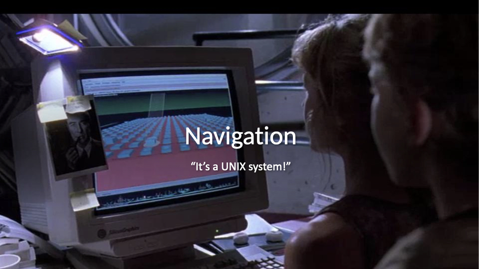{fig-align="center" width="90%"}

## 

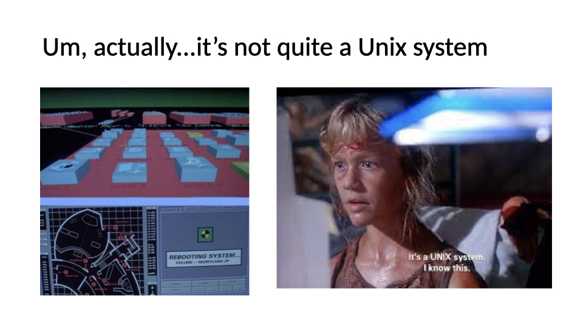{fig-align="center" width="90%"}

## The way you normally navigate

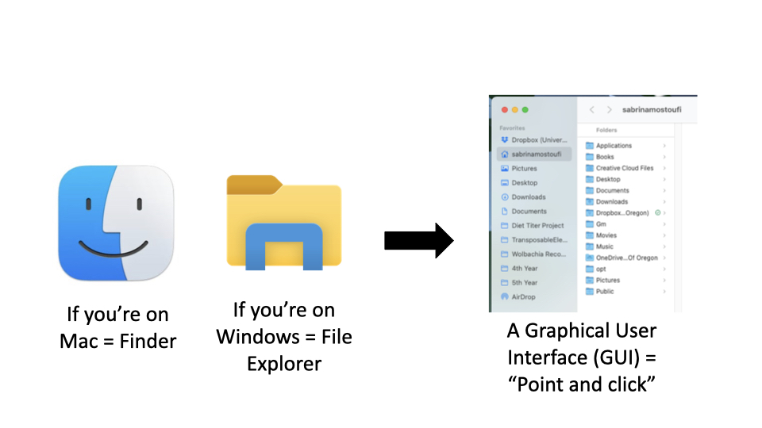{fig-align="center" width="90%"}

## 

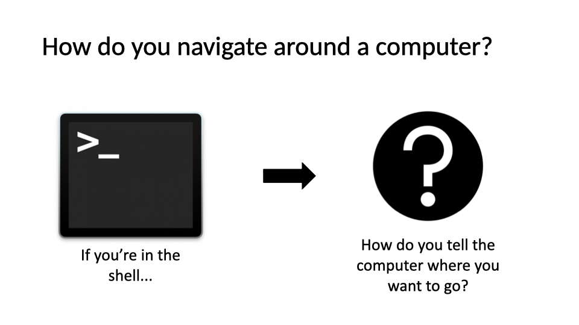{fig-align="center" width="90%"}

## How is a computer organized?

-   System of directories (folders) and files
-   / = the root directory, which holds all other directories
-   Most of your files will be located under /Users in a directory of your username
-   the `~` is shorthand for your home folder
-   Navigation in the shell consists of jumping up and down between directories and seeing what’s in them
-   The "path" refers to the location a file is in
    -   ex: "/Users/wcresko/Documents"

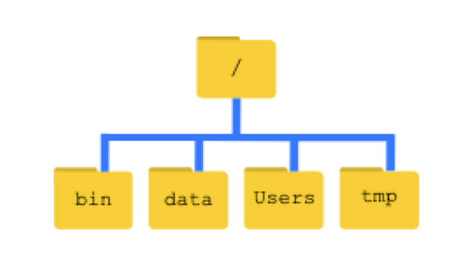{fig-align="center" width="100%"}

## 

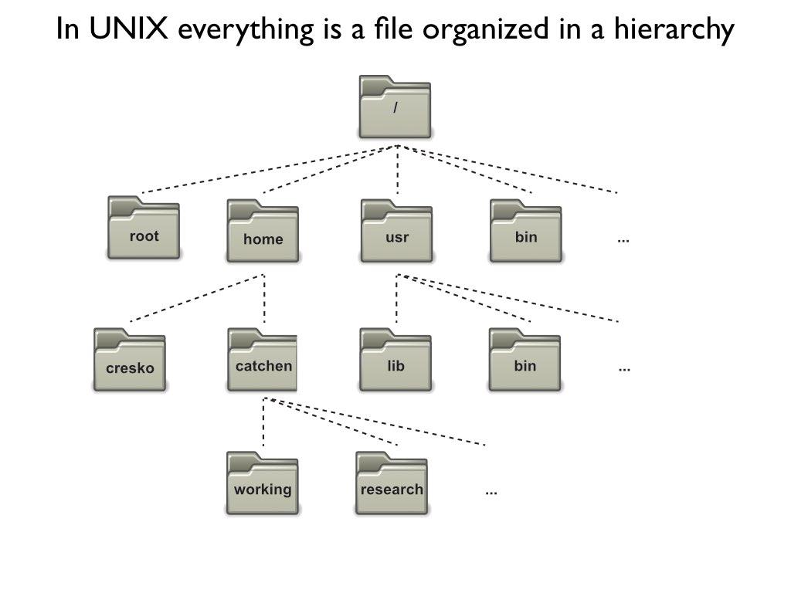{fig-align="center" width="90%"}

## 

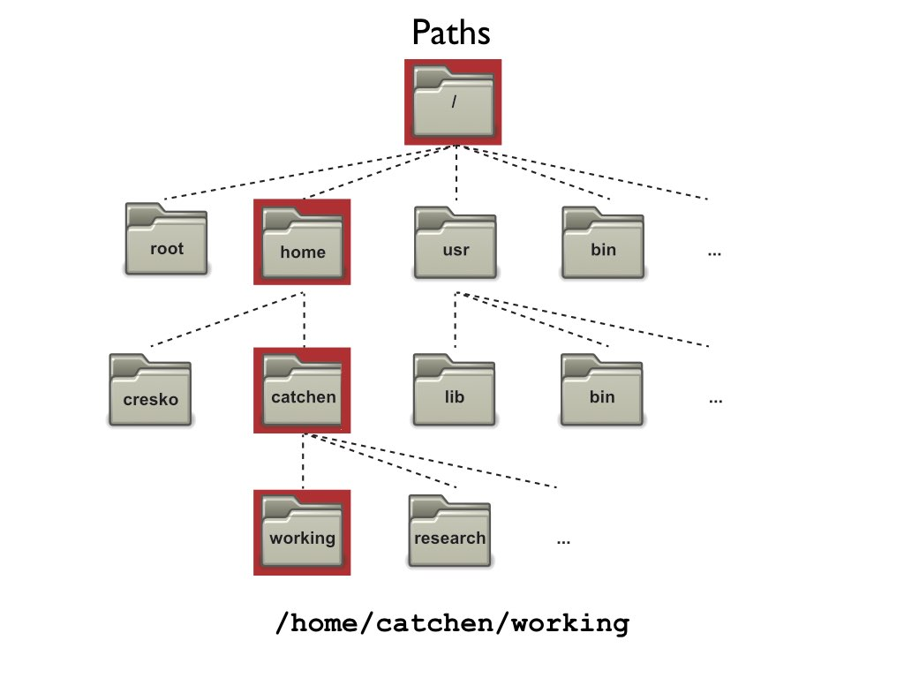{fig-align="center" width="90%"}

## 

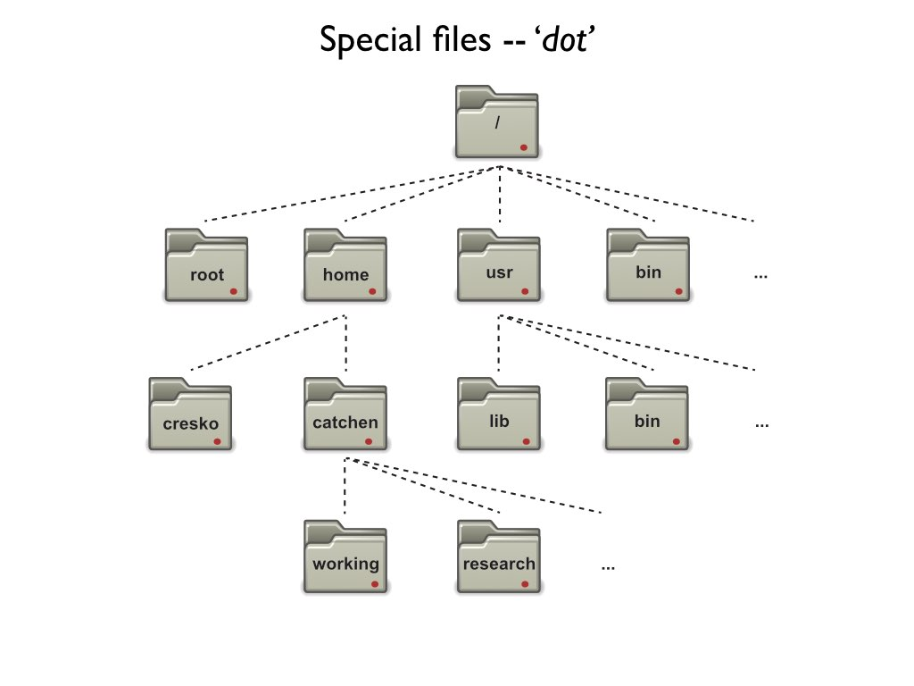{fig-align="center" width="90%"}

## 

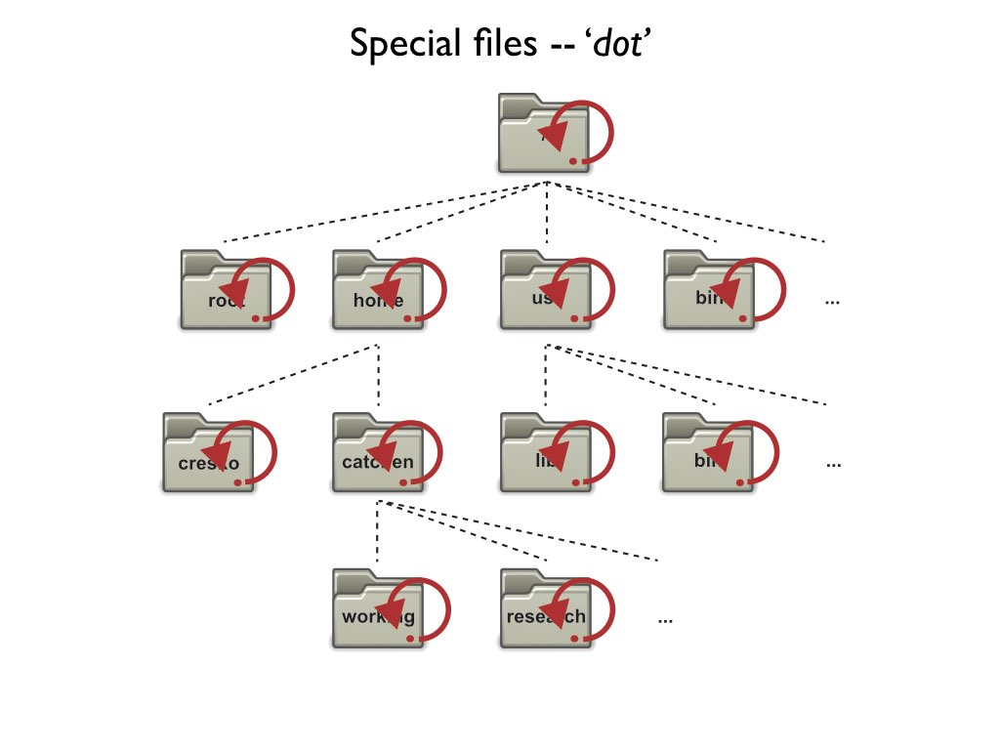{fig-align="center" width="90%"}

## 

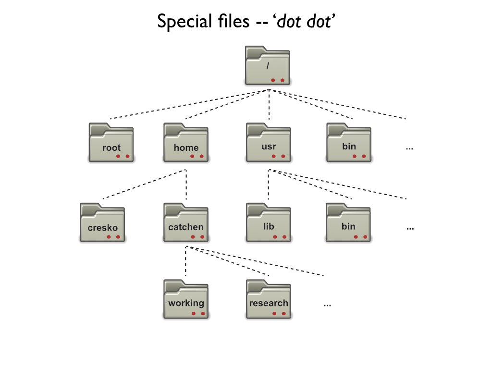{fig-align="center" width="90%"}

## 

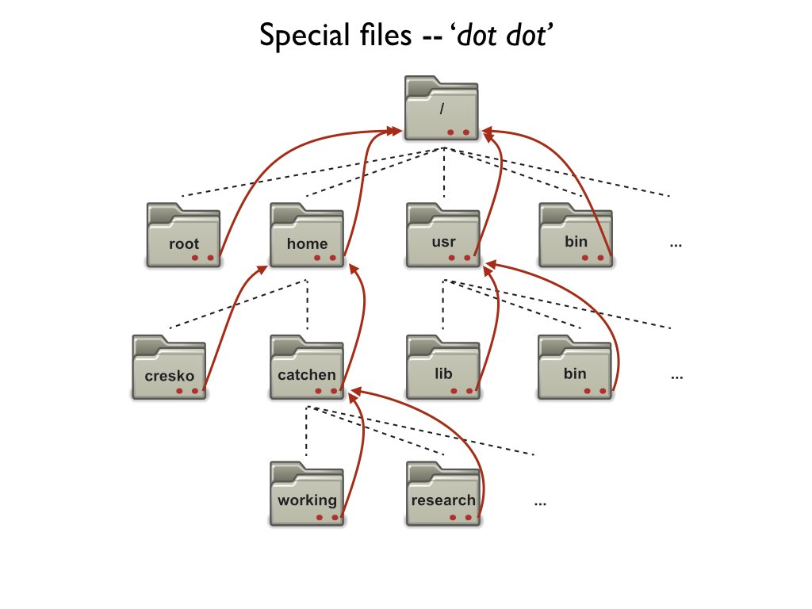{fig-align="center" width="90%"}

## 

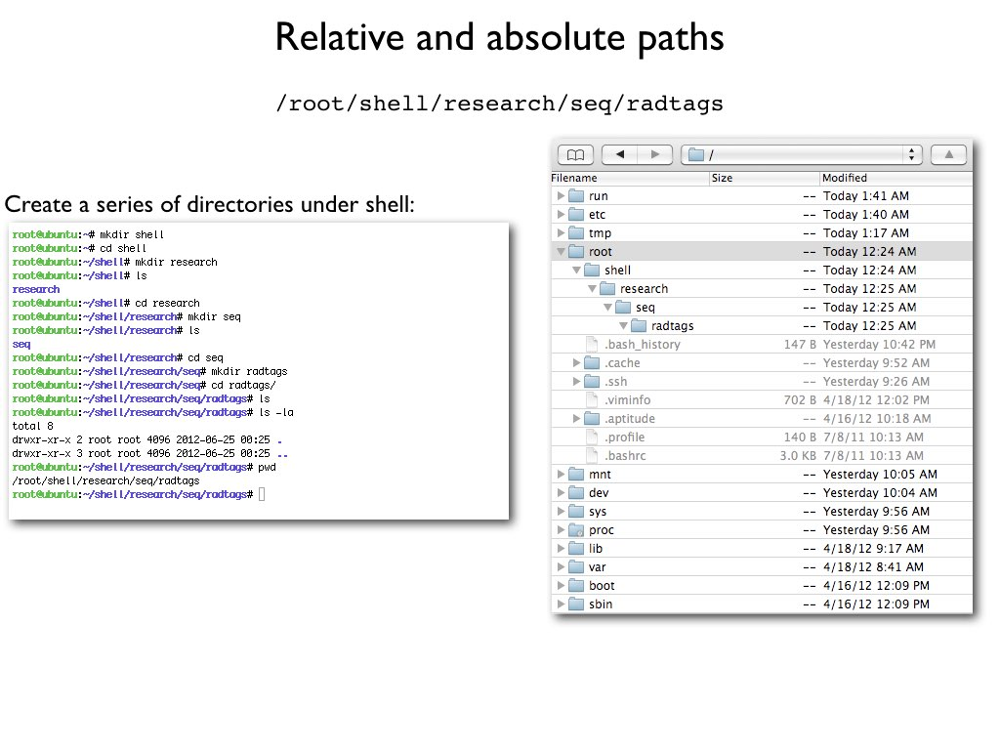{fig-align="center" width="90%"}

## Common navigation commands

::: incremental
-   **`pwd`** = “print working directory”, which will print where you currently are in the system
-   **`ls`** = “list”, list all directories and files in your current position
    -   `ls –F` = denote which results are directories, files, etc.
    -   `ls –l` = ”long format”, lists total file sizes
    -   `ls –r` = “reverse”, lists the results in reverse order
    -   `ls –S` = “size”, sort results by size
    -   `ls –t` = “time”, sort results by time created, from most recent to last
:::

## Common Navigation Commands

-   `cd` = “change directory”, will place you in a new position based on your path argument
    -   `cd ..` "go up one directory"
    -   `cd –` "go to the directory you were at last (like the back arrow on an internet browser)"
    -   `cd ~` "go to my home directory"

## Let's practice!

-   Try navigating around your computer using `cd` and `ls`
-   If you are on Ubuntu, you may need to create some empty directories in your Ubuntu folder before navigating in the terminal

# Working with files

## Making new files

::: incremental
-   Make new folders: `mkdir`
-   Make new files: `nano`, `touch`
-   Rename files: `mv`
-   Move files: `mv`
-   Copy files: `cp`
-   Delete files: `rm`
-   Delete directories: `rmdir`
-   Examining file length: `wc`
-   Reading files: `cat`
-   Looking at beginning or end: `head` or `tail`
:::

## Things to keep in mind

-   The shell trusts you
    -   It will delete files you say to delete
    -   It will override files if you name 2 things the same
-   Naming conventions
    -   Avoid spaces
    -   Don’t start with a –
    -   Stick to letters, numbers, . , -, and \_
-   Use appropriate file extensions in file names
    -   Some software expect files with certain extensions (.fasta, .txt, etc.)

## Let's try it out

-   Make a new directory called whatever you'd like.
-   Add a file named “Practice.txt” to the directory and add some text to it
-   Read the contents of the file and get its length
-   Rename the file to “Super_practice.txt”
-   Move the file to a new folder named “Testing”
-   Make a copy of the file named “Super_practice_copy.txt”
-   Read the contents of the file and get its length to make sure it’s the same as Super_practice.txt
-   Delete the original “Super_practice.txt”

## Useful flags for file commands

| Command            | Effect                                                     |
|--------------------|------------------------------------------------------------|
| `ls -l`            | Long listing: permissions, owner, size, date               |
| `ls -a`            | Show hidden "dot" files (names starting with `.`)          |
| `ls -lh`           | Human-readable sizes (K, M, G)                             |
| `ls -lt`           | Sort by modification time, newest first                    |
| `cp -r src/ dst/`  | Copy a directory and everything in it                      |
| `rm -i file`       | Ask before deleting each file                              |
| `rm -r dir/`       | Delete a directory **and all its contents** - no undo!     |
| `mkdir -p a/b/c`   | Make nested directories in one step                       |

::: callout-warning
The shell has **no Trash**. Double-check the path before `rm -r`, and never combine it with a wildcard (`rm -r *`) without thinking twice.
:::

# Wildcards

## Wildcards - one command, many files

``` bash
touch sample_01.fastq sample_02.fastq sample_03.fastq control.fastq notes.md

ls *.fastq              # everything ending in .fastq
ls sample_*.fastq       # the three sample_ files
ls sample_0?.fastq      # ? matches exactly one character
ls sample_0[12].fastq   # only sample_01 and sample_02
ls *.{fastq,md}         # brace expansion: .fastq OR .md
```

| Pattern     | Matches                                   |
|-------------|-------------------------------------------|
| `*`         | Any string of characters (including none) |
| `?`         | Exactly one character                     |
| `[abc]`     | Any one character in the set              |
| `[a-z]`     | Any one character in the range            |
| `{foo,bar}` | Either `foo` or `bar` (brace expansion)   |

::: callout-tip
The **shell** expands wildcards *before* the command runs - so `rm *.fastq` deletes every matching file at once. Run `ls *.fastq` first to see exactly what will be affected. More in the [Unix Fundamentals chapter](../book/chapters/03-unix-fundamentals.html) of the course book.
:::

# Reading Files in Unix

## Commands for Reading Files

::: incremental
-   **`cat`** = concatenate and display files
    -   Shows entire file at once
    -   Good for small files
-   **`less`** = view file page by page
    -   Navigate with space (forward), b (back), q (quit)
    -   Search with /pattern
-   **`more`** = similar to less but simpler
    -   Space to go forward, q to quit
-   **`head`** = display first 10 lines (default)
    -   `head -n 20 file.txt` shows first 20 lines
-   **`tail`** = display last 10 lines (default)
    -   `tail -n 20 file.txt` shows last 20 lines
    -   `tail -f file.txt` follows file as it grows (useful for logs)
:::

## Input Redirection

::: incremental
-   **`<`** = redirect input from a file
    -   `command < input.txt`
    -   Sends contents of file as input to command
-   **`<<`** = here document (multi-line input)
    -   Allows you to provide multi-line input directly in the terminal
-   Example uses:
    -   `wc -l < data.txt` counts lines in data.txt
    -   `sort < names.txt` sorts contents of names.txt
    -   Many commands can read from files directly OR from `stdin`
:::

# Writing Files in Unix

## Output Redirection

::: incremental
-   **`>`** = redirect output to a file (overwrites)
    -   `ls -l > filelist.txt`
    -   Creates new file or overwrites existing
-   **`>>`** = append output to a file
    -   `echo "new line" >> existing.txt`
    -   Adds to the end of existing file
-   **`2>`** = redirect error messages
    -   `command 2> errors.txt`
    -   Captures error messages separately
-   **`&>`** = redirect both output and errors
    -   `command &> all_output.txt`
:::

# Unix Pipes

## What are Pipes?

::: incremental
-   **`|`** = the pipe operator
    -   Takes output from one command as input to another
    -   Chains commands together
    -   No intermediate files needed!
-   Basic syntax:
    -   `command1 | command2 | command3`
-   Power of Unix philosophy:
    -   Small tools that do one thing well
    -   Combine them to do complex tasks
:::

## Common Pipe Patterns

::: incremental
-   **Counting patterns:**
    -   `grep "pattern" file.txt | wc -l`
    -   Count lines matching a pattern
-   **Sorting and uniqueness:**
    -   `cat file.txt | sort | uniq`
    -   Sort lines and remove duplicates
-   **Finding top/bottom items:**
    -   `sort data.txt | head -5`
    -   Get top 5 after sorting
-   **Filtering and processing:**
    -   `ls -l | grep ".txt" | awk '{print $5, $9}'`
    -   List txt files with sizes
:::

## Advanced Pipe Examples

::: incremental
-   **Multi-step data processing:**
    -   `cat data.csv | cut -d',' -f2 | sort | uniq -c | sort -rn`
    -   Extract column 2, count unique values, sort by frequency
-   **Real-time monitoring:**
    -   `tail -f logfile.txt | grep ERROR`
    -   Watch log file for errors in real-time
-   **Complex transformations:**
    -   `find . -name "*.txt" | xargs wc -l | sort -n`
    -   Find all txt files and sort by line count
:::

## Combining It All Together

Example workflow:

``` bash
# Read a file, process it, save results, and display
cat data.txt | \
  grep -v "^#" | \       # Remove comment lines
  cut -f1,3 | \          # Extract columns 1 and 3
  sort -k2 -n | \        # Sort by column 2 numerically
  tee results.txt | \    # Save to file
  head -10               # Show top 10
```

::: notes
The backslash allows you to continue commands on multiple lines for readability
:::

## Practice Exercise: Files and Pipes

Try these exercises:

1.  Create a file with a list of numbers (one per line)
2.  Use pipes to sort them numerically
3.  Save the sorted list to a new file using redirection
4.  Use `tee` to display and save the top 5 numbers
5.  Count how many unique numbers you have using pipes
6.  Append the count to your results file

## Tips for Working with Files and Pipes

::: incremental
-   Test pipes step by step
    -   Build complex pipes incrementally
    -   Check output at each stage
-   Use `less` for large files instead of `cat`
-   Remember: `>` overwrites, `>>` appends
-   Pipe efficiency:
    -   Filter early in the pipeline
    -   Reduces data passed between commands
-   Save intermediate results when debugging complex pipes
:::


------------------------------------------------------------------------

# Tidy Data

## An example to get us started

## 

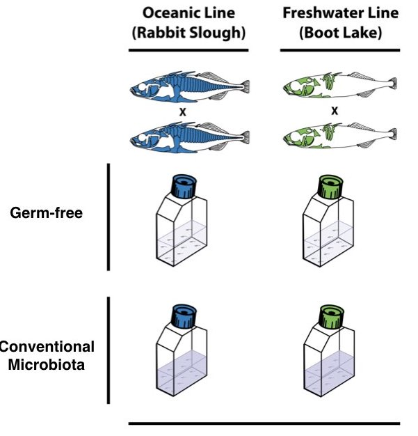{fig-align="center" width="100%"}

## 

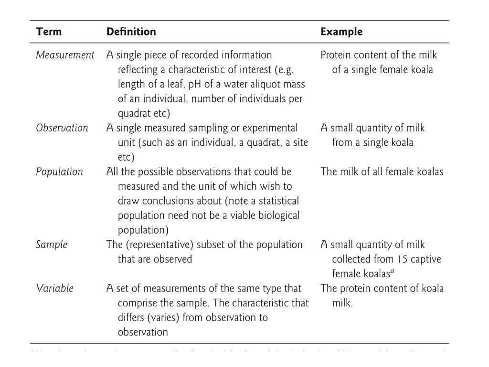{fig-align="center" width="90%"}

## Data set rules of thumb (aka Tidy Data)

-   Store a copy of data in nonproprietary software and hardware formats, such as plain ASCII text (aka a flat file)
-   Leave an uncorrected file when doing analyses
-   Use descriptive names for your data files and variables
-   Include a header line with descriptive variable names
-   Maintain effective metadata about the data (data dictionary)
-   When you add observations to a database, add rows
-   When you add variables to a database, add columns, not rows
-   A column of data should contain only one data type

## Not all data are tidy to begin with

-   Sometimes need to do some data wrangling

-   But also contingency tables

## Types of data

|  |  |  |  |
|:--:|:--:|:--:|:--:|
| Categorical |  | Quantitative |  |
| Ordinal | Nominal | Ratio | Interval |
| small, medium, large | apples, oranges, bananas | kilograms, dollars, years | temperature, calendar year |
| ordered character | character | numeric | integer |

'Factor' is a special type of character variable that we will explore more later
