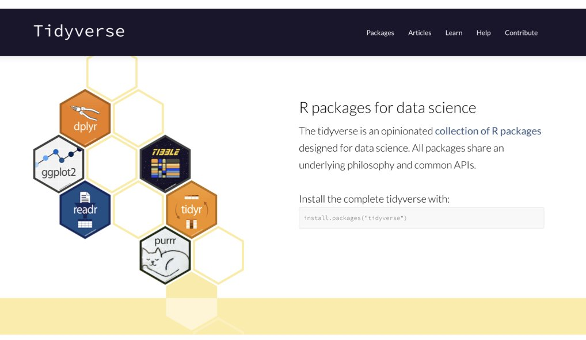
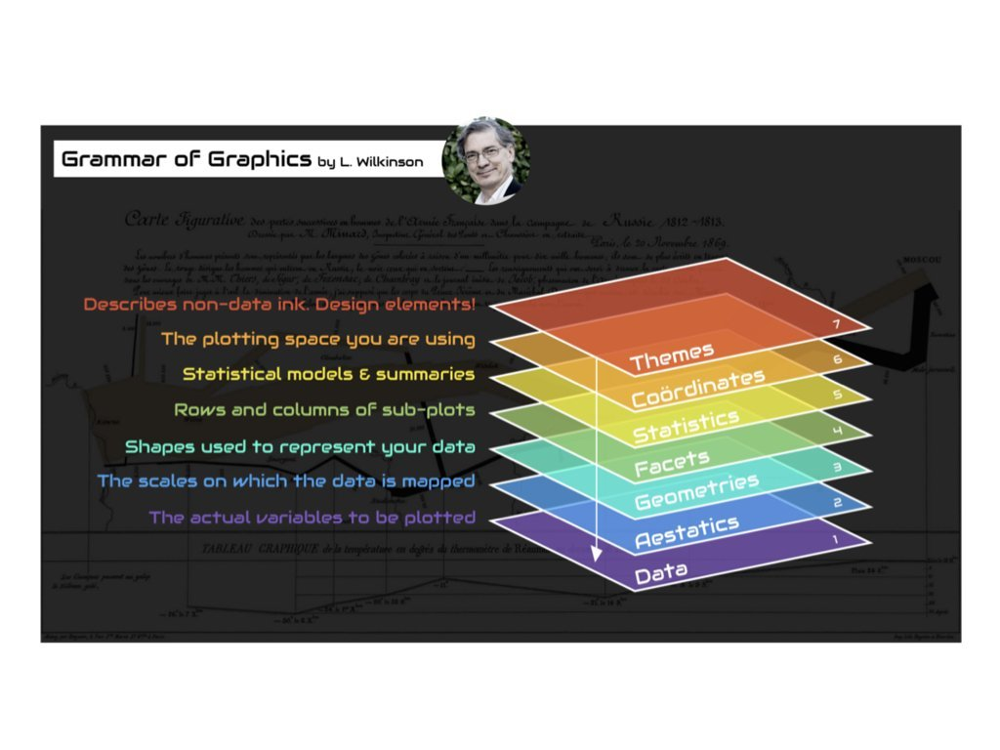

```{r}
#| label: setup
#| include: false

# Packages used in the lecture examples
library(tidyverse)
library(gt)
library(readxl)

# Consistent theme for all plots
theme_set(theme_minimal(base_size = 14))

# Reproducible random numbers
set.seed(2026)
```


## Book reading for this lecture

The course book goes deeper on everything in this lecture. Read before or after class:

-   [Ch. 8: Tidy Data Principles](../book/chapters/08-tidy-data.html)
-   [Ch. 13: Data Wrangling with the Tidyverse](../book/chapters/13-data-wrangling.html)
-   [Ch. 14: Data Visualization with ggplot2](../book/chapters/14-data-visualization.html)
-   [Ch. 15: Writing Functions in R](../book/chapters/15-writing-functions.html)
-   *Reference:* [App. E: R Command Reference](../book/chapters/appendix-E-r.html) · [App. F: Python Quick Reference](../book/chapters/appendix-F-python.html)

## Goals for today

-   Installing vs. loading packages; inspecting objects and reading error messages
-   Logical operators, filtering, type conversion and missing values
-   The tidyverse and the pipe `|>` for data wrangling
-   ggplot2 and the grammar of graphics; choosing the right plot

# Going further with R and Python

## Installing vs. loading packages

::: panel-tabset
### R

``` r
install.packages("tidyverse")   # download & install - ONCE per computer
library(tidyverse)              # load - EVERY new R session
```

::: incremental
-   **`install.packages()`** puts a package on your computer (from CRAN)
-   **`library()`** makes it available in *this* session - restarting R means re-running `library()`
-   "there is no package called ..." means you never installed it
-   Bioconductor packages (genomics) use `BiocManager::install("name")`
-   Use one function without loading the package: `readxl::read_excel("file.xlsx")`
:::

### Python

``` bash
python3 -m venv .venv && source .venv/bin/activate   # one environment per project
pip install pandas matplotlib seaborn                 # install - ONCE per environment
# alternatives: uv add pandas   |   conda install pandas
```

```{python}
#| label: lec07-import-py
#| echo: true
#| eval: false

import pandas as pd                 # load - EVERY new Python session (pd is the usual alias)
import matplotlib.pyplot as plt
from pathlib import Path            # one name from a module
```

::: incremental
-   **`pip install`** (from PyPI) puts a package in the *active environment*; `conda` also handles compiled tools (e.g. `bioconda`); `uv` is a fast modern all-in-one
-   **`import`** makes it available in *this* session
-   `ModuleNotFoundError: No module named 'pandas'` means it is not installed *in this environment*
-   `pip freeze > requirements.txt` records versions, like `renv` in R
:::
:::

## Inspecting objects and getting help

::: panel-tabset
### R

``` r
str(mydata)        # structure: type, dimensions, first values - your #1 tool
summary(mydata)    # quick summary of every column
class(mydata)      # what kind of object is this?
dim(mydata)        # rows x columns
names(mydata)      # column names
?mean              # help page for a function
??"linear model"   # search help across all packages
sessionInfo()      # R version + loaded package versions - put at the end of reports
```

### Python

```{python}
#| label: lec07-inspecting-objects-py
#| echo: true
#| eval: false

mydata.info()          # columns, dtypes, non-null counts - your #1 tool
mydata.describe()      # quick summary of every numeric column
type(mydata)           # what kind of object is this?  <class 'pandas.core.frame.DataFrame'>
mydata.shape           # (rows, columns)
mydata.columns         # column names
mydata.dtypes          # type of each column
help(pd.read_csv)      # help page for a function (or pd.read_csv? in Jupyter/Positron)
import sys; print(sys.version); print(pd.__version__)   # versions - put at the end of reports
```
:::

::: callout-tip
When an object surprises you, run `str()` (R) or `.info()` / `type()` (Python) on it first. In **Positron** or **RStudio**, the Variables/Environment pane shows the same information.
:::

## Common gotchas that bite everyone

::: panel-tabset
### R

::: incremental
-   **R counts from 1**, and `x[-1]` *drops* the first element (it is not "the last" as in Python)
-   **`=` vs `==`**: `=` assigns or names an argument; `==` tests equality
-   **`NA` is contagious**: `mean(c(1, NA, 3))` is `NA` - use `na.rm = TRUE`
-   **Floating point**: `0.1 + 0.2 == 0.3` is `FALSE` - use `all.equal()`
-   **Case matters**: `Data` and `data` are different objects
-   **Working directory**: "cannot open file" usually means R is looking in the wrong folder - check `getwd()` and use project-relative paths
:::

### Python

::: incremental
-   **Python counts from 0**, `x[-1]` *is* the last element, and a slice `x[1:3]` **excludes** the end (elements 1 and 2)
-   **`=` vs `==`**: same as R - `=` assigns, `==` tests equality
-   **`^` is not power**: use `**`
-   **`y = x` does not copy a list or array** - both names point to the same object; use `x.copy()`
-   **`NaN` is contagious** in numpy, but `pandas` `.mean()` skips it by default (`skipna=True`)
-   **Floating point**: `0.1 + 0.2 == 0.3` is `False` - use `math.isclose()`
-   **Indentation is syntax** - mixing tabs and spaces, or a missing `:`, gives `IndentationError` / `SyntaxError`
-   **Wrong environment**: `ModuleNotFoundError` usually means the package is installed in a *different* Python - check `which python3`
-   **Working directory**: `FileNotFoundError` - check `Path.cwd()` and use project-relative paths
:::
:::

## Logical operators and filtering a vector

::::: columns
::: {.column width="55%"}
| Operator     | Meaning           | R example           | Python example        |
|:-------------|:------------------|:--------------------|:----------------------|
| `==`, `!=`   | equal / not equal | `x == 5`            | `x == 5`              |
| `<`, `>`, `<=`, `>=` | comparisons | `x < 10`          | `x < 10`              |
| and          | both true         | `x > 0 & x < 10`    | `(x > 0) & (x < 10)`  |
| or           | either true       | `x < 0 \| x > 10`   | `(x < 0) \| (x > 10)` |
| not          | negation          | `!(x > 5)`          | `~(x > 5)`            |
| membership   | is element of     | `x %in% c(1, 2, 3)` | `np.isin(x, [1, 2, 3])` |
:::

::: {.column width="45%"}
{fig-align="center" width="100%"}
:::
:::::

::: panel-tabset
### R

```{r}
#| label: lec07-logical-filter-r
#| echo: true
#| eval: true

x <- c(1, 5, 10, 15, 20)
x > 10          # a logical vector, one TRUE/FALSE per element
x[x > 10]       # keep only the elements where the condition is TRUE
```

### Python

```{python}
#| label: lec07-logical-filter-py
#| echo: true
#| eval: false

import numpy as np
x = np.array([1, 5, 10, 15, 20])
x > 10          # array([False, False, False,  True,  True])
x[x > 10]       # array([15, 20])  - boolean indexing, same idea as R
```
:::

## Converting types and handling missing values

::: panel-tabset
### R

| Task                       | Code                        | Result                  |
|:---------------------------|:----------------------------|:------------------------|
| Text to number             | `as.numeric("42")`          | `42`                    |
| Text that isn't a number   | `as.numeric("hello")`       | `NA` (with a warning)   |
| Number to text             | `as.character(42)`          | `"42"`                  |
| Number to logical          | `as.logical(1)`             | `TRUE`                  |
| Check for missing          | `is.na(x)`                  | logical vector          |
| **Don't do this!**         | `x == NA`                   | always `NA`             |
| Mean ignoring missing      | `mean(x, na.rm = TRUE)`     | the mean of the rest    |

::: callout-warning
`as.numeric()` on a **factor** returns the integer level codes, not the labels - use `as.numeric(as.character(x))`. And always test for missing values with `is.na()`, never `== NA`.
:::

### Python

| Task                       | Code                              | Result                     |
|:---------------------------|:----------------------------------|:---------------------------|
| Text to number             | `float("42")`                     | `42.0`                     |
| Text that isn't a number   | `float("hello")`                  | `ValueError` (an error, not `NaN`) |
| Number to text             | `str(42)`                         | `"42"`                     |
| Whole column to number     | `pd.to_numeric(col, errors="coerce")` | bad values become `NaN` |
| Check for missing          | `pd.isna(x)` / `col.isna()`       | boolean array              |
| **Don't do this!**         | `x == np.nan`                     | always `False`             |
| Mean ignoring missing      | `col.mean()` (pandas skips `NaN`) / `np.nanmean(x)` | the mean of the rest |
:::

## Reading error messages

::: panel-tabset
### R

| Error message             | Meaning                 | Fix                                        |
|:--------------------------|:------------------------|:-------------------------------------------|
| `object 'x' not found`    | Variable doesn't exist  | Check spelling; run the line that creates it |
| `could not find function` | Package not loaded      | `library()` the package, or check spelling |
| `unexpected ')'` / `unexpected symbol` | Mismatched brackets or quotes | Count opening/closing brackets |
| `non-numeric argument to binary operator` | Wrong data type | Check with `class()` or `str()`      |
| `cannot open file ... No such file` | Wrong working directory or path | `getwd()`, `list.files()`, fix the path |

### Python

| Error message             | Meaning                 | Fix                                        |
|:--------------------------|:------------------------|:-------------------------------------------|
| `NameError: name 'x' is not defined` | Variable doesn't exist | Check spelling; run the cell that creates it |
| `ModuleNotFoundError`     | Package not installed *in this environment* | `pip install`, check `which python3` |
| `SyntaxError` / `IndentationError` | Missing `:`, bracket, or bad indentation | Look at the line **above** the arrow too |
| `TypeError: unsupported operand` | Wrong data type   | Check with `type()` or `.dtypes`           |
| `FileNotFoundError`       | Wrong working directory or path | `Path.cwd()`, fix the path         |
:::

::: callout-tip
Read error messages carefully - R reports the failing call, Python reports a **traceback** where the *last* line tells you what went wrong. Then paste the exact message into a search engine or an AI assistant.
:::

## The tidyverse family of packages

{fig-align="center" width="70%"}

::: {.aside}
Source: [tidyverse.org](https://www.tidyverse.org/)
:::

| Package   | Purpose                                                   | pandas / Python equivalent      |
|:----------|:----------------------------------------------------------|:--------------------------------|
| `dplyr`   | Data manipulation (`filter`, `select`, `mutate`, `summarise`) | pandas methods              |
| `ggplot2` | Data visualization                                        | `matplotlib`, `seaborn`, `plotnine` |
| `tidyr`   | Reshaping data (`pivot_longer`, `pivot_wider`, `separate`) | `melt`, `pivot`                |
| `readr`   | Fast reading of CSV, TSV files                            | `pd.read_csv`                   |
| `stringr` | String manipulation                                       | `str` methods, `re`             |
| `purrr`   | Functional programming tools (`map`)                      | list comprehensions             |

Loading `tidyverse` loads all of these at once (plus `tibble` and `forcats`).

## A taste of the tidyverse: the pipe `|>`

::: panel-tabset
### R

``` r
library(tidyverse)

mydata |>
  filter(compression > 4) |>                            # keep rows
  mutate(ratio = conductivity / compression) |>         # add a column
  group_by(hydrogel_concentration) |>                   # define groups
  summarise(n = n(), mean_ratio = mean(ratio))          # one row per group
```

| Verb          | What it does                       |
|---------------|------------------------------------|
| `filter()`    | Keep rows matching a condition     |
| `select()`    | Keep or drop columns               |
| `mutate()`    | Add or change columns              |
| `arrange()`   | Sort rows                          |
| `group_by()` + `summarise()` | Summaries per group |

### Python (pandas)

```{python}
#| label: lec07-pandas-chain-py
#| echo: true
#| eval: false

import pandas as pd

(mydata
   .query("compression > 4")                                  # keep rows
   .assign(ratio=lambda d: d.conductivity / d.compression)    # add a column
   .groupby("hydrogel_concentration", observed=True)          # define groups
   .agg(n=("ratio", "size"), mean_ratio=("ratio", "mean"))    # one row per group
)
```

| dplyr verb                   | pandas method                         |
|------------------------------|---------------------------------------|
| `filter()`                   | `.query("...")` or `df[df.col > 4]`    |
| `select()`                   | `df[["a", "b"]]` / `.drop(columns=)`  |
| `mutate()`                   | `.assign(new=...)`                    |
| `arrange()`                  | `.sort_values("col")`                 |
| `group_by()` + `summarise()` | `.groupby("col").agg(...)`            |
:::

::: callout-note
Read `|>` as **"and then"**. The older `%>%` pipe does the same thing. In pandas the dot does the same job - wrap the chain in `( )` so you can put each step on its own line.
:::

## A taste of ggplot2: the grammar of graphics

::: panel-tabset
### R

``` r
ggplot(mydata, aes(x = hydrogel_concentration, y = compression)) +
  geom_boxplot() +
  geom_jitter(width = 0.1) +
  labs(x = "Hydrogel concentration", y = "Compression") +
  theme_minimal()
```

### Python (seaborn)

```{python}
#| label: fig-lec07-seaborn-py
#| fig-cap: "Compression by hydrogel concentration: boxplot plus jittered points, with seaborn"
#| echo: true
#| eval: false

import seaborn as sns
import matplotlib.pyplot as plt

sns.boxplot(data=mydata, x="hydrogel_concentration", y="compression")
sns.stripplot(data=mydata, x="hydrogel_concentration", y="compression", jitter=0.1, color="black")
plt.xlabel("Hydrogel concentration")
plt.ylabel("Compression")
plt.show()
```

### Python (plotnine)

```{python}
#| label: fig-lec07-plotnine-py
#| fig-cap: "The same figure with plotnine - ggplot2 syntax in Python"
#| echo: true
#| eval: false

from plotnine import ggplot, aes, geom_boxplot, geom_jitter, labs, theme_minimal

(ggplot(mydata, aes(x="hydrogel_concentration", y="compression"))
   + geom_boxplot()
   + geom_jitter(width=0.1)
   + labs(x="Hydrogel concentration", y="Compression")
   + theme_minimal())
```
:::

::: incremental
-   **Data** + **aesthetic mappings** (`aes()`: which column goes to x, y, color...) + **geoms** (points, boxes, lines)
-   Layers are added with `+`
-   Same pattern for every plot type - learn it once; `plotnine` brings exactly this grammar to Python, `seaborn` is the more common Python choice
-   More in the course book's [R Programming chapter](../book/chapters/11-r-programming.html) and [R Command Reference](../book/chapters/appendix-E-r.html)
:::

## The grammar of graphics: a plot is a stack of layers

{fig-align="center" width="80%"}

::: {.aside}
Source: Leland Wilkinson, *The Grammar of Graphics*, 1999
:::

## Common `ggplot2` geoms

| Geom               | Purpose      | Data type               | seaborn equivalent       |
|:-------------------|:-------------|:------------------------|:-------------------------|
| `geom_point()`     | Scatterplots | Two continuous          | `sns.scatterplot()`      |
| `geom_line()`      | Line plots   | Continuous over ordered | `sns.lineplot()`         |
| `geom_bar()`       | Bar charts   | Categorical counts      | `sns.countplot()`        |
| `geom_histogram()` | Histograms   | Single continuous       | `sns.histplot()`         |
| `geom_boxplot()`   | Boxplots     | Continuous by category  | `sns.boxplot()`          |
| `geom_smooth()`    | Trend lines  | Two continuous          | `sns.regplot()`          |

::: callout-tip
`facet_wrap(~ group)` splits any plot into one panel per group, and `ggsave("figure.pdf")` writes the last plot to a file. Data-visualization mechanics get a full chapter in the [course book](../book/chapters/14-data-visualization.html).
:::

## Choosing the right kind of plot

{fig-align="center" width="90%"}

## Running example: wide to long, then summarize

```{r}
#| label: lec07-stickle-long
#| echo: true
#| eval: true
#| message: false

library(tidyverse)
stickle <- read_tsv("../Data_Folder/Stickle_RNAseq.tsv", show_col_types = FALSE) |>
  rename(geno_micro = `Geno&Micro`)          # fix the awkward name once

stickle_long <- stickle |>
  pivot_longer(starts_with("Gene"), names_to = "gene", values_to = "count")
stickle_long                                  # 80 x 600 = 48,000 rows: one per fish x gene

gene_means <- stickle_long |>
  group_by(gene, Genotype, Microbiota) |>
  summarize(mean_count = mean(count), .groups = "drop")
gene_means |> filter(gene == "Gene1")
```

## Running example: the same figure, the grammar-of-graphics way

```{r}
#| label: fig-lec07-stickle-ggplot
#| fig-cap: "Counts for four genes by genotype and microbiota treatment"
#| out-width: "70%"
#| echo: true
#| eval: true

stickle_long |>
  filter(gene %in% c("Gene1", "Gene2", "Gene3", "Gene4")) |>
  ggplot(aes(x = Genotype, y = count, fill = Microbiota)) +
  geom_boxplot() +
  facet_wrap(~ gene, scales = "free_y") +
  labs(y = "Read count", title = "Stickleback gut RNA-seq") +
  theme_minimal(base_size = 14)
```

::: callout-tip
Same data, three tools: `awk` gave us one gene's mean per group in Week 4, base R's `boxplot()` one figure in Week 6, and one `pivot_longer()` now unlocks *every* gene at once. This is the payoff of tidy, long-format data.
:::

## Key Takeaways

-   **Same ideas, two syntaxes**: variables, vectors, functions, data frames and plots work the same way in R and Python - once you know one, the other is mostly vocabulary
-   **R**: `<-`, counts from 1, `c()` vectors, `data.frame`, `library()`, `|>` pipes, `ggplot2`
-   **Python**: `=`, counts from 0, lists and `numpy` arrays, `pandas` `DataFrame`, `import`, method chaining, `matplotlib` / `seaborn`
-   **Install once, load every session**: `install.packages()` + `library()` vs `pip install` (in a virtual environment) + `import`
-   Run code as **scripts** (`Rscript`, `python3`) for pipelines and in **Quarto** when you want prose, code and output together
-   When in doubt: `str()` / `.info()`, `?fun` / `help(fun)`, and read the error message
