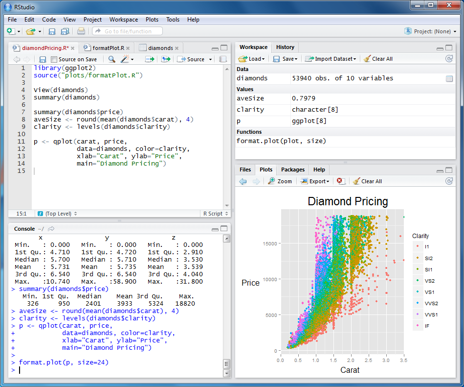
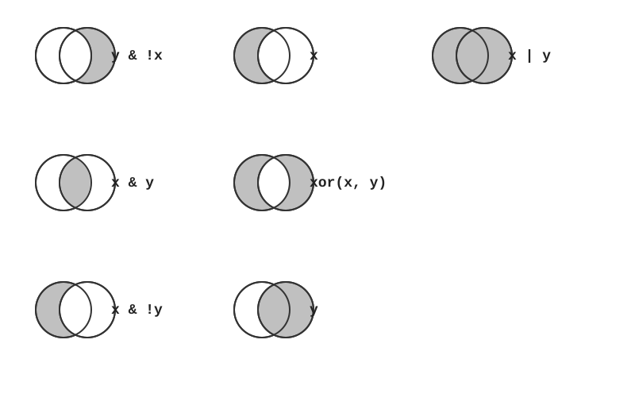
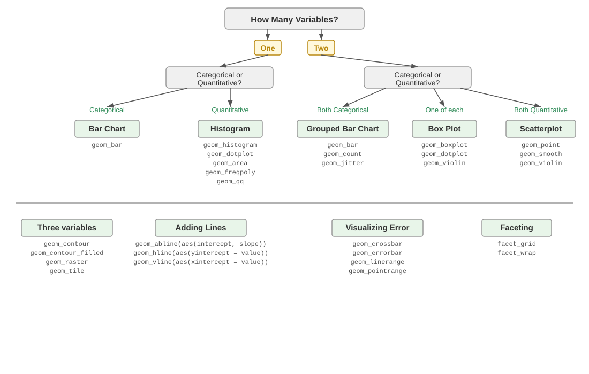

```{r}
#| label: setup
#| include: false

# Packages used in the lecture examples
library(tidyverse)
library(gt)
library(readxl)

# Consistent theme for all plots
theme_set(theme_minimal(base_size = 14))

# Reproducible random numbers
set.seed(2026)
```


## Goals for today

-   Using R Studio, Positron and Visual Studio Code (VSC) as script editors
-   R **and Python** basics, side by side: variables, vectors, functions, data frames, plots
-   R, Python and Quarto Markdown
-   Vibe Coding with LLMs
-   Git and GitHub

# R and Python: two scripting languages for data

## Why use `R`?

-   Good general scripting tool for statistics and mathematics
-   Powerful and flexible and free
-   Runs on all computer platforms
-   New enhancements coming out all the time
-   Superb data management & graphics capabilities
-   Reproducibility - can keep your scripts to see exactly what was done
-   You can write your own functions
-   Lots of online help available
-   Can use a nice GUI front end such as `Rstudio`
-   Can embed your `R` analyses in dynamic, polished files using `Quarto Markdown`
-   Quarto Markdown can be reused for websites, papers, books, presentations...

## Why use `Python`?

-   A general-purpose language that is also excellent for data analysis (`pandas`, `numpy`, `matplotlib`, `scipy`)
-   The language of machine learning, image analysis and instrument control (`scikit-learn`, `PyTorch`, `scikit-image`)
-   Free, open source, runs everywhere - including Talapas (`module load python3`)
-   Huge ecosystem: `pip install` gives you access to \>500,000 packages on PyPI; `conda` adds compiled scientific tools
-   Readable syntax; indentation *is* the structure of the code
-   Runs as scripts (`python3 script.py`), interactively (REPL / IPython), in **Jupyter notebooks**, and in **Quarto** `{python}` chunks
-   Same IDEs: **Positron** and **VS Code** run R and Python side by side

::: callout-tip
You do not have to choose. Most computational biologists use **both**: R for statistics and figures, Python for pipelines, images and machine learning. This lecture shows every idea in both languages - use the tabs.
:::

## Your IDE: the four panes

{fig-align="center" width="70%"}

| Pane                     | RStudio location | Positron equivalent            | Purpose                               |
|:-------------------------|:-----------------|:-------------------------------|:--------------------------------------|
| **Code editor**          | Top-left         | Editor tabs                    | Write/edit scripts and `.qmd` files   |
| **Console**              | Bottom-left      | Console (R *or* Python)        | Interactive session; run one line     |
| **Environment**          | Top-right        | Variables                      | Objects you have created, history     |
| **Files / Plots / Help** | Bottom-right     | Explorer, Plots, Help, Data Explorer | Navigate files, view plots, read docs |

::: callout-tip
`R` and `Python` are the languages; **RStudio**, **Positron** and **VS Code** are the IDEs you write them in. Write code in the *editor* so it is saved, and send lines to the *console* with `Cmd/Ctrl-Enter`. Customize the RStudio layout in Tools → Global Options → Pane Layout.
:::

## R vs Python: same ideas, different syntax

| Idea | R | Python |
|---|---|---|
| Assignment | `x <- 5` | `x = 5` |
| Counting starts at | **1**: `x[1]` is the first element | **0**: `x[0]` is the first element |
| Last element | `x[length(x)]`; `x[-1]` *drops* the first | `x[-1]` *is* the last |
| Sequence of values | vector `c(1, 2, 3)` | list `[1, 2, 3]` or `numpy` array `np.array([1, 2, 3])` |
| Vector arithmetic | `x^2` on any vector | `x**2` only on a numpy array (a list needs a loop) |
| Table of data | `data.frame` / tibble | `pandas` `DataFrame` |
| Load a package | `library(dplyr)` | `import pandas as pd` |
| Install a package | `install.packages("dplyr")` | `pip install pandas` (or `uv`, `conda`) |
| Chain steps | pipe `x \|> f() \|> g()` | method chaining `x.f().g()` |
| Blocks | curly braces `{ }` | indentation (4 spaces) |
| Missing value | `NA` | `None`, `float("nan")`, `pd.NA` |
| Help | `?mean` | `help(statistics.mean)` or `mean?` in Jupyter |

## `R scripts` and `Quarto Markdown`

-   Often we want to write scripts that can just be run - `R scripts`
-   We can also embed code in Quarto Markdown files that provide more annotations
-   This improves interpertability and reproducibility
-   You can insert `R code chunks` into `Quarto Markdown` documents

## `Python scripts`, `notebooks` and `Quarto Markdown`

-   A `Python script` (`script.py`) is a text file of Python commands run top to bottom with `python3 script.py`
-   A **Jupyter notebook** (`.ipynb`) mixes code cells, output and Markdown - popular in Python, but stored as JSON (hard to read in Git)
-   The same `Quarto Markdown` file can hold `{python}` code chunks - Quarto runs them through Jupyter
-   So the R and Python workflows are the same: **script** for things that just run, **Quarto** when you want prose + code + output

## `R script` basics

-   A series of R commands that will be executed\

-   Can add comments using hashtags `#`\

-   Can have pipes (`|>`) to connect one step to the next\

## `Python script` basics

-   A series of Python commands that will be executed, top to bottom\

-   Comments also use hashtags `#`\

-   Steps are connected with **method chaining** (`data.dropna().groupby("x").mean()`) rather than pipes\

-   Whitespace matters: the body of a loop, `if` or function is **indented** (4 spaces)\

-   Start scripts with `#!/usr/bin/env python3` and run them with `python3 script.py` (or `./script.py` after `chmod +x`)

## BASICS of `R` and `Python`

-   Commands can be submitted through the terminal, console or scripts (R: `R` / `Rscript`; Python: `python3` / `python3 script.py`)
-   Notice on these slides I'm evaluating the code chunks and showing output
-   Also notice that both languages follow the normal priority of mathematical evaluation
-   Careful: exponent is `^` in R but `**` in Python (`^` in Python is bitwise XOR!)

::: panel-tabset
### R

```{r}
#| label: lec07-basic-multiplication
#| echo: true
#| eval: true

4*4
```

```{r}
#| label: lec07-more-multiplication
#| echo: true
#| eval: true

(4+3*2^2)
```

### Python

```{python}
#| label: lec07-basic-multiplication-py
#| echo: true
#| eval: false

4*4
# 16
```

```{python}
#| label: lec07-more-multiplication-py
#| echo: true
#| eval: false

(4+3*2**2)
# 16
```
:::
## Assigning Variables

-   A better way to do this is to assign variables
-   Variables are assigned values using the `<-` operator in R and the `=` operator in Python.
-   Variable names must begin with a letter (or `_` in Python), but other than that, just about anything goes.
-   Do keep in mind that both `R` and `Python` are case sensitive.

## Assigning Variables

::: panel-tabset
### R

```{r}
#| label: lec07-assigning-variables
#| echo: true
#| eval: true

x <- 2
x*3
y <- x * 3
y-2

```

These do not work

```{r}
#| label: lec07-assigning-variables-2
#| echo: true
#| eval: false

3y <- 3
3*y <- 3
```

### Python

```{python}
#| label: lec07-assigning-variables-py
#| echo: true
#| eval: false

x = 2
x*3
# 6
y = x * 3
y-2
# 4
```

These do not work either (`SyntaxError`)

```{python}
#| label: lec07-assigning-variables-2-py
#| echo: true
#| eval: false

3y = 3
3*y = 3
```
:::

## Arithmetic operations on functions

-   Arithmetic operations can be performed easily on functions as well as numbers.
-   Try the following, and then your own.

::: panel-tabset
### R

```{r}
#| label: lec07-functions
#| echo: true
#| eval: false

x+2
x^2
log(x)
```

### Python

```{python}
#| label: lec07-functions-py
#| echo: true
#| eval: false

import math

x+2
x**2
math.log(x)
```
:::

-   Note that the last of these - `log` - is a built in function of `R`, and therefore the object of the function needs to be put in parentheses
-   In Python, `log` lives in the `math` module, so we `import math` once and call `math.log(x)` (`numpy` has `np.log()` for whole arrays)
-   These parentheses will be important, and we'll come back to them later when we add arguments after the object in the parentheses\
-   The outcome of calculations can be assigned to new variables as well, and the results can be checked using the 'print' command

## Arithmetic operations on functions

::: panel-tabset
### R

```{r}
#| label: lec07-arithmetic-operations-on-functions
#| echo: true
#| eval: true

y <- 67
print(y)

x <- 124
z <- (x*y)^2
print(z)
```

### Python

```{python}
#| label: lec07-arithmetic-operations-on-functions-py
#| echo: true
#| eval: false

y = 67
print(y)
# 67

x = 124
z = (x*y)**2
print(z)
# 69022864
```
:::

## STRINGS

-   Variables and operations can be performed on characters as well
-   Note that characters need to be set off by quotation marks to differentiate them from numbers
-   The `c` stands for `concatenate`; in Python square brackets `[ ]` build a **list**
-   Note that we are using the same variable names as we did previously, which means that we're overwriting our previous assignment
-   A good rule of thumb is to use new names for each variable, and make them short but still descriptive

## STRINGS

::: panel-tabset
### R

```{r}
#| label: lec07-strings
#| echo: true
#| eval: true

x <- "I Love"
print (x)
y <- "Bioengineering"
print (y)
z <- c(x,y)
print (z)
```

### Python

```{python}
#| label: lec07-strings-py
#| echo: true
#| eval: false

x = "I Love"
print(x)
# I Love
y = "Bioengineering"
print(y)
# Bioengineering
z = [x, y]
print(z)
# ['I Love', 'Bioengineering']
print(x + " " + y)      # + joins strings
# I Love Bioengineering
```
:::

## VECTORS

-   In general `R` thinks in terms of vectors (a list of characters, factors or numerical values).
-   It will benefit any `R` user to try to write programs with that in mind, as it will simplify most things.
-   Vectors can be assigned directly using the `c()` function and then entering the exact values.
-   Python has **lists** (`[ ]`) for any collection, and **numpy arrays** (`np.array()`) when you want R-style vector math
-   `x^2` squares every element of an R vector; in Python that only works on a numpy array - a list needs a loop or a *list comprehension*

## VECTORS

::: panel-tabset
### R

```{r}
#| label: lec07-example-vectors
#| echo: true
#| eval: true

x <- c(2,3,4,2,1,2,4,5,10,8,9)
print(x)
```

```{r}
#| label: lec07-example-vector-multiplication
#| echo: true
#| eval: true

x <- c(2,3,4,2,1,2,4,5,10,8,9)
y <- x^2
print(x)
print(y)
```

### Python

```{python}
#| label: lec07-example-vectors-py
#| echo: true
#| eval: false

x = [2,3,4,2,1,2,4,5,10,8,9]     # a list
print(x)
# [2, 3, 4, 2, 1, 2, 4, 5, 10, 8, 9]
```

```{python}
#| label: lec07-example-vector-multiplication-py
#| echo: true
#| eval: false

import numpy as np

x = np.array([2,3,4,2,1,2,4,5,10,8,9])   # a numpy array
y = x**2                                 # element-wise, like R
print(x)
# [ 2  3  4  2  1  2  4  5 10  8  9]
print(y)
# [  4   9  16   4   1   4  16  25 100  64  81]
# with a plain list you would write: y = [v**2 for v in x]
```
:::

## VECTORS (cont.)

::: panel-tabset
### R

```{r}
#| label: fig-lec07-example-vector-plot
#| fig-cap: "Each value of x plotted against its square (y = x^2)"
#| echo: true
#| eval: true

plot(x,y)
```

### Python

```{python}
#| label: fig-lec07-example-vector-plot-py
#| fig-cap: "Each value of x plotted against its square (y = x^2), with matplotlib"
#| echo: true
#| eval: false

import matplotlib.pyplot as plt

plt.scatter(x, y)
plt.xlabel("x")
plt.ylabel("y")
plt.show()
```
:::

## Basic Statistics

-   Many functions exist to operate on vectors.
-   Combine these with your previous variable to see what happens.
-   Also, try to find other functions (e.g. standard deviation).

::: panel-tabset
### R

```{r}
#| label: lec07-basic-statistics
#| echo: true
#| eval: false

mean(x)
median(x)
var(x)
log(x)  # natural log
sqrt(x)
sum(x)
length(x)
sample(x, replace = TRUE)
```

### Python

```{python}
#| label: lec07-basic-statistics-py
#| echo: true
#| eval: false

import numpy as np
import random

x.mean()                     # or np.mean(x)
np.median(x)
x.var(ddof=1)                # sample variance, like R's var()
np.log(x)                    # natural log, element-wise
np.sqrt(x)
x.sum()                      # sum(x) also works
len(x)                       # length(x)
random.choices(list(x), k=len(x))   # sample with replacement
```
:::

-   Notice that the last function (`sample`) has an argument (`replace=T`); in Python `random.choices()` samples *with* replacement and `k=` sets how many
-   Python functions come in two flavours: `np.median(x)` (function) and `x.mean()` (a **method** attached to the array)
-   Arguments simply modify or direct the function in some way
-   There are many arguments for each function, some of which are defaults

## Getting Help

-   Getting Help on any function is very easy - just type a question mark and the name of the function (R), or `help(function)` in Python.
-   There are functions for just about anything within `R` and it is easy enough to write your own functions if none already exist to do what you want to do.
-   In general, function calls have a simple structure: a function name, a set of parentheses and an optional set of parameters to send to the function.
-   Help pages exist for all functions that, at a minimum, explain what parameters exist for the function.\
-   Help can be accessed a few ways - try them :

## Getting Help

::: panel-tabset
### R

```{r}
#| label: lec07-getting-help
#| echo: true
#| eval: false

- help(mean)
- ?mean
- example(mean)
- help.search("mean")
- apropos("mean")
- args(mean)
```

### Python

```{python}
#| label: lec07-getting-help-py
#| echo: true
#| eval: false

import numpy as np, inspect

help(np.mean)                # full documentation, any Python
np.mean?                     # short help - IPython, Jupyter, Positron only
np.mean??                    # ... plus the source code
dir(np)                      # list everything inside a module
[n for n in dir(np) if "mean" in n]   # like apropos("mean")
inspect.signature(np.mean)   # like args(mean)
```
:::

-   Online: <https://docs.python.org/3/>, <https://numpy.org/doc/>, <https://pandas.pydata.org/docs/>

## Creating vectors

-   Creating vector of new data by entering it by hand can be a drag
-   However, it is also very easy to use functions such as `seq` and `sample` (Python: `range()`, `np.arange()`, `np.linspace()`)
-   Try the examples below; can you figure out what the three arguments in the parentheses mean?
-   Try varying the arguments to see what happens.
-   Don't go too crazy with the last one or your computer might slow way down

## Creating vectors

::: panel-tabset
### R

```{r}
#| label: lec07-creating-vectors
#| echo: true
#| eval: true

seq_1 <- seq(0.0, 10.0, by = 0.1)
print(seq_1)
seq_2 <- seq(10.0, 0.0, by = -0.1)
print(seq_2)
```

### Python

```{python}
#| label: lec07-creating-vectors-py
#| echo: true
#| eval: false

import numpy as np

seq_1 = np.linspace(0.0, 10.0, 101)    # 101 points from 0 to 10 (step 0.1)
print(seq_1)
# [ 0.   0.1  0.2 ...  9.8  9.9 10. ]
seq_2 = np.linspace(10.0, 0.0, 101)
print(seq_2)
# [10.   9.9  9.8 ...  0.2  0.1  0. ]
list(range(0, 10))                     # integers only: 0, 1, ..., 9 (stop is excluded!)
```
:::

## Creating vectors

::: panel-tabset
### R

```{r}
#| label: lec07-creating-vectors-2
#| echo: true
#| eval: true

seq_square <- (seq_2)*(seq_2)
print(seq_square)
```

### Python

```{python}
#| label: lec07-creating-vectors-2-py
#| echo: true
#| eval: false

seq_square = (seq_2)*(seq_2)
print(seq_square)
# [100.    98.01  96.04 ...   0.04   0.01   0.  ]
```
:::

## Creating vectors

::: panel-tabset
### R

```{r}
#| label: lec07-creating-vectors-3
#| echo: true
#| eval: true

seq_square_new <- (seq_2)^2
print(seq_square_new)
```

### Python

```{python}
#| label: lec07-creating-vectors-3-py
#| echo: true
#| eval: false

seq_square_new = (seq_2)**2
print(seq_square_new)
# [100.    98.01  96.04 ...   0.04   0.01   0.  ]
```
:::

## Types of vectors of data

-   `int` stands for integers

-   `dbl` stands for doubles, or real numbers

-   `chr` stands for character vectors, or strings

-   `dttm` stands for date-times (a date + a time)

-   `lgl` stands for logical, vectors that contain only TRUE or FALSE

-   `fctr` stands for factors, which R uses to represent categorical variables with fixed possible values

-   `date` stands for dates

<!-- -->

-   Integer and double vectors are known collectively as numeric vectors.
-   In `R` numbers are doubles by default.

## The hierarchy of R vector types

{fig-align="center" width="85%"}

## Types of vectors of data

-   Logical vectors can take only three possible values:
    -   `FALSE`
    -   `TRUE`
    -   `NA` which is 'not available'.
-   Integers have one special value: NA, while doubles have four:
    -   `NA`
    -   `NaN` which is 'not a number'
    -   `Inf`
    -   `-Inf`

## Types of data in Python

| R                | Python                                   | Example                        |
|------------------|------------------------------------------|--------------------------------|
| `int`            | `int`                                    | `3`                            |
| `dbl`            | `float`                                  | `3.0`, `2.5e-3`                |
| `chr`            | `str`                                    | `"low"`                        |
| `lgl`            | `bool`                                   | `True`, `False`                |
| `fctr`           | `pandas.Categorical`                     | `pd.Categorical(["low", "high"])` |
| `date` / `dttm`  | `datetime.date` / `datetime.datetime`    | `datetime.date(2026, 11, 9)`   |
| `NA`             | `None`, `float("nan")`, `np.nan`, `pd.NA` |                               |
| `Inf` / `-Inf`   | `math.inf` / `-math.inf`                 |                                |

-   Ask with `type(x)`; a numpy array or pandas column has one **dtype** for all its values (`x.dtype`)
-   `7 / 2` is `3.5` (always a float); `7 // 2` is `3` (integer division); `7 % 2` is the remainder `1`

## Reading in Data Frames in R

-   A strength of `R` is being able to import data from an external source
-   Create the same table that you did above in a spreadsheet like Excel
-   Export it to comma separated and tab separated text files for importing into `R`.
-   The first will read in a comma-delimited file, whereas the second is a tab-delimited
-   In both cases the header and row.names arguments indicate that there is a header row and row label column
-   Note that the name of the file by itself will have R look in the CWD, whereas a full path can also be used
-   In Python the same job is done by **pandas**: `pd.read_csv()` for comma-separated, `pd.read_csv(sep="\t")` for tab-separated; `pathlib.Path` builds paths that work on every operating system

## Drawing samples from distributions

-   Here is a way to create your own data sets that are random samples.
-   Again, play around with the arguments in the parentheses to see what happens.
-   In Python random numbers come from a numpy **generator**: `rng = np.random.default_rng(2026)` (the number is the seed, like `set.seed(2026)` in R)

## Drawing samples from distributions

::: panel-tabset
### R

```{r}
#| label: fig-lec07-samples-from-distributions-1
#| fig-cap: "10,000 normal draws (x) plotted against 10,000 uniform draws (y)"
#| out-width: "100%"
#| echo: true
#| eval: true

x <- rnorm (10000, 0, 10)
y <- sample (1:10000, 10000, replace = TRUE)
xy <- cbind(x,y)
plot(x,y)
```

### Python

```{python}
#| label: fig-lec07-samples-from-distributions-1-py
#| fig-cap: "10,000 normal draws (x) plotted against 10,000 uniform draws (y), with matplotlib"
#| echo: true
#| eval: false

import numpy as np
import matplotlib.pyplot as plt

rng = np.random.default_rng(2026)
x = rng.normal(0, 10, 10000)               # rnorm(10000, 0, 10)
y = rng.integers(1, 10001, size=10000)     # sample(1:10000, 10000, replace = TRUE)
xy = np.column_stack([x, y])               # cbind(x, y)
plt.scatter(x, y, s=2)
plt.show()
```
:::

## Drawing samples from distributions

::: panel-tabset
### R

```{r}
#| label: fig-lec07-samples-from-distributions-2
#| fig-cap: "The same samples plotted from a two-column matrix made with cbind()"
#| out-width: "100%"
#| echo: true
#| eval: true

x <- rnorm (10000, 0, 10)
y <- sample (1:10000, 10000, replace = TRUE)
xy <- cbind(x,y)
plot(xy)
```

### Python

```{python}
#| label: fig-lec07-samples-from-distributions-2-py
#| fig-cap: "The same samples plotted from the columns of a two-column array"
#| echo: true
#| eval: false

xy = np.column_stack([x, y])
print(xy.shape)
# (10000, 2)
plt.scatter(xy[:, 0], xy[:, 1], s=2)       # column 0 vs column 1
plt.show()
```
:::

## Drawing samples from distributions

::: panel-tabset
### R

```{r}
#| label: fig-lec07-samples-from-distributions-3
#| fig-cap: "Histogram of 10,000 draws from a normal distribution (mean 0, sd 10)"
#| out-width: "100%"
#| echo: true
#| eval: true

x <- rnorm (10000, 0, 10)
y <- sample (1:10000, 10000, replace = TRUE)
xy <- cbind(x,y)
hist(x)
```

### Python

```{python}
#| label: fig-lec07-samples-from-distributions-3-py
#| fig-cap: "Histogram of 10,000 draws from a normal distribution (mean 0, sd 10), with matplotlib"
#| echo: true
#| eval: false

plt.hist(x, bins=30)
plt.xlabel("x")
plt.ylabel("Frequency")
plt.show()
```
:::

## Drawing samples from distributions

-   You’ve probably figured out that y from the last example is drawing numbers with equal probability.
-   What if you want to draw from a distribution?
-   Again, play around with the arguments in the parentheses to see what happens.

## Drawing samples from distributions

::: panel-tabset
### R

```{r}
#| label: fig-lec07-drawing-samples-from-distributions
#| fig-cap: "Histogram of normal draws with the theoretical density curve overlaid"
#| out-width: "100%"
#| echo: true
#| eval: true

x <-rnorm(1000, 0, 100)
hist(x, xlim = c(-500,500))
curve(50000*dnorm(x, 0, 100), xlim = c(-500,500), add=TRUE, col='Red')
```

### Python

```{python}
#| label: fig-lec07-drawing-samples-from-distributions-py
#| fig-cap: "Histogram of normal draws with the theoretical density curve overlaid (scipy.stats)"
#| echo: true
#| eval: false

from scipy.stats import norm

x = rng.normal(0, 100, 1000)
plt.hist(x, bins=20, range=(-500, 500))    # bins 50 wide, like R's default here
grid = np.linspace(-500, 500, 200)
plt.plot(grid, 50000 * norm.pdf(grid, 0, 100), color="red")
plt.show()
```
:::

-   `dnorm()` generates the probability density, which can be plotted using the `curve()` function.
-   Note that is curve is added to the plot using `add=TRUE`
-   In Python `norm.pdf()` from `scipy.stats` is the density; every `plt.` call draws on the same figure until `plt.show()`

## Visualizing Data

-   So far you've been visualizing just the list of output numbers
-   Except for the last example where I snuck in a `hist` function.
-   You can also visualize all of the variables that you've created using the `plot` function (as well as a number of more sophisticated plotting functions).
-   Each of these is called a `high level` plotting function, which sets the stage
-   `Low level` plotting functions will tweak the plots and make them beautiful

## Visualizing Data

-   What do you think that each of the arguments means for the plot function?
-   A cool thing about `R` is that the options for the arguments make sense.
-   Try adjusting an argument and see if it works
-   Note- most people use the package `GGPlot2` for nice scientific graphics
-   In Python the base library is `matplotlib` (`plt.plot`, `plt.scatter`, `plt.hist`); `seaborn` and `plotnine` (a ggplot2 clone) sit on top of it

## Visualizing Data

::: panel-tabset
### R

```{r}
#| label: fig-lec07-visualizing-data
#| fig-cap: "A sequence from 0 to 10 plotted as points"
#| echo: true
#| eval: true

seq_1 <- seq(0.0, 10.0, by = 0.1)
plot (seq_1, xlab="space", ylab ="function of space", type = "p", col = "red")
```

### Python

```{python}
#| label: fig-lec07-visualizing-data-py
#| fig-cap: "A sequence from 0 to 10 plotted as points, with matplotlib"
#| echo: true
#| eval: false

seq_1 = np.linspace(0.0, 10.0, 101)
plt.plot(seq_1, "o", color="red")          # "o" = points; default is a line
plt.xlabel("space")
plt.ylabel("function of space")
plt.show()
```
:::

## Putting plots in a single figure

-   On the next slide
-   The first line of the lower script tells R that you are going to create a composite figure that has two rows and two columns. Can you tell how?
-   In Python, `plt.subplots(2, 2)` does the same job and hands back a grid of **axes** to draw on
-   Now, modify the code to add two more variables and add one more row of two panels.

::: panel-tabset
### R

```{r}
#| label: lec07-putting-plots-in-a-single
#| out-width: "50%"
#| out-height: "20%"
#| echo: true
#| eval: true

seq_1 <- seq(0.0, 10.0, by = 0.1)
seq_2 <- seq(10.0, 0.0, by = -0.1)
```

### Python

```{python}
#| label: lec07-putting-plots-in-a-single-py
#| echo: true
#| eval: false

seq_1 = np.linspace(0.0, 10.0, 101)
seq_2 = np.linspace(10.0, 0.0, 101)
seq_square = seq_2 * seq_2
seq_square_new = seq_2**2
```
:::

## Putting plots in a single figure

::: panel-tabset
### R

```{r}
#| label: fig-lec07-composite-figure
#| fig-cap: "Four plots arranged in a 2 x 2 grid with par(mfrow)"
#| out-width: "50%"
#| out-height: "50%"
#| echo: true
#| eval: true

par(mfrow=c(2,2))
plot (seq_1, xlab="time", ylab ="p in population 1", type = "p", col = 'red')
plot (seq_2, xlab="time", ylab ="p in population 2", type = "p", col = 'green')
plot (seq_square, xlab="time", ylab ="p2 in population 2", type = "p", col = 'blue')
plot (seq_square_new, xlab="time", ylab ="p in population 1", type = "l", col = 'yellow')
```

### Python

```{python}
#| label: fig-lec07-composite-figure-py
#| fig-cap: "Four plots arranged in a 2 x 2 grid with plt.subplots()"
#| echo: true
#| eval: false

fig, ax = plt.subplots(2, 2, figsize=(8, 6))
ax[0, 0].plot(seq_1, "o", color="red")
ax[0, 0].set(xlabel="time", ylabel="p in population 1")
ax[0, 1].plot(seq_2, "o", color="green")
ax[0, 1].set(xlabel="time", ylabel="p in population 2")
ax[1, 0].plot(seq_square, "o", color="blue")
ax[1, 0].set(xlabel="time", ylabel="p2 in population 2")
ax[1, 1].plot(seq_square_new, "-", color="yellow")   # "-" = line
ax[1, 1].set(xlabel="time", ylabel="p in population 1")
fig.tight_layout()
plt.show()
```
:::

## Creating Data Frames in R and Python

-   As you have seen, in R you can generate your own random data set drawn from nearly any distribution very easily.
-   Often we will want to use collected data.
-   Now, let’s make a dummy dataset to get used to dealing with data frames
-   Set up three variables (hydrogel_concentration, compression and conductivity) as vectors
-   In Python the data frame comes from **pandas** (`import pandas as pd`); it has the same idea - rows are samples, columns are variables

## Creating Data Frames in R and Python

::: panel-tabset
### R

```{r}
#| label: lec07-creating-data-frames-in-r
#| echo: true
#| eval: true

hydrogel_concentration <- factor(c("low", "high", "high", "high", "medium", "medium", "medium","low"))
compression <- c(3.4, 3.4, 8.4, 3, 5.6, 8.1, 8.3, 4.5)
conductivity <- c(0, 9.2, 3.8, 5, 5.6, 4.1, 7.1, 5.3)
```

-   Create a data frame where vectors become columns

```{r}
#| label: lec07-creating-data-frames-in-r-2
#| echo: true
#| eval: true

mydata <- data.frame(hydrogel_concentration, compression, conductivity)
row.names(mydata) <- c("Sample_1", "Sample_2", "Sample_3", "Sample_4",
                       "Sample_5", "Sample_6", "Sample_7", "Sample_8")
```

### Python

```{python}
#| label: lec07-creating-data-frames-py
#| echo: true
#| eval: false

import pandas as pd

hydrogel_concentration = pd.Categorical(["low", "high", "high", "high", "medium", "medium", "medium", "low"])
compression = [3.4, 3.4, 8.4, 3, 5.6, 8.1, 8.3, 4.5]
conductivity = [0, 9.2, 3.8, 5, 5.6, 4.1, 7.1, 5.3]
```

-   Create a DataFrame from a dictionary of `column name: values`

```{python}
#| label: lec07-creating-data-frames-2-py
#| echo: true
#| eval: false

mydata = pd.DataFrame({"hydrogel_concentration": hydrogel_concentration,
                       "compression": compression,
                       "conductivity": conductivity})
mydata.index = [f"Sample_{i}" for i in range(1, 9)]   # row names = the index
mydata.head(3)
#          hydrogel_concentration  compression  conductivity
# Sample_1                    low          3.4           0.0
# Sample_2                   high          3.4           9.2
# Sample_3                   high          8.4           3.8
```
:::

-   Now you have a hand-made data frame with row names
-   Take a look at it in the data section of RStudio, or the **Data Explorer** in Positron (R and Python)

## Reading in and Exporting Data Frames

\

::: panel-tabset
### R

```{r}
#| label: lec07-reading-in-and-exporting-data
#| echo: true
#| eval: false

YourFile <- read.table('yourfile.csv', header=T, row.names=1, sep=',')
YourFile <- read.table('yourfile.txt', header=T, row.names=1, sep='\t')
```

\

```{r}
#| label: lec07-reading-in-and-exporting-data-2
#| echo: true
#| eval: false

write.table(YourFile, "yourfile.csv", quote=F, row.names=T, sep=",")
write.table(YourFile, "yourfile.txt", quote=F, row.names=T, sep="\t")
```

### Python

```{python}
#| label: lec07-reading-in-and-exporting-data-py
#| echo: true
#| eval: false

import pandas as pd
from pathlib import Path

YourFile = pd.read_csv("yourfile.csv", index_col=0)             # header row is the default
YourFile = pd.read_csv("yourfile.txt", index_col=0, sep="\t")
YourFile = pd.read_csv(Path("data") / "raw" / "yourfile.csv")   # portable paths with pathlib
```

\

```{python}
#| label: lec07-reading-in-and-exporting-data-2-py
#| echo: true
#| eval: false

YourFile.to_csv("yourfile.csv")                 # index (row names) is written by default
YourFile.to_csv("yourfile.txt", sep="\t")
YourFile.to_csv("yourfile.csv", index=False)    # drop the row names
```
:::

## Indexing in data frames

-   Next up - indexing just a subset of the data
-   This is a very important idea in R, that you can analyze just a subset of the data.
-   This is analyzing only the data in the file you made that has the factor value 'mixed'.
-   pandas: `.iloc[row, col]` indexes by **position** (from 0), `.loc[row, col]` by **name**; `df["col"]` or `df.col` picks a column

::: panel-tabset
### R

```{r}
#| label: lec07-indexing-in-data-frames
#| echo: true
#| eval: false

print (YourFile[,2])
print (YourFile$variable)
print (YourFile[2,])
plot (YourFile$variable1, YourFile$variable2)
```

### Python

```{python}
#| label: lec07-indexing-in-data-frames-py
#| echo: true
#| eval: false

print(YourFile.iloc[:, 1])          # 2nd column (position 1) - R's YourFile[,2]
print(YourFile["variable"])         # column by name        - R's YourFile$variable
print(YourFile.iloc[1])             # 2nd row               - R's YourFile[2,]
print(YourFile.loc["Sample_2"])     # row by its name
plt.scatter(YourFile["variable1"], YourFile["variable2"])
plt.show()
```
:::

## Practice reading in transcriptomic data

::: panel-tabset
### R

```{r}
#| label: lec07-practice-reading-in-transcriptomic-data
#| echo: true
#| eval: false

RNAseq_Data <- read.table('<name_of_file>', header=TRUE, sep=',')

print (RNAseq_Data)
head (RNAseq_Data)
tail (RNAseq_Data)

print (RNAseq_Data[,2])
print (RNAseq_Data[1,])
print (RNAseq_Data[1,2])
print (RNAseq_Data$ENSGACG00000000010)
print (RNAseq_Data$ENSGACG00000000010>45.0)
```

### Python

```{python}
#| label: lec07-practice-reading-in-transcriptomic-data-py
#| echo: true
#| eval: false

RNAseq_Data = pd.read_csv("<name_of_file>")

print(RNAseq_Data)
RNAseq_Data.head()
RNAseq_Data.tail()

print(RNAseq_Data.iloc[:, 1])
print(RNAseq_Data.iloc[0])          # first row is 0!
print(RNAseq_Data.iloc[0, 1])
print(RNAseq_Data["ENSGACG00000000010"])
print(RNAseq_Data["ENSGACG00000000010"] > 45.0)
```
:::

## Summary stats and figures

::: panel-tabset
### R

```{r}
#| label: lec07-summary-stats-and-figures
#| echo: true
#| eval: false

summary1 <- summary(RNAseq_Data $ENSGACG00000000003)
print (summary1)

hist(RNAseq_Data $ENSGACG00000000003)
boxplot(RNAseq_Data$ENSGACG00000000003)
boxplot(RNAseq_Data$ENSGACG00000000003~RNAseq_Data$Population)
plot(RNAseq_Data $ENSGACG00000000003, RNAseq_Data$ENSGACG00000000003)

boxplot(RNAseq_Data $ENSGACG00000000003~RNAseq_Data$Treatment,
        col = "red", ylab = "Expression Level", xlab = "Treatment level",
        border ="orange",
        main = "Boxplot of variation in gene expression across microbiota treatments")
```

### Python

```{python}
#| label: lec07-summary-stats-and-figures-py
#| echo: true
#| eval: false

import seaborn as sns

gene = RNAseq_Data["ENSGACG00000000003"]
summary1 = gene.describe()          # count, mean, std, min, quartiles, max
print(summary1)

gene.hist()
gene.plot.box()
RNAseq_Data.boxplot(column="ENSGACG00000000003", by="Population")
plt.scatter(gene, gene)

sns.boxplot(data=RNAseq_Data, x="Treatment", y="ENSGACG00000000003", color="red")
plt.xlabel("Treatment level")
plt.ylabel("Expression Level")
plt.title("Boxplot of variation in gene expression across microbiota treatments")
plt.show()
```
:::

# Going further with R and Python

## Installing vs. loading packages

::: panel-tabset
### R

``` r
install.packages("tidyverse")   # download & install - ONCE per computer
library(tidyverse)              # load - EVERY new R session
```

::: incremental
-   **`install.packages()`** puts a package on your computer (from CRAN)
-   **`library()`** makes it available in *this* session - restarting R means re-running `library()`
-   "there is no package called ..." means you never installed it
-   Bioconductor packages (genomics) use `BiocManager::install("name")`
-   Use one function without loading the package: `readxl::read_excel("file.xlsx")`
:::

### Python

``` bash
python3 -m venv .venv && source .venv/bin/activate   # one environment per project
pip install pandas matplotlib seaborn                 # install - ONCE per environment
# alternatives: uv add pandas   |   conda install pandas
```

```{python}
#| label: lec07-import-py
#| echo: true
#| eval: false

import pandas as pd                 # load - EVERY new Python session (pd is the usual alias)
import matplotlib.pyplot as plt
from pathlib import Path            # one name from a module
```

::: incremental
-   **`pip install`** (from PyPI) puts a package in the *active environment*; `conda` also handles compiled tools (e.g. `bioconda`); `uv` is a fast modern all-in-one
-   **`import`** makes it available in *this* session
-   `ModuleNotFoundError: No module named 'pandas'` means it is not installed *in this environment*
-   `pip freeze > requirements.txt` records versions, like `renv` in R
:::
:::

## Inspecting objects and getting help

::: panel-tabset
### R

``` r
str(mydata)        # structure: type, dimensions, first values - your #1 tool
summary(mydata)    # quick summary of every column
class(mydata)      # what kind of object is this?
dim(mydata)        # rows x columns
names(mydata)      # column names
?mean              # help page for a function
??"linear model"   # search help across all packages
sessionInfo()      # R version + loaded package versions - put at the end of reports
```

### Python

```{python}
#| label: lec07-inspecting-objects-py
#| echo: true
#| eval: false

mydata.info()          # columns, dtypes, non-null counts - your #1 tool
mydata.describe()      # quick summary of every numeric column
type(mydata)           # what kind of object is this?  <class 'pandas.core.frame.DataFrame'>
mydata.shape           # (rows, columns)
mydata.columns         # column names
mydata.dtypes          # type of each column
help(pd.read_csv)      # help page for a function (or pd.read_csv? in Jupyter/Positron)
import sys; print(sys.version); print(pd.__version__)   # versions - put at the end of reports
```
:::

::: callout-tip
When an object surprises you, run `str()` (R) or `.info()` / `type()` (Python) on it first. In **Positron** or **RStudio**, the Variables/Environment pane shows the same information.
:::

## Common gotchas that bite everyone

::: panel-tabset
### R

::: incremental
-   **R counts from 1**, and `x[-1]` *drops* the first element (it is not "the last" as in Python)
-   **`=` vs `==`**: `=` assigns or names an argument; `==` tests equality
-   **`NA` is contagious**: `mean(c(1, NA, 3))` is `NA` - use `na.rm = TRUE`
-   **Floating point**: `0.1 + 0.2 == 0.3` is `FALSE` - use `all.equal()`
-   **Case matters**: `Data` and `data` are different objects
-   **Working directory**: "cannot open file" usually means R is looking in the wrong folder - check `getwd()` and use project-relative paths
:::

### Python

::: incremental
-   **Python counts from 0**, `x[-1]` *is* the last element, and a slice `x[1:3]` **excludes** the end (elements 1 and 2)
-   **`=` vs `==`**: same as R - `=` assigns, `==` tests equality
-   **`^` is not power**: use `**`
-   **`y = x` does not copy a list or array** - both names point to the same object; use `x.copy()`
-   **`NaN` is contagious** in numpy, but `pandas` `.mean()` skips it by default (`skipna=True`)
-   **Floating point**: `0.1 + 0.2 == 0.3` is `False` - use `math.isclose()`
-   **Indentation is syntax** - mixing tabs and spaces, or a missing `:`, gives `IndentationError` / `SyntaxError`
-   **Wrong environment**: `ModuleNotFoundError` usually means the package is installed in a *different* Python - check `which python3`
-   **Working directory**: `FileNotFoundError` - check `Path.cwd()` and use project-relative paths
:::
:::

## Logical operators and filtering a vector

::::: columns
::: {.column width="55%"}
| Operator     | Meaning           | R example           | Python example        |
|:-------------|:------------------|:--------------------|:----------------------|
| `==`, `!=`   | equal / not equal | `x == 5`            | `x == 5`              |
| `<`, `>`, `<=`, `>=` | comparisons | `x < 10`          | `x < 10`              |
| and          | both true         | `x > 0 & x < 10`    | `(x > 0) & (x < 10)`  |
| or           | either true       | `x < 0 \| x > 10`   | `(x < 0) \| (x > 10)` |
| not          | negation          | `!(x > 5)`          | `~(x > 5)`            |
| membership   | is element of     | `x %in% c(1, 2, 3)` | `np.isin(x, [1, 2, 3])` |
:::

::: {.column width="45%"}
{fig-align="center" width="100%"}
:::
:::::

::: panel-tabset
### R

```{r}
#| label: lec07-logical-filter-r
#| echo: true
#| eval: true

x <- c(1, 5, 10, 15, 20)
x > 10          # a logical vector, one TRUE/FALSE per element
x[x > 10]       # keep only the elements where the condition is TRUE
```

### Python

```{python}
#| label: lec07-logical-filter-py
#| echo: true
#| eval: false

import numpy as np
x = np.array([1, 5, 10, 15, 20])
x > 10          # array([False, False, False,  True,  True])
x[x > 10]       # array([15, 20])  - boolean indexing, same idea as R
```
:::

## Converting types and handling missing values

::: panel-tabset
### R

| Task                       | Code                        | Result                  |
|:---------------------------|:----------------------------|:------------------------|
| Text to number             | `as.numeric("42")`          | `42`                    |
| Text that isn't a number   | `as.numeric("hello")`       | `NA` (with a warning)   |
| Number to text             | `as.character(42)`          | `"42"`                  |
| Number to logical          | `as.logical(1)`             | `TRUE`                  |
| Check for missing          | `is.na(x)`                  | logical vector          |
| **Don't do this!**         | `x == NA`                   | always `NA`             |
| Mean ignoring missing      | `mean(x, na.rm = TRUE)`     | the mean of the rest    |

::: callout-warning
`as.numeric()` on a **factor** returns the integer level codes, not the labels - use `as.numeric(as.character(x))`. And always test for missing values with `is.na()`, never `== NA`.
:::

### Python

| Task                       | Code                              | Result                     |
|:---------------------------|:----------------------------------|:---------------------------|
| Text to number             | `float("42")`                     | `42.0`                     |
| Text that isn't a number   | `float("hello")`                  | `ValueError` (an error, not `NaN`) |
| Number to text             | `str(42)`                         | `"42"`                     |
| Whole column to number     | `pd.to_numeric(col, errors="coerce")` | bad values become `NaN` |
| Check for missing          | `pd.isna(x)` / `col.isna()`       | boolean array              |
| **Don't do this!**         | `x == np.nan`                     | always `False`             |
| Mean ignoring missing      | `col.mean()` (pandas skips `NaN`) / `np.nanmean(x)` | the mean of the rest |
:::

## Reading error messages

::: panel-tabset
### R

| Error message             | Meaning                 | Fix                                        |
|:--------------------------|:------------------------|:-------------------------------------------|
| `object 'x' not found`    | Variable doesn't exist  | Check spelling; run the line that creates it |
| `could not find function` | Package not loaded      | `library()` the package, or check spelling |
| `unexpected ')'` / `unexpected symbol` | Mismatched brackets or quotes | Count opening/closing brackets |
| `non-numeric argument to binary operator` | Wrong data type | Check with `class()` or `str()`      |
| `cannot open file ... No such file` | Wrong working directory or path | `getwd()`, `list.files()`, fix the path |

### Python

| Error message             | Meaning                 | Fix                                        |
|:--------------------------|:------------------------|:-------------------------------------------|
| `NameError: name 'x' is not defined` | Variable doesn't exist | Check spelling; run the cell that creates it |
| `ModuleNotFoundError`     | Package not installed *in this environment* | `pip install`, check `which python3` |
| `SyntaxError` / `IndentationError` | Missing `:`, bracket, or bad indentation | Look at the line **above** the arrow too |
| `TypeError: unsupported operand` | Wrong data type   | Check with `type()` or `.dtypes`           |
| `FileNotFoundError`       | Wrong working directory or path | `Path.cwd()`, fix the path         |
:::

::: callout-tip
Read error messages carefully - R reports the failing call, Python reports a **traceback** where the *last* line tells you what went wrong. Then paste the exact message into a search engine or an AI assistant.
:::

## The tidyverse family of packages

{fig-align="center" width="70%"}

::: {.aside}
Source: [tidyverse.org](https://www.tidyverse.org/)
:::

| Package   | Purpose                                                   | pandas / Python equivalent      |
|:----------|:----------------------------------------------------------|:--------------------------------|
| `dplyr`   | Data manipulation (`filter`, `select`, `mutate`, `summarise`) | pandas methods              |
| `ggplot2` | Data visualization                                        | `matplotlib`, `seaborn`, `plotnine` |
| `tidyr`   | Reshaping data (`pivot_longer`, `pivot_wider`, `separate`) | `melt`, `pivot`                |
| `readr`   | Fast reading of CSV, TSV files                            | `pd.read_csv`                   |
| `stringr` | String manipulation                                       | `str` methods, `re`             |
| `purrr`   | Functional programming tools (`map`)                      | list comprehensions             |

Loading `tidyverse` loads all of these at once (plus `tibble` and `forcats`).

## A taste of the tidyverse: the pipe `|>`

::: panel-tabset
### R

``` r
library(tidyverse)

mydata |>
  filter(compression > 4) |>                            # keep rows
  mutate(ratio = conductivity / compression) |>         # add a column
  group_by(hydrogel_concentration) |>                   # define groups
  summarise(n = n(), mean_ratio = mean(ratio))          # one row per group
```

| Verb          | What it does                       |
|---------------|------------------------------------|
| `filter()`    | Keep rows matching a condition     |
| `select()`    | Keep or drop columns               |
| `mutate()`    | Add or change columns              |
| `arrange()`   | Sort rows                          |
| `group_by()` + `summarise()` | Summaries per group |

### Python (pandas)

```{python}
#| label: lec07-pandas-chain-py
#| echo: true
#| eval: false

import pandas as pd

(mydata
   .query("compression > 4")                                  # keep rows
   .assign(ratio=lambda d: d.conductivity / d.compression)    # add a column
   .groupby("hydrogel_concentration", observed=True)          # define groups
   .agg(n=("ratio", "size"), mean_ratio=("ratio", "mean"))    # one row per group
)
```

| dplyr verb                   | pandas method                         |
|------------------------------|---------------------------------------|
| `filter()`                   | `.query("...")` or `df[df.col > 4]`    |
| `select()`                   | `df[["a", "b"]]` / `.drop(columns=)`  |
| `mutate()`                   | `.assign(new=...)`                    |
| `arrange()`                  | `.sort_values("col")`                 |
| `group_by()` + `summarise()` | `.groupby("col").agg(...)`            |
:::

::: callout-note
Read `|>` as **"and then"**. The older `%>%` pipe does the same thing. In pandas the dot does the same job - wrap the chain in `( )` so you can put each step on its own line.
:::

## A taste of ggplot2: the grammar of graphics

::: panel-tabset
### R

``` r
ggplot(mydata, aes(x = hydrogel_concentration, y = compression)) +
  geom_boxplot() +
  geom_jitter(width = 0.1) +
  labs(x = "Hydrogel concentration", y = "Compression") +
  theme_minimal()
```

### Python (seaborn)

```{python}
#| label: fig-lec07-seaborn-py
#| fig-cap: "Compression by hydrogel concentration: boxplot plus jittered points, with seaborn"
#| echo: true
#| eval: false

import seaborn as sns
import matplotlib.pyplot as plt

sns.boxplot(data=mydata, x="hydrogel_concentration", y="compression")
sns.stripplot(data=mydata, x="hydrogel_concentration", y="compression", jitter=0.1, color="black")
plt.xlabel("Hydrogel concentration")
plt.ylabel("Compression")
plt.show()
```

### Python (plotnine)

```{python}
#| label: fig-lec07-plotnine-py
#| fig-cap: "The same figure with plotnine - ggplot2 syntax in Python"
#| echo: true
#| eval: false

from plotnine import ggplot, aes, geom_boxplot, geom_jitter, labs, theme_minimal

(ggplot(mydata, aes(x="hydrogel_concentration", y="compression"))
   + geom_boxplot()
   + geom_jitter(width=0.1)
   + labs(x="Hydrogel concentration", y="Compression")
   + theme_minimal())
```
:::

::: incremental
-   **Data** + **aesthetic mappings** (`aes()`: which column goes to x, y, color...) + **geoms** (points, boxes, lines)
-   Layers are added with `+`
-   Same pattern for every plot type - learn it once; `plotnine` brings exactly this grammar to Python, `seaborn` is the more common Python choice
-   More in the course book's [R Programming chapter](../book/chapters/07-r-programming.html) and [R Command Reference](../book/chapters/appendix-r.html)
:::

## The grammar of graphics: a plot is a stack of layers

{fig-align="center" width="80%"}

::: {.aside}
Source: Leland Wilkinson, *The Grammar of Graphics*, 1999
:::

## Common `ggplot2` geoms

| Geom               | Purpose      | Data type               | seaborn equivalent       |
|:-------------------|:-------------|:------------------------|:-------------------------|
| `geom_point()`     | Scatterplots | Two continuous          | `sns.scatterplot()`      |
| `geom_line()`      | Line plots   | Continuous over ordered | `sns.lineplot()`         |
| `geom_bar()`       | Bar charts   | Categorical counts      | `sns.countplot()`        |
| `geom_histogram()` | Histograms   | Single continuous       | `sns.histplot()`         |
| `geom_boxplot()`   | Boxplots     | Continuous by category  | `sns.boxplot()`          |
| `geom_smooth()`    | Trend lines  | Two continuous          | `sns.regplot()`          |

::: callout-tip
`facet_wrap(~ group)` splits any plot into one panel per group, and `ggsave("figure.pdf")` writes the last plot to a file. Data-visualization mechanics get a full chapter in the [course book](../book/chapters/09-data-visualization.html).
:::

## Choosing the right kind of plot

{fig-align="center" width="90%"}

## Key Takeaways

-   **Same ideas, two syntaxes**: variables, vectors, functions, data frames and plots work the same way in R and Python - once you know one, the other is mostly vocabulary
-   **R**: `<-`, counts from 1, `c()` vectors, `data.frame`, `library()`, `|>` pipes, `ggplot2`
-   **Python**: `=`, counts from 0, lists and `numpy` arrays, `pandas` `DataFrame`, `import`, method chaining, `matplotlib` / `seaborn`
-   **Install once, load every session**: `install.packages()` + `library()` vs `pip install` (in a virtual environment) + `import`
-   Run code as **scripts** (`Rscript`, `python3`) for pipelines and in **Quarto** when you want prose, code and output together
-   When in doubt: `str()` / `.info()`, `?fun` / `help(fun)`, and read the error message
