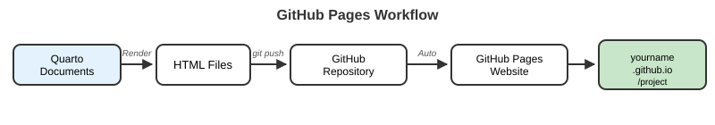

```{r}
#| label: setup
#| include: false

# Packages used in the lecture examples
library(tidyverse)
library(gt)
library(readxl)

# Consistent theme for all plots
theme_set(theme_minimal(base_size = 14))

# Reproducible random numbers
set.seed(2026)
```


## Goals for today

-   Quarto Markdown - with R **and Python** code chunks
-   Vibe Coding with LLMs
-   Git and GitHub

# Markdown and Quarto Markdown

## What is Markdown?

::: {.incremental}
-   a very light weight but flexible editing language
-   allows the `rendering` of markdown text to a variety of different formats (pdf, html, web pages, powerpoint, etc....)
-   very simple and common across science and engineering
-   involves a `yaml` header (YAML stands for `YAML Ain't Markup Language`, originally `Yet Another Markup Language`)
-   similar to `html` but simpler
:::

## What is Quarto Markdown?

Quarto `(https://quarto.org/)` provides a next-generation authoring framework for data science.

-   `Quarto Markdown` is a powerful scientific and technical publishing system that extends the lightweight markup language Markdown for creating formatted text using a plain-text editor
-   You can use `Quarto Markdown` files to save and execute code \*and\* generate high quality reports that can be shared with an audience.
-   You can make html, pdf, docx, websites, slides, books, and more.

When you save your document, the output will be in the format indicated in your YAML header. This could be an html document, Word document, pdf, website, book, etc.

## Getting started

-   Open a new Quarto Markdown document from RStudio (or **File → New File → Quarto Document** in VS Code / Positron)

-   You should see a document that is already populated with some example text and code

## This is Quarto Markdown

``` yaml
---
title: "My Analysis"
author: "Your Name"
format: html
---
```

-   Note that `---` delineates the `yaml header`.
-   This controls document-level settings and rendering - `format:` picks the output (`html`, `pdf`, `docx`, `revealjs`, ...)
-   There are a lot of options that you can put in the `yaml header`
-   (Older R Markdown files use `output: html_document` here - Quarto uses `format:`)

## This is Quarto Markdown

```markdown
# Header size 1

## Header size 2

I can write text and it will look normal!

I can still run code!
```

## This is Quarto Markdown

::: panel-tabset
### R

````markdown
```{{r}}
#| label: my-first-chunk
#| echo: true

x <- 5
print(x^2)
```
````

### Python

````markdown
```{{python}}
#| label: my-first-chunk-py
#| echo: true

x = 5
print(x**2)
```
````
:::

-   By default, the code and output will print to your document
-   Note the back tick marks - these delineate the code
-   The {r} indicates this is r code; {python} indicates Python code - everything else about the chunk is identical

## Rendered, the chunks look like this

::: panel-tabset
### R

```{r}
#| label: lec08-first-chunk-r
#| echo: true
#| eval: true

x <- 5
print(x^2)
```

### Python

```{python}
#| label: lec08-first-chunk-py
#| echo: true
#| eval: false

x = 5
print(x**2)
# 25
```
:::

-   Code first, output underneath - Quarto ran the code while rendering
-   R chunks run through **knitr**; Python chunks run through **Jupyter** (see the next slides)

## Navigating chunks

-   Easy to run chunks - a few ways to do this
-   Top right of each chunk - just run, run all above, etc.
-   Cog wheel at the top of the Quarto Markdown document - run options
-   Keyboard shortcuts

## Chunk options, Quarto style

Quarto puts chunk options *inside* the chunk with `#|` - one per line, the **same options in every language**:

::: panel-tabset
### R

````markdown
```{{r}}
#| label: fig-stiffness
#| echo: false
#| fig-cap: "Stiffness by hydrogel concentration"
#| fig-width: 6
boxplot(compression ~ hydrogel_concentration, data = mydata)
```
````

### Python

````markdown
```{{python}}
#| label: fig-stiffness-py
#| echo: false
#| fig-cap: "Stiffness by hydrogel concentration"
#| fig-width: 6
mydata.boxplot(column="compression", by="hydrogel_concentration")
```
````
:::

| Option                | Effect                                        |
|-----------------------|-----------------------------------------------|
| `echo: false`         | Run the code, **hide** the code               |
| `eval: false`         | **Show** the code, don't run it               |
| `include: false`      | Run it, show **nothing** (setup chunks)       |
| `warning: false`      | Hide warnings (`message: false` for messages) |
| `fig-cap:`            | Figure caption                                |
| `cache: true`         | Don't re-run slow chunks unless they change   |

::: callout-tip
Set defaults for the whole document in the YAML header under `execute:` and override chunk-by-chunk only where needed.
:::

## Python in Quarto: engines, Jupyter and notebooks

::: panel-tabset
### Setup

``` bash
python3 -m venv .venv && source .venv/bin/activate   # a project environment
pip install jupyter pandas matplotlib                # Quarto runs {python} chunks through Jupyter
quarto check jupyter                                 # does Quarto see it?
```

``` yaml
---
title: "My analysis"
format: html
jupyter: python3        # optional: name the kernel explicitly
---
```

### Which engine runs my chunks?

-   Only `{r}` chunks → **knitr** (R) runs the document
-   Only `{python}` chunks → **Jupyter** runs the document
-   **Both** in one file → knitr runs it and hands Python chunks to R's `reticulate` package (`install.packages("reticulate")`) - objects can even be shared: `py$x` in R, `r.x` in Python
-   `` `{python} 1 + 1` `` and `` `{r} 1 + 1` `` also work **inline** in the text

### Notebooks

``` bash
quarto render notebook.ipynb              # a Jupyter notebook is a valid Quarto input
quarto convert notebook.ipynb             # .ipynb  ->  .qmd (plain text, Git-friendly)
quarto convert analysis.qmd               # .qmd    ->  .ipynb (to hand to a Jupyter user)
quarto preview notebook.ipynb
```

-   `.ipynb` stores code, Markdown **and saved output** as JSON - handy interactively, noisy in Git
-   `.qmd` stores only the source; output is regenerated when you render
:::

## Rendering your document

``` bash
quarto render report.qmd              # default format from the YAML
quarto render report.qmd --to pdf     # PDF (needs LaTeX / TinyTeX)
quarto render report.qmd --to docx    # Word document
quarto preview report.qmd             # live preview - re-renders every time you save
quarto render                         # render a whole project/website (_quarto.yml)
quarto render notebook.ipynb          # Jupyter notebooks render the same way
```

::: incremental
-   In **VS Code** (Quarto extension) or **Positron**: the **Preview** button or `Cmd/Ctrl-Shift-K`
-   In **RStudio**: the **Render** button
-   Same source, many outputs: HTML, PDF, Word, slides, websites
:::

## One source, several output formats

List more than one format in the YAML header and `quarto render` makes them all:

``` yaml
---
title: "My Analysis"
format:
  html: default
  pdf: default
  docx: default
---
```

| Output type       | Formats                                          |
|-------------------|--------------------------------------------------|
| **Documents**     | HTML, PDF (via LaTeX), Word (`.docx`), Markdown  |
| **Presentations** | RevealJS (these slides!), PowerPoint, Beamer     |
| **Websites and books** | HTML (all of our class material!)           |

## Callouts and cross-references

``` markdown
::: {.callout-tip title="Pro tip"}
Callouts come in five types: note, tip, warning, important, caution.
:::

{#fig-sem width=60%}

As shown in @fig-sem, the pores are uniform.
```

::: incremental
-   A **callout** is a colored box - great for tips, warnings, and definitions (you've seen many in these slides)
-   **Cross-references**: label a figure `#fig-...`, a table `#tbl-...`, or an equation `#eq-...`, then refer to it with `@fig-...` - Quarto numbers them automatically
-   Full syntax reference: the course book's [Quarto chapter](../book/chapters/12-quarto-documents.html)
:::

## Cross-referencing everything

Every labelled element can be referenced from the text, and the numbers update automatically each time you render:

| Type      | Where the label goes            | Reference syntax |
|:----------|:--------------------------------|:-----------------|
| Figures   | `#| label: fig-name` (code chunk) or `{#fig-name}` (image) | `@fig-name` |
| Tables    | `#| label: tbl-name` or `{#tbl-name}` | `@tbl-name` |
| Equations | `$$ ... $$ {#eq-name}`          | `@eq-name`       |
| Sections  | `## Heading {#sec-name}`        | `@sec-name`      |

``` markdown
{#fig-scaffold fig-align="center" width="70%"}

See @fig-scaffold and @sec-methods for details.
```

## Quarto Markdown formatting

``` markdown
*italic*
**bold**
$A = \pi \times r^{2}$
```

*italic*

**bold**

$A = \pi \times r^{2}$

## Quarto Markdown lists

``` markdown
* Item 1
* Item 2
    + Item 2a
    + Item 2b
```

-   Item 1
-   Item 2
    -   Item 2a
    -   Item 2b

## Quarto Markdown lists

``` markdown
1. Item 1
2. Item 2
3. Item 3
    + Item 3a
    + Item 3b
```

1.  Item 1
2.  Item 2
3.  Item 3
    -   Item 3a
    -   Item 3b

## Typesetting Mathematics

-   Since 'tex' is embedded in Quarto Markdown you can typeset mathematics easily using LaTeX (https://en.wikibooks.org/wiki/LaTeX)

-   Essentially, just surround your mathematics in \$ symbols

-   \$\$ centers the expressions

## Typeset mathematics

Poisson Sampling Equation

``` markdown
$$\large Pr(Y=r) = \frac{e^{-\mu}\mu^r}{r!}$$
```

$$\large Pr(Y=r) = \frac{e^{-\mu}\mu^r}{r!}$$

## Differential Equations

``` markdown
$$\iint xy^2\,dx\,dy =\frac{1}{6}x^2y^3$$
```

$$\iint xy^2\,dx\,dy =\frac{1}{6}x^2y^3$$

## In-line versus fenced

``` markdown
This equation, $y=\frac{1}{2}$, is included inline
```

This equation, $y=\frac{1}{2}$, is included inline

``` markdown
Whereas this equation, $$y=\frac{1}{2}$$, is put on a separate line
```

Whereas this equation $$y=\frac{1}{2}$$ is put on a separate line

## Matrix formulations

``` markdown
$$	\begin{matrix}
		-2 & 1 & 0 & 0 & \cdots & 0  \\
		1 & -2 & 1 & 0 & \cdots & 0  \\
		0 & 1 & -2 & 1 & \cdots & 0  \\
		0 & 0 & 1 & -2 & \ddots & \vdots \\
		\vdots & \vdots & \vdots & \ddots & \ddots & 1  \\
		0 & 0 & 0 & \cdots & 1 & -2
	\end{matrix} $$
```

$$  \begin{matrix}
        -2 & 1 & 0 & 0 & \cdots & 0  \\
        1 & -2 & 1 & 0 & \cdots & 0  \\
        0 & 1 & -2 & 1 & \cdots & 0  \\
        0 & 0 & 1 & -2 & \ddots & \vdots \\
        \vdots & \vdots & \vdots & \ddots & \ddots & 1  \\
        0 & 0 & 0 & \cdots & 1 & -2
    \end{matrix} $$

## Quarto Markdown is very flexible

-   You can use Quarto templates and open as a new Quarto Markdown file
-   Better yet there are extensions that add functionality
    -   books
    -   journal articles
    -   slide shows (these slides!)
    -   interactive exercises

## More on Quarto Markdown

-   https://quarto.org/docs/authoring/
-   https://quarto.org/docs/reference/
-   Lots more fun stuff you can do!

------------------------------------------------------------------------

# `Vibe coding` with the ***help*** of Large Language Models (LLMs)

## What is "vibe coding"?

::: incremental
-   A **large language model (LLM)** predicts the most *plausible* next text - including code
-   **Vibe coding** = describe what you want, accept what comes back, run it, paste the error, repeat - *without reading the code*
-   Fun for a weekend project; a problem for science:
    -   you have to **defend** every result
    -   scientific bugs are usually **silent** (wrong number, no crash)
    -   you stop **learning**
-   Our version: keep the speed, drop the blindness - **the assistant writes, you read, a tiny test decides**
:::

## The tools - three flavors

| Flavor        | Examples                                                        | Sees               | Can run things? |
|---------------|-----------------------------------------------------------------|--------------------|-----------------|
| **Chat**      | ChatGPT, Claude, Gemini, **UO Microsoft Copilot Chat**          | only what you paste | no             |
| **In-editor** | **GitHub Copilot** (VS Code), **Positron Assistant**            | your open files, console | no        |
| **Agentic**   | Claude Code, Copilot agent mode                                 | your whole project | **yes** - edits files, runs commands |

::: callout-tip
-   **Microsoft Copilot Chat** signed in with your **UO account** is covered by UO's data agreement
-   **GitHub Copilot** is free for verified students via the [Student Developer Pack](https://education.github.com/pack)
-   Start with chat; try agents only with everything committed in Git
:::

## The loop

::: incremental
1.  **Describe** the goal precisely - language, versions, sample input, expected output
2.  **Get** code
3.  **READ** it - every line; look up anything you don't recognize
4.  **Run** it on a tiny test you can check by hand
5.  **Check** the result against something you already know
6.  **Iterate** - paste the exact error or wrong output, say what you expected
:::

::: callout-important
Steps 3 and 5 are the ones people skip. Don't.
:::

## Live demo - the prompt

> I am on Linux with bash. In the current directory there are files ending in `.fasta`. Write a short script that prints, for each file, the file name and the number of sequences (lines starting with `>`), one per line as `filename<TAB>count`.

Expected shape of the answer:

``` bash
#!/bin/bash
# Count sequences in every FASTA file in the current directory
for f in *.fasta; do
    n=$(grep -c '^>' "$f")
    printf '%s\t%d\n' "$f" "$n"
done
```

-   Read it: `for` over the files, `grep -c '^>'` counts header lines, `printf` formats the output
-   Is `"$f"` quoted? Is the pattern anchored with `^`?

## Now verify it

Build inputs where **you** know the answer:

``` bash
mkdir ai_test && cd ai_test
printf '>seq1\nACGT\n>seq2\nGGCC\n' > two.fasta
printf '>only\nACGTACGT\n'          > one.fasta
printf ''                            > empty.fasta
bash count_fasta.sh
```

```
empty.fasta	0
one.fasta	1
two.fasta	2
```

::: callout-warning
What if there are **no** `.fasta` files? `*.fasta` stays literal and `grep` errors. The assistant didn't mention that - you only find it by testing. (`shopt -s nullglob` fixes it.)
:::

## Where LLMs fail

::: incremental
-   **Hallucinated** functions, packages, arguments - `read_fasta()` from a package that doesn't exist; `na.ignore = TRUE`
-   **Outdated APIs** - `gather()`/`spread()` instead of `pivot_longer()`/`pivot_wider()`
-   **Subtly wrong statistics** - `sd(x) / n` instead of `sd(x) / sqrt(n)`; `mean()` when you asked for `median()`
-   **Off-by-one / precedence** - `x[1:n-1]` is `x[0:(n-1)]`, not "all but the last"; in Python `x[1:n]` *excludes* element `n`
-   **Mixing up R and Python** - `x^2` in Python (that's XOR), `df.append()` (removed from pandas 2.0), `len(x)` in R
-   **Silently changing your data** - drops every row with an `NA`, re-sorts and breaks an alignment
-   **Confident nonsense** - an invented file-format spec, delivered with authority
-   **Security-sensitive code** - shell commands built from pasted strings, keys in plain text
:::

## What you must never paste

::: incremental
-   **Unpublished data or results** - describe the *shape* with 3 made-up rows instead
-   **Human-subjects data / PHI** - anything under an IRB protocol or HIPAA is **red** data
-   **Credentials** - API keys, passwords, SSH keys, `.Renviron`; if you paste one, rotate it
-   Anything above **green** classification - unless the tool is **UO-supported** (Copilot Chat with your UO login)
-   In-editor tools send your **open files** as context - close data and secrets first
:::

::: callout-important
UO data classes: **green** (published data, your code) / **amber** (unpublished research, FERPA) / **red** (HIPAA, SSNs). Unsupported AI tools: **green only**. See UO's [AI Service Offerings](https://service.uoregon.edu/TDClient/2030/Portal/KB/Article/140911/AI-Service-Offerings).
:::

## Course policy on AI

::: callout-important
-   AI may help you **learn, explore, and debug** - explain concepts, explain errors, review your code
-   **Submitted work must be your own**
-   You must be able to **explain every line** you turn in - what it does, why it's there, what breaks if you remove it
-   Note AI help in a comment or your README
-   If you can't explain it, don't submit it - we may ask you to walk through it in person
:::

Same idea for publications: disclose the tool in your methods or README; the humans remain responsible.

## Use it to learn, not to avoid learning

::: incremental
-   Ask **"why?"** - "why `map()` instead of a loop?" - then check the docs (`?median`, `man grep`)
-   Have it **quiz you** - "five short exercises on joins, hidden answers, then grade mine"
-   Ask for the **wrong version** - "how would a beginner get this wrong?"
-   **Explain your code to it** - "I think this does X because Y - am I right?"
-   Turn **off inline suggestions** while learning new syntax - write it yourself first
-   The test: close the assistant and rewrite the core piece from memory. Can't? You were vibe coding.
:::

## Read more

-   Course book chapter: [Coding with AI Assistants](../book/chapters/17-ai-assisted-coding.html) - worked examples in R and bash, a review checklist, prompting template, exercises with planted bugs
-   Try the live-demo prompt again asking for **Python** instead of bash (`pathlib.Path(".").glob("*.fasta")`) - does it handle the empty-directory case?
-   [GitHub Student Developer Pack](https://education.github.com/pack) - free Copilot
-   [UO AI Service Offerings](https://service.uoregon.edu/TDClient/2030/Portal/KB/Article/140911/AI-Service-Offerings) - which tools, which data

::: callout-tip
Vendor menus and keybindings change every few months - the loop, the failure modes, and the data rules don't.
:::

------------------------------------------------------------------------

# Git and GitHub

## What is Git?

-   **Git** is a distributed version control system
-   Tracks changes in your code over time
-   Allows collaboration with others
-   Maintains complete history of all changes
-   Essential tool for reproducible research
-   Works locally on your computer

## What is GitHub?

-   **GitHub** is a web-based hosting service for Git repositories
-   Provides cloud storage for your code
-   Enables collaboration features:
    -   Pull requests
    -   Issues tracking
    -   Project management
-   Hosts documentation and websites (GitHub Pages)
-   Free for public repositories

## Git Workflow Concept

{fig-align="center" width="100%"}

-   **Track Changes**: Every modification is recorded
-   **Collaboration**: Multiple people can work simultaneously
-   **Backup**: Your code is safe in multiple places
-   **Experimentation**: Try new things without breaking working code

## Setting Up Git

### 1. Install Git

``` bash
# Check if Git is installed
git --version

# Ubuntu/Debian
sudo apt-get install git

# macOS (with Homebrew)
brew install git

# Windows: Download from git-scm.com
```

### 2. Configure Git

``` bash
# Set your name and email
git config --global user.name "Your Name"
git config --global user.email "your.email@example.com"

# Check your settings
git config --list
```

# GitHub

## GitHub for Scientific Collaboration

### Perfect for Research Projects:

-   **Reproducibility**: Complete history of analysis development
-   **Collaboration**: Work with colleagues worldwide
-   **Documentation**: README files, wikis, and GitHub Pages
-   **Issues**: Track bugs, ideas, and to-dos
-   **Releases**: Tag specific versions for publications
-   **DOI Integration**: Link with Zenodo for citations

## Resources and Help

### Learning Resources:

-   GitHub Docs `(https://docs.github.com)`
-   Pro Git Book `(https://git-scm.com/book) (free online)`
-   GitHub Skills `(https://skills.github.com)`
-   Quarto + GitHub Pages `(https://quarto.org/docs/publishing/github-pages.html)`

### Getting Help:

``` bash
# Git help
git help <command>
git <command> --help

# Quick reference
git help everyday
```

## Creating a GitHub Account

### Steps to Get Started:

1.  Go to [github.com](https://github.com)
2.  Click "Sign up"
3.  Choose a username (professional, memorable)
4.  Add your university email
5.  Verify your account
6.  Consider GitHub Student Developer Pack:
    -   Free GitHub Pro while you're a student
    -   Access to development tools
    -   Apply at [education.github.com](https://education.github.com)

## Basic Git Commands

### Initialize a Repository

``` bash
# Create a new repository
git init

# Clone an existing repository
git clone https://github.com/username/repository.git
```

### Track Changes

``` bash
# Check status
git status

# Add files to staging
git add filename.txt        # Add specific file
git add .                   # Add all changes

# Commit changes
git commit -m "Descriptive message about changes"
```

## Working with Remotes

``` bash
# Add a remote repository
git remote add origin https://github.com/username/repo.git

# View remotes
git remote -v

# Push changes to GitHub
git push origin main

# Pull changes from GitHub
git pull origin main

# Fetch without merging
git fetch origin
```

## Branching and Merging

{fig-align="center" width="100%"}

``` bash
# Create and switch to new branch
git switch -c feature-branch

# Switch branches
git switch main

# Merge branch
git merge feature-branch
```

`git checkout -b` / `git checkout main` is the older syntax you'll still see everywhere - it does the same thing.

## Common Git Workflow

### Daily Development Cycle

``` bash
# 1. Start your day - update your local copy
git pull origin main

# 2. Create a feature branch
git switch -c new-feature

# 3. Make changes and commit regularly
git add .
git commit -m "Add new analysis function"

# 4. Push your branch
git push origin new-feature

# 5. Create pull request on GitHub (via website)
```

## Viewing History

``` bash
# View commit history
git log

# Prettier one-line format
git log --oneline

# With graph
git log --graph --oneline --all

# Show changes in commits
git log -p

# Show last n commits
git log -3
```

## GitHub Pages

### Host Your Research Website for Free!

{fig-align="center" width="100%"}

### Setup Steps:

1.  Create repository
2.  Push your HTML files
3.  Enable Pages in repository settings
4.  Your site is live at `https://username.github.io/repo_name`

## GitHub Pages Configuration

### In your repository:

1.  Go to Settings → Pages
2.  Source: Deploy from a branch
3.  Branch: main (or gh-pages)
4.  Folder: / (root) or /docs

### For Quarto projects:

``` yaml
# In _quarto.yml
project:
  type: website
  output-dir: docs

publish:
  gh-pages:
    branch: gh-pages
```

``` bash
# Publish with Quarto
quarto publish gh-pages
```

## Best Practices

### Commit Messages

-   Be descriptive and concise
-   Use present tense: "Add feature" not "Added feature"
-   Reference issues: "Fix bug #123"

### Repository Organization

```         
project/
├── README.md           # Project description
├── data/              # Raw data (consider .gitignore)
├── analysis/          # Analysis scripts
├── results/           # Output files
└── docs/              # Documentation
```

## .gitignore File

### Exclude files from version control:

``` bash
# Create .gitignore file
touch .gitignore
```

### Common patterns to exclude:

``` bash
# Data files
*.fastq
*.fasta
*.bam
*.vcf
data/raw/*

# R files
.Rhistory
.RData
.Rproj.user

# Python files
__pycache__/
*.pyc
.venv/
.ipynb_checkpoints/

# Output files
results/temp/*
*.log

# System files
.DS_Store
```
