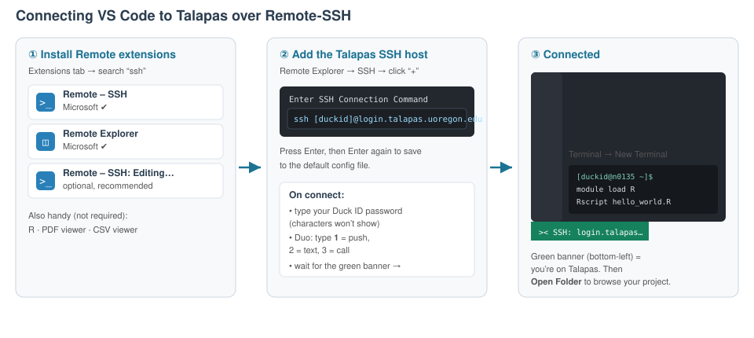
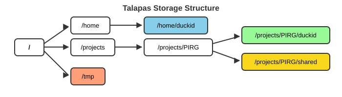

```{r}
#| label: setup
#| include: false

# Packages used in the lecture examples
library(tidyverse)
library(gt)
library(readxl)

# Consistent theme for all plots
theme_set(theme_minimal(base_size = 14))

# Reproducible random numbers
set.seed(2026)
```


## Book reading for this lecture

The course book goes deeper on everything in this lecture. Read before or after class:

-   [Ch. 15: High-Performance Computing with Talapas](../book/chapters/15-hpc-talapas.html)
-   [Ch. 16: Parallel Computing in R](../book/chapters/16-parallel-computing.html)
-   *Reference:* [App. G: SLURM Command Reference](../book/chapters/appendix-G-slurm.html)

## Goals for today

-   Basics of working with Talapas
-   The SLURM job scheduler
-   Software modules and monitoring jobs
-   Running R (`Rscript`) and Python (`python3`) scripts as batch jobs
-   <https://wcresko.github.io/computational_tools_book/>


# Talapas and High Performance Computing

## What is Talapas?

-   **Talapas** is UO's high-performance computing (HPC) cluster
-   Named from Chinook word for coyote (educator and keeper of knowledge)
-   Managed by Research Advanced Computing Services (RACS)
-   Located in the Allen Hall Data Center
-   https://uoracs.github.io/talapas2-knowledge-base/

### Key Resources:

-   Over 14,520 CPU cores
-   129 TB of memory
-   89 GPUs (including A100, H100, V100)
-   3+ Petabytes of storage

## Talapas Architecture

{fig-align="center" width="95%"}

## Login Nodes vs Compute Nodes

### Login Nodes (Head Nodes)

-   Where you land when you SSH into Talapas
-   For **light tasks only**: file management, editing, job submission
-   Shared by all users - be considerate!
-   Heavy processes will be killed

### Compute Nodes

-   Where your actual work runs
-   Accessed through the SLURM scheduler
-   Different types for different needs:
    -   Standard CPU nodes
    -   GPU nodes
    -   High-memory ("fat") nodes

## Node Types on Talapas

| Node type (general use)  | How many | Cores per node | Memory per node | Purpose                         |
|--------------------------|----------|----------------|-----------------|---------------------------------|
| Standard CPU (AMD Milan) | 43       | 128            | 512 GB          | General computation             |
| GPU                      | 24       | 48             | 256 - 512 GB    | Machine learning, CUDA (52 NVIDIA A100 GPUs in total) |
| Large memory             | a few    | varies         | up to 4 TB      | Memory-hungry jobs (e.g. genome assembly) |
| Interactive              | 19       | varies         | varies          | Testing, development, Open OnDemand sessions |

::: callout-note
Researchers can also buy **condo** nodes that their group gets priority on - about 166 more CPU nodes plus V100, A100, and H100 GPUs. Numbers from [RACS](https://racs.uoregon.edu/services); check the [Knowledge Base](https://uoracs.github.io/talapas2-knowledge-base/) for the current list.
:::

## Partitions (Queues)

| Partition        | Time limit | Use it for                                   |
|------------------|------------|----------------------------------------------|
| `compute`        | 1 day      | General CPU jobs (the default choice)        |
| `computelong`    | 14 days    | Long CPU jobs                                |
| `gpu`            | 1 day      | Jobs that need a GPU                         |
| `gpulong`        | 14 days    | Long GPU jobs                                |
| `interactive`    | 12 hours   | Shorter interactive CPU sessions             |
| `interactivegpu` | 8 hours    | Shorter interactive GPU sessions             |
| `memory`         | 1 day      | Jobs needing lots of memory (up to 4 TB)     |
| `memorylong`     | 14 days    | Long, memory-hungry jobs                     |

::: callout-tip
Run `sinfo` on Talapas to see every partition, including your lab's condo partitions.
:::

## Getting Access to Talapas

### Step 1: Join or Create a PIRG

-   **PIRG** = Principal Investigator Research Group
-   Contact your PI to be added to their PIRG
-   Or contact RACS to create a new PIRG

### Step 2: Request Access

-   Visit [racs.uoregon.edu/request-access](https://racs.uoregon.edu/request-access)
-   Your username = your Duck ID
-   Your password = your UO password

## Logging Into Talapas - web browser

[ondemand.talapas.uoregon.edu](https://ondemand.talapas.uoregon.edu)

-   No command line needed!
-   File browser for uploads/downloads
-   Interactive applications:
    -   JupyterLab/Notebooks
    -   RStudio
    -   MATLAB
    -   Remote desktop

### Great for:

-   Beginners learning HPC
-   Quick file management
-   Interactive data analysis
-   Running GUI applications

## Logging Into Talapas - command line

### From a terminal (macOS, Ubuntu/WSL, VS Code, Positron):

``` bash
# Through the load balancer - works from anywhere (expect a Duo prompt)

ssh yourduckid@login.talapas.uoregon.edu

# With the UO VPN connected you can also pick a specific login node

ssh yourduckid@login1.talapas.uoregon.edu
ssh yourduckid@login2.talapas.uoregon.edu
ssh yourduckid@login3.talapas.uoregon.edu
ssh yourduckid@login4.talapas.uoregon.edu
```

### From Windows:

-   Use the Ubuntu (WSL) terminal
-   Or VS Code / Positron with the Remote-SSH extension

::: callout-note
The Knowledge Base says the UO VPN is **recommended, not required**. Off campus without the VPN: SSH to the load balancer `login.talapas.uoregon.edu` and answer the Duo two-step prompts.
:::

## Connecting VS Code to Talapas (Remote-SSH)

{fig-align="center" width="100%"}

::: callout-tip
With **Remote - SSH**, VS Code (or Positron) runs its editor on your laptop while the files, terminal, and code live on Talapas - it feels just like working locally.
:::

## Storage on Talapas

{fig-align="center" width="85%"}

### Directory Structure:

| Location                | Quota                 | Purpose                     |
|-------------------------|-----------------------|-----------------------------|
| `/home/duckid`          | 250 GB                | Config files, small scripts |
| `/projects/PIRG/duckid` | Shared (2 TB default) | Large data, analysis        |
| `/projects/PIRG/shared` | Shared                | Files shared with group     |
| `/tmp`                  | Local to node         | Temporary scratch space     |

## Important Notes:

-   **Data is NOT automatically backed up!**
-   Use `/projects` for large files
-   Clean up when done

``` bash
# Check your storage usage
df -h ~
du -sh /projects/myPIRG/myusername
```

## What is SLURM?

-   **S**imple **L**inux **U**tility for **R**esource **M**anagement
-   Job scheduler and workload manager
-   Allocates resources fairly among users
-   Ensures efficient cluster utilization

{fig-align="center" width="95%"}

### Key Concepts:

-   **Jobs**: Units of work you submit
-   **Partitions**: Queues with different properties
-   **Accounts**: Your PIRG for resource tracking

## Essential SLURM Commands

``` bash
# Submit a batch job

sbatch myscript.sh

# Check your jobs in the queue

squeue -u $USER

# Check all jobs on a partition

squeue -p compute

# Cancel a job

scancel JOBID

# Get detailed job info

scontrol show job JOBID

# Check job history and resource usage

sacct -j JOBID --format=JobID,Elapsed,MaxRSS

# View partition information

sinfo -p compute
```

## Interactive Jobs

### For testing and development:

``` bash
# Start an interactive session

srun --pty --partition=interactive --account=myPIRG \
     --time=2:00:00 --cpus-per-task=4 --mem=8G /bin/bash
```

\
\

### When to use interactive jobs:

-   Testing your workflow before batch submission
-   Debugging code
-   Quick data exploration
-   Running GUI applications

**Note**: Your prompt will change from `login1` to something like `n049`

## Writing a SLURM Batch Script

A batch script is a **shell script** with `#SBATCH` directives on top. The last lines are the same commands you would type on your laptop - `Rscript` or `python3`.

::: panel-tabset
### R

``` bash
#!/bin/bash
#SBATCH --job-name=my_analysis      # Job name
#SBATCH --partition=compute         # Partition (queue)
#SBATCH --account=myPIRG            # Your PIRG name
#SBATCH --output=output_%j.log      # Standard output (%j = job ID)
#SBATCH --error=error_%j.log        # Standard error
#SBATCH --time=04:00:00             # Time limit (HH:MM:SS)
#SBATCH --nodes=1                   # Number of nodes
#SBATCH --ntasks-per-node=1         # Tasks per node
#SBATCH --cpus-per-task=4           # CPUs per task
#SBATCH --mem=16G                   # Memory per node

# Load required modules

module load R/4.3.3

# Run your program

Rscript my_analysis.R
```

### Python

``` bash
#!/bin/bash
#SBATCH --job-name=my_analysis_py   # Job name
#SBATCH --partition=compute         # Partition (queue)
#SBATCH --account=myPIRG            # Your PIRG name
#SBATCH --output=output_%j.log      # Standard output (%j = job ID)
#SBATCH --error=error_%j.log        # Standard error
#SBATCH --time=04:00:00             # Time limit (HH:MM:SS)
#SBATCH --nodes=1                   # Number of nodes
#SBATCH --ntasks-per-node=1         # Tasks per node
#SBATCH --cpus-per-task=4           # CPUs per task
#SBATCH --mem=16G                   # Memory per node

# Load required modules

module load python3/3.11.4          # or: module load miniconda3/20240410
                                    #     conda activate my_env

# Run your program

python3 my_analysis.py
```

### R + Python in one job

``` bash
#!/bin/bash
#SBATCH --job-name=fasta_pipeline
#SBATCH --partition=compute
#SBATCH --account=myPIRG
#SBATCH --output=output_%j.log
#SBATCH --error=error_%j.log
#SBATCH --time=01:00:00
#SBATCH --cpus-per-task=2
#SBATCH --mem=8G

set -e                              # stop the job if any step fails

module load python3/3.11.4
module load R/4.3.3

# Step 1 (Python): summarise every FASTA file into one table
python3 fasta_stats.py data/*.fasta > results/fasta_stats.tsv

# Step 2 (R): read that table, make the figure
Rscript plot_stats.R results/fasta_stats.tsv results/fasta_stats.png
```
:::

## What the job actually runs

The scripts are ordinary R and Python programs - the same ones you test on your laptop first. Arguments come from the command line so nothing is hard-coded.

::: panel-tabset
### R (`plot_stats.R`)

```{r}
#| label: lec10-plot-stats-r
#| echo: true
#| eval: false

#!/usr/bin/env Rscript
library(tidyverse)

args <- commandArgs(trailingOnly = TRUE)      # c("results/fasta_stats.tsv", "results/fasta_stats.png")
stats <- read_tsv(args[1])

p <- ggplot(stats, aes(x = file, y = gc_percent)) +
  geom_col() +
  labs(x = NULL, y = "GC content (%)") +
  theme_minimal()

ggsave(args[2], p, width = 8, height = 4)
cat("Wrote", args[2], "\n")
```

### Python (`fasta_stats.py`)

```{python}
#| label: lec10-fasta-stats-py
#| echo: true
#| eval: false

#!/usr/bin/env python3
import sys
from pathlib import Path

print("file\tn_seqs\ttotal_bp\tgc_percent")           # header of the TSV
for path in map(Path, sys.argv[1:]):                 # every file given on the command line
    lines = path.read_text().splitlines()
    n_seqs = sum(line.startswith(">") for line in lines)
    seq = "".join(line for line in lines if not line.startswith(">")).upper()
    gc = 100 * (seq.count("G") + seq.count("C")) / len(seq)
    print(f"{path.name}\t{n_seqs}\t{len(seq)}\t{gc:.1f}")
```
:::

::: callout-tip
Test on a **tiny input on the login node** first (`python3 fasta_stats.py small.fasta`), then submit: `sbatch run_pipeline.sh`. Output and errors land in `output_JOBID.log` and `error_JOBID.log`.
:::

## R and Python packages on Talapas

::: panel-tabset
### R

``` bash
module load R/4.3.3
R                                   # interactive, on an interactive node
```

``` r
install.packages("tidyverse")       # goes to your personal library in ~/R/ - once
library(tidyverse)                  # every session / every script
```

-   Modules give you R itself; **you** install packages into your home directory
-   For a reproducible project, `renv::init()` records exact package versions in the project folder

### Python

``` bash
module load miniconda3/20240410
conda create -n my_env python=3.11 pandas matplotlib biopython   # once
conda activate my_env                                            # every session / job

# or, with the plain python3 module and a virtual environment:
module load python3/3.11.4
python3 -m venv ~/envs/my_env && source ~/envs/my_env/bin/activate
pip install pandas matplotlib biopython
```

-   `conda` (with the **bioconda** channel) installs compiled bioinformatics tools too - `conda install -c bioconda samtools`
-   Put the same `module load` + `conda activate` / `source .../activate` lines in your `sbatch` script
:::

## Understanding SLURM Directives

| Directive         | Description         | Example                           |
|-------------------|---------------------|-----------------------------------|
| `--partition`     | Queue to use        | `compute`, `computelong`, `gpu`, `memory` |
| `--account`       | PIRG for accounting | `myPIRG`                          |
| `--time`          | Max runtime         | `1-12:00:00` (1 day, 12 hrs)      |
| `--nodes`         | Number of nodes     | `1`                               |
| `--cpus-per-task` | Cores per task      | `8`                               |
| `--mem`           | Memory per node     | `32G`                             |
| `--mem-per-cpu`   | Memory per CPU      | `4G`                              |
| `--gres`          | Generic resources   | `gpu:1`                           |

**Tip**: Request only what you need - smaller jobs run sooner!

## GPU Jobs

``` bash
#!/bin/bash
#SBATCH --job-name=gpu_job
#SBATCH --partition=gpu             # GPU partition
#SBATCH --account=myPIRG
#SBATCH --time=1-00:00:00           # 1 day
#SBATCH --nodes=1
#SBATCH --ntasks-per-node=1
#SBATCH --gres=gpu:1                # Request 1 GPU
#SBATCH --mem=32G

# Load CUDA and your software

module load cuda/12.4
module load miniconda3/20240410

# Activate your conda environment

conda activate my_ml_env

# Run your GPU code

python train_model.py
```

\
\

### Check available GPUs:

``` bash
/packages/racs/bin/slurm-show-gpus
```

## Talapas Uses Software Modules (LMOD)

``` bash
# List all available modules
module avail

# Search for specific software
module spider R
module spider python          # python3/3.x.y modules, plus miniconda3 for conda environments

# Load a module
module load R/4.3.3
module load miniconda3/20240410

# See what's loaded
module list

# Unload a module
module unload R

# Reset to default
module purge
```

::: callout-note
In your batch scripts, always load modules after the SBATCH directives!
:::

## Monitoring Your Jobs

``` bash
# Check job status

squeue -u $USER

# Detailed job information

scontrol show job JOBID

# After job completes - see resource usage

sacct -j JOBID --format=JobID,JobName,Elapsed,MaxRSS,State
```

\
\

### Common Status Codes:

| Code | Meaning           |
|------|-------------------|
| PD   | Pending (waiting) |
| R    | Running           |
| CG   | Completing        |
| CD   | Completed         |
| F    | Failed            |

## Best Practices for Talapas

### Do:

-   Request only resources you need
-   Test with small datasets first
-   Use `--time` conservatively
-   Clean up old files regularly
-   Use `/projects` for large data

### Don't:

-   Run heavy computation on login nodes
-   Leave jobs running indefinitely
-   Store sensitive data without encryption
-   Forget to acknowledge RACS in publications

## Getting Help with Talapas

### Resources:

-   Documentation: [uoracs.github.io/talapas2-knowledge-base](https://uoracs.github.io/talapas2-knowledge-base/)
-   Service Desk: [hpcrcf.atlassian.net/servicedesk](https://hpcrcf.atlassian.net/servicedesk/customer/portal/1)
-   Email: racs\@uoregon.edu
-   Office Hours: Knight Library, Dream Lab 122E (Wednesdays 1-3pm)

### Acknowledgment Text:

> "The authors acknowledge Research Advanced Computing Services (RACS) at the University of Oregon for providing computing resources that have contributed to the research results reported within this publication."
