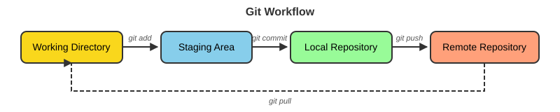
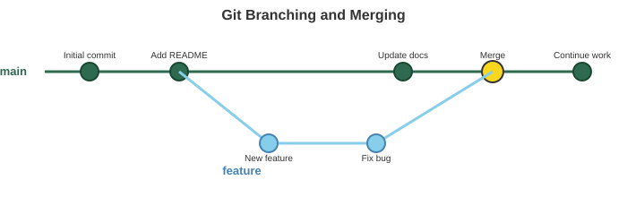

```{r}
#| label: setup
#| include: false

# Packages used in the lecture examples
library(tidyverse)
library(gt)
library(readxl)

# Consistent theme for all plots
theme_set(theme_minimal(base_size = 14))

# Reproducible random numbers
set.seed(2026)
```

## Book reading for this lecture

The course book goes deeper on everything in this lecture. Read before or after class:

- [Ch. 19: Version Control with Git and GitHub](../book/chapters/19-git-github.html)
- *Reference:* [App. H: Git Command Reference](../book/chapters/appendix-H-git.html)

## Goals for today

- Git and GitHub
  - hands-on: `init`, `add`, `commit`, `push` and `pull`
  - branches and pull requests to explore after class
- Publishing websites with GitHub Pages

::: callout-note
## On your own this week

- Work through this one-hour video alongside the book chapter

- [**Learn Git & GitHub for Beginners (Coder Coder)**](https://www.youtube.com/watch?v=h2a3Kw-I_Ec)

- It covers today's whole arc a second time, at a gentler pace
:::

## Before anything else - do these two things right now

1.  Open a terminal and run `git --version`. A version number = you're ready. An error = install Git now, and keep up with the slides while it runs:

``` bash
git --version

# macOS: this one command triggers Apple's installer
xcode-select --install          # (or: brew install git)

# Windows: download the installer from git-scm.com, accept the defaults
# (inside WSL/Ubuntu instead: sudo apt-get install git)
```

2.  **No GitHub account yet?** Start the signup *this minute* at [github.com](https://github.com) - the next slides walk through the steps. The verification email will arrive while I talk; finish it when it does.

Both done? Perfect - you'll push code to the internet within 25 minutes.

## Configure Git - introduce yourself

Git stamps every commit with an author, so tell it who you are (once per computer):

``` bash
# Set your name and email
# use the SAME email as your GitHub account

git config --global user.name "Your Name"
git config --global user.email "your.email@example.com"

# Make every new repository start on a branch named 'main'
# (older Git versions default to 'master' - set this once and forget it)

git config --global init.defaultBranch main

# Check your settings

git config --list
```

# GitHub

## Creating a GitHub Account

You started this a minute ago - finish the email verification when it lands. The steps:

1.  Go to [github.com](https://github.com)
2.  Click "Sign up"
3.  Choose a username - professional and memorable; it becomes part of your public URL (`username.github.io`), so think "future CV", not "xXgamerXx"
4.  Add your university email (you can add others later)
5.  Verify your account from the email they send
6.  Then apply for the **GitHub Student Developer Pack**:
    - Free GitHub Pro while you're a student
    - Access to development tools
    - Apply at [education.github.com](https://education.github.com)

## Git and GitHub

### What is Git?

- **Git** is a distributed version control system
- Tracks changes in your code over time
- Allows collaboration with others
- Maintains complete history of all changes

### What is GitHub?

- **GitHub** is a web-based hosting service for Git repositories
- Provides cloud storage for your code
- Enables collaboration features
- Hosts documentation and websites (GitHub Pages)
- Free for public repositories

## GitHub for Scientific Collaboration

### Perfect for Research Projects:

- **Reproducibility**: the complete history of how every figure was made - "code available at github.com/yourlab/..." is what journals and funders increasingly require
- **Collaboration**: labmates and collaborators work on the same analysis - no more emailing `script_final_v3_REALLY.R` around
- **Lab continuity**: when a student graduates, the analysis stays - with the history of why each choice was made
- **Documentation**: README files, wikis, and GitHub Pages
- **Issues**: track bugs, ideas, and to-dos right next to the code
- **Releases + DOIs**: tag the exact version used in a manuscript; linking Zenodo turns a release into a citable DOI
- **Reuse**: most published pipelines live on GitHub - clone them, read them, build on them

## Git Workflow Concept

{fig-align="center" width="100%"}

- **Track Changes**: Every modification is recorded
- **Collaboration**: Multiple people can work simultaneously
- **Backup**: Your code is safe in multiple places
- **Experimentation**: Try new things without breaking working code

## Git Branching and Collaboration

{fig-align="center" width="100%"}

- Today we stay on one branch, `main`
- The commands for branching and merging are in the *For later* slides at the end and in [Ch. 19](../book/chapters/19-git-github.html)

## Authenticating to GitHub

Pushing needs more than your password - GitHub stopped accepting passwords from the command line in 2021, and the first `git push` is where everyone gets stuck. We'll all use the **GitHub CLI** (`gh`), the easiest route:

``` bash
# 1. Install the CLI

brew install gh                  # macOS
winget install --id GitHub.cli   # Windows
sudo apt-get install gh          # Ubuntu / WSL

# 2. Log in - one time only; answer the prompts like this:

gh auth login
#  ? Where do you use GitHub?            -> GitHub.com
#  ? Preferred protocol?                 -> HTTPS
#  ? Authenticate Git with credentials?  -> Yes
#  ? How would you like to authenticate? -> Login with a web browser
#  ...copy the one-time code it prints, paste it in the browser that opens

# 3. Confirm it worked

gh auth status                   # "Logged in to github.com as USERNAME"
```

::: callout-tip
Done once, done forever on this machine. The alternatives - SSH keys (which also log you in to Talapas in Week 10) and credential managers - are in [Ch. 19](../book/chapters/19-git-github.html#sec-git-auth).
:::

## Walkthrough: a new repository, from your laptop to GitHub

We'll do this live, together - a brand-new repository on your computer, then the same repository on GitHub, then the two connected:

``` bash
# 1. Make a project and put it under version control

mkdir ~/projects/git_practice && cd ~/projects/git_practice
git init                      # creates the hidden .git/ folder
git status                    # read what it says - always

# 2. Create a few files worth tracking

echo "# My first repository" > README.md
echo 'print("hello, git")' > analysis.py
echo "lab notes, day 1" > notes.txt

# 3. Stage - three ways to say what goes into the commit

git add README.md             # one file, by name
git add *.py                  # wildcard: every .py file
git add .                     # everything new or changed from here down

# 4. Commit the staged snapshot

git commit -m "First commit: README, analysis script, notes"
git status                    # "working tree clean" - everything is recorded
```

::: callout-tip
Fall behind? Keep watching - every step of today's class is in [Ex 8](../Exercise_Folder/Exercises_Week08.qmd) to redo tonight at your own pace.
:::

## Viewing Commit History

``` bash
# View commit history

git log

# Prettier one-line format

git log --oneline

# With graph

git log --graph --oneline --all

# Show changes in commits

git log -p

# Show last n commits

git log -3
```

## What changed? `git diff` and commit hashes

``` bash
# What have I edited but not yet staged?

git diff

# What is staged, about to be committed?

git diff --staged

# Every commit has a unique ID - a hash. See the short form:

git log --oneline        # e.g.  7d4e8c2  Add violin plot

# Compare any two commits by their hashes

git diff 7d4e8c2 3f9a1b5
```

- A **hash** is the commit's name - quote it in lab notebooks ("results from `7d4e8c2`") and use it anywhere a command wants a commit
- **HEAD** is simply the commit you are standing on right now; `HEAD~1` is one commit back

## Walkthrough: connect it to GitHub

``` bash
# 3. On github.com: New repository -> name it git_practice
#    IMPORTANT: leave it EMPTY - no README, no license, no .gitignore
#    (those would create a history that conflicts with yours)

# 4. Connect and push (GitHub shows these exact lines after step 3)

git remote add origin https://github.com/USERNAME/git_practice.git
git branch -M main            # make sure your branch is named 'main'
git push -u origin main       # -u: remember this pairing for future pushes
```

::: callout-note
**Why `branch -M main`?** Older Git creates the first branch as `master` (harmless if yours is already `main`) - and GitHub takes the **first branch you push** as the repository's default, so push `main` first and the two sides agree.
:::

## The round trip: `pull`

Your repository now lives in **two places** - so finish the loop:

``` bash
# 1. On github.com: open README.md, click the pencil icon,
#    add a line, and commit the change THERE

# 2. Bring that commit down to your laptop

git pull

# 3. Proof - both commits, one history

git log --oneline
```

- `push` and `pull` are the same verb in opposite directions - this is also how you'll move between laptop and Talapas in Week 10
- **Daily rhythm** from here on: `git pull` → edit → `git add .` → `git commit -m "..."` → `git push`

::: callout-tip
Lost or confused? `git status` always tells you the next command. And worst case: your work is on GitHub - delete the folder and `git clone` it back.
:::

## .gitignore File

### Exclude files from version control:

``` bash
# Create .gitignore file
touch .gitignore
```

### Common patterns to exclude:

``` bash
# Data files
*.fastq
*.fasta
*.bam
*.vcf
data/raw/*

# R files
.Rhistory
.RData
.Rproj.user

# Python files
__pycache__/
*.pyc
.venv/
.ipynb_checkpoints/

# Output files
results/temp/*
*.log

# Quarto working folder
.quarto/

# System files
.DS_Store
```

## Best Practices: commits

### Messages - the history is for readers (including future-you)

- First line short (~50 characters) and imperative: "Add violin plot", not "Added some stuff"
- Say *why*, not just what - the diff already shows the what
- Bad: `stuff`, `final`, `final2`, `fixed it` · Good: `Normalize counts before PCA`

### Habits

- Commit **early and often** - one logical change per commit, so the history reads like a lab notebook and any single step can be undone
- `git status` and `git diff` before every commit - know exactly what you are recording
- **Pull before you start, push when you stop** - the habit that keeps two machines (or two people) out of trouble

## Best Practices: what belongs in a repository

```         
project/
├── README.md          # Project description - the front page on GitHub
├── .gitignore         # What Git should never track
├── data/              # Raw data (usually .gitignore'd - README says where it lives)
├── analysis/          # Analysis scripts (.R, .py, .sh, .qmd)
├── results/           # Output files (commit small tables/figures; regenerable ones can be ignored)
└── docs/              # Documentation, or the rendered website for Pages
```

- **Yes**: code, text, notebooks, config, `environment.yml` (next week) - small, human-readable, hard to recreate
- **No**: large raw data (put *where it lives* in the README), regenerable bulk output, `.quarto/`
- **NEVER**: passwords, API keys, tokens - even in a private repository; treat every commit as permanent and public

# GitHub Pages

## GitHub Pages: host your research website for free

{fig-align="center" width="100%"}

- Any repository can serve a website: **Settings → Pages → Deploy from a branch → `main`, `/docs`** - live at `https://username.github.io/repo_name`
- Quarto fits perfectly: `output-dir: docs` in `_quarto.yml` means `quarto render` fills `docs/` and a push publishes it (`quarto publish gh-pages` is the one-command alternative)
- Which is exactly what we do next, live

## Finale: last week's website goes live

In L07 you built `example_website` - a real four-page Quarto site (home, research, publications, CV) with your details in it. A website is just a folder of HTML files; GitHub Pages will serve that folder to the world. Step one is getting the folder rendered and under version control:

``` bash
cd ~/projects/my_website        # your website project from last week

# 1. Render the site one final time
#    _quarto.yml says output-dir: docs, so the finished HTML
#    lands in docs/ - open docs/index.html to see what will go live

quarto render
touch docs/.nojekyll            # tells GitHub Pages: serve the files as-is

# 2. Exactly the walkthrough from earlier - plus the .gitignore,
#    so Quarto's working folder stays out of the repository

git init
echo ".quarto/" > .gitignore
git add .
git commit -m "First commit: my academic website"
git branch -M main
```

*(No website from last week? Grab `example_website.zip` from the [Examples page](../Examples.html#week-7), unzip it, put your name in `_quarto.yml` - two minutes, then rejoin.)*

## Finale: flip the switch

``` bash
# 3. On github.com: New repository -> my_website -> EMPTY again
#    (no README, no license - your history already exists locally)

git remote add origin https://github.com/USERNAME/my_website.git
git push -u origin main
```

4.  On GitHub: **Settings → Pages → Deploy from a branch → `main`, `/docs` → Save** - you are telling GitHub "serve the `docs/` folder of `main` as a website"
5.  Watch the repository's **Actions** tab: a "pages build and deployment" job runs for about a minute and turns green
6.  Open **`https://USERNAME.github.io/my_website`** - on your phone too; it is the public internet now
7.  Updating the site from here on is just the daily rhythm: edit a `.qmd` → `quarto render` → `git add .` → `git commit` → `git push` - live about a minute later

::: callout-tip
That URL is real, permanent, and free - put it in your email signature. It is also the exact mechanism your term project report will use.
:::

## Start now: publish your term project

1.  `git init` your project folder (data excluded via `.gitignore`), commit, and push it to a GitHub repository
2.  Render your Quarto report and enable **Pages** on the `docs/` folder - your analysis is now a live website
3.  Add a `README.md` that says what the project is, where the data live, and how to reproduce the results (the [example README](../Examples.html#week-8) is the model)

::: callout-tip
This is exactly the shape of a modern reproducible paper: a repository anyone can clone, a report anyone can read, and a history of how it got there. **HW2 goes out today** (due Monday, November 30) and ends the same way - your analysis pushed to GitHub. Final projects are due **Friday, December 11**.
:::

## Summary - and where we are in the arc

- **Git** records every step; **GitHub** backs it up, shares it, and (with **Pages**) publishes it
- The arc so far: shell pipelines → R/Python scripts → data frames and figures → Quarto documents → a published, reproducible project
- Still to come: **environments that travel** (next Monday, L09) and **Talapas at scale** (L10) - the last two pieces of the loop
- Every tool here is free, open, and the daily standard in computational science

# For later - on your own

## Branching and Merging

`git switch` (and `git restore`, two slides on) are the modern commands that split the overloaded `git checkout` in two - older tutorials say `checkout`, and both forms work:

``` bash
# Create and switch to new branch

git switch -c feature-branch

# Switch branches

git switch main

# Merge branch

git merge feature-branch
```

## Common Git Workflow with Branches

### Daily Development Cycle

``` bash
# 1. Start your day - update your local copy

git pull origin main

# 2. Create a feature branch

git switch -c new-feature

# 3. Make changes and commit regularly

git add .
git commit -m "Add new analysis function"

# 4. Push your branch

git push origin new-feature

# 5. Create pull request on GitHub (via website)
```

## Undoing: `git restore` and resetting HEAD

``` bash
# Discard your edits to a file (back to the last commit) - GONE for good

git restore analysis.R

# Un-stage a file, keeping your edits

git restore --staged analysis.R

# Undo the last commit, three strengths:

git reset --soft HEAD~1    # undo commit, keep changes staged
git reset HEAD~1           # undo commit, keep changes unstaged
git reset --hard HEAD~1    # undo commit, DISCARD the changes
```

::: callout-warning
`restore` (without `--staged`) and `reset --hard` delete real work with no confirmation. Run `git status` and `git diff` first, so you know exactly what you are throwing away. [App. H](../book/chapters/appendix-H-git.html) has the full undo table.
:::

## Cloning an Existing Repository

The other way a repository reaches your laptop - someone else's (or yours, on a new machine):

``` bash
git clone https://github.com/username/repository.git
cd repository    # a full copy: files, history, remote already connected
```

## Resources and Help

::: callout-note
## Keep going

- The one-hour video from the start of class: [Learn Git & GitHub for Beginners (Coder Coder)](https://www.youtube.com/watch?v=h2a3Kw-I_Ec)
- [Ex 8](../Exercise_Folder/Exercises_Week08.qmd) - today's whole class as short tasks, plus branching and the rescue drill
:::

- **GitHub Docs** `(https://docs.github.com)`
- **Pro Git Book** `(https://git-scm.com/book) (free online)`
- **GitHub Skills** `(https://skills.github.com)`
- **Quarto + GitHub Pages** `(https://quarto.org/docs/publishing/github-pages.html)`