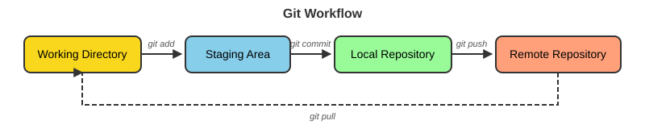
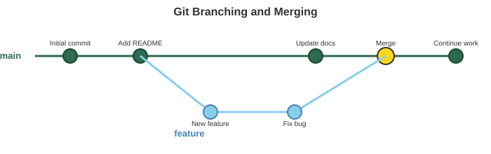

```{r}
#| label: setup
#| include: false

# Packages used in the lecture examples
library(tidyverse)
library(gt)
library(readxl)

# Consistent theme for all plots
theme_set(theme_minimal(base_size = 14))

# Reproducible random numbers
set.seed(2026)
```


## Book reading for this lecture

The course book goes deeper on everything in this lecture. Read before or after class:

-   [Ch. 20: Version Control with Git and GitHub](../book/chapters/20-git-github.html)
-   *Reference:* [App. I: Git Command Reference](../book/chapters/appendix-I-git.html)

## Goals for today

-   Finish Git and GitHub
-   Publishing websites with GitHub Pages
-   <https://wcresko.github.io/computational_tools_book/>

## Git and GitHub

### What is Git?

-   **Git** is a distributed version control system
-   Tracks changes in your code over time
-   Allows collaboration with others
-   Maintains complete history of all changes

### What is GitHub?

-   **GitHub** is a web-based hosting service for Git repositories
-   Provides cloud storage for your code
-   Enables collaboration features
-   Hosts documentation and websites (GitHub Pages)
-   Free for public repositories

## Git Workflow Concept

{fig-align="center" width="100%"}

-   **Track Changes**: Every modification is recorded
-   **Collaboration**: Multiple people can work simultaneously
-   **Backup**: Your code is safe in multiple places
-   **Experimentation**: Try new things without breaking working code

## Setting Up Git

### 1. Install Git

``` bash
# Check if Git is installed

git --version

# macOS (with Homebrew)

brew install git

# Ubuntu/Debian

sudo apt-get install git

# Windows: Download from git-scm.com
```

### 2. Configure Git

``` bash
# Set your name and email

git config --global user.name "Your Name"
git config --global user.email "your.email@example.com"

# Check your settings

git config --list
```

# GitHub

## GitHub for Scientific Collaboration

### Perfect for Research Projects:

-   **Reproducibility**: Complete history of analysis development
-   **Collaboration**: Work with colleagues worldwide
-   **Documentation**: README files, wikis, and GitHub Pages
-   **Issues**: Track bugs, ideas, and to-dos
-   **Releases**: Tag specific versions for publications
-   **DOI Integration**: Link with Zenodo for citations

## Resources and Help

### Learning Resources:

-   **GitHub Docs** `(https://docs.github.com)`
-   **Pro Git Book** `(https://git-scm.com/book) (free online)`
-   **GitHub Skills** `(https://skills.github.com)`
-   **Quarto + GitHub Pages** `(https://quarto.org/docs/publishing/github-pages.html)`

## Creating a GitHub Account

### Steps to Get Started:

1.  Go to [github.com](https://github.com)
2.  Click "Sign up"
3.  Choose a username (professional, memorable)
4.  Add your university email
5.  Verify your account
6.  Consider GitHub Student Developer Pack:
    -   Free GitHub Pro while you're a student
    -   Access to development tools
    -   Apply at [education.github.com](https://education.github.com)

## Basic Git Commands

### Initialize a Repository

There are two ways to do this: create a new repository, or clone an existing repository

``` bash
# Create a new repository

git init

# Clone an existing repository

git clone https://github.com/username/repository.git
```

## Creating a template repo on GitHub

I created a template website repository for you to clone and edit

-   Open GitHub and log into it (important that you're logged in)
-   Go to this repository in my GitHub account:

`https://github.com/wcresko/academic_website_template`

-   Click the green button in the upper right hand corner that says 'Use this template'
-   This will clone the template into your GitHub account.

## Cloning the template repository to your local machine

-   Now you can clone the repository to you local machine

-   Open your terminal and `cd` to a location where you want to clone the repository

``` bash
## type the following command

git clone << Link to your repository on GitHub >>
```

-   I'll show you how to find the link on GitHub to use

## Track Changes

``` bash
# Check status

git status

# Add files to staging

git add filename.txt        # Add specific file
git add .                   # Add all changes

# Commit changes

git commit -m "Descriptive message about changes"
```

## Working with Remotes

``` bash
# Add a remote repository

git remote add origin https://github.com/username/repo.git

# View remotes

git remote -v

# Push changes to GitHub

git push origin main

# Pull changes from GitHub

git pull origin main

# Fetch without merging

git fetch origin
```

## Branching and Merging

{fig-align="center" width="100%"}

``` bash
# Create and switch to new branch

git switch -c feature-branch

# Switch branches

git switch main

# Merge branch

git merge feature-branch
```

Note: `git checkout -b` / `git checkout main` is the older syntax - it still works and you will see it everywhere

## Common Git Workflow

### Daily Development Cycle

``` bash
# 1. Start your day - update your local copy

git pull origin main

# 2. Create a feature branch

git switch -c new-feature

# 3. Make changes and commit regularly

git add .
git commit -m "Add new analysis function"

# 4. Push your branch

git push origin new-feature

# 5. Create pull request on GitHub (via website)
```

## Viewing Commit History

``` bash
# View commit history

git log

# Prettier one-line format

git log --oneline

# With graph

git log --graph --oneline --all

# Show changes in commits

git log -p

# Show last n commits

git log -3
```

## .gitignore File

### Exclude files from version control:

``` bash
# Create .gitignore file
touch .gitignore
```

### Common patterns to exclude:

``` bash
# Data files
*.fastq
*.fasta
*.bam
*.vcf
data/raw/*

# R files
.Rhistory
.RData
.Rproj.user

# Python files
__pycache__/
*.pyc
.venv/
.ipynb_checkpoints/

# Output files
results/temp/*
*.log

# System files
.DS_Store
```

## Best Practices

### Commit Messages

-   Be descriptive and concise
-   Use present tense: "Add feature" not "Added feature"
-   Reference issues: "Fix bug #123"

### Repository Organization

```         
project/
├── README.md          # Project description
├── data/              # Raw data (consider .gitignore)
├── analysis/          # Analysis scripts (.R, .py, .sh, .qmd)
├── results/           # Output files
└── docs/              # Documentation
```

## GitHub Pages

### Host Your Research Website for Free!

{fig-align="center" width="100%"}

### Setup Steps:

1.  Create repository
2.  Clone to your local computer
3.  Make changes in VS Code, Positron or RStudio (`.qmd` files with R or Python chunks)
4.  Add and Commit your changes
5.  Push your changes and files to the remote repository
6.  Enable Pages in repository settings
7.  Your site is live at `https://username.github.io/repo_name`

## GitHub Pages Configuration

### In your repository:

1.  Go to Settings → Pages
2.  Source: Deploy from a branch
3.  Branch: main (or gh-pages)
4.  Folder: `/docs` (preferable) or `/` (root)

### For Quarto projects:

``` yaml
# In _quarto.yml

project:
  type: website
  output-dir: docs
```
