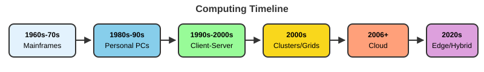
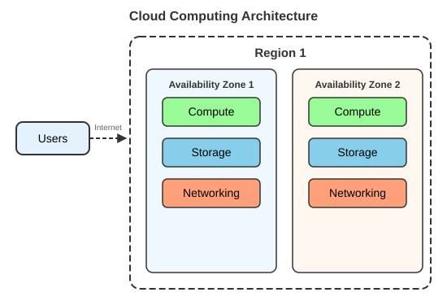

Modern bioengineering research pushes against the limits of a laptop surprisingly quickly: imaging datasets, simulation outputs, and sequencing files are large, the software stack is deep, and many steps run faster (or only run at all) on shared research computing infrastructure. This appendix builds the mental model you need: how a computer actually executes work, how an operating system manages resources, how to get a Unix shell on any laptop (including Windows), how to use VS Code or Positron as a local editor, and how to navigate and manipulate the file system from the command line. The University of Oregon's Talapas HPC cluster, SSH login, modules, and SLURM scheduling are covered in **Lecture 10 (Talapas)**.

::: {.callout-tip title="Where this fits in the course"}
This appendix is a written reference for material **covered in Lectures 00-04**:

| Section of this appendix | Lecture |
|---|---|
| Getting a shell (macOS, Linux, Windows/WSL); VS Code and Positron | Lecture 00 (bootcamp) |
| How computers and operating systems work | Lecture 01 (computer systems) |
| Where computation can happen; first steps at the command line | Lecture 02 (local/cluster/cloud computing) |
| Navigating, paths, files, wildcards, pipes and redirection | Lecture 03 (Unix navigation, files, pipes) |
| Viewing large files, compressed files, downloading data | Lecture 04 (Unix streams & large data files) |

`grep`, regular expressions, and shell scripting (Lectures 05-06) are in [Appendix B](Appendix_B_GREP_Regex_Shell.qmd); Talapas and SLURM are in Lecture 10.
:::

::: callout-tip
**Keep a reference open.** The [Resources hub](../Resources.qmd) links to one-page Unix shell and VS Code references that pair with this appendix, and the [Glossary](Glossary.qmd) defines every term used here. You will lean on the shell again every time you work in a terminal, locally now and on Talapas later in the term.
:::

::: {.callout-note title="What you'll be able to do"}
After working through this appendix you should be able to:

- Explain how a computer executes work (CPU/GPU, memory vs. storage) and what an operating system does
- Decide **where** a given analysis should run: laptop, HPC cluster, or cloud
- Open a Unix shell on macOS, Linux, or Windows (via WSL)
- Open and work in a project folder in **VS Code** (or **Positron**) as a local editor
- Navigate the file system from the command line and tell **absolute** from **relative** paths
- Create, move, copy, and remove files and directories safely from the shell
- Use **wildcards, pipes, and redirection** to combine commands, and download data with `wget`/`curl`
:::

# How computers and operating systems work

## What is a computer system?

A computer system is the combination of four things working together:

-   **Hardware**: the physical components (CPU, memory, storage, I/O devices)
-   **Software**: the programs and instructions that run on the hardware
-   **Firmware**: low-level software embedded in hardware
-   **Data**: the information being processed

{fig-align="center" width="60%"}

### The fetch-decode-execute cycle

Every operation a computer performs reduces to a small cycle repeated billions of times per second:

{fig-align="center" width="80%"}

1.  **Fetch**: retrieve an instruction from memory
2.  **Decode**: interpret what the instruction means
3.  **Execute**: perform the operation
4.  **Store**: save results to memory or a register

The classic name is the three-phase "fetch-decode-execute" cycle; the **store** (write-back) phase is often counted as part of execute, which is why you will see it described as either three or four steps.

## Hardware components

### Central Processing Unit (CPU)

::::: columns
::: {.column width="50%"}
**Core components**

-   **Control Unit (CU)**: directs operations
-   **Arithmetic Logic Unit (ALU)**: performs calculations
-   **Registers**: ultra-fast temporary storage
-   **Cache**: high-speed memory buffer
:::

::: {.column width="50%"}
**Key concepts**

-   **Clock speed**: cycles per second (GHz)
-   **Cores**: independent processing units
-   **Threads**: virtual cores for parallel processing
-   **Instruction set**: the CPU's language (x86, ARM)
:::
:::::

### Graphics Processing Unit (GPU)

::::: columns
::: {.column width="50%"}
**Core components**

-   **Streaming Multiprocessors (SMs)**: processing clusters
-   **CUDA cores / stream processors**: parallel compute units
-   **Video Memory (VRAM)**: dedicated high-bandwidth memory
-   **Memory controller**: manages data flow to/from VRAM
:::

::: {.column width="50%"}
**Key concepts**

-   **Parallel architecture**: thousands of cores for simultaneous tasks
-   **Memory bandwidth**: data throughput (GB/s)
-   **Compute units**: groups of processing cores
-   **APIs**: programming interfaces (CUDA, OpenCL, Vulkan)
:::
:::::

### CPU vs GPU

::::: columns
::: {.column width="50%"}
**CPU characteristics**

-   **Design focus**: sequential processing & complex tasks
-   **Core count**: 4-64 powerful cores
-   **Architecture**: optimized for single-thread performance
-   **Best for**: operating systems & general computing, complex branching logic, serial tasks
:::

::: {.column width="50%"}
**GPU characteristics**

-   **Design focus**: parallel processing & high throughput
-   **Core count**: thousands of smaller cores
-   **Architecture**: optimized for massive parallelism
-   **Best for**: graphics rendering, machine learning/AI, image processing, scientific simulations
:::
:::::

### Memory and storage

::::: columns
::: {.column width="50%"}
**Random Access Memory (RAM)**

-   **DRAM**: main system memory; needs constant refresh; cheaper, higher density (DDR4, DDR5)
-   **SRAM**: used in CPU cache; no refresh needed; faster but expensive
-   **Volatile**: data is lost when power is off
-   **Random access**: any location is equally fast
:::

::: {.column width="50%"}
**Persistent storage**

-   **HDD**: mechanical spinning platters; large capacity, low cost; ~100-200 MB/s; higher latency (~10 ms)
-   **SSD**: no moving parts (NAND flash); faster access (~0.1 ms); 500-7000 MB/s; more expensive per GB
:::
:::::

::: {.callout-note title="Key concept - CPU, RAM, and disk are three different resources"}
These three are often confused but serve entirely different roles:

- **CPU (processor)**: does the actual computation (arithmetic, logic, calling functions). More cores = more things happening in parallel; higher clock speed = each thing happens faster.
- **RAM (memory)**: holds the data and code the CPU is actively working with. Fast but limited and *volatile*: it empties when you power off. A single time-lapse 3D microscopy stack, or a mammalian reference genome loaded for alignment, can easily occupy 10-30 GB of RAM.
- **Disk (storage)**: holds files permanently. Much slower than RAM but far larger and persistent. Opening a file moves data from disk into RAM; saving it moves data from RAM back to disk.

The most common reason a large analysis crashes on a laptop is **running out of RAM**, not disk space or CPU. Knowing which resource is the bottleneck guides every decision about whether to work locally or on a cluster.
:::

Input/output (I/O) systems connect the computer to the outside world: keyboards, mice, touchscreens, cameras and sensors on the input side; monitors, printers, speakers and actuators on the output side; and network interfaces in both directions. For bioengineers, lab instruments (plate readers, microscopes, sequencers, force sensors) are I/O devices too, and the files they write are where your computational work begins.

## Operating systems

An operating system (OS) is system software that manages hardware and software resources and provides common services for programs.

::::: columns
::: {.column width="40%"}
**Key roles**

-   Resource manager
-   Extended machine
-   User interface provider
-   Security enforcer
:::

::: {.column width="60%"}
**Common operating systems**

-   **Desktop**: Windows, macOS, Unix, Linux
-   **Mobile**: Android, iOS
-   **Server**: Unix, Linux, Windows Server
-   **Specialized**: supercomputers, IoT, embedded instrument controllers

Research computing clusters, including the University of Oregon's Talapas cluster (Lecture 10), run **Linux**, which is why this course spends so much time on the Unix command line.
:::
:::::

{fig-align="center" width="70%"}

### Core OS functions

::::: columns
::: {.column width="50%"}
**Process management**

-   Process creation & termination
-   Process scheduling: CPU time allocation
-   Inter-process communication (IPC)
-   Synchronization & deadlock handling

**File system management**

-   File operations: create, read, write, delete
-   Directory structure
-   Access control & permissions
:::

::: {.column width="50%"}
**Memory management**

-   Memory allocation/deallocation
-   Virtual memory, paging & segmentation
-   Memory protection
-   Swap space management

**Device management**

-   Device drivers: hardware abstraction
-   I/O scheduling, buffering & caching
-   Interrupt handling
:::
:::::

The OS also decides which process runs next on a CPU (scheduling algorithms such as First-Come-First-Served, Shortest Job First, Round Robin, and Priority scheduling) and enforces security through access control lists, user/group permissions, memory protection, user-vs-kernel CPU modes, and sandboxing. The guiding principle:

> "Every program and user should operate using the least amount of privilege necessary."

This same scheduling-and-fairness problem reappears at cluster scale; that is exactly what SLURM solves on Talapas (Lecture 10).

## Coding and scripting

Why work at the command line and in code rather than point-and-click GUIs?

-   It is fast and powerful, particularly for repeated actions: thousands of "clicks" in a single command.
-   It can analyze datasets far too large for Excel or other GUIs.
-   It gives access to thousands of free programs made for and by scientists and engineers.
-   Commands work almost identically across platforms.
-   It is the *only* practical way to use a computer cluster (Lecture 10).
-   Every step is written down, so your analysis can be repeated, shared, and version-controlled ([Appendix C](Appendix_C_Git_GitHub.qmd)).

There is a loose distinction between **coding** (compiled languages such as C, C++, Fortran: faster but less flexible) and **scripting** (interpreted languages such as the Unix shell, Python, R, Julia: flexible but slower). The line has blurred, and most modern analysis pipelines mix both.

# Where computation can happen

Before reaching for a cluster, it helps to see the landscape of where computation can happen.

::: {.callout-note title="The computing landscape"}
- **Local computing**: resources physically present and directly controlled by you (laptop, workstation, lab server).
- **Cluster computing**: many interconnected computers working together as one system (this is what Talapas is).
- **Cloud computing**: on-demand resources delivered over the internet with pay-as-you-go pricing (AWS, Azure, Google Cloud).
:::

{fig-align="center" width="90%"}

::: panel-tabset
### Local

{fig-align="center" width="70%"}

### Cluster

{fig-align="center" width="70%"}

### Cloud

{fig-align="center" width="70%"}
:::

A laptop is fine for learning and for small datasets, but it runs out of memory and time quickly once you scale to full experiments: hundreds of image stacks, parameter sweeps of a simulation, or whole-genome sequencing data. The University of Oregon's **Talapas** HPC cluster is available to UO researchers and has large-memory nodes and GPUs. Connecting to Talapas, loading software, managing files, and submitting jobs are covered in **Lecture 10 (Talapas)**.

# Getting a Unix shell on your laptop

All of the command-line work in this course uses a Unix-style shell (Bash or zsh). How you get one depends on your operating system:

- **macOS**: open the built-in **Terminal** app (Applications → Utilities → Terminal). Modern macOS uses **zsh** by default, which behaves almost identically to Bash for everything in this course.
- **Linux**: open your distribution's **Terminal** application; the default shell is usually Bash.
- **Windows**: install **WSL (Windows Subsystem for Linux)**, which runs a real Ubuntu Linux environment alongside Windows (below).

In every case, the integrated terminal in VS Code, Positron, or RStudio opens the same shell, so you can work without leaving your editor.

## Windows: installing WSL

WSL gives Windows users a full Linux command line, so every command in this course works exactly as it does on macOS, Linux, and Talapas.

1.  Open **PowerShell as Administrator**: click Start, type *PowerShell*, right-click **Windows PowerShell**, and choose **Run as administrator**.
2.  Run:

    ```powershell
    wsl --install
    ```

    This enables the required Windows features and installs the default Ubuntu distribution.
3.  **Restart** your computer when prompted.
4.  Open **Ubuntu** from the Start menu. The first launch takes a minute or two to finish setting up.
5.  When asked, **create a Linux username and password**. These are separate from your Windows or UO login; the password is what `sudo` will ask for later. (Nothing appears on screen while you type the password; that is normal.)
6.  Update the installed software:

    ```bash
    sudo apt update && sudo apt upgrade
    ```

::: {.callout-note title="Where are my Windows files?"}
Inside WSL, your Linux home directory is `/home/<linux-username>` (shortcut `~`). Your Windows drive is mounted under `/mnt/c`, so your Windows user folder is:

```bash
cd /mnt/c/Users/<your-windows-name>
ls
```

For best performance, keep active command-line projects inside the Linux file system (e.g., `~/projects/`) rather than under `/mnt/c`. VS Code and Positron can open folders inside WSL directly (VS Code: install the **WSL** extension, then run `code .` from the Ubuntu terminal).
:::

See Microsoft's guide for troubleshooting: <https://learn.microsoft.com/windows/wsl/install>.

# VS Code (and Positron) on your laptop

**Visual Studio Code** is a free, cross-platform editor from Microsoft that you will use throughout the course: first locally on your laptop, and later to connect to Talapas over SSH (Lecture 10). This section covers the local laptop setup.

::: {.callout-tip title="What about Positron?"}
**Positron** is Posit's data-science IDE, built on **Code OSS**, the open-source core of VS Code. It looks and feels much like VS Code (same Command Palette, Explorer, integrated terminal, and many of the same keyboard shortcuts and extensions), but adds RStudio-style panes for R and Python: a console, variables viewer, plots pane, and data viewer. Almost everything below about opening folders, the terminal, and shortcuts applies to Positron too. Download it from <https://positron.posit.co/>. For R-specific work, see also [Appendix D - R and RStudio](Appendix_D_R_and_RStudio.qmd).
:::

## Installing VS Code

Install it from <https://code.visualstudio.com/download>. Run the installer for your operating system (Windows, macOS, or Linux). On first launch, allow any requested permissions.

Take a moment to find the **Activity Bar** down the left edge: the icons there switch between the Explorer, Search, Source Control, Extensions, and (after installing Remote extensions) Remote Explorer panels. The **Command Palette** (`Ctrl+Shift+P` on Windows/Linux, `Cmd+Shift+P` on macOS) searches every VS Code command by name; you will use it constantly.

## Useful extensions

In the left sidebar, click the **Extensions** tab (the four-squares icon) and search for the following:

-   **Quarto**: edit, preview, and run `.qmd` files. With this extension installed, a **Preview** button appears in the editor's top-right corner; clicking it (or pressing `Ctrl+Shift+K` / `Cmd+Shift+K`) renders a live HTML preview in a split pane that refreshes on save. See [Appendix F](Appendix_F_Quarto_Markdown.qmd).
-   **R**: syntax highlighting, autocompletion, and integration with the R language server.
-   **Python** (Microsoft): Python language support, environments, and Jupyter notebooks.
-   **WSL** (Windows only): open folders that live inside your WSL Linux file system.
-   **vscode-pdf** (PDF Viewer): open plots and rendered documents without leaving the editor.
-   **Excel Viewer** (CSV Editor/Viewer): renders `.csv` files as a formatted table.
-   **GitLens** or **Git Graph**: visualize repository history alongside your code ([Appendix C](Appendix_C_Git_GitHub.qmd)).

After installing, restart VS Code if prompted. The **Remote - SSH** extension (for connecting VS Code to Talapas) is set up in Lecture 10.

## Opening a project folder

VS Code is folder-centric: almost everything works better when you open the root folder of a project rather than individual files.

1.  Create or clone a project folder somewhere sensible on your laptop (e.g., `~/projects/bioe610`).
2.  In VS Code choose **File → Open Folder…** (macOS: **File → Open…**) and navigate to that folder.
3.  The **Explorer** panel on the left now shows the directory tree. Click on any file to open it.
4.  VS Code may ask if you trust the authors of the files in this folder; for your own projects click **Yes, I trust the authors** to enable full functionality.

::: {.callout-tip title="Workspace vs. folder"}
A **folder** opened directly is the simplest way to work. A **workspace** (`.code-workspace` file) lets you group multiple root folders, which is handy when a project spans several directories but unnecessary for this course. Stick with **Open Folder** for now.
:::

## Using VS Code as a local IDE

Once you have a project folder open, VS Code behaves as a full local IDE:

-   The **Explorer** panel (left sidebar) shows the directory tree; click a file to open it in the editor.
-   The **integrated terminal** (**Terminal → New Terminal**, or `` Ctrl+` ``) opens a shell in the project directory: use it to run R scripts, shell commands, or Git commands without leaving VS Code. Press `` Ctrl+` `` to toggle it open and closed.
-   **Comment / uncomment** selected lines with `Ctrl + /` (macOS `Cmd + /`).
-   **Search across all files** in the folder with `Ctrl + Shift + F` (macOS `Cmd + Shift + F`).
-   Split-pane editing lets you view a script and its output log side by side (`Ctrl+\` / `Cmd+\`).
-   Add more terminal tabs with the **+** at the top-right of the terminal pane; you can have multiple shells open simultaneously.
-   **Run R or Python locally**: the integrated terminal is a full shell, so start an interactive session with `R` or `python3`, or run a script with `Rscript my_script.R` or `python3 my_script.py`, exactly as you would in any terminal.

## Useful VS Code shortcuts

| What | How (Win/Linux) | How (macOS) |
|---|---|---|
| Toggle word wrap | Alt+Z | Option+Z |
| Find in current file | Ctrl+F | Cmd+F |
| Find across all files | Ctrl+Shift+F | Cmd+Shift+F |
| Go to a line number | Ctrl+G | Ctrl+G |
| Format a file | Shift+Alt+F | Shift+Option+F |
| Toggle integrated terminal | Ctrl+` | Ctrl+` |
| Open new terminal | Ctrl+Shift+` | Ctrl+Shift+` |
| Split editor pane | Ctrl+\\ | Cmd+\\ |
| Open Command Palette | Ctrl+Shift+P | Cmd+Shift+P |
| Preview Quarto document | Ctrl+Shift+K | Cmd+Shift+K |

Most of these shortcuts also work in Positron.

::: {.callout-tip title="Laptop workflow tip"}
For the first part of the course you work entirely locally: open your project folder in VS Code (or Positron) and run everything from the integrated terminal. When you move to Talapas in Lecture 10, VS Code's Remote-SSH extension connects the same editor interface directly to the cluster; the experience feels nearly identical, but your files and terminal are on Talapas.
:::

# The command line

The **shell** is a text-based interface to your computer's operating system. You type a command, the shell passes it to the OS, the OS executes it, and the result comes back as text. This is not a workaround for a lack of GUI tools; it is a deliberate design of small, focused programs that each do one thing well, combined in flexible ways.

::: {.callout-note title="Key concept - what the shell is and why it matters"}
The shell is both a **command interpreter** (it reads what you type and runs the corresponding programs) and a **scripting language** (you can save a sequence of commands in a file and run it repeatedly). Most bioinformatics and many image-analysis and simulation tools (samtools, BLAST, FIJI/ImageJ in headless mode, GROMACS) are run from the shell, and jobs on a cluster are submitted as shell scripts. Knowing the shell is foundational for serious computational work.

The most common shell on Linux is **bash** (Bourne-Again SHell); modern macOS defaults to **zsh**, which is nearly identical for interactive use. On Windows, **WSL** gives a full Linux environment (see above). All examples here run the same on macOS, Linux, and WSL.
:::

## Where am I? Navigating the file system

Open a terminal (the VS Code or Positron integrated terminal, your system Terminal app, or Ubuntu on WSL) and orient yourself.

A shell command is a **command** plus optional **flags/options** (like `-l`) and **arguments** (what to act on):

```bash
command  -flag  argument
ls       -l     ~/Documents
```

{fig-align="center" width="70%"}

The foundational navigation commands:

```bash
pwd                 # "print working directory": the absolute path you are in right now
ls                  # list files and folders in the current directory
ls -F               # mark directories with /, executables with *
ls -l               # long format: permissions, owner, size, modified date
ls -la              # long format + hidden (dot-)files like .bashrc
cd ~                # go to your home directory (~ is shorthand for home)
pwd                 # confirm you moved
```

::: {.callout-note title="Key concept - the working directory"}
Every shell session has a **current working directory** (CWD): the folder the shell is "standing in" right now. `pwd` prints it. Relative paths are interpreted from the CWD, so the CWD determines what `ls` shows, what `./script.sh` runs, and where files are written when you give a bare filename like `output.csv`. Keeping track of your CWD is the single most important habit for avoiding "file not found" errors.
:::

::: {.callout-note title="Key parameter - ls flags"}
| Flag | Effect |
|------|--------|
| `-l` | Long listing: permissions, owner, size, modification date |
| `-a` | Show all files including hidden dotfiles (names starting with `.`) |
| `-h` | Human-readable file sizes (1K, 5M, 2G); use with `-l` |
| `-t` | Sort by modification time, newest first |
| `-r` | Reverse sort order |

Flags can be combined: `ls -lah` gives a long, human-readable listing of all files.
:::

## Absolute vs relative paths

Every file on a Unix-like system has an **absolute path** (the full address from the root `/` of the file system), and you can also refer to files by a **relative path** from wherever you currently are.

{fig-align="center" width="50%"}

{fig-align="center" width="70%"}

```bash
cd /                    # jump to the root of the whole file system (absolute)
ls                      # the top-level directories of the machine
cd ~                    # back home (absolute, via the ~ shortcut)
cd ..                   # up one level (relative: .. means "parent directory")
cd -                    # back to where you just were (toggles between last two dirs)
cd ~/Desktop            # absolute path built from home; adjust if Desktop does not exist
pwd
```

::: {.callout-note title="Key concept - absolute vs relative paths"}
An **absolute path** starts at the filesystem root `/` and is unambiguous from anywhere on the machine: `/home/you/projects/hydrogel_study/data/rheology_01.csv`. A **relative path** is interpreted from the current working directory: `../data/rheology_01.csv` means "go up one level, then into `data/`."

Special path shortcuts:

| Shortcut | Meaning |
|----------|---------|
| `.` | The current directory |
| `..` | The parent directory (one level up) |
| `~` | Your home directory |
| `-` | The previous directory (where you just were; used with `cd -`) |

Relative paths are shorter and survive moving an entire project to a new location; absolute paths are unambiguous but break if anything above them moves. In analysis scripts, **relative paths anchored to the project root** (e.g., `data/raw/rheology_01.csv`) are best for reproducibility.
:::

## Making, moving, copying, and removing files

Create a scratch workspace and practice the core file operations.

```bash
cd ~
mkdir shell_practice             # make a new directory
cd shell_practice

touch notes.txt                  # create an empty file
echo "BioE 610 practice" > notes.txt      # write one line (> overwrites)
echo "command line day 1" >> notes.txt    # append a second line (>> appends)

cp notes.txt notes_backup.txt    # copy a file
mv notes.txt readme.txt          # rename (move within the same directory)
mkdir archive
mv notes_backup.txt archive/     # move a file into a subdirectory

ls -F                            # see what you have made
ls archive/
```

Now clean up selectively:

```bash
rm archive/notes_backup.txt      # remove a single file
rmdir archive                    # remove an *empty* directory
# rm -r somedir                  # remove a directory AND everything inside it
```

A few rules the shell enforces that can surprise newcomers: the shell **trusts you**. It deletes what you tell it to and overwrites same-named files without asking, and there is no Recycle Bin or Trash. Avoid spaces in filenames; stick to letters, numbers, `.`, `-`, and `_`.

::: {.callout-note title="Key parameter - rm and cp flags"}
| Command | Effect |
|---------|--------|
| `rm file` | Delete a single file (irreversible; no Recycle Bin) |
| `rm -r dir/` | Delete a directory **and all its contents** recursively |
| `rm -i file` | Interactive: ask before each deletion |
| `cp src dst` | Copy a single file |
| `cp -r src/ dst/` | Copy a directory and all its contents recursively |
| `mv src dst` | Move or rename a file or directory |

`rm -r` is powerful and irreversible. Always double-check the path before pressing Enter, and never combine it with wildcards (`rm -r *`) without careful thought.
:::

## Viewing file contents

You rarely open large data files in a GUI; you inspect them directly in the shell. Build a test file, then look at it several ways:

```bash
cd ~/shell_practice
# write 100 numbered lines into a file
for i in {1..100}; do echo "line $i"; done > big.txt

cat readme.txt          # dump an entire (small) file to the screen
head big.txt            # first 10 lines (default)
head -n 3 big.txt       # first 3 lines
tail big.txt            # last 10 lines
tail -n 3 big.txt       # last 3 lines
wc -l big.txt           # count lines in a file
less big.txt            # page through interactively (SPACE=down, b=up, /pattern=search, q=quit)
```

::: {.callout-warning title="Do not use cat on large files"}
`cat` dumps the **entire file** to the screen. That is fine for a 10-line README, but a 3 GB genome FASTA or a multi-gigabyte instrument log will flood your terminal and can stall your session. For big files always use `head`, `tail`, `less`, or streaming tools; they never load the whole file into memory at once.
:::

::: {.callout-note title="Key parameter - file-viewing commands"}
| Command | What it does |
|---------|-------------|
| `cat file` | Print entire file to stdout |
| `head -n N file` | Print first N lines (default 10) |
| `tail -n N file` | Print last N lines (default 10) |
| `wc -l file` | Count lines; `-w` = words, `-c` = bytes |
| `less file` | Interactive pager: scroll, search, quit with `q` |
| `zcat file.gz` | Stream a gzip-compressed file without unpacking (on macOS use `gzcat` or `zcat < file.gz`) |
| `zless file.gz` | Page through a gzip-compressed file |
:::

Compressed files and common genomics formats are described in more detail in [Appendix G - Common Data Formats & Public Repositories](Appendix_G_Data_Formats_Repositories.qmd).

## Wildcards

Wildcards let one command act on many files at once. The shell expands them before passing the result to the command.

```bash
cd ~/shell_practice
touch sample_01.csv sample_02.csv sample_03.csv control.csv notes.md

ls *.csv                # everything ending in .csv
ls sample_*.csv         # the three sample files (prefix match)
ls sample_0?.csv        # ? matches exactly one character
ls sample_0[12].csv     # character class: only sample_01 and sample_02
ls *.{csv,md}           # brace expansion: match .csv OR .md
```

::: {.callout-note title="Key concept - shell wildcards"}
| Pattern | Matches |
|---------|---------|
| `*` | Any string of characters (including none) |
| `?` | Exactly one character |
| `[abc]` | Any single character in the set |
| `[a-z]` | Any single character in the range |
| `{foo,bar}` | Either `foo` or `bar` (brace expansion, not a true wildcard) |

Wildcards are expanded by the **shell** before the command receives them. If no file matches, Bash passes the literal pattern to the command (zsh reports "no matches found"), which is a useful signal that your pattern is wrong or you are in the wrong directory.
:::

## Pipes and redirection

Two mechanisms power most command-line work:

**Redirection** routes a command's input or output to/from a file:

- `>` writes stdout to a file (overwrites if it exists)
- `>>` appends stdout to a file
- `<` reads stdin from a file
- `2>` redirects stderr (error messages) to a file

**Pipes** (`|`) connect the stdout of one command directly to the stdin of the next, with no temporary file needed. This is the Unix philosophy: small tools that each do one thing well, chained together into powerful pipelines.

```bash
cd ~/shell_practice

# --- redirection ---
ls -l > listing.txt                     # write a directory listing to a file (overwrites)
echo "generated $(date)" >> listing.txt # append a timestamp line
wc -l < big.txt                         # feed big.txt as stdin; counts its lines

# --- pipes ---
cat big.txt | wc -l                     # count lines via a pipe (same result)
head -n 50 big.txt | tail -n 5          # lines 46-50: take first 50, then last 5 of those
ls *.csv | wc -l                        # how many .csv files are there?

# --- a longer pipeline ---
# count and rank the most common words in readme.txt
cat readme.txt | tr ' ' '\n' | sort | uniq -c | sort -rn | head
```

Every program has three standard streams: **stdin** (0, input), **stdout** (1, normal output), and **stderr** (2, error messages). You can redirect each independently; for example, `command 2> errors.log` keeps error messages out of your results file.

::: {.callout-note title="Key concept - pipes and the Unix philosophy"}
A **pipe** `|` makes the output of one program the input of the next, all in memory, with no temporary files written to disk. This lets you chain simple, specialized tools into powerful one-liners. For example:

```bash
grep "^>" sequences.fasta | sort | uniq | wc -l
```

reads a FASTA file, keeps only header lines (starting with `>`), sorts them, removes duplicates, and counts the result: four operations in one readable command.

Pipes and redirection can be combined freely: `ls | wc -l > count.txt` pipes the listing into a counter, then saves the count to a file.

For deeper treatment of `grep`, regular expressions, and shell scripting see [Appendix B - GREP, Regex & Shell Scripting](Appendix_B_GREP_Regex_Shell.qmd).
:::

## Downloading data with wget and curl

Reference genomes, annotation files, and public datasets are usually distributed by URL. `wget` and `curl` fetch them directly to your machine or the cluster, no browser required. (`curl` is preinstalled on macOS; `wget` is standard on Linux/WSL and can be added on macOS with Homebrew.)

```bash
cd ~/shell_practice

# wget: download a file to the current directory
wget https://raw.githubusercontent.com/githubtraining/hellogitworld/master/README.txt

# curl: -o specifies the output filename
curl -o readme_copy.txt \
  https://raw.githubusercontent.com/githubtraining/hellogitworld/master/README.txt

ls -lh README.txt     # -h = human-readable size (e.g. 1.2K instead of 1234)
head README.txt
```

::: {.callout-note title="Key parameter - wget and curl flags"}
| Flag | Tool | Effect |
|------|------|--------|
| `-O filename` | wget | Save to a specific filename instead of the URL's basename |
| `-q` | wget | Quiet mode: suppress progress output |
| `-c` | wget | Continue (resume) a partially downloaded file |
| `-o filename` | curl | Write output to a named file |
| `-L` | curl | Follow HTTP redirects (important for many data portals) |
| `-C -` | curl | Resume a partially downloaded file |

The backslash `\` at the end of a line continues the command on the next line, which is useful for long URLs or multi-flag commands. Compressed files ending in `.gz` can be streamed without unpacking: `wget -qO- url | zcat | head` pipes the download straight into `zcat` for inspection.
:::

When you finish practicing, clean up the scratch folder:

```bash
cd ~
rm -r shell_practice   # deletes the folder and everything in it (intentional here)
```

## Quick reference: the most-used shell commands

| Category | Command | What it does |
|----------|---------|-------------|
| Navigation | `pwd` | Print current directory |
| | `ls [-la]` | List directory contents |
| | `cd path` | Change directory |
| File ops | `touch file` | Create empty file |
| | `cp src dst` | Copy file or directory (`-r` for directories) |
| | `mv src dst` | Move or rename |
| | `rm file` | Delete file (`-r` for directories) |
| | `mkdir dir` | Create directory |
| Viewing | `cat file` | Print file contents |
| | `head / tail` | First/last lines |
| | `less file` | Page through interactively |
| | `wc -l file` | Count lines |
| Streams | `>` / `>>` | Redirect stdout (overwrite / append) |
| | `\|` | Pipe stdout to next command's stdin |
| | `2>` | Redirect stderr |
| Download | `wget url` | Download file from URL |
| | `curl -o file url` | Download to named file |

For advanced shell topics (`grep` pattern matching, regular expressions, `sed`, `awk`, loops, and writing shell scripts) see [Appendix B](Appendix_B_GREP_Regex_Shell.qmd). The [Resources hub](../Resources.qmd) links to printable one-page shell references.

::: {.callout-note title="Recap - the foundation you now have"}
- A computer is hardware + OS + software + data; the **CPU** runs the work, **memory** is fast and volatile, **storage** is slower and persistent, and the **GPU** accelerates massively parallel work.
- **Where to compute** is a deliberate choice: a laptop for small/interactive work, an HPC cluster for large or long jobs (Talapas, Lecture 10), the cloud for on-demand scale.
- Every laptop can run a Unix shell: Terminal on macOS/Linux, **WSL** on Windows.
- **VS Code** (or **Positron**) is your local editor/IDE; a project folder keeps scripts, data, and outputs organized.
- On the command line: `pwd`/`ls`/`cd` to orient, **relative paths** (`../data/raw/`) for portability, `mkdir`/`cp`/`mv`/`rm` to manage files (`rm` has no undo), and **wildcards + pipes + redirection** to compose commands.
- Next: [Appendix B](Appendix_B_GREP_Regex_Shell.qmd) for `grep`, regex, and scripting; [Appendix D](Appendix_D_R_and_RStudio.qmd) for R; Lecture 10 takes these same shell skills onto Talapas.
:::

# Best practices and getting help

## Getting help in the shell

The shell has several built-in ways to learn about a command:

```bash
man ls          # the full manual page (q to quit)
ls --help       # brief usage summary (works on Linux/WSL; not all macOS tools support it)
whatis ls       # one-line description
```

Most commands follow the pattern `command --help` or `man command`. Reading the man page for any command you are about to use on important data is a good habit.

## Getting help with VS Code and Positron

-   **Command Palette**: `Ctrl + Shift + P` (macOS `Cmd + Shift + P`) searches all available commands by name.
-   **Official docs**: [code.visualstudio.com/docs](https://code.visualstudio.com/docs) and [positron.posit.co](https://positron.posit.co/) are thorough references for every feature.
-   **Extension pages**: each extension's page in the Marketplace explains its keybindings and settings.
-   **Settings Sync**: if you use VS Code on multiple machines, **File → Preferences → Turn on Settings Sync…** keeps your extensions and keybindings in sync automatically.

## Getting help with Talapas

Everything Talapas-related (accounts, SSH login, modules, SLURM, file systems) is covered in Lecture 10. Quick links for UO research computing support:

-   **Knowledge Base**: [uoracs.github.io/talapas2-knowledge-base](https://uoracs.github.io/talapas2-knowledge-base/)
-   **Service Desk**: [hpcrcf.atlassian.net/servicedesk](https://hpcrcf.atlassian.net/servicedesk/customer/portal/1)
-   **Email**: racs\@uoregon.edu

## Further reading

-   [Appendix B - GREP, Regex & Shell Scripting](Appendix_B_GREP_Regex_Shell.qmd): pattern matching, `sed`, `awk`, and writing reusable shell scripts.
-   [Appendix G - Common Data Formats & Public Repositories](Appendix_G_Data_Formats_Repositories.qmd): what is inside FASTA, FASTQ, CSV, and other files you will open at the command line.
-   [Glossary](Glossary.qmd) and the [Resources hub](../Resources.qmd).
-   [Software Carpentry - The Unix Shell](https://swcarpentry.github.io/shell-novice/): a well-regarded self-paced introduction with hands-on exercises.
-   Microsoft, [Install WSL](https://learn.microsoft.com/windows/wsl/install).
-   Buffalo, *Bioinformatics Data Skills* (O'Reilly, 2015; https://www.oreilly.com/library/view/bioinformatics-data-skills/9781449367480/): chapters on the Unix shell, streams, and working with large files.
